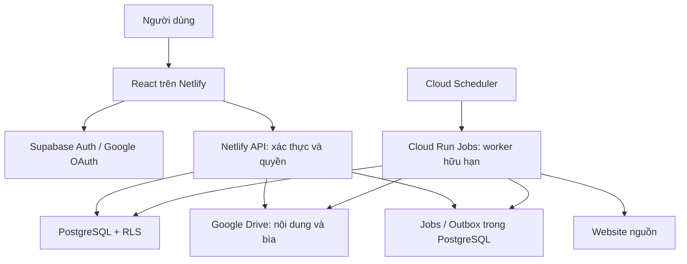
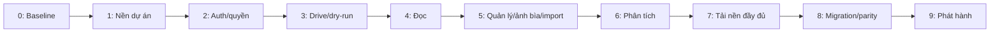

# Kế hoạch chuyển Trình tải truyện sang web app Netlify

- Bản kế hoạch: 0.5 — 08/10/2026 (Phase 0–3 local; cloud để sau khi đóng code).
- Baseline: Apps Script V1.59.2 tại commit `aae3c570286edac1db5ca355cbce40f5108d0a10` (mã info.txt được thêm ở `18d1b1e`); đọc `plan_TrinhTaiTruyen.md`, `HUONG_DAN_SU_DUNG.md`, 29 file mã nguồn và bộ kiểm thử `tests/book-info.test.js` để đối chiếu khi triển khai.
- Trạng thái: Phase 0 đạt gate đối chiếu với 98/98 kiểm thử; khảo sát thư viện thật còn mở. Phase 1 đã triển khai nền local; gate staging còn mở. Phase 2 đã có code auth/phân quyền và kiểm chứng local; Phase 3 đã triển khai adapter/API/migration nền và kiểm chứng local; Phase 4–9 chưa triển khai. Chưa tạo Netlify/Supabase/OAuth/worker cloud. Xem [báo cáo Phase 3](docs/phase-3/REPORT.md). Xem [báo cáo Phase 2](docs/phase-2/REPORT.md). Xem [báo cáo Phase 1](docs/phase-1/REPORT.md). Xem [báo cáo Phase 0](docs/phase-0/REPORT.md).
- Mục tiêu: giữ toàn bộ hành vi nghiệp vụ đang có, thêm đăng nhập Google, phân quyền nhiều người và ảnh bìa; Google Drive chỉ lưu file, PostgreSQL là nguồn dữ liệu chính.
- Cách làm: trước mỗi thay đổi mã, đọc plan cũ và plan này, xác định mã chức năng/phase, cập nhật checklist và bằng chứng kiểm thử sau khi làm. Tài liệu có nội dung lệch mã thì đối chiếu mã thật và ghi rõ chênh lệch, không lấy kết quả lịch sử làm kết quả mới.

**Quyết định chủ dự án:** làm local trước, sau khi đóng code mới kiểm Google API, Netlify và database cloud. Các gate dịch vụ thật của Phase 1–3 giữ mở; không cản triển khai phase local tiếp theo. Ưu tiên gói miễn phí, chỉ đề xuất nâng cấp sau khi đo tải.

## 1. Phạm vi và quyết định nền tảng

### 1.1. Mô hình sản phẩm

Một thư viện dùng chung do quản trị viên vận hành. Người dùng đăng nhập bằng Google được tạo hồ sơ tự động và có quyền đọc; chuyển thẳng đến `/read`, không qua màn quản trị. Tài khoản có quyền bổ sung mới thấy Tải sách/Quản lý sách. Không yêu cầu độc giả kết nối Drive cá nhân.

Chủ sở hữu thư viện khởi tạo quyền quản trị bằng thao tác máy chủ được ghi nhật ký; không cho tài khoản đăng nhập đầu tiên tự nhận quyền admin. Dùng Google OAuth, không tự xây mật khẩu. Tài khoản bị khóa không được đọc hoặc ghi ngay cả khi token chưa hết hạn.

Google Drive là nơi lưu TXT, ảnh bìa, `info.txt`, `_import.json` và `_Chương lỗi đã xóa.txt`; không dùng Sheets/Properties làm database runtime mới. Việc đọc Sheets chỉ thuộc công cụ chuyển dữ liệu chạy riêng.

### 1.2. Stack đề xuất cho triển khai

| Thành phần | Lựa chọn | Trách nhiệm |
|---|---|---|
| Web | React + TypeScript + Vite trên Netlify | Ba màn cũ, đăng nhập và quản trị; tái sử dụng CSS, nội dung trợ giúp, thuật toán trình đọc |
| Auth | Supabase Auth, provider Google | OAuth, session, định danh người dùng |
| Database | Supabase PostgreSQL | Metadata, phân quyền, hàng chờ, tiến độ đọc, nhật ký, trạng thái đồng bộ |
| API | Netlify Functions, TypeScript | Xác thực, phân quyền, truy vấn, nhận tác vụ và proxy nội dung Drive |
| Worker | Cloud Run Jobs, Node.js/TypeScript | Phân tích website, nhập truyện, tải từng đợt, đồng bộ file Drive |
| Điều phối | Cloud Scheduler gọi Cloud Run Jobs định kỳ | Kích hoạt xử lý hàng chờ bền vững trong PostgreSQL, không phụ thuộc tab trình duyệt |
| File | Google Drive API v3 | Lưu và đọc file, thư mục, ảnh bìa |
| Kiểm thử | Vitest/Node test, Playwright, kiểm thử SQL/RLS | Logic, hợp đồng API, giao diện, quyền và migration |

Đây là lựa chọn thiết kế, không phải các dịch vụ đã được provision. Trước khi cài đặt cần kiểm tra phiên bản runtime được Netlify/Cloud Run hỗ trợ, hạn mức, chi phí và khu vực của database. Người dùng chọn ưu tiên gói miễn phí, chỉ đề xuất nâng cấp sau khi đo tải. Chốt chi phí sau đo tải; không hứa toàn bộ hệ thống miễn phí. Worker chạy local khi phát triển; kiểm free allowance và điều kiện billing trước deployment cloud, không tự kích hoạt billing/nâng gói. Xem [ADR Phase 0](docs/phase-0/DECISIONS.md).

Netlify phục vụ web và API ngắn. Một yêu cầu tải truyện trả `202` và `job_id`; không chờ tải hết sách trong Function. Worker xử lý hữu hạn mỗi lần chạy, checkpoint từng chương, nhận việc tiếp ở lần sau. Không đưa browser/Chromium vào worker mặc định; chỉ hỗ trợ các cấu trúc HTML/mẫu URL tương đương bộ parser cũ.

### 1.3. Các mặc định để triển khai

- Một thư viện; tài khoản Google Workspace cũng dùng được như Gmail. Nếu chỉ cho đuôi `gmail.com` thì phải có yêu cầu riêng trước phase Auth.
- Bản web mới bắt đầu dòng phiên bản riêng, đề xuất `2.0.0`; không đổi V1.59.2 của ứng dụng cũ khi chỉ lập kế hoạch.
- Giữ tên ba mục: Tải sách, Quản lý sách, Đọc truyện; thêm Quản trị hệ thống.
- Sách có cờ xuất bản tách khỏi trạng thái tải. Sách ẩn không được đọc bằng cách đoán URL/API; quản trị vẫn xem được.
- Thư viện cũ giữ nguyên Drive File ID, không tải lại hoặc chuyển hàng loạt file khi migration.
- Giới hạn nguồn V1.59.2 được dùng làm baseline; tăng giới hạn phải có kiểm thử và ghi quyết định riêng.
- Truyện mới hoặc nội dung đang sửa chỉ xuất bản theo quyền quản lý, không tự công khai do một worker tải thành công.

## 2. Kiến trúc và ranh giới bảo mật



- Mỗi request kiểm token, trạng thái tài khoản và quyền theo tài nguyên. Database dùng RLS; đường server dùng khóa đặc quyền phải kiểm quyền trước, không dựa vào RLS vì service role có thể bỏ qua RLS.
- Độc giả chỉ đọc metadata cho phép xuất bản và chương DONE có file hợp lệ. Chỉ được ghi tiến độ/cài đặt đọc của chính mình. Không có endpoint nhận Drive File ID tùy ý để đọc.
- API nội dung tra `chapter_id → book_id → quyền đọc → drive_file_id`; kiểm quyền trước cả cache hit. Ảnh bìa áp dụng cùng quyền sách. Không trả cookie, refresh token hoặc khóa dịch vụ trong response trạng thái.
- Google OAuth đăng nhập và ủy quyền Drive là hai kết nối khác nhau. Mặc định chủ thư viện cấp OAuth Drive offline riêng, refresh token mã hóa/lưu trong secret manager phía server. Độc giả không thấy hoặc nhận token này.
- Với My Drive hiện hữu, ưu tiên OAuth của tài khoản sở hữu dữ liệu. Shared Drive/service account là lựa chọn thay thế sau kiểm chứng quyền, quota và khả năng tạo file; không giả định service account có dung lượng My Drive riêng.
- Scope Drive phải đủ cho file cũ. `drive.file` không mặc nhiên cho đọc mọi file có sẵn; chọn scope tối thiểu đáp ứng migration và xác minh bằng truy cập thật. Trạng thái ứng dụng OAuth, người thử nghiệm, expiry của refresh token và yêu cầu xác minh phải được kiểm tra trước vận hành.
- Worker chỉ nhận job trong database do API hợp lệ tạo. Gọi điều phối bằng danh tính dịch vụ; không mở endpoint worker công khai không xác thực.
- URL tải, phân trang và redirect phải chặn localhost, mạng riêng, metadata endpoint, scheme khác HTTP(S), DNS rebinding và hostname giả; kiểm lại từng redirect. Cookie khớp hostname/domain boundary, không dùng `host.indexOf(domain)` và không chuyển cookie sang domain khác.
- Upload giới hạn kích thước, kiểm chữ ký file và MIME. Nội dung truyện hiển thị dạng text; không thực thi HTML/script từ nguồn. Thao tác xóa có xác nhận và audit.
- Môi trường local/staging/production có DB, secrets và thư mục Drive tách biệt. Preview không được dùng khóa/thư mục production để chạy thử ghi dữ liệu.

## 3. Ma trận giữ tính năng — bắt buộc nghiệm thu

Mỗi dòng dưới đây phải có test hoặc biên bản kiểm tra mới. Các tính năng cũ đã bỏ, như nút đổi giao diện sáng toàn ứng dụng, không được hiểu là tính năng phải phục hồi. EPUB/PDF không thuộc baseline vì mã cũ ghi TXT UTF-8.

| Mã | Hành vi phải giữ | Nguồn tái sử dụng | Phase |
|---|---|---|---|
| F01 | Tự động/thủ công; nhiều URL qua `;` và thêm từng dòng | Dashboard, JS, BookManager | 6 |
| F02 | URL hiện ngay, phân tích tuần tự; thêm mới khi đang phân tích; trả URL về ô khi máy chủ từ chối | JS, AnalyzeQueue | 6 |
| F03 | Hàng phân tích bền vững, giữ URL lỗi, thử lại/bỏ; không tự tải truyện ANALYZED | AnalyzeQueue, Code | 6 |
| F04 | Bảng 8 cột: STT, tên, tác giả, thể loại, URL, thư mục, trạng thái, thao tác | JS, Dashboard | 6 |
| F05 | Metadata JSON-LD/meta/itemprop; selector cấu hình; dò nội dung khi chưa có selector | Parser, Adapters | 0, 6 |
| F06 | Phân trang, URL mẫu; chỉ sinh chương thiếu khi đủ bằng chứng, cảnh báo mục lục không đầy đủ | ChapterManager, BookManager | 6 |
| F07 | Quyển/Phần, chương `1-2`, mục lục trộn; phân tích lại thêm chương thiếu, không mất file cũ | ChapterManager, BookManager | 6, 7 |
| F08 | Chuyển một/tất cả truyện đã phân tích xuống tải; giới hạn số truyện tải, đổi thứ tự hàng chờ | AnalyzeQueue, BookManager | 7 |
| F09 | Tách hai pipeline FILE và WEB, cap riêng; trạng thái ANALYZED/IDLE/READY/DOWNLOADING/PAUSED/ERROR/COMPLETED | Downloader, Scheduler | 7 |
| F10 | Tạm dừng/tiếp tục/thử lại; tải nền khi đóng tab, auto resume cấu hình được | Downloader, BookManager | 7 |
| F11 | Retry HTTP, DELAY_MS, cookie theo website; báo 401/403/429/5xx phù hợp | Downloader, Config | 7 |
| F12 | Khôi phục file tạo dở, không tải trùng; verify file mất; FOLDER không thành việc tải mạng | DriveManager, Downloader, BookManager | 3, 7 |
| F13 | Giám sát tác vụ, lọc nhóm, tiến độ, làm mới và thao tác từng tác vụ | JS, Dashboard | 7 |
| F14 | Danh sách chương/chương lỗi; retry/cancel/pause/delete, sửa URL/tiêu đề | BookManager, JS, Modals | 5, 7 |
| F15 | Tự bỏ đoạn lỗi rỗng/quá ngắn theo `emptyRuns_`; giữ đoạn dài/cận cuối, không đánh lại số khi xóa | Downloader | 7 |
| F16 | `_Chương lỗi đã xóa.txt` ghi thời điểm, nhóm, số hiệu, tiêu đề, URL, lý do; chỉ ghi đúng trường hợp | ChapterTools | 5, 7 |
| F17 | Nhập TXT/MD/Markdown/CSV, Chương/Hồi tiếng Việt, lời tựa | Importer, Cleaner | 5 |
| F18 | Cặp mục lục + truyện có marker `#@`, `##@`, `###@`, `@`, `00`; ghép/chỉ rõ thiếu và thừa | Importer, ManagerJS | 5 |
| F19 | Nhập thư mục Drive: nhận diện tên file, bỏ file phụ, đếm skipped; mỗi folder một truyện | Importer, DriveManager | 5 |
| F20 | Nhập dài lưu tạm `_import.json`, tạo chương theo đợt, hoàn tất mới dọn dữ liệu tạm | Importer, Downloader | 5, 7 |
| F21 | Thêm chương từ link/file/dán; chọn/tạo nhóm và thứ tự; cấm trùng; FILE không thêm từ link | ChapterTools, Modals | 5 |
| F22 | Nội dung chủ động thêm ngắn vẫn được nhận; giới hạn file/text đúng baseline | ChapterTools, ManagerJS | 5 |
| F23 | Thư viện bảng/lưới mặc định lưới; tìm không dấu, sắp xếp, phân trang, trạng thái, đọc tiếp | ManagerJS, Manager, Utils | 4, 5 |
| F24 | Tên duy nhất sau chuẩn hóa; sửa tác giả/thể loại; rename/move folder theo thể loại chính | BookManager, DriveManager | 5 |
| F25 | Quản lý thể loại, nhiều thể loại, thể loại chính, nhập danh mục từ sách; bỏ danh mục không mất thể loại sách | Config, JS, Modals | 5 |
| F26 | Quản lý sách lưu tạm nhiều bản nháp, Lưu tất cả, giữ mục lỗi; ở Tải sách lưu ngay; cảnh báo rời trang | ManagerJS, JS | 5, 6 |
| F27 | Gán thể loại cả bảng ANALYZED, lỗi từng truyện không làm mất kết quả khác | BookManager, JS | 6 |
| F28 | Xóa truyện có lựa chọn đưa folder vào thùng rác; dọn queue/progress, chống worker ghi lại sách đã xóa | BookManager, Downloader | 5, 7 |
| F29 | Đọc chương DONE có file, cây Phần/Quyển, dropdown và chương trước/sau; xử lý sách bị xóa | ReaderData, ReaderJS | 4 |
| F30 | Cuộn/lật trang, click mép, vuốt, phím, chuyển chương ở ranh giới; resize/font giữ vị trí | ReaderJS, ReaderCSS | 4 |
| F31 | 4 phông và hệ số cỡ chữ, A-/A+, ngày/đêm, 4 mức lọc xanh | ReaderJS, Reader, Index | 4 |
| F32 | Cụm đọc 5 chương, tải trước 2 chương cuối, giữ 2 cụm; batch tối đa 40 và giới hạn byte | ReaderJS, ReaderData | 4 |
| F33 | Lưu vị trí local và server, debounce, gửi khi ẩn tab, hỏi tiếp tục khi thiết bị khác mới hơn | ReaderJS, ReaderData | 4 |
| F34 | Bìa chữ tự sinh khi chưa có ảnh, tiến độ/Đọc tiếp trên thẻ | ManagerJS | 4, 5 |
| F35 | Dark Glass, sidebar thu gọn, responsive, skeleton, toast, modal chồng, Esc/Tab và trợ giúp `?` | CSS, JS, Modals, Sidebar | 1, 4–7 |
| F36 | Đăng ký/tạo thư mục gốc, cấu hình batch/delay/retry/concurrent/auto resume/junk/rules/cookie | DriveManager, Config, JS | 3, 5, 7 |
| F37 | `info.txt` đúng bốn mục, nguồn trống với FILE/FOLDER; tạo/cập nhật không trùng; bỏ qua khi scan | DriveManager, Importer, tests | 3, 5, 7 |
| F38 | Nhật ký tải, import, sửa, phục hồi và lỗi; lỗi tiếng Việt phân loại rõ | Logger, Utils | 1, 5–7 |
| N01 | Google đăng nhập, tự tạo reader, vào đọc ngay, logout và tài khoản bị khóa | Mới | 2 |
| N02 | Quyền độc lập đọc/tải/quản lý/admin; kiểm cả API và database | Mới | 2, 5–7 |
| N03 | Upload/preview/thay/xóa ảnh bìa; bìa mặc định; lưu Drive File ID | Mới + thẻ sách cũ | 5 |
| N04 | Tiến độ và cài đặt riêng từng người, không lộ/copy dữ liệu giữa tài khoản | ReaderJS chuyển đổi | 2, 4 |

## 4. Tận dụng các module cũ

### 4.1. Tận dụng các phần của plan hiện có

| Phần trong `plan_TrinhTaiTruyen.md` | Cách dùng trong kế hoạch mới |
|---|---|
| 1. Tổng quan | Giữ ba chức năng và quy tắc nội dung; mở rộng mô hình nhiều người ở mục 1 |
| 2. Kiến trúc tổng thể | Giữ tách UI/API/nghiệp vụ/lưu trữ, thay runtime và dịch vụ ở mục 2 |
| 3. Danh sách file | Làm inventory 29 file và bảng port module, cấu trúc đích ở mục 9 |
| 4. Mô hình dữ liệu | Ánh xạ đủ BOOKS/CHAPTERS/CONFIG/LOG và Properties sang mục 5, không bỏ trường legacy |
| 5. Mô tả từng file | Dùng để tách hàm pure khỏi Google service; đối chiếu source khi mô tả đã cũ |
| 6. Mối liên hệ/API | Giữ bảng phụ thuộc và đối chiếu đủ 34 API ở mục 6; thêm kiểm quyền |
| 7. Luồng xử lý | Nguồn chính của F01–F38 và các test phase; giữ riêng quy tắc info.txt mục 7.3b |
| 8. Hiệu năng/an toàn/tin cậy | Giữ các vấn đề đã xử lý, thay cơ chế bằng transaction/lease/cache/outbox và auth |
| 9. Hướng dẫn mở rộng | Giữ extension points adapter/junk/font/config; cập nhật cách phát hành web/worker |
| Kết quả kiểm thử và T10/T11 | Dùng làm kịch bản cần dựng lại; giữ nguyên lịch sử, không cộng kết quả cũ vào test mới |
| Nhật ký thay đổi/checklist | Giữ lịch sử Apps Script; bản mới có phase/PR/release/bằng chứng riêng |
| Ngoại lệ đã duyệt | Chỉ áp dụng trong bối cảnh Apps Script cũ; ngoại lệ “dùng một mình, không phân quyền” không áp dụng cho web mới |

### 4.2. Ánh xạ module và mã nguồn

| Module cũ | Đích đề xuất | Phần giữ | Phần phải thay |
|---|---|---|---|
| Utils.gs | packages/domain/utils | Normalize tên/URL, entity, đặt tên, định dạng lỗi | Session, LockService, CacheService; sửa an toàn URL/domain |
| Cleaner.gs | packages/domain/cleaner | Đầu chương/Hồi, số tiếng Việt, junk, tidy | Export/import module; test trước khi refactor |
| Adapters.gs | packages/domain/adapters | Generic, grammar SITE_RULES, giới hạn 2000 ký tự | Khớp domain đúng ranh giới |
| Parser.gs | packages/domain/parser | JSON-LD/meta, block/clean/autoBlock, ngưỡng 50 ký tự | Inject HTTP client bất đồng bộ |
| ChapterManager.gs | packages/domain/discovery + services/chapters | Phân trang, URL mẫu, nhóm và số hiệu | DB repository thay truy cập khối Sheet |
| Importer.gs | packages/domain/import + services/import | Parser TXT/CSV/Hồi/marker, ghép, đặt tên | Utilities.parseCsv/base64/blob, Drive/DB async và hàng chờ |
| ChapterTools.gs | packages/domain/chapter-order + services/chapters | Chèn thứ tự, nhóm, xác thực, dòng nhật ký | File/DB writes và transaction |
| BookManager.gs | services/books | Trùng tên, thao tác, transition | Array/row index thành ID/queries; đồng bộ Drive bù lỗi |
| Downloader.gs | apps/worker | Chọn việc, retry, recover, emptyRuns | Blocking sleep, UrlFetchApp, deadline/lock thành leases/checkpoint |
| DriveManager.gs | packages/infrastructure/drive | Cấu trúc thư mục, tên chương, info.txt | Drive API v3; `title` trong query cũ thành `name`; ID mapping trong DB |
| ReaderData.gs | services/reader | Bóc header/lọc, đọc cụm và kiểm file đăng ký | Quyền sách/người dùng, Drive API, cache có giới hạn |
| AnalyzeQueue.gs | services/analysis | Queue chờ/lỗi, hold/move, khử trùng | ANA_QUEUE Properties thành jobs bền vững; worker phân tích không phụ thuộc trình duyệt |
| Database.gs | repositories/Postgres | Hợp đồng dữ liệu, counter | Bỏ schema Sheets/ghi theo dòng; transaction/constraints/migrations |
| Config.gs | services/settings | Mặc định, validation, genres/junk | DB settings; tách bí mật khỏi cấu hình trả cho UI |
| Scheduler.gs | apps/worker + lịch điều phối | Tự chạy khi có việc/auto resume | Không dùng Apps Script trigger |
| Logger.gs | services/audit | Action/result/message, ghi theo đợt | DB audit; redaction và retention |
| Code.gs | netlify/functions + packages/contracts | Đủ 34 API nghiệp vụ, loại lỗi | doGet/include/google.script.run và lock wrapper thành HTTP/auth |
| ReaderJS.html/Reader.html | features/reader | Thuật toán paging/font/cluster/restore, cấu trúc màn | Chuyển từng phần sang React hook, AbortController, API client |
| ManagerJS.html/Manager.html | features/library, features/manage | Grid/table, tìm/sort/draft/genres | React state/query cache, server pagination, ảnh bìa |
| JS.html/Dashboard.html | features/download + shared UI | Hàng phân tích/monitor, HELP_, toast/confirm | Không copy nguyên global state; tách module và transport |
| CSS.html/ReaderCSS.html | styles/*.css | Tokens, Dark Glass, reader day/night, hiệu ứng | Bỏ thẻ style, sửa selector theo component và test ảnh |
| Index/Sidebar/Modals/Favicon | app shell + components + assets | Font/logo, menu, modal, hình nhận diện | Route auth/permission, favicon static thay tạo file Drive |
| Tài liệu và tests | docs + tests | Quy tắc hiện hành, 10 ca info.txt, kịch bản T10/T11 | Port harness, dựng lại test lịch sử không có trong repo; không tuyên bố đã chạy |

Không đặt mục tiêu phần trăm tái sử dụng khi chưa port thử. Đo bằng số hàm pure giữ được, Fxx/API có test tương đương và chênh lệch output fixture. Không copy nguyên `.gs` vào Function rồi giả lập tất cả Google service trong production.

## 5. Database, tài nguyên và trạng thái

| Bảng | Nội dung và ràng buộc chính |
|---|---|
| profiles | auth user ID, tên/ảnh Google, trạng thái active/blocked; ảnh hồ sơ khác ảnh bìa |
| user_permissions | unique(user_id, permission); chỉ admin sửa; không lấy quyền từ metadata do client tự đặt |
| books | UUID, legacy_id, name/normalized_name unique trong thư viện, author, source_url/source_type WEB/FILE/FOLDER, chapter_label, folder_id unique, download_status, visibility, version, deleted_at |
| genres/book_genres | Nhiều thể loại, thứ tự và đúng một primary khi có thể loại; giữ nhãn cũ ngay cả khi bỏ khỏi danh mục chọn |
| chapters | UUID, book_id, legacy_order, order_key, display_number dạng text, title, source_url, part/volume, status, file_id, retry/error, content_version, is_skipped; không đồng nhất DONE bỏ qua với DONE có file |
| chapter_groups | Phần/Quyển, cha, thứ tự; giữ nhóm rỗng và chương không thuộc nhóm, migration bảo toàn nhãn gốc |
| reading_progress | unique(user_id,book_id), chapter_id, ratio 0..1, scroll_px, revision, server timestamp; chapter phải thuộc sách được đọc |
| reader_preferences | user_id, font/size/theme/blue/mode và lựa chọn library; local cache có namespace user |
| jobs/job_items | Kind ANALYZE/WEB_DOWNLOAD/FILE_IMPORT/DRIVE_SYNC, book/url, priority, status, attempts, next_run_at, lease_owner/until, checkpoint, dedupe_key, request_id, actor |
| app_settings/site_rules | Config tải không bí mật, root_folder_id, junk, giới hạn, adapter version |
| site_credentials | Secret reference, domain/path scope; không lưu hoặc xuất cookie vào settings công khai |
| drive_resources | File/folder IDs, book/group owner, loại CHAPTER/INFO/COVER/IMPORT/REMOVED_LOG; sync state/hash |
| outbox_operations | Drive ops cần làm, idempotency key, version, retry, compensation; giữ lỗi để repair |
| audit_logs/removed_chapters | Actor/action/result, chapter snapshot, lý do xóa; không ghi token/cookie/nội dung riêng không cần thiết |
| migration_runs/migration_items | Nguồn, checksum, ID map, counts, lỗi, trạng thái và thời điểm chạy |

Schema cụ thể/indices/RLS tạo trong phase 1; tên bảng là thiết kế, chưa có SQL triển khai.

- ID chương ổn định, không dùng float làm identity. Legacy thứ tự 4.5/1001.002 lưu nguyên dạng numeric chính xác hoặc raw string; tạo order_key riêng khi cần, display_number giữ `1-2`, `*`, lời tựa. Không đổi số hiệu sau khi xóa/chèn.
- Unique source URL khi có URL; uniqueness theo nhóm/số hiệu phải tách chương không đánh số. Mọi quy tắc kiểm trùng giữ hành vi cũ và được kiểm thử trước khi chốt constraint.
- Database là nguồn chính. Counter là cache tổng hợp hoặc cập nhật cùng transaction; có reconciliation so số chương/status/file, không tin số tổng do client gửi.
- Giữ state machine sách cũ; FILE có cap riêng, FOLDER không có tác vụ tải URL khi verify. Job state riêng QUEUED/RUNNING/RETRY_WAIT/SUCCEEDED/FAILED/CANCELLED, không dùng thay trạng thái sách.
- Lấy việc bằng transaction + `FOR UPDATE SKIP LOCKED`, lease có hạn, heartbeat và fencing/version kiểm lúc ghi kết quả. Job cùng sách không được tạo file đồng thời. Worker cũ mất lease không được ghi DB hoặc xuất bản kết quả; file tạo dở phải có reconciliation.
- Không giữ transaction database trong lúc gọi HTTP/Drive hoặc nghỉ DELAY_MS. Lưu checkpoint, thời điểm chạy tiếp; khóa/claim ngắn, không khóa toàn bộ hệ thống như ScriptLock cũ.
- Retry có giới hạn, exponential backoff/jitter và Retry-After; 401/403 cần sửa quyền/cookie, không retry vô hạn. AUTO_RESUME=false dừng tự tiếp tục ở ranh giới batch; nút tải/tiếp tục vẫn cho chạy một batch có chủ đích.
- DB và Drive không có transaction chung. Lưu staged operation/outbox; chỉ đánh dấu thành công khi các bước bắt buộc hoàn tất. Rename/move/info lỗi phải hiện pending/error và có retry/repair, không giả báo đã đồng bộ. UI có revision để phát hiện hai người sửa cùng sách.
- `info.txt` giữ chính xác bốn tiêu đề V1.59.2, giá trị trống khi không có source URL; ảnh bìa không thêm tiêu đề thứ năm. Nội dung lấy theo phiên bản metadata hiện hành để job cũ không ghi đè bản mới.
- `_import.json` giữ trong Drive cho resume tương đương cũ; payload tạm không làm database nội dung vĩnh viễn. Dọn khi import thành công, không khi mới enqueue.

## 6. Phân quyền và hợp đồng API

### 6.1. Quyền độc lập

| Quyền | Thao tác |
|---|---|
| read | Thư viện sách được xuất bản, chương hợp lệ, bìa và tiến độ/cài đặt của chính mình |
| download | Phân tích, tạo sách từ WEB, xếp tải, start/pause/retry/cancel, xem tác vụ; không tự có quyền quản lý người dùng |
| manage | Metadata/ảnh bìa/thể loại, nhập file/folder, thêm/sửa/xóa chương, xóa sách, xuất bản/ẩn sách |
| admin | Cấp quyền, khóa tài khoản, root Drive, cấu hình hệ thống/cookie, audit và migration |

Admin vận hành mặc định được gán cả read/download/manage/admin; quyền không ngầm suy ra ở client. Link chương mới hoặc sửa URL rồi kích hoạt tải yêu cầu manage + download. Gán thể loại, sửa/xóa ở màn Tải sách vẫn cần manage. Nhập file/folder cần manage và dùng pipeline import; không yêu cầu download để quản lý truyện riêng có sẵn. Quyền download không được tự động xuất bản nội dung mới.

### 6.2. Đối chiếu toàn bộ API cũ

Các tên `api_*` bên dưới là hợp đồng đối chiếu; endpoint HTTP sẽ có schema version riêng. Mọi API cần xác thực, schema validation, quyền, request_id và lỗi tiếng Việt; đọc không gây tác dụng phụ dữ liệu.

| API V1.59.2 | API/service mới đề xuất | Quyền |
|---|---|---|
| api_getState | GET /state, dữ liệu lọc theo quyền, phân trang | Theo từng nhóm dữ liệu; không trả secret |
| api_createAndStart | POST /books/from-web | download |
| api_queueAnalyze | POST /analysis/jobs | download |
| api_dropPending | DELETE /analysis/jobs/:id | download |
| api_analyzeAndHold | Worker analysis job, POST /analysis/jobs/:id/start khi cần | download |
| api_retryAnalyze | POST /analysis/jobs/:id/retry | download |
| api_addChapter | POST /books/:id/chapters | manage; thêm link cần download |
| api_chapterGroups | GET /books/:id/groups | read nếu sách xuất bản; manage/download khi quản trị |
| api_moveToDownload | POST /downloads/enqueue | download |
| api_manualAnalyze | POST /analysis/manual | download |
| api_tick | POST /jobs/wake, nhận job; scheduler xử lý, không tải trong request | download cho wake, danh tính worker cho drain |
| api_setStatus | POST /books/:id/download-actions | download; verify chỉ đọc trạng thái cần quyền quản trị sách |
| api_chapters | GET /books/:id/chapters | read nhận chương được phép; manage/download nhận dữ liệu quản trị |
| api_errorChapters | GET /books/:id/chapter-errors | manage hoặc download |
| api_chapterAction | POST /chapters/:id/actions | download cho retry/pause/cancel; manage cho delete |
| api_editChapter | PATCH /chapters/:id | manage; sửa URL kích hoạt tải cần download |
| api_firstChapterUrls | GET /books/source-links | download hoặc manage |
| api_addBookFromFile | POST /imports/file | manage |
| api_addBookFromFiles | POST /imports/paired-files | manage |
| api_addBookFromFolder | POST /imports/drive-folder | manage |
| api_saveBook | PATCH /books/:id | manage |
| api_setGenreMany | POST /books/bulk-genres | manage |
| api_saveBooksBatch | POST /books/bulk-save | manage |
| api_deleteBook | DELETE /books/:id, tùy chọn trash_folder | manage |
| api_reorderQueue | POST /downloads/:id/reorder | download |
| api_saveConfig | PATCH /settings | admin; có thể tách config vận hành cho download sau |
| api_saveGenres | PUT /genres | manage |
| api_readerList | GET /books/:id/reader-chapters | read và quyền sách |
| api_readChapter | GET /chapters/:id/content | read và quyền sách |
| api_readChapterCluster | POST /reader/cluster | read, kiểm từng chapter, giới hạn count/bytes |
| api_saveReadingProgress | PUT /me/progress/:bookId | read; chỉ chính mình |
| api_getReadingProgress | GET /me/progress/:bookId | read; chỉ chính mình |
| api_registerRoot | PUT /drive/root | admin |
| api_createRoot | POST /drive/root | admin |

API mới: OAuth callback/session, GET /me, quản lý users/permissions, xuất bản sách, upload/commit/delete cover, GET cover, job status, operations repair và migration report. Reader không nhận cấu hình cookie, URL nguồn nhạy cảm, lỗi worker thô hoặc thông tin admin từ `/state`.

Mutation idempotent bằng request_id/dedupe key. Bulk trả kết quả từng mục, không bỏ bản nháp thất bại. Lỗi validation/permission/conflict phân biệt 400/401/403/404/409; rate limit 429; accepted job 202. UI poll nhẹ có backoff và hủy request cũ; realtime chỉ bổ sung sau khi RLS kiểm đúng, không broadcast toàn bộ trạng thái cho reader.

## 7. Kế hoạch các phase và tiêu chí hoàn thành

Phase 0 đã có bằng chứng bên dưới; Phase 1 có nền local bên dưới; Phase 2 có code/kiểm chứng local; các checklist Phase 3–9 đang chưa làm. Mỗi phase phải có code, migration/schema khi cần, tests, hướng dẫn chạy, kết quả và lỗi còn mở. Không đánh dấu hoàn thành bằng việc build thành công hoặc ảnh chụp một màn hình.

### Phase 0 — Chốt baseline và bộ đối chiếu

**Phụ thuộc:** không. **Đầu ra:** [inventory](docs/phase-0/inventory.json), [parity](docs/phase-0/PARITY.md), [ADR](docs/phase-0/DECISIONS.md), [fixtures/runner](docs/phase-0/README.md), [báo cáo kết quả](docs/phase-0/REPORT.md).

- [x] Ghi baseline commit V1.59.2, SHA-256/byte count cho 29 nguồn, đủ 34 API/signatures và 42 nhóm tính năng; ghi chênh lệch mô tả/mã trong ADR-007.
- [x] Giữ và chạy lại 10 test info.txt; tạo 17 fixture HTML/URL/TXT/MD/CSV/Hồi/marker nguyên bản, Drive mock và metadata export synthetic; không tải nội dung thật.
- [x] Ghi 74 expected output/error bằng thực thi source pinned từ Git, có neo output kiểm độc lập; không lấy kết quả lịch sử hoặc mã tương lai làm expected.
- [x] Runner golden cho Cleaner/Parser/Adapters/chương nhiều cấp/import/filename/info/log/header; có 2 mutation trong VM chứng minh phát hiện đổi logic. Tổng 98 tests pass, không skip.
- [!] Khảo sát số sách/chương/max file **thật** chưa hoàn tất vì chưa có export owner. Đã có profiler read-only, 3 workload synthetic (14/126, 100/20000, 1/20000) và mặc định page/cache/batch. Dữ liệu thật để null; hoàn tất khảo sát tại Phase 3 và trước nghiệm thu migration Phase 8, không thay bằng số mẫu.
- [x] Chốt mô hình thư viện chung, publication, bootstrap admin, owner OAuth Drive, worker hữu hạn và free-first theo trả lời người dùng; ADR-006 ghi domain/cookie boundary và kiểm quyền trước cache là thay đổi bắt buộc. Chưa provision hay kích hoạt chi phí.

**Gate đối chiếu đạt:** mọi chức năng/API có phase và ca nghiệm thu; không có tính năng cũ bị bỏ. Còn khảo sát dữ liệu thật như mục `[!]`; plan cho phép dùng fixtures để sang Phase 1, nhưng thiếu dữ liệu thật chặn nghiệm thu migration. Các ca acceptance web/API/RLS/browser và dịch vụ thật vẫn chưa chạy.

### Phase 1 — Nền dự án, contracts, database và CI

**Phụ thuộc:** 0. **Đầu ra:** web/API/worker skeleton chạy local và staging.

- [x] Thêm cấu trúc mới cạnh mã Apps Script, giữ nguyên file gốc; khóa phiên bản runtime/package manager, lockfile, .env.example chỉ có tên/giá trị không bí mật.
- [x] Tạo schema, migrations, constraints, indices tìm/sort/jobs/chapters, RLS deny-by-default và seed không chứa dữ liệu thật.
- [x] Tách domain pure giữ golden tests; tạo interfaces BookRepository, DriveStorage, HttpFetcher, JobRepository, Clock.
- [x] Tạo React shell từ Sidebar/CSS/logo/toast/modal/help, route placeholders rõ chưa triển khai; không để React và legacy JS cùng quản lý một DOM.
- [x] Lưu CI: frozen install, typecheck, unit/contracts/SQL tests, build/browser/Docker; khai báo context preview staging. Migration production ngoài PR/build; site/credentials và preview thật còn ở mục `[!]` dưới.
- [x] Netlify SPA redirect sau API routes; security headers/CSP phù hợp OAuth/font, redaction logs, correlation ID; worker Docker chạy noninteractive.

- [!] Staging chưa được triển khai/kiểm chứng vì chưa có site/project và credentials Netlify/Supabase. CI/Netlify config đã viết; chưa xác nhận remote CI hoặc preview. Không tự provision/bật billing.

**Bằng chứng local:** [setup](docs/phase-1/README.md), [report](docs/phase-1/REPORT.md). 98 legacy + 73 domain/contracts/API + 29 SQL/RLS + 5 browser đạt; build/typecheck/bundle/worker kiểm chứng local.

**Gate chưa khóa do staging:** clean checkout chạy được setup đã ghi; build/typecheck đạt; API health kiểm DB; service keys không có trong bundle/browser; test RLS thực thi có ca bị từ chối.

### Phase 2 — Đăng nhập Google và phân quyền

**Phụ thuộc:** 1. **Đầu ra:** user đăng nhập tới `/read`, admin quản lý quyền.

- [x] Luồng Google OAuth/PKCE trong SDK, callback cố định `/auth/callback`, bỏ qua next/return URL tùy ý; hướng dẫn cấu hình theo từng môi trường.
- [!] Cấu hình provider/site/redirect thật và Google OAuth staging chưa có credentials/project/site; chưa chạy gate dịch vụ thật.
- [x] Tạo profile/read permission tự động một lần; session refresh/logout; blocked account; bootstrap admin server-side.
- [x] Bổ sung menu/routes theo quyền, trang quản lý tài khoản/cấp quyền có audit, không tự nâng quyền.
- [x] API và RLS cho progress/preferences theo user; xử lý logout/đổi user xóa cache/private state, draft riêng.
- [x] Test reader/download/manage/admin và các tổ hợp, direct URL, gọi API trực tiếp, token hết hạn, revoked/blocked user, ID của người khác.

**Bằng chứng local:** [hướng dẫn](docs/phase-2/README.md), [report](docs/phase-2/REPORT.md). Code auth/admin/progress/preferences, service-only RPC/session checks, 256/256 tests legacy/domain/auth/SQL/concurrency/browser đạt. Người dùng chọn hoàn tất local trước, chưa tạo staging. Reader/library thật thuộc Phase 3–4, chưa truy cập Drive.

**Gate còn mở:** Google đăng nhập thật ở staging; reader vào đọc ngay không cần setup Drive; không truy cập màn/API tải/quản lý/admin và không đọc progress người khác. Chưa cấp OAuth thật thì phase chưa đạt gate, dù mock tests qua.

### Phase 3 — Drive adapter, dữ liệu mẫu và migration chỉ đọc

**Phụ thuộc:** 1–2. **Đầu ra local:** Drive API v3 adapter, API đọc nội dung/ảnh qua quyền SQL, cache PostgreSQL, dữ liệu synthetic và dry-run/ID map. Code tích hợp cloud được chuẩn bị; kiểm chứng thật để sau đóng code theo chủ dự án.

- [x] Adapter owner OAuth refresh và root validation, request/byte budget, metric; kiểm chứng bằng transport local. Cấu hình server-only, không yêu cầu độc giả nối Drive.
- [x] Port tên/thư mục/chapter/info/import/log; `syncBookInfo` khóa row và lưu ID/version vào DB, pagination/retry/403/404/trashed. Helper nghiệp vụ chờ nối vào quản lý/tải ở Phase 5–7.
- [x] TXT/header/nhóm giữ định dạng; API đọc chapter/cover lấy ID từ mapping đúng sách. Cache bền vững có version/hash bộ lọc, TTL 5 phút, 60 KB/entry và 8 MB tổng; quyền được kiểm trước cache hit.
- [x] Export chỉ đọc BOOKS/CHAPTERS/CONFIG allowlist và Properties ID; tool inventory GET-only; dry-run validation, ID map và báo cáo counts/trùng/status/missing/outside-book. Không ghi database hoặc Drive khi dry-run. Export UI, user progress/queue/log đầy đủ để Phase 8.
- [x] Thư viện mô phỏng nhỏ từ nội dung tự viết; PostgreSQL test riêng có cleanup, test repeat/concurrent info và cache. Không thao tác thư viện production.
- [ ] Kết nối Drive **thật** của chủ thư viện, kiểm owner/scopes/refresh/quota/editor root và staging riêng; chưa chạy theo quyết định làm local trước.
- [ ] Nghiệm thu Drive/Sheets/Supabase/Netlify **thật**: tạo/cập nhật info, lỗi quyền/trash, timeout/recover; chuyển sang đợt kiểm cloud sau đóng code.

**Gate local:** API đọc đúng chương, reader không đọc file ngoài sách dù cache đã có, dry-run có totals/lỗi chi tiết, không có remote write; adapter lỗi không trả success giả. Đã kiểm chứng; xem [README](docs/phase-3/README.md) và [REPORT](docs/phase-3/REPORT.md). **Gate cloud còn mở**, không dùng mock để coi dịch vụ thật đã nghiệm thu. UI reader/thư viện ở Phase 4.

### Phase 4 — Đọc truyện và thư viện cho độc giả

**Phụ thuộc:** 2–3. **Đầu ra:** bản dùng được để đọc sách nhập thử.

- [ ] Port danh sách tìm không dấu, thư viện grid/table/sort/pagination và card mặc định từ Manager; chỉ sách xuất bản được hiển thị cho reader.
- [ ] Port cây Phần/Quyển/Chương/Hồi, số hiệu/phần không nhóm/lời tựa, chuyển chương, empty/deleted/error state.
- [ ] Giữ scroll/page, font hệ số, theme/blue, phím/touch, thanh nổi, resize giữ ratio và modal trợ giúp.
- [ ] Giữ cluster 5, prefetch, 2 cụm cache; AbortController/request version ngăn response sách cũ hiện ở sách mới; giới hạn memory/bytes trên mobile.
- [ ] Progress/preferences namespace user; debounce local 500 ms/server khoảng 4 s, lifecycle flush best-effort có retry lần mở sau. DB revision/server time tránh client clock cũ ghi đè; xung đột chương hiện hỏi tiếp tục như cũ.
- [ ] Tiến độ trên card đồng bộ theo user; không copy progress chủ thư viện sang user mới. Reader content cache vẫn phải kiểm permission/visibility mỗi request.

**Gate:** F23/F29–F35/N04 có E2E trên desktop/mobile, keyboard và trình duyệt thật; hai user không lẫn cache, hai thiết bị khôi phục đúng; reader vẫn đọc được khi worker không chạy.

### Phase 5 — Quản lý sách, nhập truyện, thể loại và ảnh bìa

**Phụ thuộc:** 3–4. **Đầu ra:** quản lý đủ nghiệp vụ cũ và N03.

- [ ] Port edit/delete/groups/chapters/genre danh mục, primary genre, uniqueness normalize; option trash folder và audit actor.
- [ ] Giữ draft/Lưu tất cả, vàng pending, partial errors và cảnh báo rời trang; optimistic concurrency hiển thị xung đột thay vì mất edit khác.
- [ ] Port single TXT/Markdown/CSV, Hồi/lời tựa, cặp marker/toc/story và báo thiếu/thừa; upload không giới hạn bởi payload Function tùy ý. File lớn dùng phiên upload server quản lý/worker qua Drive, không public bucket nội dung vĩnh viễn.
- [ ] Port import folder, name fallback và skipped; không tính info/import/log/bìa là chương. Thư mục đã đăng ký không dùng cho sách khác; phải có quyền ghi để tạo info.
- [ ] Port thêm chương link/file/paste; bắt buộc group/order, cấm URL trùng; giới hạn text 300000 ký tự và file 2 MB cho thêm chương; giữ ngoại lệ text ngắn.
- [ ] Ảnh bìa: đề xuất JPEG/PNG/WebP, tối đa 5 MB upload, kiểm magic bytes/decode/pixel limit, chuẩn hóa orientation, bỏ metadata, resize cạnh dài tối đa 1200 px; các giới hạn này là thiết kế mới cần kiểm chứng.
- [ ] UI preview/chọn lại/xóa ảnh; ảnh mới staging asset, commit theo lần Lưu tất cả nếu sửa ở Quản lý. Hủy draft hoặc upload mồ côi được dọn sau TTL; không mất cover đang dùng khi upload lỗi.
- [ ] Drive cover ID/hash/version trong DB; proxy cache có quyền, thay ảnh invalidate; chưa có ảnh dùng bìa chữ cũ. info.txt vẫn bốn mục, không thêm ảnh bìa vào file.
- [ ] Outbox rename/move/info/cover với retry, retry không tạo file trùng và không xóa file ngoài ownership. Sách đang đồng bộ/lỗi hiện trạng thái rõ.

**Gate:** F14/F16–F28/F36–F38/N03 theo phạm vi phase đạt; import folder/file thật staging; preview/hủy/Lưu tất cả và thiếu quyền đều được kiểm tra. Import có thể enqueue trước khi worker hoàn chỉnh, nhưng phase chỉ hoàn thành sau khi executor tối thiểu tạo file thật và resume được.

### Phase 6 — Phân tích URL và bảng Tải sách

**Phụ thuộc:** 3, 5. **Đầu ra:** parser/analysis worker và bảng tương đương cũ.

- [ ] Port discovery/parser/adapter với dependency injection, SITE_RULES và junk; phân trang/mixed/URL template không sinh URL thiếu bằng phỏng đoán.
- [ ] Manual sample URL + total giữ giới hạn 1–20000; validate/SSRF ở máy chủ ngay cả với URL do thuật toán sinh.
- [ ] Queue analysis bền vững, UI optimistic row hiện ngay, gửi request xong reconcile; reject trả lại input không mất URL.
- [ ] Phân tích tuần tự; thêm khi đang chạy, giữ lỗi/retry/drop; đóng tab không mất queue; không auto tải ANALYZED.
- [ ] Bảng 8 cột, info folder link và bước phân tích, edit lưu ngay, genre bulk có quyền manage; tạo info.txt tại hold.
- [ ] Reanalyze tìm chapter mới, bảo toàn chapter IDs/file/progress; xử lý mixed ordering và nhãn theo baseline.

**Gate:** F01–F07/F26/F27 có golden + E2E; website fixture có paging/mixed/error; smoke website thật có quyền truy cập. Cloudflare/CAPTCHA không hỗ trợ thì báo rõ như giới hạn cũ, không coi là thành công parser.

### Phase 7 — Worker tải đầy đủ, resume và vận hành tác vụ

**Phụ thuộc:** 5–6. **Đầu ra:** tải/nhập nền độc lập trình duyệt với đầy đủ thao tác.

- [ ] Điều phối FILE/WEB cap riêng, IDLE/READY promotion, priority/reorder, batch size và delay đúng cấu hình.
- [ ] Lease/checkpoint/retry budget, job restart, worker crash, HTTP 429/401/403/5xx, hết quyền Drive; monitor đếm đúng trạng thái.
- [ ] Tải chương giữ tên/head/group/body, recover file tạo dở, ghi DB sau kiểm ownership/version; kiểm retry không tạo bản trùng.
- [ ] Pause/cancel/delete đang chạy: ghi tombstone/cancel request, kiểm lại trước khi commit; không tự dựng lại sách/chương đã xóa. Nêu rõ batch/file đang in-flight và thời điểm dừng.
- [ ] Retry/chapter actions, verify file mất và FOLDER exception; `_import.json` resume + cleanup; lỗi ngắn emptyRuns/log giữ đúng baseline.
- [ ] Đồng bộ info.txt/removed log có tuần tự theo sách; ghi log không mất dữ liệu khi retry/crash; sync job cũ không ghi metadata cũ.
- [ ] UI monitor/filters/errors/refresh/progress/batch controls; không polling toàn bộ hàng chương, không tự giới hạn task theo vòng tab.

**Gate:** F08–F16/F20/F28/F36–F38 chạy E2E; hai worker cạnh tranh, mất lease, tạo file rồi DB fail, xóa/đổi thông tin khi tải và đóng tab đều có test. Không nhận hoàn thành chỉ vì có PID hoặc scheduler enabled.

### Phase 8 — Chuyển dữ liệu thật và kiểm tra toàn bộ tương đương

**Phụ thuộc:** 4–7. **Đầu ra:** staging giống thư viện thật, báo cáo đối chiếu từng Fxx.

- [ ] Export CONFIG/BOOKS/CHAPTERS/LOG, Script Properties DB_ID/ANA_QUEUE/FLD_/IMP_/DEL_, và tiến độ owner bằng cơ chế có quyền; secrets tách khỏi export phổ thông.
- [ ] Migration idempotent theo legacy IDs/checksum; preserve URLs/author/genre/date/status/file/group/order/display labels. Unknown statuses và dữ liệu corrupt phải report, không âm thầm loại.
- [ ] Progress Apps Script UserProperties chỉ gắn cho tài khoản owner đã xác minh. localStorage thuộc origin Apps Script không tự đọc được ở Netlify; cho export/import chủ động trên trình duyệt cũ hoặc báo phần không chuyển được.
- [ ] Chọn visibility rõ: import private mặc định; admin xem report rồi xuất bản theo lựa chọn, không công khai toàn bộ thư viện tự động.
- [ ] Không chạy cả worker cũ và mới ghi cùng folder. Reconcile DOWNLOADING/READY cũ thành job cần resume có kiểm file, không bê nguyên lease cũ.
- [ ] Dry-run/migrate/re-run cho ra cùng counts/IDs, không tạo lại folder/file; đối chiếu hash/sample text và số DONE có file, skipped, removed, pending, errors.
- [ ] Load test dựa số liệu phase 0: thời gian đọc cold/warm, queue throughput, phân trang sách dài, peak memory/Drive quota/cost; ghi số đo và ngưỡng chấp nhận trước khi chạy.
- [ ] Hoàn thành bảng Fxx/API test evidence, accessibility/mobile; kiểm auth thật và các ca permission denial production-like.

**Gate:** không còn chức năng cũ thiếu hoặc chênh lệch chưa giải thích; không sai file/group/order; không lỗi phân quyền nghiêm trọng; đủ báo cáo migration và thử khôi phục backup.

### Phase 9 — Phát hành, chuyển vận hành và tài liệu

**Phụ thuộc:** 8. **Đầu ra:** bản web vận hành, đường quay lại có kiểm chứng.

- [ ] Tạo backup export DB cũ/Drive inventory và snapshot DB mới; thử restore. Snapshot metadata không thay backup file nội dung khi file bị chỉnh/xóa.
- [ ] Maintenance ngắn: dừng worker mới, tạm dừng tải cũ và trigger do chủ quản lý, freeze chỉnh sửa cũ, export delta, import/reconcile cuối.
- [ ] Deploy schema tương thích rồi worker/API/web, kiểm health/read/login/roles/cover/import/download; enable scheduler mới chỉ sau checks.
- [ ] Netlify domain/OAuth redirect production, server secret storage, backup schedule, alerts jobs stuck/Drive deny/429/DB fail, nhật ký deployment và ownership vận hành.
- [ ] GitHub CI main → build/test → Netlify deploy; worker image revision phát hành cùng contract. DB migration là bước riêng có review, không tự chạy schema phá hủy khi push code.
- [ ] Rollback: dừng mọi ghi mới, lưu delta DB/file mới, restore/deploy bản tương thích; muốn trở lại Apps Script phải reconcile delta sang schema cũ hoặc xác nhận chỉ phục hồi mốc snapshot. Không bật ngay trigger cũ trên thư viện đã bị hệ mới đổi mà chưa đối chiếu.
- [ ] Tài liệu cho user/admin/dev: login, quyền, bìa, info, import, cookie, lỗi quota, backup/restore, release/migration/rollback và chi phí đo được.

**Gate:** nghiệm thu đầy đủ trên dịch vụ thật, owner chấp nhận chuyển vận hành, không có worker cũ/mới ghi chồng. Chỉ phase này mới gọi hệ mới hoàn tất thay thế; bản đọc sớm ở phase 4 là bản thử có phạm vi rõ.

## 8. Thứ tự, checkpoint và phạm vi mỗi lần làm



- Checkpoint A (0–3): nền tảng và dữ liệu mẫu, chưa thay ứng dụng cũ.
- Checkpoint B (4): đăng nhập và đọc thư viện thử; các chức năng quản trị chưa đủ phải thể hiện rõ.
- Checkpoint C (5–7): đủ nghiệp vụ và ảnh bìa, vẫn staging.
- Checkpoint D (8–9): migration thật, nghiệm thu tương đương và chuyển vận hành.

Mỗi phase chia PR nhỏ: domain/contracts → service/DB → UI → tests/tài liệu. Tái sử dụng code cũ theo module, không viết lại toàn bộ ba màn trong một PR. Không cam kết thời lượng cố định trước phase 0 và thử OAuth/Drive.

## 9. Cấu trúc repository đích đề xuất

```text
BookDownloader/
├── *.gs, *.html                   # Baseline Apps Script giữ nguyên trong quá trình chuyển
├── plan_TrinhTaiTruyen.md          # Plan/hành vi và lịch sử ứng dụng cũ
├── PLAN_WEB_APP.md                 # Plan chuyển đổi và checklist mới
├── apps/web/src/
│   ├── features/auth/
│   ├── features/reader/
│   ├── features/library/
│   ├── features/manage/
│   ├── features/download/
│   ├── features/admin/
│   └── components/, styles/
├── apps/worker/src/                # analysis, download, import, Drive sync
├── netlify/functions/              # HTTP API ngắn
├── packages/domain/                # parser, cleaner, import, order, state, filenames
├── packages/contracts/             # schemas/DTO/error/permission
├── packages/infrastructure/        # postgres, Drive, HTTP, queue, secrets
├── supabase/migrations/            # schema + RLS + index
├── tools/migrate/                  # export, dry-run, migrate, validate, restore
├── tests/                         # unit, golden, API, SQL, E2E, recovery
└── docs/                          # decisions, parity, operations, release reports
```

Đây là cấu trúc sẽ tạo trong phase 1, chưa tồn tại. Khi thêm `.js/.ts/.json` của hệ mới, giữ cấu hình clasp loại toàn bộ các thư mục mới và chỉ đồng bộ baseline nếu vẫn bảo trì Apps Script. Không đưa test/worker/secret vào project Apps Script.

## 10. Chuẩn kiểm thử và bằng chứng

| Nhóm | Ca tối thiểu bắt buộc |
|---|---|
| Pure/golden | HTML lồng/JSON-LD, nội dung thiếu, junk, hồi chữ, marker, CSV có dấu phẩy/newline, unicode, mixed links, filename, info bốn mục |
| Database | Migrations lặp, unique/ordering/relations, counter reconciliation, RLS từng role và progress cross-user |
| API | Token invalid/expired/blocked, insufficient permission, direct Drive ID/other book, validation, partial bulk, idempotency, conflict revisions |
| Worker | Two workers/lease expiry, timeout/crash/restart, HTTP retries, delete/pause in-flight, file created before DB fail, sync old metadata, no duplicate |
| Import/migration | Single/paired/folder, metadata excluded, missing/trashed file, exact chapter label/order/IDs/count, rerun and rollback |
| Reader/browser | Scroll/page/touch/keys, font resize/rotate, cluster/prefetch/race response, two users/devices, deleted book/chapter, hidden book cache |
| UI management | Pending drafts/save-all/failed-item/leave warning, genres primary/bulk, cover staging/cancel/replace/remove/fallback |
| Services thật | Google auth, Drive create/read/update/move/trash ở staging, database, worker scheduler, Netlify deep links/functions |

Mỗi ca ghi command, thời điểm, fixture/target, passed/failed/skipped/unrun và artifact khi hữu ích. Test history T10/T11 là nguồn kịch bản, không tính vào số test mới đã chạy. Không đổi assertion chỉ để test qua; giải thích chênh lệch với hàm baseline trước.

Tiêu chí phát hành: toàn bộ F01–F38 và N01–N04 có bằng chứng đạt hoặc quyết định thay đổi rõ được chủ dự án chấp nhận; không có kiểm tra quan trọng skipped/unrun. Mọi API cũ được map và test; auth/Drive thật và migration/restore bắt buộc. Target hiệu năng phải gắn dataset/điều kiện cold-warm, không ghi số ước đoán là kết quả.

## 11. Prerequisite bên ngoài và rủi ro phải giải quyết theo phase

| Prerequisite/rủi ro | Phase cần | Việc phải làm |
|---|---|---|
| Netlify/Supabase/GCP accounts, ngân sách và khu vực | 1 | Có quyền tạo staging; chốt billing/limits trước worker/load |
| Google OAuth client/provider/redirect | 2 | Chủ dự án cấu hình consent và credentials bằng settings bảo mật, không gửi giá trị secret trong chat |
| Drive owner hoặc Shared Drive và thư mục mẫu | 3 | Kiểm scope, quyền đọc/ghi thực tế, refresh expiry; không giả định đăng nhập Google đủ quyền Drive |
| Export dữ liệu Sheets/Properties và owner mapping | 3, 8 | Read-only export; xác minh người nhận tiến độ cũ; thiếu dữ liệu thì tiếp tục fixture nhưng chưa đạt migration gate |
| API service keys và secret/cookie | 1–3, 7 | Secret manager, scope server-only, redaction, rotate/revoke procedure |
| Website đổi mẫu/chặn bot | 6–7 | Adapter/rules, fixture/regression; báo lỗi giới hạn hỗ trợ, không hứa tải mọi website |
| Rate limit Drive, nhiều người đọc | 4, 8 | Cache/pagination/prefetch budget, đo quota/egress/cost; không đọc lại Drive vô hạn |
| Đồng thời và DB/Drive partial failures | 5–8 | Leases/outbox/version, test recovery, reconciliation và audit |
| Hai hệ ghi cùng kho Drive | 8–9 | Single writer, freeze/delta và rollback có đối chiếu |

Không cần xin credentials để hoàn thành tài liệu này. Khi bắt đầu từng phase, kiểm những binding có sẵn rồi mới yêu cầu phần còn thiếu qua nơi cấu hình bảo mật.

## 12. Mẫu cập nhật tiến độ sau mỗi phase

```text
Phase:
Baseline commit / release mới:
Fxx/Nxx/API đã xử lý:
Phần code cũ đã tái sử dụng và phần chuyển đổi:
Schema/permission/Drive operation thay đổi:
Commands và kết quả (pass/fail/skip/unrun):
Kiểm chứng dịch vụ thật:
Migration/rollback impact:
Lỗi còn mở và dependency bên ngoài:
Gate đạt/chưa đạt, bằng chứng:
Bước tiếp theo:
```

Không tự tăng phiên bản ứng dụng cũ hoặc đánh dấu checklist cũ đã khóa vì kế hoạch mới được lưu. Trong thời gian chuyển đổi, mọi sửa baseline vẫn cập nhật plan cũ; các thay đổi web/API/worker cập nhật plan này và bảng đối chiếu.
