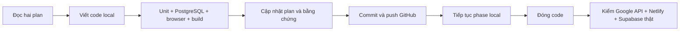

# Phase 3 — lưu trữ và migration local

Phase 3 xây adapter Google Drive API v3 và kiểm chứng bằng dữ liệu tự viết, transport Drive mô phỏng và PostgreSQL thật chạy local. Làm local trước theo quyết định của chủ dự án; chỉ kiểm Google API, Netlify và Supabase thật sau khi đóng code. Không cần khóa cloud để chạy bộ kiểm thử này.

## Chạy và kiểm tra

Dùng checkout hiện tại, Node 24.19.0, npm 11.9.0 và Docker theo [Phase 1](../phase-1/README.md). Không cần tạo worktree mới.

```bash
npm ci --cache /tmp/book-npm-cache --no-audit --no-fund
npm run db:up
npm run db:migrate
npm run check
npm run test:storage:db
mkdir -p .local-library
npm run migration:dry-run -- tools/migration/sample.json .local-library/sample-report.json
```

`test:storage:db` tạo một database PostgreSQL local riêng, seed sách/chương synthetic, gọi API thật với verifier danh tính mô phỏng và Drive adapter thật trên transport mô phỏng; cuối cùng xóa database test. Không bỏ xác thực trong API sản phẩm. PostgreSQL cần quyền tạo database local như cấu hình Docker hiện tại.

Dry-run ghi **chỉ báo cáo local** bằng `wx`: không ghi đè file đã có. Exit 0 khi không có lỗi và inventory đầy đủ; 2 khi có lỗi hoặc inventory chưa đầy đủ; 1 khi input/schema/path không hợp lệ. Báo cáo gồm số lượng, lỗi với số hàng, ID map ổn định, cấu trúc nhóm và metadata. File mẫu là truyện tự viết, không phải dữ liệu thư viện thật. Không commit exports/reports của thư viện vào Git.

## API nền cho Phase 4–5

- `GET /api/books/:bookUUID/chapters/:chapterUUID/content`: Bearer token được xác minh như Phase 2; trả `{text,title}`.
- `GET /api/books/:bookUUID/cover`: proxy PNG/JPEG/WebP, kiểm mime và signature; không trả link Drive công khai.

Browser không truyền file ID. RPC service-only kiểm tài khoản active/read, publication, sách chưa xóa, chương DONE/chưa skip, đúng book/chapter và `drive_resources` synced. Sau khi đọc Drive, kiểm lại trước khi trả/cache. Reader thông thường không thấy sách hidden; tài khoản có read + manage/admin có thể xem sách hidden. API không giả thành công khi thiếu cấu hình/quyền/file.

Cache nằm trong PostgreSQL `private.reader_cache`, không phụ thuộc RAM của Function. Key có book/chapter/file ID, metadata/content/book version, phiên bản bộ lọc và hash `JUNK_WORDS`. TTL 5 phút, tối đa 60.000 byte/entry, tổng 8.000.000 byte; khóa database bảo vệ eviction đồng thời. Mỗi cache hit kiểm quyền/mapping trước. File bị thay đổi/xóa trực tiếp trên Drive có thể còn bản cache tối đa TTL; thao tác qua app cần cập nhật `content_version`/mapping. Luồng kiểm tra file và UI đọc tiếp tục ở Phase 4–5.

## Quy tắc lưu trữ

Adapter chỉ truy cập tài nguyên nằm dưới `DRIVE_ROOT_ID`; kiểm ancestry mỗi lần, không dùng cache ID trong RAM để thay quyền. Danh sách phân trang, query escape tên, từ chối trùng singleton, folder bị trash/ngoài root, ancestry vòng hoặc không xác định. Ngân sách mặc định 100 request mỗi instance, 2.000.000 byte mỗi file, timeout 5 giây/request và tối đa 2 retries với backoff cho GET lỗi quota/timeout/5xx. Metric: requests, retries, bytesRead/bytesWritten; không log tokens hoặc nội dung.

Cấu trúc giữ `root/thể loại chính/tên truyện/Phần/Quyển`. Port dùng lại formatter/parser tên file và header đã đối chiếu với V1.59.2. `info.txt` giữ bốn mục `##Tên truyện`, `##Tác giả`, `##Thể loại`, `##link gốc`; nguồn FILE/FOLDER để trống link. `_import.json` giữ mảng chương và tra theo `num`; log `_Chương lỗi đã xóa.txt` dùng clock được truyền vào và timestamp giờ Việt Nam có giây.

`putText` dùng appProperties `metadataVersion`, không ghi lại cùng phiên bản/nội dung, cập nhật cùng ID ở phiên bản mới, từ chối ghi đè bằng phiên bản cũ hoặc nội dung khác cùng phiên bản. Không tự retry POST/PATCH khi kết quả mơ hồ; lần gọi sau tìm lại file theo tên. `syncBookInfo` giữ row lock trong transaction PostgreSQL xuyên suốt IO, kiểm book version và lưu ID vào `drive_resources` chỉ sau khi ghi thành công. Caller của các helper ghi chapter/import/log phải giữ lock/lease database tương ứng; phần outbox và worker retry ở Phase 7. `ensureBookFolder` là helper nền chưa nối vào UI thêm truyện của Phase 5–6.

## Export và inventory thật — để sau khi đóng code

1. Sao lưu thư viện theo Phase 8. Chép `tools/migration/export-read-only.gs` vào một file tạm trong **project Apps Script hiện có** để đọc đúng Script Properties. Gọi `exportLegacyReadOnly(spreadsheetId)` từ caller/debugger; lưu chuỗi JSON trả về thành `.local-library/export.json`. Không gọi `db_()`/`getConfig_()` vì chúng có thể tạo/sửa Sheets. Helper không viết Sheets/Properties/Drive, không tự gửi dữ liệu ra ngoài. Với thư viện lớn cần caller có tải JSON thành file, không dùng Execution Log vốn giới hạn kích thước. Hàm này chưa có UI export; không thay các file GAS baseline.
2. Export giữ BOOKS 13 cột, CHAPTERS 12 cột, CONFIG thuộc allowlist và chỉ Properties root/folder/log ID. Cookies, tokens, queues, private user properties và log messages không export tự động. Chuyển hàng chờ, tiến độ riêng và lịch sử log cần thiết kế riêng ở Phase 8; dry-run hiện chưa nhập DB. Chạy dry-run đầu tiên sẽ cảnh báo inventory chưa đầy đủ.
3. Khi được phép kiểm cloud, cấu hình server-only `DRIVE_ROOT_ID`, `DRIVE_CLIENT_ID`, `DRIVE_CLIENT_SECRET`, `DRIVE_REFRESH_TOKEN` bằng Environment Settings hoặc `.env` không commit. Drive OAuth của **chủ thư viện** tách khỏi Google login độc giả; cần xác minh chủ tài khoản/scopes/quota với Google thật. Chưa có UI kết nối Drive ở phase này. Không dùng root production cho thử ghi.
4. Tool sau chỉ gọi GET trên Drive và refresh token; root phải khớp export. Kết quả hoàn chỉnh chỉ được ghi sau khi đọc hết các trang; vượt ngân sách/lỗi quyền thì fail, không đánh dấu inventoryComplete.

```bash
npm run migration:inventory -- .local-library/export.json .local-library/inventory-export.json
npm run migration:dry-run -- .local-library/inventory-export.json .local-library/migration-report.json
```

5. Chỉ thử ghi vào thư mục staging mới/tách biệt. Kiểm root editable, owner OAuth refresh, pagination/quota, 403/404/trash, timeout, tạo/cập nhật info không trùng và đối chiếu nội dung. Các bước Google/Supabase/Netlify thật chưa chạy và chưa đánh dấu gate cloud đạt.



Xem [báo cáo kết quả](REPORT.md) và [plan](../../PLAN_WEB_APP.md).
