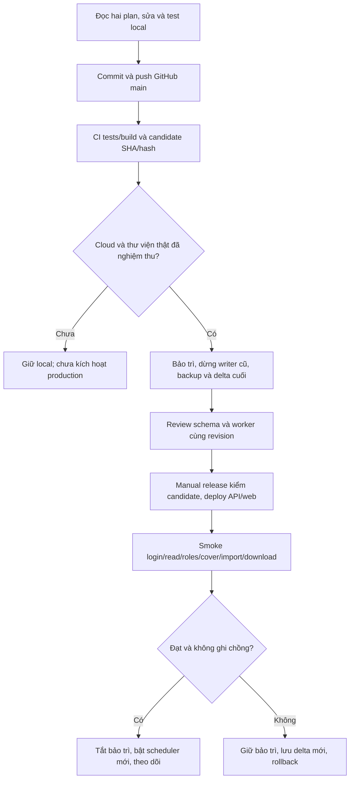

# Runbook phát hành, migration cuối và rollback

Ngày 09/10/2026. Lệnh local đã diễn tập; bước cloud chưa chạy. Owner quyết định chuyển thư viện thật sau đóng code. Ưu tiên gói miễn phí, chưa kích hoạt billing/nâng gói.

## Code → GitHub → cập nhật dự án



GAS vẫn cập nhật bằng [clasp riêng](../../README.md); workflow web không cập nhật Apps Script.

## Diễn tập local

Đọc [Phase 8](../phase-8/README.md) để tạo export BOOKS/CHAPTERS/CONFIG/inventory và options owner. Import ban đầu `migration:local` chạy vào DB sạch, bảo trì tắt và không worker; sách ẩn/jobs paused cho đến review. Sau import bật bảo trì cho reconcile/verify/backup/delta.

`private-state.json` (không commit) có cấu trúc:

```json
{
  "scriptState": {"DB_ID":"sheet-id","ANA_QUEUE":"{\"w\":[],\"h\":[],\"e\":[]}"},
  "LOG": [],
  "imports": [],
  "removedLogs": []
}
```

Mỗi entry imports/removedLogs: `{ "book":"BOOK001", "fileId":"drive-id", "sha256":"64 ký tự hex", "content":"nội dung nguyên gốc" }`. FILE pending bắt buộc có `_import.json` chứa mọi chương còn chờ (`num`, `body`, title/part/vol/dnum optional), hash/ancestry/IMP pointer khớp. Removed log mỗi dòng `thời điểm | Chương N | phần › quyển | tiêu đề | URL | lý do`. Script state chỉ nhận DB_ID, ANA_QUEUE, ROOT_FOLDER/ROOT_FOLDER_ID và FLD_/IMP_/DEL_; không nhập credential.

Reconcile áp dụng CONFIG hợp lệ, catalog GENRES, ngày giờ chương dạng `dd/MM/yyyy HH:mm:ss` (+07), FILE checkpoint, queue paused/failed và removed log. FILE_TYPE khác TXT/encoding khác UTF-8 yêu cầu chuyển đổi riêng. Dữ liệu không đối soát được rollback toàn transaction. LOG/lỗi gốc giữ trong archive private; public audit chỉ tham chiếu. Archive/dump vẫn có thể chứa text riêng tư, cần bảo vệ. Cùng checksum giữ IDs; payload đổi phải đi qua delta.

`file-map.json` là map `{ "drive-file-id": {"path":"relative/file.txt","sha256":"64 ký tự hex"} }` tới bytes offline. Backup bắt buộc mọi file DB/chapter/manifest tham chiếu; **owner cung cấp toàn bộ inventory** để giữ cả info/bìa/file chưa map. Metadata dump không thay backup nội dung.

```bash
npm run operations:maintenance -- on
npm run migration:reconcile -- .local-library/base.json .local-library/options.json .local-library/private-state.json .local-library/reconcile-report.json
npm run migration:verify-apply-local -- .local-library/base.json .local-library/options.json .local-library/raw .local-library/file-map.json .local-library/verify-report.json
npm run operations:backup -- backup .local-library/backup-before .local-library/raw .local-library/file-map.json
npm run operations:backup -- restore .local-library/backup-before
```

Dùng file report/thư mục output **mới**. Snapshot chứa dump và file SHA-256, directory 0700/file 0600. Restore kiểm hash/path, tạo DB `book_restore_<UUID>` mới, so digest bảng auth/public/private trừ cache/token transaction nội bộ, giữ maintenance; không đè DB nguồn, không ghi Drive. Nếu thiếu native pg tools dùng Docker local; đặt BOOK_POSTGRES_CONTAINER/BOOK_DOCKER_CONFIG khi tên khác. Kiểm owner/ACL/progress/bytes trước dùng DB mới.

Delta giữ base/options đã import; target giữ sourceKey/owner/Drive subject/root. Options có thể là `{ "before": <options cũ>, "after": <options mới> }` khi progress owner khác. Đổi source type/folder/root cần migration storage riêng.

```bash
npm run migration:delta -- plan .local-library/base.json .local-library/final.json .local-library/delta-options.json .local-library/delta-plan.json
# Đọc plan và lấy planHash chính xác
npm run migration:delta -- apply .local-library/base.json .local-library/final.json .local-library/delta-options.json .local-library/delta-result.json PLAN_HASH .local-library/backup-before
```

Apply cần DB hiện tại trùng backup và metadata baseline chưa bị sửa native. Conflict thì đối soát/backup mới, không sửa ledger để ép chạy. Giữ IDs, soft-delete sách bị bỏ, archive chương bị bỏ và reset tiến độ trỏ chương đã bỏ; không sửa/xóa Drive. Sách target ẩn/chưa review, jobs paused/không dùng lease cũ. Reconcile private payload cuối, verify files, review từng sách bằng service RPC `review_legacy_book(actor,target,expected_checksum)`, rồi publish/start riêng. Local verify chỉ chứng minh bản sao bytes, không chứng minh Drive access thật. Không grant review RPC cho browser.

## Chuẩn bị cloud sau đóng code

1. Staging dùng gói miễn phí phù hợp; ghi quota/region/TLS/connection pool, kiểm Node/npm provider hỗ trợ. Migration schema có review qua DB owner, ghi checksum ledger; không đưa auth fixtures local lên Supabase. Không tự chạy schema phá hủy khi push.
2. Google OAuth callback Supabase, Site URL/Netlify redirects staging/production; thử Gmail/Workspace, logout/session hết hạn/blocked; bootstrap owner đã xác minh. Kiểm RLS anon/authenticated, phân quyền tải/quản lý/admin trước cache.
3. Drive owner/scopes/refresh/root read-write, Shared Drive nếu dùng, 403/429/backoff, hashes/size/info/cover và mapping ownership. Server secrets: service-role key, DATABASE_URL, Drive OAuth, cookies; không VITE hoặc log. Browser chỉ VITE_SUPABASE_URL/anon-publishable key, APP_ORIGINS đúng domain ở API.
4. GitHub **production environment** có reviewer và chỉ main; vars VITE_SUPABASE_URL, VITE_SUPABASE_ANON_KEY, NETLIFY_SITE_ID; secret NETLIFY_AUTH_TOKEN. **Tắt automatic production publishing trong Netlify Git integration** để không bypass CI/gates. PR không nhận production secret. Netlify CLI pin `27.12.0`; deploy thật chưa kiểm.
5. Owner/on-call giữ lịch backup DB và bản sao Drive, retention và diễn tập restore. Cấu hình alert ngoài app cho jobs stuck/expired lease, sync fail, Drive deny/429 và DB unavailable. UI counters không phát hiện DB chết/không tự gửi thông báo; backup scheduler cloud chưa có do chưa provision. Đo quota/chi phí thật trước tăng lịch/nâng gói, không suy từ mocks.

## Cửa sổ chuyển vận hành

- Ghi release SHA/schema checksum/worker digest/backup và người chịu trách nhiệm. Dừng worker/scheduler mới, bật bảo trì và chờ writer kết thúc. Chủ quản dừng GAS triggers/freeze chỉnh sửa; export cuối.
- Backup Sheets/Properties/LOG/inventory **và bytes Drive** cùng DB mới, thử restore/hashes. Reconcile delta cuối, owner progress/FILE pending/review từng sách. Không có writer cũ/mới ghi chồng.
- Deploy schema tương thích đã review; worker đúng SHA: `docker build --build-arg RELEASE_REVISION=<SHA> -f apps/worker/Dockerfile -t <image:SHA> .`. Lưu digest, chạy `worker --check`, finite pass staging. Check chỉ xác minh schema, chưa chứng minh Google access.
- Nghiệm thu cloud rồi chạy **Release an approved web candidate** ở GitHub Actions: CI run ID main push, full SHA và hai checkbox acceptance. Workflow mặc định đóng, kiểm provenance/hash/lock, rebuild browser public config và ghi manifest môi trường trước deploy API/web. Không migration/push worker image/bật scheduler trong workflow. Ghi run/deploy ID và manifest; candidate retention 14 ngày, deployment record 30 ngày, lưu riêng cho rollback lâu hơn.
- Smoke đạt thì tắt maintenance, bật duy nhất scheduler mới. Cloud Run Jobs/Scheduler là phương án dự kiến; quota/billing/lịch thật cần xác nhận. Kiểm 24 giờ đầu và owner ký nghiệm thu mới đóng gate production.

| Smoke | Kết quả cần đạt |
|---|---|
| Health/version | DB OK; version/contract/minimum schema/full SHA đúng |
| Login/roles | đọc ngay; logout/expired/blocked bị chặn; reader không manage/download/admin |
| Reader | chương/cụm 5/mục lục/Phần-Quyển, negative-fraction display, progress riêng |
| Cover/info | bìa sửa được, file quyền đúng; info.txt đủ bốn mục |
| Import/download | TXT/marker/folder/FILE pending, DONE không rewrite; WEB auto/manual, retry/pause/queue/outbox |
| Migration | counts/hash/IDs/owner progress, review-publication riêng; rerun không nhân bản |
| Maintenance/restore | zero worker IO; DB/file restore hashes và ACL đúng |

## Rollback

1. Bật bảo trì, dừng worker/scheduler, chờ pass ghi kết thúc, freeze cả GAS. Lưu **delta DB và bytes Drive mới nhất** (file mới/thay/xóa/progress) trước rollback để giữ dữ liệu phát sinh.
2. Nếu lỗi web/API, redeploy candidate cũ **tương thích schema hiện tại**, worker cùng contract; không tự down migration phá dữ liệu. Hết artifact retention thì rebuild đúng SHA/lock, kiểm lại trước dùng.
3. Restore vào DB mới còn bảo trì, đối chiếu ACL/progress/hashes. Local restore không khôi phục Drive remote hoặc đảo Drive writes/trash; thư viện thật cần phục hồi bytes/IDs hoặc rebind mapping có review. Smoke revision tương thích trước đổi connection, giữ nguồn mới để đối soát.
4. Trở về GAS phải reconcile delta mới vào schema/Properties/file IDs cũ, hoặc owner xác nhận chỉ quay về snapshot và lưu riêng dữ liệu phát sinh. Không bật ngay GAS trigger trên thư viện hệ mới đã đổi. Chỉ một hệ được ghi sau khi owner chấp nhận mốc rollback.
