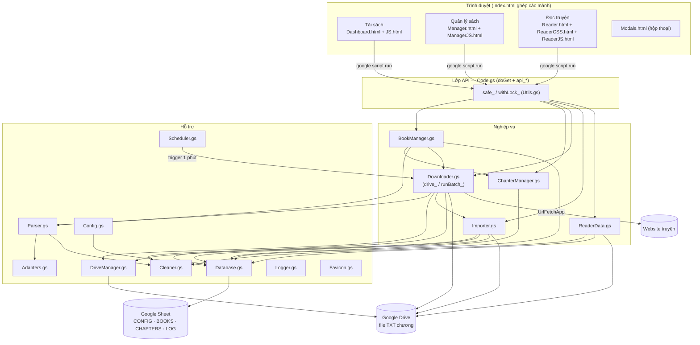
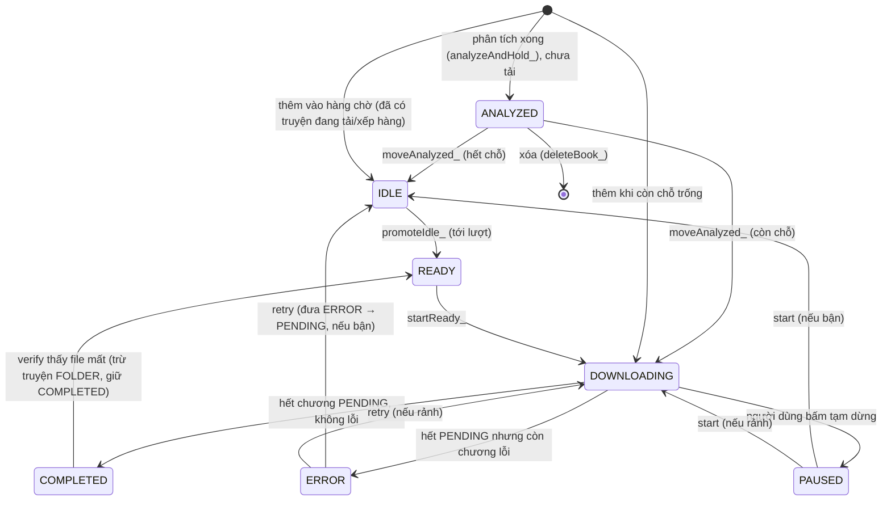
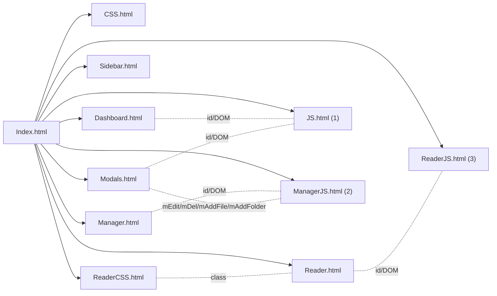
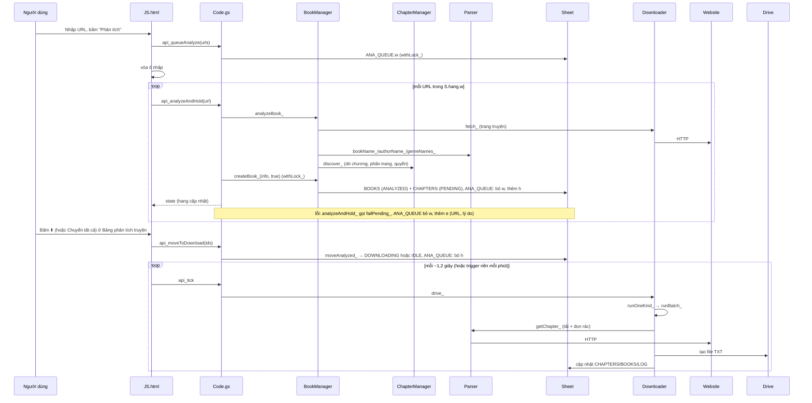
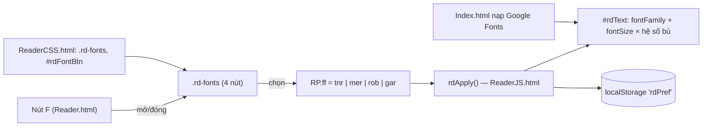

# PLAN: TrinhTaiTruyen

> File này là **plan và mô tả dự án hợp nhất** (thay `MO_TA_DU_AN.md`). Trước khi làm bất kỳ việc gì, đọc mục "Cách làm việc ở các phiên sau" trong MÔ TẢ PHẦN MỀM.

## CHECKLIST TIẾN ĐỘ
Trạng thái: ĐANG MỞ | Phiên bản hiện tại: V1.59.1 | Cập nhật: 2026-10-04 | Cỡ đợt này: S

- [x] 1. `JS.html` — Nhiệm vụ: thêm URL thì hiện ngay trong Bảng phân tích truyện rồi tự động phân tích lần lượt (Chủ dự án chốt ngày 2026-10-04). B1: zip V1.59.0 và plan V1.59.0 cùng phiên bản. Nguyên nhân gốc của độ trễ: bộ xử lý bấm nút Phân tích chờ `api_queueAnalyze` trả lời rồi mới có dòng trong `S.hang.w`, nên trên Apps Script thật bảng chỉ hiện sau vài giây. Hàm chính: `anaRows_()`, bộ xử lý bấm của nút Phân tích (`bAna`), biến `ANA_ADDING_`, `anaRun_`. Thuật toán: kiểm URL bắt đầu bằng http:// hoặc https:// (sai thì báo lỗi, giữ nguyên ô nhập); đưa URL vào `ANA_ADDING_`, xóa ô nhập, vẽ bảng ngay; `anaRows_` thêm dòng trạng thái Chờ phân tích (không nút) cho URL trong `ANA_ADDING_` chưa có ở `w`, `e` hoặc truyện đã phân tích; gọi `api_queueAnalyze`; trả lời xong thì bỏ URL khỏi `ANA_ADDING_`, dùng state máy chủ rồi `anaResume_`; lỗi thì dòng tạm biến mất và URL trả lại ô nhập. Bỏ khóa nút Phân tích suốt lượt phân tích (`anaRun_`), chỉ khóa trong lúc chờ máy chủ, để đang phân tích vẫn thêm được; chỉ xóa `ANA_TRIED_` của URL mới, không xóa cả bảng. Đầu vào: ô URL. Đầu ra: dòng trong `#anaBox`. Phụ thuộc: `api_queueAnalyze`, `take`, `call`, `anaResume_`.
- [x] 2. `Code.gs` — Nhiệm vụ: nâng phiên bản V1.59.1 (dòng 1 và biến `VERSION`), không đổi logic
- [x] 3. `HUONG_DAN_SU_DUNG.md`, `HELP_['tai-sach']` trong `JS.html` — Nhiệm vụ: ghi hành vi thêm URL hiện ngay và tự động phân tích
- [x] 4. Kiểm thử trước khi viết mã: T11.32 đến T11.45 viết vào bảng KẾT QUẢ KIỂM THỬ. Chạy sau khi viết mã trên Chromium qua Playwright: 14 kiểm tra mới Đạt, bộ U 20 kiểm tra và bộ Node hàng chờ 11 kiểm tra chạy lại vẫn Đạt. Lần chạy đầu có 3 kiểm tra mới và 9 kiểm tra cũ không đạt; nguyên nhân gốc đều ở bộ kiểm thử: (a) dòng giờ hiện trước khi phân tích bắt đầu nên điều kiện chờ `!ANA_RUN_` đúng ngay lập tức, đã đổi sang chờ không còn dòng Chờ hoặc Đang phân tích; (b) máy chủ giả không nhận ra URL đã có nên tạo truyện trùng, đã sửa cho giống `analyzeBook_` thật; (c) URL trùng với truyện đã phân tích vẫn đi qua `w` rồi mới được xác định là không đổi, hành vi có từ V1.46.0, không đổi. Đã xem ảnh chụp lúc máy chủ chậm 3 giây
- [!] 5. Chạy tay T10.18 trên Apps Script thật (xem mục 7 của đợt V1.59.0). Lý do: AI không có Apps Script thật; đặc biệt cần xem độ trễ thật giữa lúc bấm và lúc dòng được lưu, và hai lượt thêm URL liên tiếp khi đang phân tích
- [x] 6. Chạy script tuân thủ, xuất zip TrinhTaiTruyen_V1.59.1.zip. TÓM TẮT: LỖI 10 | CẢNH BÁO 17 | ĐÃ DUYỆT 16 | ĐẠT 16/21 | KHÔNG ÁP DỤNG 0 (10 LỖI giống từng dòng với zip gốc V1.58.0, đã nêu là báo nhầm ở đợt V1.59.0 mục 8; số CẢNH BÁO thay đổi so với 38 của zip gốc vì script đánh số và chấm lại các mục K02, K06 của các đợt cũ sau khi checklist thêm mục mới, chưa tra hết nguyên nhân từng dòng; đợt này không thêm cảnh báo K06 nào trong mục của đợt V1.59.1)

### Đợt V1.59.0 (đã thu gọn)

- [x] 1. Đối chiếu bản mới nhất (B1): zip V1.58.0 (dòng 1 Code.gs) và plan V1.58.0 cùng phiên bản. Chủ dự án yêu cầu sửa luồng phân tích truyện: thêm URL, lập danh sách chờ phân tích, phân tích lần lượt; bảng phân tích truyện gồm STT, Tên truyện, Tác giả, Thể loại, Url, Thư mục (chưa phân tích xong thì để trống), Trạng thái, Thao tác. Rà mã: luồng thêm URL, hàng chờ và phân tích lần lượt đã có từ V1.46.0 (ANA_QUEUE, anaRun_), nhưng hiện chia hai bảng rời (Chờ phân tích gồm STT, Link, Trạng thái; Truyện đã phân tích gồm STT, Tên, Thể loại, Số chương, Link), thiếu cột Tác giả và Thư mục, và URL phân tích lỗi bị xóa khỏi hàng chờ ngay (dropPending_) chỉ còn một dòng thông báo thoáng qua nên không phân tích lại được. Cỡ M: không đổi sheet, chỉ mở rộng JSON ANA_QUEUE.
- [x] 2. `AnalyzeQueue.gs` — Nhiệm vụ: giữ URL phân tích lỗi trong hàng chờ ở máy chủ để bảng hiện được dòng Lỗi kèm lý do và cho phân tích lại. Hàm chính: `anaFail_(url, msg)`, `failPending_(url, msg)`, `retryAnalyze_(url)`; sửa `anaLoad_`, `anaSave_`, `anaDone_`, `anaDrop_`, `queueAnalyze_`, `hangState_`, `analyzeAndHold_`. Thuật toán: JSON `ANA_QUEUE` thêm khóa `e` = `[[URL, lý do]]` (chỉ ghi khi không rỗng; JSON cũ không có `e` vẫn đọc được). `anaFail_` bỏ URL khỏi `w`, thêm vào cuối `e` kèm lý do cắt 80 ký tự, giữ tối đa 50 dòng lỗi (bỏ dòng cũ nhất); nếu vượt 8800 byte thì thử lại không kèm lý do, nếu vẫn vượt thì giữ nguyên danh sách lỗi cũ (URL đang chờ không bao giờ bị mất). `failPending_` bọc `anaFail_` trong `withLock_` thử 3 lần (như `dropPending_`) và được `analyzeAndHold_` gọi khi phân tích ném lỗi. `retryAnalyze_` kiểm URL (không rỗng, tối đa 500 ký tự, phải đang ở `e`), chuyển từ `e` về cuối `w`. `anaDone_` (cũng là `dropPending_`) xóa URL khỏi cả `w` lẫn `e`. `queueAnalyze_` thêm lại URL đang lỗi thì chuyển từ `e` sang `w` và đếm là thêm mới. `hangState_` trả thêm `e: [{u, m}]`. Đầu vào: URL, lý do lỗi. Đầu ra: `{state}` hoặc lỗi tiếng Việt. Phụ thuộc: `Utils.gs` (`mk_`, `withLock_`), `Database.gs` (`getState_`).
- [x] 3. `Code.gs` — Nhiệm vụ: thêm API phân tích lại và nâng phiên bản V1.59.0 (dòng 1 và biến `VERSION`). Hàm chính: `api_retryAnalyze(url)` (bọc `retryAnalyze_` trong `safe_` và `withLock_`). Thuật toán: không có logic riêng. Đầu vào: URL. Đầu ra: `{state}`. Phụ thuộc: `AnalyzeQueue.gs`.
- [x] 4. `JS.html`, `CSS.html` — Nhiệm vụ: một Bảng phân tích truyện thay hai bảng rời ở vùng `anaBox`. Hàm chính: `anaRows_()`, `anaRow_(r, i)`, `anaDirPath_(b)`, `anaUrlBtn_(...)`, `drawAna_()`, sửa `anaHeldRows_()`, bộ xử lý bấm của `anaBox`, `anaRun_`, `HELP_['tai-sach']`; CSS `.chst.ok`, `.anaDir`, `.anaMsg`. Thuật toán: `anaRows_` dựng danh sách dòng trong bộ nhớ từ bốn nguồn có sẵn trong `S` (truyện `ANALYZED` trong `S.hang.h`, URL trong `S.hang.w` là Đang phân tích nếu bằng `ANA_CUR_` còn lại là Chờ, URL lỗi trong `S.hang.e`), thứ tự đã phân tích, đang hoặc chờ (theo thứ tự thêm), lỗi; không gọi máy chủ thêm. Tám cột: STT, Tên truyện, Tác giả, Thể loại (tiêu đề bấm được để chọn thể loại cho tất cả truyện đã phân tích, chỉ khi có truyện đã phân tích), Url (chỉ nút 📎), Thư mục, Trạng thái, Thao tác. Dòng chưa phân tích xong để trống Tên, Tác giả, Thể loại, Thư mục; dòng đã phân tích thiếu tác giả hoặc thể loại hiện —. Thư mục là `/{ROOT_FOLDER}/{thể loại chính hoặc Chưa phân loại}/{tên truyện}` (cùng cách đặt tên của `genreFolderName_`) kèm 📎 mở thư mục Drive theo `folderId`. Trạng thái: chip Đã phân tích kèm số chương, chip Đang phân tích có chấm nhấp nháy, chữ Chờ phân tích, chip Lỗi kèm lý do (`textContent`). Thao tác: đã phân tích ✏️ ⬇️ 🗑 (như cũ); chờ 🗑 (xác nhận bằng `askConfirm` rồi `api_dropPending`, không cho bỏ URL đang phân tích); lỗi 🔁 (`api_retryAnalyze`, xóa `ANA_TRIED_` của URL rồi `anaResume_`) và 🗑; đang phân tích không có nút. Bảng ẩn khi không có dòng nào; khóa vẽ lại gồm toàn bộ dòng và `ROOT_FOLDER`. Đầu vào: `S` (trạng thái từ máy chủ). Đầu ra: DOM `#anaBox`. Phụ thuộc: `AnalyzeQueue.gs` qua `getState_`, `askConfirm`, `take`, `call`, `openEdit`, `openDel`.
- [x] 5. `HUONG_DAN_SU_DUNG.md` — Nhiệm vụ: viết lại bước 1 và 2 của mục Tải sách và các chỗ nhắc danh sách Truyện đã phân tích cho khớp Bảng phân tích truyện
- [x] 6. Kiểm thử trước khi viết mã: tình huống T11.1 đến T11.31 viết vào bảng KẾT QUẢ KIỂM THỬ trước khi sửa mã. Chạy sau khi viết mã: 11 kiểm tra Node (mã thật AnalyzeQueue.gs, Script Properties giả) và 20 kiểm tra Chromium thật qua Playwright (trang ghép từ Index.html nguyên bản, máy chủ giả chạy mã thật AnalyzeQueue.gs), tất cả Đạt; đã xem ảnh chụp. Lần chạy giao diện đầu tiên có 10 kiểm tra không đạt, nguyên nhân gốc đều ở bộ kiểm thử (đọc bảng trước khi máy chủ giả trả lời; ký tự 📎 nằm trong textContent; máy chủ giả thiếu getConfig_ cho moveAnalyzed_ thật), không phải ở mã sản phẩm; một lỗi bố cục thật phát hiện qua ảnh chụp: cột Thư mục bị cắt bằng dấu … nên mất tên truyện, đã đổi thành xuống dòng (.anaDir) và chụp lại
- [!] 7. Chạy tay T10.18 (đã viết lại) trên Apps Script thật. Lý do: AI không có Apps Script thật; các điểm chưa kiểm chứng thật là `PropertiesService` thật với giới hạn 9 KB mỗi khóa, thời gian `analyzeAndHold_` với website thật, và thao tác vuốt trên điện thoại thật (đã chụp bằng Chromium ở 390 px, 2026-10-04: trang không tràn ngang, bảng rộng 700 px cuộn ngang trong khung `.wrap` rộng 362 px nên cột Trạng thái và Thao tác nằm ngoài màn hình, phải vuốt mới thấy; dùng được nhưng chưa tiện)
- [x] 8. Chạy script tuân thủ (bản 1.0.0 trong skill), hợp nhất checklist tạm vào plan và xóa checklist tạm, xuất zip TrinhTaiTruyen_V1.59.0.zip. TÓM TẮT: LỖI 10 | CẢNH BÁO 38 | ĐÃ DUYỆT 16 | ĐẠT 16/21 | KHÔNG ÁP DỤNG 0. Chạy cùng script trên zip gốc V1.58.0 cho đúng TÓM TẮT này, danh sách LỖI trùng khớp từng dòng (bỏ số dòng) và không có CẢNH BÁO nào mới, nên đợt này không thêm LỖI hay cảnh báo. 10 LỖI còn lại là báo nhầm của script 1.0.0, đã đọc lại câu lệnh trong phiên này: 7 dòng K09 (JS.html 463, 564, 637, 696, 762, 779 và ManagerJS.html 111) mọi chuỗi chèn vào innerHTML đều qua thoatHtml hoặc là số hoặc hằng; K11 Parser.gs add() là hàm con khai báo bên trong genreNames_ nên giao diện không gọi được; 2 dòng K17 ở Modals.html là nút chữ Hủy và Xác nhận có chữ hiển thị. Chưa khóa checklist vì mục 7 còn chờ Chủ dự án chạy tay và 10 báo nhầm cần Chủ dự án xác nhận hoặc nâng script (plan các đợt trước ghi dự án dùng script 1.0.2 trở lên, bản nhúng trong skill hiện là 1.0.0)

### Đợt V1.58.0 (đã thu gọn)

- [x] 1. Đối chiếu bản mới nhất (B1): zip V1.57.0 (dòng 1 `Code.gs`) và plan V1.57.0 cùng phiên bản. Chủ dự án yêu cầu tùy chọn chế độ đọc Cuộn dọc hoặc Lật trang như Kindle. Rà mã: đoạn mẫu dùng `#chapterContentContainer` (không có; vùng đọc là `#rdMain` chứa `#rdText`), lớp `.reader-mode-*`, `height: 80vh` cố định và `overflow-x:auto` (người đọc kéo ngang được, không có nút lật, chiều cao lệch khi mở khung cài đặt), khóa `reader_view_mode` riêng. Đã chuyển sang: lớp `rd-paged` trên `#rd`, chiều cao tính theo cửa sổ, cuộn ngang bằng mã, cài đặt `RP.mode` nằm chung `rdPref`. Tiến độ đọc V1.57.0 dựa trên cuộn dọc nên phải tính lại theo trang.
- [x] 2. `Reader.html`, `ReaderCSS.html` — Nhiệm vụ: nút chuyển chế độ và bộ điều khiển trang. Thuật toán: thêm nút `rdMode` trong khung cài đặt (nhãn là chế độ sẽ chuyển tới: 📖 Lật trang hoặc 📜 Cuộn dọc); trong menu nổi thêm cụm `.rd-pg` (‹, `rdPgInfo` dạng `3/32`, ›), chỉ hiện khi `#rd` có lớp `rd-paged`. CSS: `.rd.rd-paged .rd-main` (tối đa 44rem, đệm 18/16 px, `overflow:hidden`, `touch-action:pan-y`) và `#rdText` (bỏ giới hạn rộng và đệm, `column-fill:auto`).
- [x] 3. `ReaderJS.html` — Nhiệm vụ: chế độ Lật trang. Hàm chính: `rdLayout()`, `rdShowPage(n)`, `rdPage(d)`, `rdPgInfo()`, `rdSetMode(m)`, `rdLayoutSoon()`, `rdPosSchedule()`, `rdRestore(c, rs)`, biến `RG` `{page, pages, step, gap, bottom}`, `RP.mode`. Thuật toán: chế độ trang đặt `#rdMain` cao bằng cửa sổ trừ phần trên và 84 px cho menu nổi, `#rdText` rộng đúng một cột (`width` và `column-width` cùng giá trị nguyên để cột không giãn lệch), `column-gap` 32 px, nội dung chảy thành nhiều cột; trang n là `scrollLeft = n × (rộng + gap)`, số trang là `round((scrollWidth + gap) / bước)`. Lật bằng bấm 30% mép trái hoặc phải của vùng đọc (không lật khi đang bôi chọn chữ), vuốt ngang (từ 50 px, dốc ít hơn 1,5 lần), nút ‹ ›, phím ← →, PageUp, PageDown (chế độ trang không dùng ← → để đổi chương; dùng ◀ ▶). Lật quá trang cuối thì sang chương kế (trang đầu), lật lùi từ trang đầu thì sang chương trước ở trang cuối (`rs` có `q:1` nên không báo toast). Dàn lại khi đổi cỡ chữ, phông, kích thước cửa sổ, mở hoặc đóng các khung phía trên (quan sát thay đổi lớp của `#vRd`), font tải xong, và khi chuyển tab; vị trí giữ theo tỉ lệ. Đổi chế độ giữa chừng giữ nguyên vị trí theo tỉ lệ. Tiến độ đọc: ở chế độ trang `p = trang / (số trang − 1)`, `y = 0`, lưu sau 500 ms kể từ lúc lật; `rdPosFlush` so thêm độ lệch `p` (từ 0,02) để lật trang trong cùng chương vẫn được gửi máy chủ; `rdRestore` về đúng trang theo `p`, thông báo khôi phục khi trang khác 0. Lựa chọn nhớ ở `rdPref.mode` (mặc định `scroll`).
- [x] 4. `JS.html` — Nhiệm vụ: thêm một dòng hướng dẫn chế độ lật trang vào khóa `doc-truyen` của `HELP_`
- [x] 5. `Code.gs` — Nhiệm vụ: nâng phiên bản V1.58.0 (dòng 1 và biến `VERSION`), không đổi logic
- [x] 6. `HUONG_DAN_SU_DUNG.md` — Nhiệm vụ: thêm mục Chế độ đọc ở phần Đọc truyện
- [x] 7. Kiểm thử trên Chromium thật (Playwright, trang đọc nguyên bản, máy chủ giả, phục vụ qua HTTP cục bộ, bộ PG chạy ngoài zip): mở ở chế độ trang được 32 trang, trang không cuộn dọc (cao đúng bằng cửa sổ); phím ←, → lật đúng và `scrollLeft` bằng đúng bội của bước; bấm mép phải và mép trái lật, bấm giữa không lật; lật quá cuối sang chương sau trang đầu, lật lùi sang chương trước trang cuối; tăng cỡ chữ giữ vị trí (16/32 thành 20/40); đổi sang cuộn dọc giữ vị trí (tỉ lệ 0,51 trước và sau) và bỏ kiểu nội tuyến; đổi lại chế độ trang giữ vị trí; `rdPref.mode` được lưu; mở lại truyện khôi phục đúng trang 6 kèm thông báo; đồng bộ máy chủ gửi `p = 0,128`; đổi cỡ cửa sổ dàn lại trang; mở khung cài đặt không làm trang cuộn dọc; không có lỗi trang. Đã xem ảnh chụp. Chưa thử vuốt cảm ứng thật. Đây cũng là lần đầu chạy thử `rdRestore`, `rdPosStore` và đồng bộ của V1.57.0 trên trình duyệt
- [!] 8. Thử trên điện thoại thật và Apps Script thật; chạy lại các bộ kiểm thử Node cũ (không có trong zip). Lý do: vuốt ngang, bấm mép và chiều cao theo thanh địa chỉ điện thoại (`innerHeight` đổi khi thanh địa chỉ ẩn, đã có dàn lại khi đổi cỡ cửa sổ nhưng chưa thử trên máy thật); truyện có hình hoặc bảng trong chương chưa kiểm tra (nội dung chương hiện chỉ là văn bản); chế độ trang chỉ hiện một cột, chưa có hai cột cho màn rộng

### Đợt V1.57.0 (đã thu gọn)

- [x] 1. Đối chiếu bản mới nhất (B1): zip V1.56.0 (dòng 1 `Code.gs`) và plan V1.56.0 cùng phiên bản. Chủ dự án gửi hai đoạn mẫu: (a) lưu và khôi phục vị trí cuộn khi đọc, đồng bộ lên máy chủ; (b) bảng giám sát hàng chờ tải (danh sách tác vụ, tạm dừng, xóa). Rà mã: Toast (V1.56.0) và hộp xác nhận (V1.55.0) đã có nên dùng lại `showToast`, `askConfirm`; skeleton và thanh bên đã có từ V1.54.0. Đoạn mẫu (a) dùng `getCurrentChapterId()`, `getCurrentBookId()` (không có trong mã), `google.script.run` gọi thẳng, `window.scrollY`, cuộn `smooth`; đoạn mẫu (b) dùng FontAwesome, `glass-panel`, `btn-secondary`, `refreshQueue()` (không có trong mã). Đã chuyển sang `call()`, `R.list[R.i][0]`, `lsGet/lsSet`, token CSS và emoji của dự án. Màn Tải sách đã có bảng Hàng chờ tải (`queueBox`) và thẻ Tiến độ tải; panel mới là bản gộp để theo dõi, không thay hai chỗ đó.
- [x] 2. `ReaderData.gs` — Nhiệm vụ: lưu và đọc tiến độ đọc theo truyện ở máy chủ. Hàm chính: `rpKey_(bookId)`, `saveReadingProgress_(bookId, chapterId, y, ratio, t)`, `getReadingProgress_(bookId)`, `dropReadingProgress_(bookId)`. Thuật toán: khóa `RP_{mã truyện}` trong `UserProperties`, giá trị JSON `{c: số chương, y: px, p: tỉ lệ 0 đến 1, t: mili giây}`; mã truyện chỉ nhận `[\w-]` tối đa 100 ký tự; số chương, `y` phải là số hợp lệ, `y` không âm, `p` bị kẹp về 0 đến 1; `t` ngoài khoảng hợp lệ (quá 1 phút ở tương lai hoặc nhỏ hơn 1e12) thì lấy giờ máy chủ; bản đã lưu có `t` mới hơn thì không ghi đè (trả `skipped`). Đầu vào: mã truyện, số chương, px, tỉ lệ, thời điểm. Đầu ra: `{ok, pos}`; đọc trả `{pos}` hoặc `{pos: null}`.
- [x] 3. `Code.gs`, `BookManager.gs` — Nhiệm vụ: thêm API và dọn khi xóa truyện. Hàm chính: `api_saveReadingProgress`, `api_getReadingProgress`, `api_dropPending(url)` (bọc `dropPending_` của `AnalyzeQueue.gs`, trả `state`); `deleteBook_` gọi thêm `dropReadingProgress_`. Nâng phiên bản V1.57.0 (dòng 1 và biến `VERSION`).
- [x] 4. `ReaderJS.html` — Nhiệm vụ: lưu và khôi phục vị trí đọc, hỏi tiếp tục từ thiết bị khác. Hàm chính: `rdPosNow`, `rdPosStore`, `rdPosFlush`, `rdPosCancel`, `rdRestore(c, rs)`, `rdGo(i, rs)`, `rdOpenAt(id)`. Thuật toán: cuộn dừng 500 ms (`RD_SAVE_MS`) thì ghi `rdPos_{id}` = `{c, y, p, t}` và `rdLast_{id}` vào `localStorage`; đồng bộ lên máy chủ sau khi dừng 4 s (`RD_SYNC_MS`), bỏ qua nếu cùng chương và lệch dưới 80 px so với lần đã gửi, gửi ngay khi `visibilitychange` sang ẩn hoặc `pagehide`; chỉ lưu khi `R.ready` (đã vẽ xong chương, không lưu lúc skeleton), tab Đọc đang mở. Mở lại chương: cuộn tức thì (`behavior:'auto'`, không `smooth` để không phát sinh sự kiện cuộn trung gian) theo tỉ lệ `p` nếu có, không thì theo `y`; từ 120 px (`RD_RESTORE_MIN`) trở lên thì hiện toast "Đã khôi phục vị trí đọc gần nhất", dưới đó coi là đầu chương. `openReader` gọi `api_getReadingProgress` song song với `api_readerList`: bản máy chủ mới hơn bản cục bộ (`t`) thì chép về cục bộ trước khi mở chương; nếu đã mở chương từ bộ nhớ cục bộ và máy chủ ở chương khác thì hỏi bằng `askConfirm` ("Chuyển tới" hoặc "Ở lại đây"), chỉ hỏi khi người dùng chưa tự chuyển chương (`R.req` không đổi). `rdHome` và `rdGo` hủy hẹn giờ lưu. Chương đọc dở `rdLast_` vẫn được ghi như cũ nên thẻ tiến độ của Quản lý sách không đổi.
- [x] 5. `Dashboard.html`, `CSS.html`, `JS.html` — Nhiệm vụ: panel Giám sát tác vụ ở màn Tải sách. Hàm chính: `tmItems_()`, `drawMon_()`, `tmBtn_(a, it)`, `api_dropPending`. Thuật toán: gộp `S.hang.w` (đang phân tích hoặc chờ phân tích) và các truyện `DOWNLOADING`/`READY` (đang chạy), `IDLE` (chờ), `PAUSED` (tạm dừng), `ERROR` (lỗi); `COMPLETED` và `ANALYZED` không liệt kê (hoàn thành chỉ hiện số đếm, đã phân tích có `anaBox`). Mỗi dòng có tên, trạng thái kèm số chương, thanh tiến độ (`role="progressbar"`) và nút theo nhóm: đang chạy ⏸ 🗑; chờ ▶️ ⏸ 🗑; tạm dừng ▶️ 🗑; lỗi 🔁 🗑; chờ phân tích 🗑. ⏸ ▶️ 🔁 gọi `api_setStatus` (`pause`, `start`, `retry`), 🗑 truyện gọi `openDel` (hộp xóa có sẵn), 🗑 URL gọi `askConfirm` rồi `api_dropPending`. Bộ lọc Tất cả, Đang chạy, Chờ, Tạm dừng, Lỗi (chỉ hiện nhóm có dòng); nút 🔄 Làm mới gọi `api_getState`. `drawMon_` chạy trong `draw()` và `drawAna_`; cấu trúc danh sách không đổi thì chỉ sửa chữ trạng thái và độ rộng thanh (giữ focus), đổi thì dựng lại và trả focus; panel ẩn khi không còn tác vụ. Lớp nhóm đặt `g-run|g-wait|g-pause|g-err` để không trùng `.err` toàn cục. Không dùng FontAwesome; giá trị đưa vào HTML đều qua `thoatHtml`.
- [x] 6. `HUONG_DAN_SU_DUNG.md` — Nhiệm vụ: thêm mục Giám sát tác vụ ở Tải sách, mục Nhớ vị trí đọc ở Đọc truyện, sửa dòng Tiến độ đọc trên thẻ
- [x] 7. Mô tả trong plan: mục 2 (nơi lưu dữ liệu), 5.1 (`Code.gs`, `ReaderData.gs`, `BookManager.gs`), 5.2 (`Dashboard.html`, `JS.html`, `ReaderJS.html`), 6.3 (bảng API), 7.4 (luồng đọc), mục 8 (bảng an toàn), nhật ký, đề xuất. Đã gỡ các dòng chú thích do phiên này thêm vào mã (B15)
- [x] 8. Kiểm tra: `node --check` cho `ReaderJS.html`, `JS.html`, `ReaderData.gs`, `Code.gs`, `BookManager.gs` đạt. Panel giám sát chạy thử trên Chromium thật (Playwright, dữ liệu giả, không có `google.script.run`): 6 dòng từ 5 truyện và 2 URL, 5 nút lọc có số đếm đúng, đổi tiến độ chỉ sửa tại chỗ (chữ và độ rộng thanh), lọc Lỗi còn 1 dòng với nút 🔁 và 🗑, ẩn panel khi hết tác vụ, không có lỗi trang; đã xem ảnh chụp. Phần lưu và khôi phục vị trí đọc chưa chạy trên trình duyệt (mới kiểm cú pháp)
- [!] 9. Chạy tay trên Apps Script thật và điện thoại thật; chạy lại các bộ kiểm thử Node cũ (không có trong zip). Lý do: AI không có Apps Script thật nên chưa thử `UserProperties`, `api_dropPending` và các nút ⏸ ▶️ 🔁 của panel với máy chủ thật; chưa kiểm tra khôi phục vị trí đọc (cuộn tới đúng chỗ sau khi đổi cỡ chữ, tải lại trang, mở trên hai thiết bị, hộp "Tiếp tục đọc") nên cần đọc giữa một chương dài, tải lại trang, rồi mở trên thiết bị thứ hai; `RS.sent` và `t` dùng đồng hồ máy khách nên hai máy lệch giờ nhiều có thể chọn nhầm bản mới hơn

### Đợt V1.56.0 (đã thu gọn)

- [x] 1. Đối chiếu bản mới nhất (B1): zip V1.55.0 và plan V1.55.0 cùng phiên bản. Chủ dự án yêu cầu hệ thống thông báo Toast. Rà mã: đã có `#toast` đơn (một thông báo, bản mới ghi đè bản cũ) và hàm `toast(t, bad)` được gọi ở khoảng 25 chỗ. Đoạn mẫu của Chủ dự án dùng FontAwesome (`<i class="fa-solid …">`), gán `innerHTML` với chuỗi chưa thoát và `z-index` 1100, trái quy ước dự án (V1.54.0: giữ emoji, không FontAwesome; K09: không `innerHTML`; `z-index` toàn dự án ở mức 10 đến 30); được đặt về đúng chỗ (HTML ở `Modals.html`, CSS ở `CSS.html`, JS ở `JS.html`, không phải `Utils.gs` vì là mã trình duyệt), biểu tượng là chữ ✓ ! i trong vòng tròn màu, nội dung bằng `textContent`, `z-index` 30 (vẫn trên hộp xác nhận 25)
- [x] 2. `Modals.html` — Nhiệm vụ: thay `<div id="toast">` bằng vùng chứa `#toastContainer` (`aria-live="polite"`). Phụ thuộc: `CSS.html`, `JS.html`
- [x] 3. `CSS.html` — Nhiệm vụ: kiểu toast xếp chồng. Thuật toán: bỏ `#toast` và `#toast.on`, `.bad`; thêm `#toastContainer` (cố định góc trên phải cách mép 24 px, rộng tối đa 380 px, `pointer-events:none` để không chắn thao tác), `.toast` (kính mờ 12 px, viền, trượt vào 0,3 s, lớp `.out` mờ dần và trượt ra), `.toast.error` viền đỏ, `.ti` (vòng tròn: xanh lục thành công, đỏ lỗi, chàm thông tin; chữ đậm đủ tương phản), `.tm`, `.tx` (nút ×); màn rộng tối đa 720 px chuyển xuống đáy, lề 12 px (đầu trang có thanh bên nằm ngang); `prefers-reduced-motion` tắt chuyển động
- [x] 4. `JS.html` — Nhiệm vụ: toast xếp chồng, giữ chữ ký cũ. Hàm chính: `showToast(message, type)` (type là `success`, `error`, `info`; loại lạ thành `info`), `toast(t, bad)` (giữ nguyên chữ ký; `true` hoặc `'error'` là lỗi, `'success'` là thành công, chuỗi bắt đầu bằng `Đã ` là thành công, còn lại là thông tin; bỏ ký hiệu ✅ ở đầu vì đã có biểu tượng), `toastArm_`, `toastDrop_`. Thuật toán: dựng bằng DOM và `textContent`; tối đa 4 toast hiện cùng lúc (quá thì bỏ cái cũ nhất); cùng loại và cùng nội dung thì chỉ đặt lại giờ, không thêm toast; tự tắt sau 3,5 s (lỗi 7 s); rê chuột vào thì dừng đếm, rời ra đếm lại; nút × đóng ngay; lỗi có `role="alert"`, còn lại `role="status"`. Bỏ ✅ ở chỗ thêm xong truyện. Không đổi nơi gọi nào khác
- [x] 5. `Code.gs` — Nhiệm vụ: nâng phiên bản V1.56.0 (dòng 1 và biến `VERSION`), không đổi logic
- [x] 6. `HUONG_DAN_SU_DUNG.md` — Nhiệm vụ: thêm mục Thông báo ở phần Giao diện
- [x] 7. Kiểm thử trên Chromium thật (Playwright, bộ TOAST ngoài zip): 17/17 đạt (loại, `role`, biểu tượng, chống XSS, nút ×, tối đa 4, trùng lặp, thời hạn 3,5 s và 7 s, dừng khi rê chuột, nằm trên hộp xác nhận, không chắn bấm, vị trí máy tính và điện thoại); bộ AM chạy lại 49/49. Lượt đầu 3 lỗi do bộ thử đếm cả toast đang thoát và chờ sai 7,4 s, không phải lỗi mã
- [!] 8. Xem trên Apps Script thật và điện thoại thật; chạy lại bộ kiểm thử Node cũ (không có trong zip). Lý do: bộ TOAST chạy với máy chủ giả; các bộ cũ có thể còn tham chiếu `#toast` (đã bỏ, đổi thành `#toastContainer`) nên cần sửa khi chạy lại

### Đợt V1.55.0 (đã thu gọn)

- [x] 1. Đối chiếu bản mới nhất (B1): zip V1.54.4 (dòng 1 `Code.gs`) và plan V1.54.4 cùng phiên bản. Chủ dự án yêu cầu thay hộp thoại mặc định của trình duyệt bằng hộp kính mờ có hiệu ứng. Rà mã: không có `alert(` và `prompt(`; còn đúng 4 lệnh `confirm(` ở `JS.html` (xóa chương ở thẻ đang tải, hủy tải chương, xử lý hàng loạt trong danh sách chương, Thoát giao diện). Xóa truyện, sửa thông tin truyện và xem danh sách chương đã là hộp thoại riêng (`mDel`, `mEdit`, `mList`) nên giữ, chỉ thêm hiệu ứng mở/đóng. Đoạn mã mẫu của Chủ dự án (một khối có `<style>` và `<script>`, lớp `.glass-panel`, `.btn-primary`, `.btn-secondary`, biến `--accent`, gán `innerHTML`) được đặt về đúng chỗ của dự án: HTML ở `Modals.html`, CSS ở `CSS.html`, JS ở `JS.html`; nút dùng `button.p` và `button.x` sẵn có, biến `--pri`, nội dung dựng bằng `textContent` và DOM (K09), không chú thích trong mã (B15)
- [x] 2. `Modals.html` — Nhiệm vụ: thêm hộp xác nhận dùng chung `mAsk`. Hàm chính: không có. Thuật toán: `role="alertdialog"`, `aria-modal`, `aria-labelledby` và `aria-describedby`; tiêu đề `amTitle`, nút × `amClose`, thân `amBody`, chân `.ft` có `amCancel` và `amOk` (`data-chuc-nang` là `huy` và `xac-nhan`); đặt ngay trước `mHelp` để `mHelp` vẫn là hộp cuối tệp. Phụ thuộc: `CSS.html`, `JS.html`
- [x] 3. `CSS.html` — Nhiệm vụ: hiệu ứng mở/đóng cho mọi hộp thoại và kiểu cho `mAsk`. Hàm chính: không có. Thuật toán: sửa tại chỗ `.modal` (luôn `display:flex`, ẩn bằng `opacity:0`, `visibility:hidden`, `pointer-events:none`, chuyển 0,25 s, `visibility` đổi sau khi mờ xong để hộp ẩn không nhận Tab và không bị trình đọc màn hình đọc; nền `rgba(11,15,25,.75)`, làm mờ 8 px), `.modal.on`, `.modal .dlg` (thu về 0,92, bật lại có độ nảy) và thêm `.modal.on .dlg{transform:none}` để hộp đang mở không tạo khối chứa mới; thêm `.dlg .ft`, `#mAsk` (`z-index` 25 để nằm trên mọi hộp khác, rộng tối đa 460 px), `#amTitle`, `#amBody p`, `.amx`; `prefers-reduced-motion` tắt chuyển động; màn rộng tối đa 480 px thì hai nút xếp dọc, nút xác nhận ở trên. Phụ thuộc: `Modals.html`
- [x] 4. `JS.html` — Nhiệm vụ: thay 4 lệnh `confirm(` bằng hộp `mAsk`. Hàm chính: `askConfirm(message, opt)` (trả `Promise` là `true` khi xác nhận, `false` khi hủy), `openModal(title, content, onConfirm, opt)`, `closeModal()`, `amFinish_(ok)`. Thuật toán: `content` là chuỗi thì mỗi dòng thành một đoạn `p` bằng `textContent`, là nút DOM thì gắn vào; `opt` gồm `title`, `okText`, `cancelText`, `danger` (nút xác nhận kiểu `x`, focus mặc định ở nút Hủy), `hideCancel`; `onConfirm` có thể là hàm bất đồng bộ: khi chạy thì khóa hai nút và không đóng được, trả `false` thì giữ hộp mở, ném lỗi thì báo bằng `toast` và giữ hộp; mở hộp mới khi hộp cũ còn treo thì lời hỏi cũ nhận `false`; Esc, nút ×, nút Hủy, bấm nền (cả lúc nhấn và nhả chuột đều ở nền) đóng với `false`; Tab xoay vòng trong hộp; đóng xong trả focus về phần tử trước đó. Bốn chỗ gọi: xóa chương (`Xóa chương N`, nút nguy hiểm), hàng loạt (nguy hiểm trừ tải lại), hủy tải chương (nút `Giữ lại`), `bExit` (đổi thành hàm `async`). Phụ thuộc: `Modals.html`, `CSS.html`
- [x] 5. `Code.gs` — Nhiệm vụ: nâng phiên bản V1.55.0 (dòng 1 và biến `VERSION`), không đổi logic
- [x] 6. `HUONG_DAN_SU_DUNG.md` — Nhiệm vụ: thêm mục Hộp xác nhận ở phần Giao diện (cách hủy: Esc, ×, bấm nền, nút Hủy)
- [x] 7. Kiểm thử trên Chromium thật (Playwright, `google.script.run` giả, bộ AM chạy ngoài zip): 49/49 đạt, gồm mở/đóng, resolve đúng, bốn cách hủy, kéo chuột không đóng nhầm, vòng Tab, `onConfirm` bất đồng bộ, chồng lên `mList` và `mHelp`, hộp cũ vẫn mở/đóng được, 4 chỗ thay `confirm` chỉ gọi máy chủ sau khi xác nhận, màn 375 px
- [!] 8. Xem giao diện trên Apps Script thật và điện thoại thật; chạy lại bộ kiểm thử Node cũ (không có trong zip). Lý do: bộ AM chạy với máy chủ giả; hiệu ứng `backdrop-filter` và độ nảy có thể khác trên trình duyệt di động cũ; mọi hộp thoại cũ đổi sang hiệu ứng mới nên cần mở thử từng hộp một lần (T10.14, T10.25)

### Đợt V1.54.4 (đã thu gọn)

- [x] 1. Đối chiếu bản mới nhất (B1): zip V1.54.3 (bản vừa xuất ở lượt trước) và plan V1.54.3 cùng phiên bản. Chủ dự án gửi ảnh icon mới `Gemini_Generated_Image_6c8j4v6c8j4v6c8j.png` (sách mở và chiếc lá, nền trắng, không còn vòng tròn xanh) và yêu cầu: cập nhật icon, favicon, bổ sung icon vào màn Tải sách, Quản lý sách, Đọc sách
- [x] 2. Xử lý ảnh (ngoài mã): xóa nền trắng và dải bóng mờ bằng cách tô loang từ viền ảnh qua các điểm sáng, ít màu (nhỏ hơn 48 chênh lệch kênh, kênh nhỏ nhất từ 150 trở lên); phần giấy kem trong sách được viền vàng bao kín nên không bị tô lan; viền ngoài lấy lại màu từ điểm đặc gần nhất để không có quầng trắng. Cắt sát nội dung, thu về rộng 160 px (PNG trong suốt, khoảng 30 KB) cho giao diện; vẽ lại 16/32/48/64 trên khung vuông (lề 6%) và ghép thành `.ico` (khoảng 12 KB) cho favicon
- [x] 3. `CSS.html` — Nhiệm vụ: khai báo logo một lần. Hàm chính: không có. Thuật toán: biến `--logo` ở `:root` chứa data URI; lớp `.pgLogo` (nền `var(--logo)` vừa khung, tỉ lệ 160/119, bóng nhẹ), `.hh` (tiêu đề dạng flex căn giữa dọc, cách 8 px); `.brand .logo` rộng 64 px khi mở, `.side.col .brand .logo` rộng 42 px khi thu gọn. Bỏ quy tắc logo tròn 56 px của V1.54.3. Phụ thuộc: `Sidebar.html`, `Dashboard.html`, `Manager.html`, `Reader.html`
- [x] 4. `Sidebar.html`, `Dashboard.html`, `Manager.html`, `Reader.html`, `ReaderCSS.html` — Nhiệm vụ: đặt icon ở đầu mỗi màn hình. Thuật toán: thanh bên thay `` nhúng riêng bằng `<span class="pgLogo logo">` dùng chung biến `--logo` (trang không còn hai bản ảnh); tiêu đề "Tải sách — URL truyện" và "Quản lý sách" thêm `span.pgLogo` đứng trước chữ; thanh đầu trang đọc thêm `span.pgLogo.rdLogo` (40 px, 32 px khi màn hẹp) đứng trước khối tên truyện, `.rd-top` đổi sang flex căn giữa, `.rd-tt` thêm `flex:1`. Các icon trang trí có `aria-hidden`. Chuỗi tiêu đề do `rdTitle` đổi vẫn chỉ là chữ, không đụng icon
- [x] 5. `Favicon.gs` — Nhiệm vụ: thay ảnh favicon. Hàm chính: `faviconUrl_()` (không đổi logic). Thuật toán: thay `FAVICON_ICO_B64_` bằng `.ico` mới, tăng `FAVICON_VER_` từ 2 lên 3 để hàm tạo file mới trên Drive và bỏ file cũ vào thùng rác
- [x] 6. `Code.gs` — Nhiệm vụ: nâng phiên bản V1.54.4 (dòng 1 và biến `VERSION`), không đổi logic
- [!] 7. Xem giao diện thật trên trình duyệt (ba màn hình, thanh bên mở và thu gọn, chủ đề đọc ngày/đêm, màn hẹp) và xem favicon trên tab sau khi triển khai. Lý do: môi trường làm việc của AI không có trình duyệt nên chưa nhìn thấy; trình duyệt hay giữ favicon cũ nên có thể cần Ctrl+F5 hoặc đóng mở tab; chưa chạy bộ kiểm thử Node (không có trong zip)

### Đợt V1.54.3 (đã thu gọn)

- [x] Thêm logo tròn 56 px vào thanh bên (`Sidebar.html`, `CSS.html`), nâng V1.54.3; V1.54.4 thay bằng icon mới

### Đợt V1.54.2 (đã thu gọn)

- [x] 1. `Favicon.gs`, `Code.gs` — Nhiệm vụ: đổi favicon sang ảnh sách mở và chiếc lá do Chủ dự án gửi (`icon.png`). Hàm chính: `faviconUrl_()`. Thuật toán: ảnh cắt theo hình tròn, nền ngoài trong suốt, xuất `.ico` 4 cỡ (16, 32, 48, 64) nhúng base64 vào `FAVICON_ICO_B64_`; thêm hằng `FAVICON_VER_` và khóa Script Property `FAVICON_VER`: khác phiên bản thì tạo file ico mới trên Drive, ghi ID mới và bỏ file cũ vào thùng rác (nếu không, ID cũ lưu từ trước vẫn trả về ảnh cũ); nâng V1.54.2. Đầu vào: Script Properties. Đầu ra: URL favicon. Phụ thuộc: không
- [!] 2. Xem favicon thật trên tab trình duyệt sau khi triển khai phiên bản mới. Lý do: chưa chạy trên Apps Script thật; trình duyệt thường giữ favicon cũ trong bộ nhớ đệm nên có thể phải tải lại cứng (Ctrl+F5) hoặc đóng mở tab


- [x] 1. `ReaderJS.html`, `Code.gs` — Nhiệm vụ: mỗi lần tải chương ở trang đọc chỉ lấy 5 chương thay vì 2 cụm 10 chương. Hàm chính: `rdLoadWindow(tc, my)`, `rdGo(i)`, hằng `RD_CLUSTER`. Thuật toán: `RD_CLUSTER` 10 → 5; `rdLoadWindow` chỉ lấy cụm `tc` (trước đây `tc` và `tc+1`); `rdGo` tải nền cụm kế khi đang ở 2 chương cuối cụm (trước đây khi đang ở cụm thứ hai của cửa sổ); cửa sổ vẫn tối đa 2 cụm; nâng V1.54.1. Cách hiểu: "tải chương" là trang đọc (lấy theo cụm), không phải tải truyện từ website (`BATCH_SIZE` vốn đã mặc định 5). Đầu vào: danh sách chương. Đầu ra: chương hiển thị. Phụ thuộc: `api_readChapterCluster` (không đổi)
- [!] 2. Chạy thử trên Apps Script thật; chưa chạy bộ kiểm thử Node (không có trong zip). Lý do: chưa có môi trường chạy thật


- [x] 1. Đối chiếu bản mới nhất (B1): zip V1.53.0 và plan V1.53.0 cùng phiên bản (zip tạm, chưa khóa). Chủ dự án gửi bản gợi ý (thanh bên thu gọn dùng FontAwesome, skeleton loader cho lưới truyện và trang đọc) có tên hàm và id không khớp mã thật (`switchTab`, `bookGridContainer`, `chapterContentContainer`, `getBooksData`). Cách hiểu: chuyển thể ý tưởng vào đúng cấu trúc hiện có. Quyết định: giữ biểu tượng emoji, không thêm FontAwesome (tránh phụ thuộc tải ngoài); dựng skeleton bằng DOM, không nối chuỗi HTML (bản gợi ý nối `book.title` vào innerHTML, dễ lỗi chèn mã); không có hàm `getBooksData` vì danh sách truyện lấy từ trạng thái `S`
- [x] 2. `Sidebar.html`, `CSS.html`, `JS.html` — Nhiệm vụ: thanh bên đóng/mở. Hàm chính: `sideSet_(col)`. Thuật toán: nút `sTog` (« và ») đổi lớp `col` của thanh bên; rộng 68px khi thu gọn, chuyển động 0,3 giây, chỉ còn biểu tượng và có `title`; nút Cài đặt và Thoát luôn hiện (Thoát dùng biểu tượng ⏻); lựa chọn lưu ở `localStorage` khóa `tttSideCol`, đọc lại khi mở trang; trên màn hình ≤720px thanh bên là dải ngang nên bỏ qua trạng thái thu gọn. Đầu vào: `localStorage`. Đầu ra: thanh bên. Phụ thuộc: không
- [x] 3. `CSS.html`, `ManagerJS.html`, `ReaderJS.html`, `JS.html` — Nhiệm vụ: skeleton loader. Hàm chính: `mgSkeleton_()`, `rdSkel()`. Thuật toán: lớp `.sk` (ánh sáng chạy ngang, tắt khi người dùng chọn giảm chuyển động); `mgSkeleton_` dựng 8 thẻ chờ trong `mgGrid` khi mở Quản lý sách lúc trạng thái `S` chưa về (dạng lưới), `drawMgr` ghi đè khi dữ liệu về; `rdSkel` thay dòng chữ "Đang tải danh sách chương…" và "Đang tải chương…" bằng khung tiêu đề và 10 đoạn chờ, `rdRender` hoặc `rdMsg` ghi đè khi xong. Đầu vào: `S`. Đầu ra: khung chờ. Phụ thuộc: không
- [x] 4. `Code.gs` — Nhiệm vụ: nâng phiên bản V1.54.0 (dòng 1 và biến `VERSION`), không đổi logic
- [x] 5. Kiểm tra cú pháp ba khối script (`node --check`: JS, ManagerJS, ReaderJS đạt); cập nhật nhật ký và `HUONG_DAN_SU_DUNG.md`
- [!] 6. Xem giao diện thật trên trình duyệt và chạy tay trên Apps Script thật; chạy lại các bộ kiểm thử Node ngoài zip. Lý do: môi trường làm việc của AI không có trình duyệt hiện đại và không có các bộ kiểm thử Node của dự án trong zip nên chưa chạy lại được; bố cục thu gọn, hiệu ứng skeleton chưa được nhìn thấy thật; chưa khóa checklist, chờ Chủ dự án xem rồi xác nhận

### Đợt V1.53.0 (đã thu gọn; mục 8 và 9 của đợt này còn `[!]`, chờ xem giao diện thật)


- [x] 1. Đối chiếu bản mới nhất (B1): zip V1.52.0 (bản vừa xuất ở lượt trước, chưa khóa) và plan V1.52.0 cùng phiên bản. Chủ dự án yêu cầu "thay thế giao diện cũ". Cách hiểu: giao diện Kính tối thành giao diện duy nhất, bỏ hẳn giao diện cũ và nút đổi giao diện của V1.52.0; Quản lý sách mặc định là dạng lưới như bản mẫu, vẫn giữ nút ☰ Bảng vì bảng có sắp xếp theo cột; màu ngày hoặc đêm của trang đọc là tùy chọn đọc riêng nên giữ. Phương án: (A) giữ nút đổi giao diện như V1.52.0, không phải thay thế; (B) bỏ hẳn giao diện cũ; (C) bỏ cả dạng bảng. Chọn (B): đúng yêu cầu, và bảng giữ lại vì quy tắc ưu tiên màn hình làm việc dạng lưới cột
- [x] 2. `CSS.html`, `ReaderCSS.html` — Nhiệm vụ: gộp lớp Kính tối vào CSS gốc và xóa giao diện cũ. Hàm chính: không có (CSS). Thuật toán: gộp từng khai báo của lớp ghi đè `html[data-skin="glass"]` vào đúng quy tắc gốc cùng bộ chọn bằng công cụ gộp tự động (18 quy tắc; chỉ hai quy tắc hover mới được thêm), rồi xóa lớp ghi đè và khối `prefers-color-scheme` cũ; `:root` mang bảng màu Kính tối và `color-scheme:dark`; kiểm chứng chéo 80 khai báo kính cũ đều còn đúng giá trị (hai khác biệt cố ý: `color-scheme` ngày chuyển lên `.rd` gốc, `border-top` thay bằng `border` của viên thuốc); `ReaderCSS.html`: `.rd-float` và các quy tắc đi kèm thành viên thuốc làm quy tắc gốc, `.rd` có `color-scheme:light` và đêm `dark` để trang đọc giữ màu ngày/đêm riêng. Đầu vào: không. Đầu ra: giao diện Kính tối duy nhất. Phụ thuộc: không
- [x] 3. `Index.html`, `Sidebar.html`, `JS.html` — Nhiệm vụ: bỏ cơ chế đổi giao diện. Hàm chính: không có. Thuật toán: xóa script nạp sớm ở `<head>`, nút `bSkin`, các hàm `skinGet_`, `skinApply_` và câu hướng dẫn tương ứng; khóa `tttSkin` còn trong trình duyệt của người dùng từ V1.52.0 bị bỏ qua, vô hại. Đầu vào: không. Đầu ra: giao diện không còn nút đổi. Phụ thuộc: không
- [x] 4. `Manager.html`, `ManagerJS.html`, `JS.html` — Nhiệm vụ: Quản lý sách mặc định là dạng lưới. Hàm chính: `mgViewGet_()`, `mgSyncView_()`, `drawMgr()`. Thuật toán: `mgViewGet_` trả `table` chỉ khi người dùng đã chọn bảng (khóa `tttMgView` bằng `table`), mọi trường hợp khác kể cả chưa chọn và giá trị lạ là `grid`; trạng thái tĩnh của `Manager.html` khớp mặc định (lưới hiện, bảng ẩn, nút Lưới đang chọn) để không nháy; sửa câu hướng dẫn Quản lý sách. Đầu vào: lựa chọn đã lưu. Đầu ra: kiểu hiển thị. Phụ thuộc: không
- [x] 5. `Code.gs` — Nhiệm vụ: nâng phiên bản V1.53.0 (dòng 1 và biến `VERSION`), không đổi logic. Hàm chính: `doGet()`. Thuật toán: sửa hai chỗ ghi phiên bản. Đầu vào: không. Đầu ra: giao diện hiển thị 1.53.0. Phụ thuộc: không
- [x] 6. Kiểm thử theo bảng "Kết quả kiểm thử": viết lại bộ CS (30 kiểm tra) và UI13 (3 kiểm tra), sửa UI10 và UI14 cho mặc định mới (tổng bộ UI 124), viết trước khi sửa (trên V1.52.0: bộ UI đạt 119, không đạt 5; bộ CS mới không đạt ở các kiểm tra về dấu vết giao diện cũ, bề mặt kính, bảng màu), đột biến M141 đến M150 (10 chỗ, đều bị bắt), chạy lại bộ SG, FM, A đến G, X, HC, E, S, Z
- [x] 7. Cập nhật mô tả trong plan, hướng dẫn chạy tay T10.25 và HUONG_DAN_SU_DUNG.md
- [!] 8. Xem giao diện thật trên trình duyệt và chạy tay T10.18 đến T10.25 trên Apps Script thật; chạy lại 10 bộ kiểm thử Node cũ cùng bộ V4. Lý do: môi trường làm việc của AI không có trình duyệt hiện đại (chỉ có trình dựng WebKit cũ không hỗ trợ biến CSS và `backdrop-filter`) nên chưa ai nhìn thấy giao diện Kính tối thật; độ đọc được chỉ được chứng minh bằng tính tương phản màu WCAG từ chính CSS và kiểm thử cấu trúc trên DOM giả; bố cục, khoảng cách, hiệu ứng mờ, thanh nổi ở các cỡ màn hình chưa được xem; vì giao diện cũ đã bị thay thế nên nếu cần quay lại phải dùng zip V1.51.0 hoặc V1.52.0
- [!] 9. Chạy script kiểm tra, khóa checklist, xuất zip TrinhTaiTruyen_V1.53.0.zip. Lý do: chưa khóa vì mục 8 còn mở và chờ Chủ dự án xem giao diện rồi xác nhận; script bản 1.0.0 còn báo 5 dòng K09 là báo nhầm đã kiểm chứng thủ công; đã xuất zip tạm ghi CHƯA KHÓA

### Đợt V1.52.0 (đã thu gọn; đợt này đưa vào giao diện Kính tối kèm nút đổi, V1.53.0 thay nút đó bằng giao diện duy nhất)

- [x] 1. Đối chiếu bản mới nhất (B1): zip V1.51.0 (bản vừa xuất ở lượt trước trong cùng phiên làm việc, chưa khóa) và plan V1.51.0 cùng phiên bản. Chủ dự án gửi tài liệu thiết kế mẫu phong cách Dark Glassmorphism cho 3 phần (Tải sách, Quản lý sách, Đọc truyện) kèm yêu cầu "bổ sung". Cách hiểu: tích hợp thiết kế vào ứng dụng, không thay thế giao diện cũ. Hai chỗ mơ hồ, AI quyết và báo lại Chủ dự án: (a) dạng lưới thẻ có bìa và "Đã đọc X / N chương" của phần Quản lý sách được thêm như một kiểu hiển thị song song với bảng (quy tắc ưu tiên màn hình làm việc dạng lưới cột có tiêu đề rõ nên bảng vẫn là mặc định); (b) giao diện Kính tối là mặc định lần đầu mở và có nút đổi về giao diện Mặc định
- [x] 2. `CSS.html`, `ReaderCSS.html` — Nhiệm vụ: lớp giao diện Kính tối và CSS thẻ truyện. Hàm chính: không có (CSS). Thuật toán: toàn bộ quy tắc kính nằm dưới `html[data-skin="glass"]` nên giao diện Mặc định không đổi một dòng nào (kiểm thử CS1.4, CS1.5, CS1.8); chỉ đổi giá trị các biến `--bg --card --ink --mut --line --pri --ok --bad --warn --acc` vì nút, hộp, bảng của ứng dụng đã dùng các biến này, còn trang đọc khai báo lại biến trong phạm vi `.rd` nên màu ngày hoặc đêm của trang đọc giữ nguyên mà không cần ghi đè hàng loạt; thêm nền chuyển sắc có quầng sáng, làm mờ nền (`backdrop-filter`) cho `.box .side .bcard .tbl .seg`, nút chính chuyển sắc `#4f46e5` đến `#7c3aed` (bản mẫu dùng `#6366f1`, chữ trắng chỉ đạt 4,47:1 nên thay), thanh tiến độ chuyển sắc, hộp thoại và lớp phủ làm mờ, `#toast` và `.ct-c.err` ghi đè màu cố định kém đọc trên nền tối; `color-scheme:dark` cho điều khiển gốc của trình duyệt và `light` cho trang đọc ban ngày; thanh nổi của trang đọc `.rd-float` đổi sang dạng viên thuốc nằm giữa vùng nội dung (giữ nguyên hiệu ứng trượt `.show`); CSS lớp mới `.bgrid .bcard .bcover .binit .bbadge .bact .bbody .btitle .bsub .bprog .bread` dùng biến nên dùng được cho cả hai giao diện. Đầu vào: thuộc tính `data-skin` của thẻ html. Đầu ra: giao diện. Phụ thuộc: `Index.html`
- [x] 3. `Index.html`, `Sidebar.html`, `JS.html` — Nhiệm vụ: nạp sớm và đổi giao diện, trợ giúp. Hàm chính: hai hàm đọc và áp giao diện (tên cũ skinGet_ và skinApply_, đã bỏ ở V1.53.0 cùng nút `bSkin`). Thuật toán: script nhỏ trong `<head>` đặt `data-skin` từ `localStorage.tttSkin` (chỉ `default` là Mặc định, mọi giá trị khác kể cả chưa có là Kính tối) trước khi nạp CSS để không nháy giao diện; nút `bSkin` ở thanh bên đổi qua lại, lưu `tttSkin`, cập nhật chữ, `aria-label` và `title`; thêm một câu vào hướng dẫn màn Tải sách. Đầu vào: lựa chọn đã lưu. Đầu ra: thuộc tính `data-skin`. Phụ thuộc: không
- [x] 4. `Manager.html`, `ManagerJS.html`, `JS.html` — Nhiệm vụ: kiểu hiển thị lưới thẻ truyện ở Quản lý sách. Hàm chính: `mgViewGet_()`, `mgLs_(k)`, `mgHue_(s)`, `mgCover_(name)`, `mgInitials_(name)`, `mgReadInfo_(id)`, `mgEl_(tag, cls, text)`, `mgBtn_(text, label, a, cls)`, `mgCard_(b, d, pend)`, `mgDrawGrid_(page)`, `mgSyncView_()`, `mgAct_(e)`, `drawMgr()`. Thuật toán: `Manager.html` thêm nhóm nút `mgView` (Bảng, Lưới, có `aria-pressed` và nhãn), ô chọn sắp xếp `mgSortSel` (chỉ hiện ở dạng lưới, sáu kiểu sắp xếp theo tên, tác giả, thể loại), vùng `mgGrid` và `mgTableWrap`; `drawMgr` dùng chung một danh sách đã lọc, sắp xếp, phân trang cho cả hai dạng rồi dựng bảng hoặc lưới; mỗi thẻ dựng bằng DOM (không nối chuỗi HTML): bìa chuyển sắc theo băm tên (độ sáng đủ để chữ trắng đạt tối thiểu 4,5:1 với mọi màu, kiểm thử UI15.1), chữ cái đầu (từ đầu và từ cuối), huy hiệu `Đã tải xong` hoặc `Chưa tải đủ`, tên, tác giả và thể loại, tiến độ đọc `Đã đọc: X / N chương` từ `rdLast_<mã>` và `rdList_<mã>` có sẵn của trang đọc (không đổi cách lưu; không có thì `Chưa đọc`), nút `Đọc tiếp →` hoặc `Đọc →` (khóa khi chưa tải được chương nào), nút ✏️ và 🗑 có `aria-label`, dấu ● khi đang lưu tạm; `mgAct_` dùng chung cho bảng và lưới (tìm `[data-id]` gần nhất thay cho dòng bảng); lựa chọn Bảng hay Lưới và sắp xếp lạ được kiểm tra, kiểu hiển thị lưu ở `tttMgView`; thêm câu vào hướng dẫn Quản lý sách. Đầu vào: `S.books`, `MG.pending`, `localStorage`. Đầu ra: bảng hoặc lưới. Phụ thuộc: `ReaderJS.html` (chỉ qua dữ liệu `rdLast_`, `rdList_`)
- [x] 5. `Code.gs` — Nhiệm vụ: nâng phiên bản V1.52.0 (dòng 1 và biến `VERSION`), không đổi logic. Hàm chính: `doGet()`. Thuật toán: sửa hai chỗ ghi phiên bản. Đầu vào: không. Đầu ra: giao diện hiển thị 1.52.0. Phụ thuộc: không
- [x] 6. Kiểm thử theo bảng "Kết quả kiểm thử": bộ CSS tĩnh mới CS (26 kiểm tra), UI13 đến UI15 mới (27 kiểm tra, tổng bộ UI 124), viết trước khi sửa (trên V1.51.0: bộ CS khi có 13 kiểm tra đạt 6, không đạt 7; bộ UI 97 ca cũ đạt, UI13 không đạt và dừng vì thiếu bộ xử lý nút đổi giao diện), đột biến M121 đến M140 (20 chỗ, đều bị bắt; M122 lúc đầu bị bỏ sót nên đã siết CS1.8), chạy lại bộ SG, FM, A đến G, X, HC, E, S, Z
- [x] 7. Cập nhật mô tả trong plan (giao diện Kính tối, lưới thẻ truyện, phần lấy và không lấy từ bản mẫu), hướng dẫn chạy tay T10.25 và HUONG_DAN_SU_DUNG.md
- [!] 8. Xem giao diện thật trên trình duyệt và chạy tay T10.18 đến T10.25 trên Apps Script thật; chạy lại 10 bộ kiểm thử Node cũ cùng bộ V4. Lý do: môi trường làm việc của AI không có trình duyệt hiện đại (chỉ có trình dựng WebKit cũ không hỗ trợ biến CSS và `backdrop-filter`) nên chưa ai nhìn thấy giao diện Kính tối thật; độ đọc được chỉ được chứng minh bằng tính tương phản màu WCAG từ chính CSS (thấp nhất 5,1:1 cho chữ, không dưới 4,5:1 cho chữ trên nút và bìa) và kiểm thử cấu trúc trên DOM giả; bố cục, khoảng cách, hiệu ứng mờ, thanh nổi ở các cỡ màn hình chưa được xem
- [!] 9. Chạy script kiểm tra, khóa checklist, xuất zip TrinhTaiTruyen_V1.52.0.zip. Lý do: chưa khóa vì mục 8 còn mở và chờ Chủ dự án xem giao diện rồi xác nhận; script bản 1.0.0 còn báo 5 dòng K09 là báo nhầm đã kiểm chứng thủ công; đã xuất zip tạm ghi CHƯA KHÓA

### Đợt V1.51.0 (đã thu gọn)

- [x] 1. Đối chiếu bản mới nhất (B1): Chủ dự án gửi zip TrinhTaiTruyen_V1_50_0_luu_tam, mã là V1.50.0 cao hơn plan V1.49.2 (người khác đã sửa mã mà chưa ghi plan). Đã đồng bộ plan theo mã thực tế trước khi sửa: so từng file với V1.49.2, V1.50.0 đổi 5 file (Code.gs, Manager.html, ManagerJS.html, JS.html, CSS.html) gồm hai việc: (a) hộp chọn thể loại chỉ hiện thể loại đang tích và có dòng "Xem thêm…" ở cuối; (b) ở Quản lý sách, ✏️ rồi 💾 chỉ lưu tạm trong bộ nhớ trình duyệt, nút "💾 Lưu tất cả" mới ghi vào hệ thống bằng `api_saveBooksBatch`. Chạy các bộ kiểm thử có sẵn trên V1.50.0: đều đạt (không hồi quy). Chạy script trên V1.50.0: 34 LỖI (K03 lệch phiên bản, 29 chỗ K07 comment trong mã, 5 chỗ K09 báo nhầm cũ). Viết bộ kiểm thử mới cho V1.50.0, phát hiện thêm 3 lỗi chức năng (xem mục 2). Yêu cầu mới của Chủ dự án: danh sách Truyện đã phân tích bổ sung cột Thể loại, bấm vào để chọn thể loại áp dụng cho tất cả truyện trong danh sách
- [x] 2. `ManagerJS.html`, `Manager.html` — Nhiệm vụ: sửa 3 lỗi của V1.50.0 về lưu tạm và bỏ toàn bộ comment trong mã (B15). Hàm chính: `openEdit(id, stage)`, `mgBad_(b, f)`, `mgPrune_()`, `drawMgr()`, `mgDisplay_(b)`, `mgSyncBtn_()`. Thuật toán: (a) chỉ khi mở khung sửa từ bảng Quản lý sách (`openEdit(id, true)`) mới lưu tạm vào `MG.pending`; mở từ danh sách Truyện đã phân tích hoặc Hàng chờ tải thì lưu ngay bằng `api_saveBook` như trước và bỏ bản nháp của truyện đó; trước đây mọi nơi đều lưu tạm nhưng nút Lưu tất cả chỉ ở Quản lý sách nên thay đổi như biến mất; (b) `mgPrune_` bỏ bản nháp của truyện không còn trong hệ thống để nút không đếm mãi và không báo lỗi mãi; (c) nút Lưu tất cả chỉ xóa bản nháp nếu nó vẫn là chính bản đã gửi, tránh xóa nhầm bản vừa sửa tiếp trong lúc đang lưu; (d) `mgBad_` chặn tên, tác giả, thể loại đổi sang giá trị bắt đầu bằng = + - hoặc @ ngay lúc lưu tạm (trước đây chỉ biết lỗi khi bấm Lưu tất cả); (e) bỏ các dòng comment `//` và comment HTML (lý do thiết kế được chuyển vào mục mô tả "Lưu tạm ở Quản lý sách" của plan). Đầu vào: dữ liệu ở khung sửa. Đầu ra: bản nháp hoặc lưu ngay. Phụ thuộc: `Code.gs` (`api_saveBook`, `api_saveBooksBatch`)
- [x] 3. `ManagerJS.html` — Nhiệm vụ: hộp chọn thể loại dùng được cho việc áp dụng hàng loạt. Hàm chính: `openGenrePick_(input, opts)`, `gpApplyVisibility_()`. Thuật toán: `opts.requireOne` bắt buộc tích ít nhất một thể loại (báo "Chọn ít nhất một thể loại để áp dụng." và giữ hộp mở), `opts.note` hiện dòng ghi chú trong hộp, `opts.onOk(genre)` được gọi sau khi bấm Áp dụng; các nơi gọi cũ (không truyền `opts`) giữ nguyên hành vi, kể cả cách chỉ hiện thể loại đang tích với dòng Xem thêm của V1.50.0. Đầu vào: ô nhập, tùy chọn. Đầu ra: chuỗi thể loại, thể loại chính đứng đầu. Phụ thuộc: không
- [x] 4. `JS.html`, `Dashboard.html`, `CSS.html` — Nhiệm vụ: cột Thể loại ở danh sách Truyện đã phân tích và chọn thể loại cho cả danh sách. Hàm chính: `anaTable_(title, heads, rows, tool)`, `anaHeldRows_()`, `drawAna_()`, `anaPickGenre_()`, `anaApplyGenre_(genre)`. Thuật toán: `anaTable_` cho phép tiêu đề cột là nút (phần tử thứ ba của khai báo cột là tên thuộc tính data); `drawAna_` thêm cột Thể loại sau cột Tên truyện (— nếu trống) và tiêu đề cột là nút `data-ana-genre`; `anaPickGenre_` điền ô ẩn `anaGenre` bằng thể loại chung nếu mọi truyện có cùng thể loại rồi mở hộp chọn với ghi chú số truyện; `anaApplyGenre_` gọi `api_setGenreMany` cho tất cả truyện đang trong danh sách lúc bấm Áp dụng, cập nhật bảng và báo số truyện thành công cùng từng truyện lỗi; thêm một câu vào hướng dẫn màn Tải sách; CSS cho nút tiêu đề cột. Đầu vào: danh sách `S.hang.h`, thể loại đã chọn. Đầu ra: thể loại mới của các truyện, thông báo. Phụ thuộc: `ManagerJS.html` (`openGenrePick_`), `Code.gs`
- [x] 5. `BookManager.gs`, `Code.gs` — Nhiệm vụ: đổi thể loại hàng loạt ở máy chủ và nâng phiên bản V1.51.0, bỏ comment trong `Code.gs`. Hàm chính: `setGenreMany_(ids, genre)`, `api_setGenreMany(ids, genre)`. Thuật toán: `setGenreMany_` từ chối danh sách rỗng, quá 200 truyện, thể loại rỗng hoặc bắt đầu bằng = + - @; đọc danh sách truyện một lần; mỗi truyện phải tồn tại và đang ở trạng thái ANALYZED, rồi gọi `updateBookInfo_` giữ nguyên tên và tác giả (hàm này đổi cột Sheet và chuyển thư mục Drive sang thư mục thể loại chính nếu thể loại chính đổi); lỗi của một truyện (không tồn tại, không phải đã phân tích, lỗi Drive, trùng tên) ghi riêng theo mã truyện, không chặn truyện khác; trả `{ok, errors, state}`; `api_setGenreMany` bọc `safe_` và `withLock_` (khóa bận thì trả busy). Đầu vào: mảng mã truyện, chuỗi thể loại. Đầu ra: số thành công, lỗi theo mã, state mới. Phụ thuộc: `updateBookInfo_`, `assertNoFormula_`
- [x] 6. Kiểm thử theo bảng "Kết quả kiểm thử": bộ SG mới cho máy chủ (19 kiểm tra), UI10 đến UI12 mới cho giao diện (35 kiểm tra, tổng bộ UI 97), viết trước khi sửa (trên V1.50.0: bộ UI đạt 86, không đạt 3, UI12 không chạy được vì thiếu api_setGenreMany; bộ SG chỉ đạt 1 kiểm tra), đột biến M106 đến M120 (15 chỗ, đều bị bắt), chạy lại bộ A đến G, X (130), FM (12), HC (49), E (11), S (20), Z (32000 lượt)
- [x] 7. Cập nhật mô tả trong plan (lưu tạm, hộp chọn thể loại, thể loại hàng loạt, API), hướng dẫn chạy tay T10.24 và HUONG_DAN_SU_DUNG.md
- [!] 8. Chạy tay T10.18 đến T10.24 trên Apps Script thật và chạy lại 10 bộ kiểm thử Node cũ (320 kiểm tra) cùng bộ V4. Lý do: AI không có Apps Script thật nên chưa có kết quả T10; các bộ kiểm thử cũ nằm ngoài zip và chưa được gửi kèm; các luồng mới được kiểm bằng bộ SG, UI, A đến G, X, FM, E, Z, S, HC trên môi trường giả (Sheet, Drive, khóa, Script Property giả), chưa chứng minh hành vi riêng của Google
- [!] 9. Chạy script kiểm tra, khóa checklist, xuất zip TrinhTaiTruyen_V1.51.0.zip. Lý do: chưa khóa vì mục 8 còn mở (T10 chưa chạy) và chờ Chủ dự án xác nhận; script bản 1.0.0 còn báo 5 dòng K09 là báo nhầm đã kiểm chứng thủ công (xem mục rà soát V1.49.2); đã xuất zip tạm ghi CHƯA KHÓA

### Đợt V1.49.2 (đã khóa theo xác nhận của Chủ dự án ngày 2026-10-03; đã thu gọn)

- [x] 1. Đối chiếu bản mới nhất (B1): zip V1.49.1 (bản vừa xuất ở lượt trước trong cùng phiên làm việc, chưa khóa) và plan V1.49.1 cùng phiên bản. Chủ dự án chỉ thị "cho phép tự xử lý và hoàn thành": AI tự xử lý các việc còn mở ở lượt trước (ký tự công thức ở dữ liệu lấy từ website và cấu hình, cảnh báo K15, lỗi K09 do script cũ) rồi hoàn tất và khóa đợt. Không gửi zip mới
- [x] 2. `Database.gs`, `Config.gs` — Nhiệm vụ: chặn ký tự công thức Sheet (= + - @) ở dữ liệu không do người dùng nhập trực tiếp, gồm tên truyện, tác giả, tiêu đề chương, link, thông báo lỗi, nội dung nhật ký lấy từ website hoặc từ mã, và giá trị cấu hình. Hàm chính: `ensureSchema_(ss)`, `ensureTextFormats_(ss)`, `writeConfig_(obj)`. Thuật toán: `ensureTextFormats_` đặt định dạng văn bản thuần cho các cột chữ cột B đến E của BOOKS, cột C đến D và cột H của CHAPTERS, cột F của LOG (cột số chương và các cột số không đụng tới), chỉ chạy một lần nhờ Script Property FMT_TEXT và được gọi từ `ensureSchema_` nên áp dụng cả cho file dữ liệu mới lẫn cũ; định dạng văn bản thuần bền qua mọi lần ghi lại khối chương nên không bị mất như tiền tố dấu nháy; `writeConfig_` thêm một khoảng trắng đứng đầu cho giá trị cấu hình kiểu chữ bắt đầu bằng ký tự công thức (mọi nơi đọc đều cắt khoảng trắng, số và JSON không bị đụng). Đầu vào: file dữ liệu, giá trị cấu hình. Đầu ra: cột chữ là văn bản thuần, cấu hình không thành công thức. Phụ thuộc: `Utils.gs` (`startsFormula_`)
- [x] 3. `Code.gs` — Nhiệm vụ: nâng phiên bản V1.49.2 (dòng 1 và biến `VERSION`), không đổi logic. Hàm chính: `doGet()`. Thuật toán: sửa hai chỗ ghi phiên bản. Đầu vào: không. Đầu ra: giao diện hiển thị 1.49.2. Phụ thuộc: không
- [x] 4. Kiểm thử theo bảng "Kết quả kiểm thử": bộ mới FM (12 kiểm tra, viết trước khi sửa; trên V1.49.1 đạt 4, không đạt 8), đột biến M100 đến M105 (6 chỗ, đều bị bắt), chạy lại bộ A đến G, X (130), HC (49), UI (62), E (11), Z (32000 lượt), S (20)
- [x] 5. Kiểm chứng thủ công 5 dòng K09 do script bản 1.0.0 báo (xem mục rà soát V1.49.2): cả 5 câu lệnh chỉ chèn số hoặc giá trị đã qua thoatHtml hoặc dựng bằng DOM; ghi vào plan. Ghi ngoại lệ K15 vào mục NGOẠI LỆ ĐÃ DUYỆT theo chỉ thị của Chủ dự án
- [x] 6. Cập nhật mô tả trong plan, hướng dẫn chạy tay T10.23 và HUONG_DAN_SU_DUNG.md
- [!] 7. Chạy tay T10.18 đến T10.23 trên Apps Script thật và chạy lại 10 bộ kiểm thử Node cũ (320 kiểm tra) cùng bộ V4. Lý do: AI không có Apps Script thật nên chưa có kết quả T10; các bộ kiểm thử cũ nằm ngoài zip và chưa được gửi kèm; B5 và các luồng mới được kiểm bằng bộ S, HC, UI, E, A đến G, X, FM và Z trên môi trường giả (Sheet, Drive, khóa, Script Property giả), chưa chứng minh hành vi riêng của Google (đặc biệt định dạng văn bản thuần chặn công thức)
- [x] 8. Chạy script kiểm tra, khóa checklist, xuất zip TrinhTaiTruyen_V1.49.2.zip. Kết quả script bản 1.0.0: K15 đã ghi ngoại lệ; còn 5 dòng K09 là báo nhầm của script bản 1.0.0 đã kiểm chứng thủ công, plan khóa theo xác nhận của Chủ dự án kèm các mục chưa kiểm chứng ghi ở mục 7

### Đợt V1.49.1 (đã thu gọn)

- [x] 1. Đối chiếu bản mới nhất (B1): zip V1.49.0 (bản vừa xuất ở lượt trước trong cùng phiên làm việc, chưa khóa) và plan V1.49.0 cùng phiên bản. Chủ dự án yêu cầu: kiểm tra thật kỹ và sửa lại các lỗi. Cách làm: rà soát toàn bộ phần đã viết trong phiên (V1.46.0 đến V1.49.0) bằng kiểm tĩnh (hàm gọi mà không định nghĩa, id giao diện không tồn tại, cân bằng thẻ HTML), kiểm thử ngẫu nhiên thuật toán chèn chương, kiểm thử đầu-cuối nối các đợt, soát lại các màn khác dùng số chương và trạng thái, đối chiếu quy tắc Apps Script. Tìm ra 8 lỗi (mục 2 đến 9), đều đã sửa. Không gửi zip mới
- [x] 2. `ChapterTools.gs` — Nhiệm vụ: sửa hai lỗi chèn chương và chặn ký tự công thức. Hàm chính: `placeChapter_(rows, g, k)`, `pickName_(chosen, existing, allowBlank, allowNew, label)`, `addChapterManual_(id, kind, f)`, `addChapterByText_(b, br, at, rawText, source)`. Thuật toán: (a) khi xếp nhóm mới, chỉ xét các nhóm có Phần hoặc Quyển (bỏ nhóm không tên ra khỏi phép so thứ tự), nhóm nhỏ nhất đặt ngay trước chương đầu của nhóm có tên đầu tiên; trước đây nhóm không tên (cụm chương không thuộc Quyển) bị tính như một nhóm nên Quyển mới có thể bị đặt sau cụm đó, xen giữa các Quyển; (b) chương không thuộc Quyển (số sắp xếp bằng chính thứ tự) bị từ chối nếu số đó rơi vào giữa khoảng số của một Quyển, vì sẽ xé đôi Quyển; (c) tiêu đề, tên Phần và Quyển mới do người dùng nhập bị từ chối nếu bắt đầu bằng = + - hoặc @ qua `assertNoFormula_`, tiêu đề lấy từ dòng đầu của nội dung thì bỏ trống nếu bắt đầu bằng các ký tự đó. Đầu vào: như cũ. Đầu ra: như cũ, thêm lỗi tiếng Việt mới. Phụ thuộc: `Utils.gs` (`assertNoFormula_`, `startsFormula_`)
- [x] 3. `Utils.gs`, `BookManager.gs` — Nhiệm vụ: chặn ký tự công thức ở các đường sửa thông tin có từ trước (quy tắc Apps Script: giá trị người dùng nhập bắt đầu bằng = + - @ không được ghi vào Sheet). Hàm chính: `startsFormula_(s)`, `assertNoFormula_(s, label)`, `updateBookInfo_(id, f)`, `editChapterRow_(id, num, url, title)`. Thuật toán: `assertNoFormula_` ném lỗi tiếng Việt nêu tên trường; `updateBookInfo_` kiểm tên truyện, tác giả, thể loại chỉ khi giá trị thay đổi so với đang lưu; `editChapterRow_` kiểm tiêu đề chỉ khi khác tiêu đề đang lưu, và kiểm trước khi sửa dữ liệu trong bộ nhớ; chọn từ chối thay cho gắn tiền tố vì mọi lần ghi lại cả khối chương (`writeBlock_`) đọc rồi ghi lại giá trị, tiền tố sẽ mất ở lần ghi lại sau. Đầu vào: dữ liệu người dùng nhập. Đầu ra: như cũ hoặc lỗi tiếng Việt. Phụ thuộc: không
- [x] 4. `AnalyzeQueue.gs` — Nhiệm vụ: sửa lỗi giới hạn dung lượng JSON hàng chờ tính theo ký tự trong khi Script Property giới hạn theo byte (link có chữ có dấu chiếm 2 đến 3 byte mỗi ký tự, vượt giới hạn thì Apps Script ném lỗi tiếng Anh "Argument too large"). Hàm chính: `utf8Len_(s)`, `anaSave_(q)`. Thuật toán: `utf8Len_` đếm byte UTF-8 (1, 2, 3 byte và 4 byte cho cặp thay thế); `anaSave_` so với 8800 byte, vượt thì trả sai để các hàm gọi báo lỗi tiếng Việt "Hàng chờ phân tích đầy". Đầu vào: danh sách chờ. Đầu ra: lưu hoặc báo đầy. Phụ thuộc: không
- [x] 5. `ChapterManager.gs`, `JS.html` — Nhiệm vụ: thẻ "Chương đang tải" hiển thị Số hiệu thay vì số sắp xếp (chương chèn giữa có số sắp xếp lẻ như 4,5). Hàm chính: `activeRows_(id, limit)`, `renderActiveChapters_(rows)`, `chDispNum_(num, dnum)`. Thuật toán: `activeRows_` trả thêm cột thứ sáu là Số hiệu; `renderActiveChapters_` hiển thị `chDispNum_(num, dnum)` còn thuộc tính `data-num` giữ số sắp xếp để thao tác tìm đúng dòng. Đầu vào: dòng chương chưa xong. Đầu ra: nhãn "Chương N" đúng. Phụ thuộc: không
- [x] 6. `ManagerJS.html`, `CSS.html`, `JS.html` — Nhiệm vụ: sửa ba lỗi giao diện của hộp thêm chương và hướng dẫn. Hàm chính: `acSubmit_()`, `acLoadGroups(id, keep)`, `acReset(id)`. Thuật toán: nút Thêm chương chặn bấm đúp (bỏ qua khi đang xử lý, mở lại trong `finally`), trước đây đọc file xong mới khóa nút; sau khi thêm, lựa chọn Phần, Quyển vừa tạo mới được chọn sẵn thay vì quay về "Tạo mới"; CSS của ô chọn và vùng dán được giới hạn theo id (`#acPart`, `#acVol`, `#acText`), trước đây quy tắc `select` và `textarea` toàn cục có thể làm lệch ô chọn ở màn Đọc truyện; hướng dẫn nêu quy tắc ký tự công thức. Đầu vào: dữ liệu người dùng nhập. Đầu ra: như cũ. Phụ thuộc: `ChapterTools.gs`
- [x] 7. `Code.gs` — Nhiệm vụ: nâng phiên bản V1.49.1 (dòng 1 và biến `VERSION`), không đổi logic. Hàm chính: `doGet()`. Thuật toán: sửa hai chỗ ghi phiên bản. Đầu vào: không. Đầu ra: giao diện hiển thị 1.49.1. Phụ thuộc: không
- [x] 8. Kiểm thử theo bảng "Kết quả kiểm thử": bộ A, B, F, G, X mở rộng (130 kiểm tra), HC (49), UI (62), đầu-cuối E (11), ngẫu nhiên (32000 lượt), S (20); trên V1.49.0 (khi chạy bộ mới): bộ A, B, F, G, X đạt 113, không đạt 17; HC đạt 47, không đạt 2; UI đạt 59, không đạt 3; ngẫu nhiên lỗi 2291 trên 32000 lượt; đột biến M88 đến M99 (12 chỗ, đều bị bắt)
- [x] 9. Cập nhật mô tả trong plan, hướng dẫn chạy tay T10.22 và HUONG_DAN_SU_DUNG.md
- [!] 10. Chạy lại 10 bộ kiểm thử Node cũ (320 kiểm tra) và bộ V4. Lý do: các bộ này nằm ngoài zip và chưa được gửi kèm; B5 được kiểm bằng bộ S, HC, UI, E, A đến G
- [!] 11. Chạy script kiểm tra, khóa checklist, xuất zip. Lý do: chưa khóa vì T10 (gồm T10.18 đến T10.22) chưa có kết quả, mục 10 còn mở, script bản 1.0.0 còn báo 5 dòng K09 là báo nhầm đã ghi từ V1.42.4, và còn 1 CẢNH BÁO K15 ở Modals.html (script chỉ tìm chữ beforeunload trong cùng file với ô nhập, mã thật nằm ở ManagerJS.html và được kiểm thử UI8.16 đến UI8.19) chờ Chủ dự án duyệt ngoại lệ; đã xuất zip tạm TrinhTaiTruyen_V1.49.1.zip ghi CHƯA KHÓA

### Đợt V1.49.0 (đã thu gọn)

- [x] 1. Đối chiếu bản mới nhất (B1): zip V1.48.0 (bản vừa xuất ở lượt trước trong cùng phiên làm việc, chưa khóa) và plan V1.48.0 cùng phiên bản. Chủ dự án yêu cầu: (a) thêm chương thì bắt buộc chọn Phần, Quyển, thứ tự chương; (b) ngoài thêm từ link và từ text, thêm lựa chọn cho phép dán nội dung chương vào phần mềm. Cách hiểu của AI, đã báo Chủ dự án: Phần, Quyển chọn trong danh sách nhóm đang có của truyện hoặc tạo mới, truyện không chia Phần, Quyển thì không có mục chọn; thứ tự chương là số chương trong Quyển; ba cách thêm gồm Từ link, Từ file (.txt hoặc .md) và Dán nội dung (mục Từ text của V1.48.0 chính là ô dán nên tách riêng thêm Từ file). Không gửi zip mới
- [x] 2. `ChapterTools.gs` — Nhiệm vụ: thêm chương bắt buộc chọn Phần, Quyển, thứ tự chương, chèn đúng vị trí theo Phần, Quyển, thứ tự; ba kiểu thêm; file chương lỗi ghi cả Phần, Quyển. Hàm chính: `chapterGroups_(id)`, `pickGroup_(rows, f)`, `pickName_(chosen, existing, allowBlank, allowNew, label)`, `parseOrder_(raw)`, `placeChapter_(rows, g, k)`, `dnumValue_(r)`, `cmpGroup_(a, b)`, `addChapterManual_(id, kind, f)`, `addChapterByLink_(b, br, at, rawUrl)`, `addChapterByText_(b, br, at, rawText, source)`, `removedLine_(it)`, `removedItem_(row, reason)`. Thuật toán: `chapterGroups_` gom các dòng chương theo (Phần, Quyển) và đếm số chương; `pickGroup_` xét truyện có Phần hoặc Quyển hay không: không có thì từ chối mọi Phần, Quyển được gửi lên; có Phần thì Phần phải là chuỗi do người dùng chọn, trùng một Phần đang có (so bằng `normName_`, dùng đúng tên đang lưu), hoặc rỗng (không thuộc Phần nào, chỉ khi đã có chương như vậy), hoặc tên mới kèm cờ `newPart`; Quyển xét tương tự trong phạm vi Phần đã chọn (Phần mới thì mọi Quyển đều là mới hoặc rỗng) với cờ `newVol`; `parseOrder_` bắt buộc số nguyên 1 đến 99999; `placeChapter_`: nhóm rỗng, rỗng (truyện phẳng hoặc chương không thuộc Phần, Quyển) thì số sắp xếp bằng chính thứ tự và phải chưa dùng; nhóm khác thì từ chối nếu số hiệu đã có trong nhóm (`dnumValue_` đọc số hiệu, dạng N-M thành N cộng M chia 100000, số hiệu rỗng thì dùng số sắp xếp), nhóm đã có chương thì chèn trước chương đầu tiên của nhóm có số hiệu lớn hơn, không có thì chèn sau chương cuối nhóm, số sắp xếp lấy trung điểm hai chương liền kề (hoặc số lớn nhất cộng 1 ở cuối truyện), nhóm chưa có chương thì đặt sau nhóm cuối cùng nhỏ hơn theo `cmpGroup_` (so số đầu tiên trong tên, không có số thì so chuỗi không dấu) hoặc đầu truyện; `addChapterManual_` nhận kiểu link, file hoặc paste, thêm dòng chương có Phần, Quyển, Số hiệu; kiểu link: sách thêm từ file bị từ chối, kiểm link như cũ, dòng PENDING, trạng thái sách theo `statusAfterAdd_`; kiểu file và paste: tạo file trong thư mục Phần › Quyển bằng `chapterFolder_`, kiểm trùng file bằng `findByNum_` theo nhãn, qua `tidyChapter_`, ghi bằng `writeImportChapterFile_` với `marked` khi có số hiệu, dòng DONE; file chương lỗi: mỗi dòng thêm cột Phần › Quyển và số hiệu hiển thị. Đầu vào: mã sách, kiểu thêm, dữ liệu gồm thứ tự, tiêu đề, Phần, Quyển, cờ tạo mới, link hoặc nội dung và tên file. Đầu ra: `{state, num}` với `num` là số hiệu hiển thị, hoặc lỗi tiếng Việt (INVALID_CHAPTER, INVALID_URL, DUPLICATE_CHAPTER, DRIVE_ERROR); `chapterGroups_` trả `{groups}`. Phụ thuộc: `BookManager.gs` (`findBook_`, `insertChapterRows_`, `statusAfterAdd_`), `Importer.gs` (`writeImportChapterFile_`), `DriveManager.gs` (`chapterFolder_`, `findByNum_`, `fileOk_`), `Cleaner.gs` (`tidyChapter_`), `Config.gs`, `Logger.gs`
- [x] 3. `BookManager.gs`, `Downloader.gs`, `Code.gs` — Nhiệm vụ: dùng chung cách xác định trạng thái sách khi thêm chương, tải chương thêm từ link vào đúng thư mục Phần › Quyển, ghi Phần, Quyển vào file chương lỗi, API đọc nhóm, nâng phiên bản V1.49.0. Hàm chính: `statusAfterAdd_(b)`, `addMissingChapters_(id, newChapters)`, `deleteChapterRow_(id, num)`, `runBatch_(b, cfg, deadline)`, `api_chapterGroups(id)`. Thuật toán: `statusAfterAdd_` giữ PAUSED, DOWNLOADING, READY, IDLE, ANALYZED, còn lại vào luồng tải hoặc hàng chờ theo `pipelineBusy_` (tách từ `addMissingChapters_`, hành vi không đổi); `deleteChapterRow_` và `runBatch_` gọi `removedItem_` để ghi cả Phần, Quyển, Số hiệu; `runBatch_` chọn thư mục đích bằng `chapterFolder_(folder, Phần, Quyển)` khi dòng có Phần hoặc Quyển (trước đây bỏ qua Phần); `api_chapterGroups` chỉ đọc; sửa hai chỗ ghi phiên bản. Đầu vào: dòng chương, mã sách. Đầu ra: không đổi, thêm danh sách nhóm. Phụ thuộc: `ChapterTools.gs`
- [x] 4. `Modals.html`, `CSS.html` — Nhiệm vụ: mục Thêm chương có ba chế độ và các ô chọn Phần, Quyển. Hàm chính: không có (khung giao diện). Thuật toán: nhóm nút Từ link, Từ file, Dán nội dung (`acMode`); vùng `acGroupBox` có ô chọn Phần (`acPart`, `acPartNew`) và Quyển (`acVol`, `acVolNew`), ẩn khi truyện không chia; ô Thứ tự chương (`acNum`) đánh dấu bắt buộc; ô link (`acUrl`), chọn file (`acFile`, nhận .txt .md), vùng dán (`acText`); mỗi ô có `label for`, placeholder ngắn, nút `acGo` có `data-chuc-nang="luu"` và `aria-label`; CSS thêm kiểu cho ô chọn. Đầu vào: không. Đầu ra: giao diện. Phụ thuộc: `ManagerJS.html`
- [x] 5. `ManagerJS.html`, `JS.html` — Nhiệm vụ: xử lý ba chế độ thêm chương, chọn Phần, Quyển bắt buộc, đọc file, hướng dẫn. Hàm chính: `acLoadGroups(id, keep)`, `acRenderGroups_(keepPart, keepVol)`, `acRenderParts_(keep)`, `acRenderVols_(keep)`, `acReadFile_(file)`, `acSetMode(m)`, `acReset(id)`, `acDirty()`, `openEdit(id)`, `openHelp_(key)`. Thuật toán: `openEdit` gọi `acReset` rồi `acLoadGroups` (gọi `api_chapterGroups`, bỏ kết quả nếu đã mở truyện khác); `acRenderGroups_` hiện ô Phần khi truyện có Phần, ô Quyển khi truyện có Quyển; danh sách Quyển chỉ gồm Quyển thuộc Phần đã chọn, có mục "Không thuộc … nào" khi có chương như vậy và mục Tạo mới (Phần mới thì không còn Quyển có sẵn); nút Thêm chương kiểm ở giao diện theo thứ tự: Phần, Quyển, tên mới nếu chọn Tạo mới, thứ tự chương (số nguyên 1 đến 99999), rồi theo chế độ: link http hoặc https, file (đã chọn, tối đa 2 MB, đọc bằng `FileReader` UTF-8, không rỗng), nội dung dán không rỗng; gọi `api_addChapter` với kiểu link, file hoặc paste; thành công thì cập nhật tổng, xóa các ô nhập (giữ lựa chọn Phần, Quyển), tải lại nhóm; thất bại thì giữ dữ liệu và hiện lỗi; `beforeunload` cảnh báo khi hộp mở và còn dữ liệu chưa thêm kể cả file đã chọn; viết lại `HELP_['sua-truyen']`. Đầu vào: dữ liệu người dùng nhập. Đầu ra: thông báo trong hộp và state mới. Phụ thuộc: `ChapterTools.gs`
- [x] 6. Kiểm thử theo bảng "Kết quả kiểm thử": bộ A, B, F, G viết lại và mở rộng (107 kiểm tra, viết trước khi sửa; trên V1.48.0 khi bộ có 75 kiểm tra: đạt 39, không đạt 36), bộ giao diện UI8 và UI9 (35 kiểm tra, nạp mã JS.html và ManagerJS.html thật; tổng UI 59), đột biến M68 đến M87 (20 chỗ, 19 bị bắt, 1 là đột biến tương đương đã loại bỏ dòng mã thừa), chạy lại bộ S (20), HC (45)
- [x] 7. Cập nhật mô tả trong plan (thêm chương theo Phần, Quyển, ba kiểu thêm, API đọc nhóm), hướng dẫn chạy tay T10.21 và HUONG_DAN_SU_DUNG.md
- [!] 8. Chạy lại 10 bộ kiểm thử Node cũ (320 kiểm tra) và bộ V4. Lý do: các bộ này nằm ngoài zip và chưa được gửi kèm; B5 được kiểm bằng bộ S, HC, UI, B8, G
- [!] 9. Chạy script kiểm tra, khóa checklist, xuất zip. Lý do: chưa khóa vì T10 (gồm T10.18 đến T10.21) chưa có kết quả, mục 8 còn mở, script bản 1.0.0 còn báo 5 dòng K09 là báo nhầm đã ghi từ V1.42.4, và còn 1 CẢNH BÁO K15 ở Modals.html (script chỉ tìm chữ beforeunload trong cùng file với ô nhập, mã thật nằm ở ManagerJS.html và được kiểm thử UI8.16 đến UI8.19) chờ Chủ dự án duyệt ngoại lệ; đã xuất zip tạm TrinhTaiTruyen_V1.49.0.zip ghi CHƯA KHÓA

### Đợt V1.48.0 (đã thu gọn)

- [x] 1. Đối chiếu bản mới nhất (B1): zip V1.47.0 (bản vừa xuất ở lượt trước trong cùng phiên làm việc, chưa khóa) và plan V1.47.0 cùng phiên bản. Chủ dự án yêu cầu hai việc: (a) tạo file txt ở mỗi thư mục truyện để ghi các chương lỗi bị xóa; (b) ở mục sửa truyện cho thêm chương, từ link hoặc từ text. Không gửi zip mới. Nâng cỡ lên L vì hơn 5 file và ghi file Drive
- [x] 2. `ChapterTools.gs` (file mới) — Nhiệm vụ: ghi file txt chương lỗi đã xóa và thêm chương thủ công từ link hoặc text. Hàm chính: `removedLogAppend_(b, items)`, `removedLine_(it)`, `logCell_(v)`, `addChapterManual_(id, kind, f)`, `addChapterByLink_(b, br, n, title, rawUrl)`, `addChapterByText_(b, br, n, title, rawText)`. Thuật toán: `removedLogAppend_` lấy mã file từ Script Property `DEL_{mã thư mục truyện}`; còn tồn tại và không ở thùng rác thì đọc nội dung, nối dòng mới, ghi lại một lần; ngược lại tạo file `_Chương lỗi đã xóa.txt` trong thư mục truyện (có tiêu đề ba dòng) rồi lưu mã file; lỗi Drive không ném ra mà ghi một dòng LOG REMOVE WARN; mỗi dòng gồm thời điểm, chương, tiêu đề, link, lý do, ngăn bằng " | ", ký tự | và xuống dòng trong dữ liệu bị thay bằng khoảng trắng. Số chương để trống thì lấy phần nguyên của số lớn nhất cộng 1 (cách làm này đã thay bằng thứ tự chương bắt buộc ở V1.49.0), có giá trị thì phải là số nguyên 1 đến 99999 và chưa có trong truyện. `addChapterManual_` nhận `kind` là link hoặc text; link: sách thêm từ file bị từ chối, link phải http hoặc https, không khoảng trắng, tối đa 2000 ký tự, chưa có trong truyện, rồi gọi `addMissingChapters_` (chương PENDING, sách COMPLETED hoặc ERROR vào luồng tải theo `pipelineBusy_`, sách ANALYZED, PAUSED, DOWNLOADING, READY, IDLE giữ nguyên trạng thái); text: nội dung không rỗng, tối đa 300000 ký tự, thư mục Drive chưa có file của số chương đó (`findByNum_` theo nhãn Chương hoặc Hồi), qua `tidyChapter_` như chương tải về (bóc dòng đầu trùng, lọc JUNK_WORDS, lấy tiêu đề từ dòng đầu khi để trống), ghi file bằng `writeImportChapterFile_`, chèn dòng DONE bằng `insertChapterRows_`, tăng tổng và đã tải của sách một lần; ghi LOG hành động ADD_CHAPTER. Đầu vào: mã sách, kiểu thêm, số chương, tiêu đề, link hoặc nội dung. Đầu ra: `{state, num}` hoặc lỗi tiếng Việt qua `mk_` (INVALID_CHAPTER, INVALID_URL, DUPLICATE_CHAPTER, DRIVE_ERROR). Phụ thuộc: `BookManager.gs` (`findBook_`, `addMissingChapters_`, `insertChapterRows_`), `Importer.gs` (`writeImportChapterFile_`), `DriveManager.gs` (`findByNum_`, `fileOk_`), `Cleaner.gs` (`tidyChapter_`), `Config.gs`, `Logger.gs`
- [x] 3. `Downloader.gs` — Nhiệm vụ: chương lỗi bị tự xóa được ghi vào file txt của thư mục truyện. Hàm chính: `runBatch_(b, cfg, deadline)`. Thuật toán: trong vòng xóa các dòng lỗi (đã có từ V1.44.0), gom từng chương vào danh sách kèm số chương, tiêu đề, link, lý do "Không có nội dung" hoặc "Nội dung quá ngắn", xếp theo thứ tự chương tăng dần rồi gọi `removedLogAppend_` MỘT lần cho cả lượt; không có chương nào bị xóa thì không đụng Drive. Đầu vào: truyện và các dòng chương. Đầu ra: file ghi nối, LOG REMOVE nêu lý do. Phụ thuộc: `ChapterTools.gs`
- [x] 4. `BookManager.gs` — Nhiệm vụ: tách phần chèn dòng chương dùng chung, ghi file khi xóa thủ công chương lỗi, dọn khóa khi xóa truyện. Hàm chính: `insertChapterRows_(br, rows)`, `addMissingChapters_(id, newChapters)`, `deleteChapterRow_(id, num)`, `deleteBook_(id, trashFolder)`. Thuật toán: `insertChapterRows_` chèn dòng sau khối của sách rồi ghi lại khối đã trộn theo số chương (`mergeByNum_`), sách chưa có dòng nào thì ghi thẳng; `addMissingChapters_` gọi hàm này thay cho đoạn chèn nội tuyến, hành vi không đổi; `deleteChapterRow_` chỉ khi dòng bị xóa đang ở trạng thái ERROR mới gọi `removedLogAppend_` với lý do "Xóa thủ công; lỗi: …"; `deleteBook_` xóa Script Property `DEL_{mã thư mục}`. Đầu vào: dòng chương cần chèn. Đầu ra: không đổi. Phụ thuộc: `ChapterTools.gs`
- [x] 5. `DriveManager.gs`, `Code.gs` — Nhiệm vụ: tìm file chương theo nhãn Chương hoặc Hồi, API thêm chương, nâng phiên bản V1.48.0. Hàm chính: `findByNum_(folder, n, label)`, `api_addChapter(id, kind, f)`. Thuật toán: `findByNum_` thêm tham số nhãn, mặc định Chương nên các nơi gọi cũ không đổi; `api_addChapter` bọc `withLock_` rồi gọi `addChapterManual_`; sửa hai chỗ ghi phiên bản. Đầu vào: thư mục, số chương, nhãn; mã sách, kiểu, dữ liệu thêm. Đầu ra: file tìm thấy hoặc null; state kèm số chương. Phụ thuộc: `ChapterTools.gs`
- [x] 6. `Modals.html`, `CSS.html` — Nhiệm vụ: mục Thêm chương trong hộp Thông tin truyện (mở bằng ✏️ ở Quản lý sách và ở danh sách Truyện đã phân tích), cùng nút ? riêng cho hộp. Hàm chính: không có (khung giao diện). Thuật toán: nhóm hai nút Từ link và Từ text (`acMode`); ô Số chương (`acNum`), Tiêu đề (`acTitle`), Link chương (`acUrl`), Nội dung chương (`acText`, vùng nhập nhiều dòng), dòng thông báo `acMsg`, nút 💾 Thêm chương (`acGo`, `data-chuc-nang="luu"`, `aria-label`); mỗi ô có nhãn `label for`, placeholder ngắn, hướng dẫn nằm sau nút ? (`data-help="sua-truyen"`); CSS thêm `textarea` dùng chung kiểu ô nhập. Đầu vào: không. Đầu ra: giao diện. Phụ thuộc: `ManagerJS.html`
- [x] 7. `ManagerJS.html`, `JS.html` — Nhiệm vụ: xử lý mục Thêm chương và hướng dẫn. Hàm chính: `acSetMode(m)`, `acReset()`, `acMsg(t, bad)`, `acDirty()`, `openEdit(id)`, `openHelp_(key)`. Thuật toán: `openEdit` gọi `acReset` (về chế độ Từ link, xóa ô và thông báo); nút Từ link, Từ text đổi hiển thị ô link hoặc ô nội dung; nút Thêm chương kiểm tra ở giao diện (link http hoặc https không khoảng trắng, nội dung không rỗng) rồi gọi `api_addChapter`; thành công thì cập nhật số chương trong hộp, xóa các ô và báo "Đã thêm chương N"; thất bại thì giữ nguyên dữ liệu đã nhập và hiện lỗi trong hộp; `beforeunload` cảnh báo khi hộp đang mở và còn chữ chưa lưu; `HELP_['sua-truyen']` mới, sửa hai câu của `HELP_['quan-ly-sach']` và `HELP_['tai-sach']`. Đầu vào: dữ liệu người dùng nhập. Đầu ra: thông báo trong hộp và state mới. Phụ thuộc: `ChapterTools.gs`
- [x] 8. Kiểm thử theo bảng "Kết quả kiểm thử": bộ mới A1 đến A5 và B1 đến B8 (62 kiểm tra, Drive giả đầy đủ), UI8 (13 kiểm tra, nạp mã JS.html và ManagerJS.html thật), viết trước khi sửa (trên V1.47.0, khi bộ A, B có 39 kiểm tra: đạt 7, không đạt 32), đột biến M49 đến M67 (19 chỗ, đều bị bắt), chạy lại bộ S (20), HC (45), UI1 đến UI7 (24)
- [x] 9. Cập nhật mô tả trong plan (file ChapterTools.gs, khóa DEL_, luồng, API), hướng dẫn chạy tay T10.20 và HUONG_DAN_SU_DUNG.md
- [!] 10. Chạy lại 10 bộ kiểm thử Node cũ (320 kiểm tra) và bộ V4. Lý do: các bộ này nằm ngoài zip và chưa được gửi kèm; B5 được kiểm bằng bộ S, HC, UI, B8 (hồi quy `addMissingChapters_` sau khi tách hàm chèn)
- [!] 11. Chạy script kiểm tra, khóa checklist, xuất zip. Lý do: chưa khóa vì T10 (gồm T10.18, T10.19, T10.20) chưa có kết quả, mục 10 còn mở, script bản 1.0.0 còn báo 5 dòng K09 là báo nhầm đã ghi từ V1.42.4, và còn 1 CẢNH BÁO K15 ở `Modals.html` (script chỉ tìm chữ beforeunload trong cùng file với ô nhập, mã cảnh báo thật nằm ở `ManagerJS.html` và đã được kiểm thử UI8.11 đến UI8.13) chờ Chủ dự án duyệt ngoại lệ; đã xuất zip tạm `TrinhTaiTruyen_V1.48.0.zip` ghi CHƯA KHÓA

### Đợt V1.47.0 (đã thu gọn)

- [x] 1. Đối chiếu bản mới nhất (B1): zip V1.46.1 (bản vừa xuất và đã khóa ở lượt trước trong cùng phiên làm việc) và plan V1.46.1 cùng phiên bản; coi yêu cầu mới là đợt riêng. Chủ dự án yêu cầu: tự xóa chương báo lỗi "Nội dung chương quá ngắn, có thể lấy sai". Không gửi zip mới
- [x] 2. `Parser.gs` — Nhiệm vụ: lỗi nội dung quá ngắn có mã riêng để nhận biết và xóa tự động, trước đây dùng chung mã PARSER_ERROR với các lỗi khác nên không phân biệt được. Hàm chính: `getChapter_(url, cfg, num)`. Thuật toán: khi văn bản chương sau khi dọn dưới 50 ký tự thì ném lỗi mã `TOO_SHORT` với thông báo cũ giữ nguyên; các lỗi khác không đổi. Đầu vào: URL chương. Đầu ra: tiêu đề, nội dung hoặc lỗi `TOO_SHORT`. Phụ thuộc: `Adapters.gs`, `Cleaner.gs`
- [x] 3. `Downloader.gs` — Nhiệm vụ: chương lỗi quá ngắn được tự xóa theo cùng quy tắc an toàn đã dùng cho chương không có nội dung, kể cả các dòng đã lưu lỗi này từ trước V1.47.0. Hàm chính: `isEmptyRow_(r)`, `emptyRuns_(rows)`, `runBatch_(b, cfg, deadline)`. Thuật toán: `isEmptyRow_` nhận dòng ERROR có lỗi bắt đầu `NO_CONTENT:` hoặc `TOO_SHORT:` hoặc thông báo cũ `PARSER_ERROR: Nội dung chương quá ngắn`; `emptyRuns_` giữ nguyên: dải tối đa 3 dòng liên tiếp, dòng liền trước là chương xong hoặc đầu truyện, dòng liền sau là chương xong, nên dải từ 4 dòng, chương ở cuối truyện và chương kề chương chờ tải được giữ lại; `runBatch_` ghi LOG hành động `REMOVE` với lý do "không có nội dung" hoặc "quá ngắn" kèm URL, số chương các chương còn lại giữ nguyên. Đầu vào: các dòng CHAPTERS của truyện. Đầu ra: truyện không còn chương lỗi rải rác, tổng và trạng thái tính lại. Phụ thuộc: `Database.gs`, `Logger.gs`
- [x] 4. `JS.html` — Nhiệm vụ: hướng dẫn màn Tải sách nói đúng hành vi mới. Hàm chính: `openHelp_(key)`. Thuật toán: sửa một câu trong `HELP_['tai-sach']` nêu thêm lỗi quá ngắn, điều kiện hai bên là chương xong, và từ 4 chương liên tiếp hoặc ở cuối truyện thì giữ lại. Đầu vào: khóa hướng dẫn. Đầu ra: hộp hướng dẫn đúng. Phụ thuộc: không
- [x] 5. `Code.gs` — Nhiệm vụ: nâng phiên bản lên V1.47.0 (dòng 1 và biến `VERSION`), không đổi logic. Hàm chính: `doGet()`. Thuật toán: sửa hai chỗ ghi phiên bản. Đầu vào: không. Đầu ra: giao diện hiển thị 1.47.0. Phụ thuộc: không
- [x] 6. Kiểm thử theo bảng "Kết quả kiểm thử": bộ mới S1 đến S5 (20 kiểm tra, viết trước khi sửa; trên V1.46.1 đạt 11, không đạt 9), đột biến M42 đến M48 (7 chỗ, bộ S đều bắt được), chạy lại bộ HC (45/45) và UI (24/24)
- [x] 7. Cập nhật mô tả trong plan (quy tắc xóa chương trống), hướng dẫn chạy tay T10.19 và `HUONG_DAN_SU_DUNG.md`
- [!] 8. Chạy lại 10 bộ kiểm thử Node cũ (320 kiểm tra) và bộ V4 của V1.44.0. Lý do: các bộ này nằm ngoài zip và chưa được gửi kèm; riêng bộ V4 có một kiểm tra "lỗi quá ngắn được giữ" nay không còn đúng theo yêu cầu mới, được thay bằng bộ S; B5 được kiểm bằng S2, S4, S5, HC và UI
- [!] 9. Chạy script kiểm tra, khóa checklist, xuất zip. Lý do: chưa khóa vì T10 (gồm T10.18 và T10.19) chưa có kết quả, mục 8 còn mở, và script bản 1.0.0 cài trong skill còn báo 5 dòng K09 là báo nhầm đã ghi từ V1.42.4 (bản 1.0.2 báo 0, chưa xác nhận lại); đã xuất zip tạm `TrinhTaiTruyen_V1.47.0.zip` ghi CHƯA KHÓA

### Đợt V1.46.1 (đã khóa theo xác nhận của Chủ dự án ngày 2026-10-03 kèm các mục chưa kiểm chứng ghi ở mục 10; đã thu gọn)

- [x] 1. Đối chiếu bản mới nhất (B1): zip TrinhTaiTruyen_V1_45_1 có Code.gs V1.45.1, cao hơn plan V1.44.4. Theo B1 đã đồng bộ plan theo mã thực tế trước khi sửa: ghi hai dòng "bản nhận" V1.45.0 và V1.45.1 vào nhật ký; mô tả màn Tải sách đối chiếu lại theo mã, phát hiện plan chưa nêu nút ➕ thêm dòng URL (bAddUrl, urlExtra). Không xác định được ranh giới thay đổi giữa V1.45.0 và V1.45.1 và chưa đối chiếu hết các phần khác của hai bản này; chạy script (bản 1.0.0 cài trong skill) trên zip gốc: LỖI 9 (K03 lệch phiên bản; K07 hai chỗ; K09 năm chỗ; K17 một chỗ). Chủ dự án yêu cầu sửa mục phân tích truyện, không gửi plan riêng
- [x] 2. `AnalyzeQueue.gs` (file mới) — Nhiệm vụ: lưu hai danh sách link vào JSON trên máy chủ (Script Property `ANA_QUEUE`, dạng `{"w":[URL chờ phân tích],"h":[[mã truyện,URL truyện chờ chuyển xuống tải]]}`), xếp URL vào hàng chờ phân tích, phân tích xong đưa truyện vào trạng thái `ANALYZED` thay vì tự tải, và chuyển truyện từ danh sách đã phân tích xuống luồng tải bằng tay. Hàm chính: `queueAnalyze_(urls)`, `analyzeAndHold_(url)`, `analyzeHoldCore_(url)`, `moveAnalyzed_(ids)`, `hangState_(books)`, `anaLoad_()`, `anaSave_(q)`, `anaDone_(rawUrl, bookId, bookUrl)`, `anaDrop_(ids)`, `dropPending_(url)`. Thuật toán: `queueAnalyze_` kiểm từng URL (bắt đầu http hoặc https, tối đa 500 ký tự, tối đa 100 URL mỗi lần), gộp trùng, ghi JSON, vượt 8800 ký tự thì báo lỗi `QUEUE_FULL`; `analyzeAndHold_` gọi `analyzeBook_` ngoài khóa, rồi trong MỘT khóa: truyện mới thì `createBook_(info, true)` và `anaDone_` (xóa URL khỏi `w`, thêm vào `h`), truyện đã có thì `addMissingChapters_` (nếu có chương mới) và `anaDone_`; lỗi bất kỳ thì `dropPending_` xóa URL khỏi `w` (thử khóa tối đa 3 lần) rồi ném lại lỗi; khóa bận thì trả `{busy:true}` và giữ nguyên URL để máy khách thử lại; `moveAnalyzed_` đọc BOOKS một lần, tính số chỗ trống trong bộ nhớ theo `MAX_CONCURRENT` và hàng chờ IDLE (giống `pipelineBusy_`), đặt DOWNLOADING hoặc IDLE cho từng truyện đang `ANALYZED` theo thứ tự trong bảng, ghi cột trạng thái MỘT lần, gọi `anaDrop_` và `ensureTrigger_`; `hangState_` lấy danh sách chờ tải từ các dòng BOOKS có trạng thái `ANALYZED` (bảng là nguồn đúng, mục JSON mồ côi bị loại) và KHÔNG ghi gì (thăm dò không khóa nên không được ghi). Đầu vào: mảng URL, URL, mảng mã truyện. Đầu ra: `{added, dup, state}`, `{created|existing, id, added, warn, state}`, `{moved, started, queued, state}`; lỗi tiếng Việt qua `mk_`. Phụ thuộc: `BookManager.gs` (`analyzeBook_`, `createBook_`, `addMissingChapters_`), `Database.gs` (`readBooks_`, `db_`, `getState_`), `Utils.gs` (`withLock_`, `mk_`, `stamp_`), `Config.gs` (`getConfig_`), `Scheduler.gs` (`ensureTrigger_`), `Logger.gs` (`writeLogs_`)
- [x] 3. `BookManager.gs` — Nhiệm vụ: sách phân tích xong có trạng thái mới `ANALYZED` (không vào luồng tải), xóa được, và `analyzeAndQueue_` (tự đưa vào hàng chờ tải) bị bỏ. Hàm chính: `createBook_(info, hold)`, `addMissingChapters_(id, newChapters)`, `deleteBook_(id, trashFolder)`. Thuật toán: `createBook_` nhận thêm tham số `hold`, đúng thì trạng thái `ANALYZED`, không gọi `ensureTrigger_`, và trả thêm `id`; `addMissingChapters_` giữ nguyên trạng thái `ANALYZED` như đã giữ PAUSED, DOWNLOADING, READY, IDLE; `deleteBook_` gọi `anaDrop_([id])` để xóa mục khỏi JSON; `pipelineBusy_` không đổi nên sách `ANALYZED` không chiếm chỗ của luồng tải. Đầu vào: thông tin truyện kèm cờ `hold`, mã sách. Đầu ra: `{state, id}`. Phụ thuộc: `AnalyzeQueue.gs` (`anaDrop_`)
- [x] 4. `Database.gs`, `Code.gs` — Nhiệm vụ: trạng thái tổng có thêm `hang`; API mới cho hàng chờ phân tích; nâng phiên bản V1.46.0. Hàm chính: `getState_()`, `api_queueAnalyze(urls)`, `api_analyzeAndHold(url)`, `api_moveToDownload(ids)`. Thuật toán: `getState_` trả thêm `hang: hangState_(books)`; `api_queueAnalyze` và `api_moveToDownload` bọc `withLock_`, `api_analyzeAndHold` tự khóa bên trong (như `api_analyzeAndQueue` cũ); bỏ `api_analyze` và `api_analyzeAndQueue` vì giao diện không còn gọi; sửa hai chỗ ghi phiên bản. Đầu vào: mảng URL, URL, mảng mã truyện. Đầu ra: state có `hang`. Phụ thuộc: `AnalyzeQueue.gs`
- [x] 5. `JS.html`, `Dashboard.html`, `CSS.html` — Nhiệm vụ: khu phân tích truyện đọc từ JSON trên máy chủ, hiện hai danh sách (Chờ phân tích, Truyện đã phân tích), cho chuyển xuống tải, sửa, xóa, và luôn hiển thị đúng không cần làm mới trang. Hàm chính: `drawAna_()`, `anaHeldRows_()`, `anaRun_()`, `anaResume_()`, `take(r)`, `loop()`, `draw()`, `clipLink_(url, label)`. Thuật toán: nút Phân tích gọi `api_queueAnalyze` rồi xóa ô nhập ngay; `take` tăng số thứ tự `STATE_SEQ_` mỗi lần áp state rồi gọi `anaResume_`, hàm này chạy `anaRun_` khi `hang.w` còn URL chưa thử trong lần mở trang (`ANA_TRIED_`) nên mở lại trang vẫn phân tích tiếp; `anaRun_` xử lý từng URL qua `api_analyzeAndHold`, lỗi thì gọi `api_getState` để danh sách cập nhật, cuối cùng báo tổng kết kèm cảnh báo phân tích; `loop` bỏ kết quả thăm dò nếu trong lúc chờ đã có state mới hơn (số thứ tự đổi); `draw` loại `ANALYZED` khỏi Tiến độ tải và gọi `drawAna_`; `drawAna_` dựng bảng bằng DOM (`textContent`), link nằm dưới nút 📎, mỗi dòng có ✏️ (`openEdit`), ⬇️ (`api_moveToDownload`), 🗑 (`openDel`, có xác nhận), cùng nút Chuyển tất cả xuống tải; bỏ `analyzeSingle_`, `analyzeQueueMany_`, `savePending_`, `loadPending_`, `clearPending_`, `resumePending_` (localStorage) và bảng thông tin của chế độ Tự động; chế độ Thủ công giữ nguyên nhưng xóa luôn ô URL chương mẫu và tổng chương sau khi bắt đầu tải; cập nhật hướng dẫn `HELP_['tai-sach']`; `Dashboard.html` thêm vùng `anaBox`; `CSS.html` thêm kiểu `.clip`. Đầu vào: `S.hang`, `S.books`. Đầu ra: hai bảng cập nhật ngay sau mỗi thao tác. Phụ thuộc: `AnalyzeQueue.gs`, `ManagerJS.html` (`openEdit`, `openDel`)
- [x] 6. `ManagerJS.html`, `Modals.html` — Nhiệm vụ: sửa hai LỖI có sẵn từ V1.45.x liên quan B15 và U6: dòng chú thích ở đầu `openGenrePick_` (K07) và placeholder dài của ô `gNew` (K17, câu hướng dẫn "nhiều tên cách nhau dấu phẩy" đã có trong `HELP_['cai-dat']`). Hàm chính: `openGenrePick_(input)`. Thuật toán: xóa một dòng chú thích; rút placeholder còn "Tên thể loại mới"; cùng xóa dòng chú thích ở đầu khối Quản lý thể loại của `JS.html`. Đầu vào: không. Đầu ra: giao diện không đổi ngoài placeholder. Phụ thuộc: không
- [x] 7. Kiểm thử theo bảng "Kết quả kiểm thử": bộ mới HC1 đến HC15 (45 kiểm tra) và UI1 đến UI7 (24 kiểm tra) viết trước khi sửa mã (trên V1.45.1: bộ HC đạt 5, không đạt 14; bộ UI không chạy được vì thiếu `queueAnalyze_`), kiểm thử đột biến M28 đến M41 (14 chỗ, bộ mới đều bắt được)
- [x] 8. Cập nhật mô tả trong plan (trạng thái `ANALYZED`, JSON `ANA_QUEUE`, luồng phân tích, API), hướng dẫn chạy tay T10.18 và `HUONG_DAN_SU_DUNG.md`
- [!] 9. Chạy lại 10 bộ kiểm thử Node cũ (320 kiểm tra). Lý do: các bộ này nằm ngoài zip và chưa được gửi kèm, nên chưa chạy lại được; B5 mới được kiểm bằng HC10, HC11, HC13, HC14 (đường tải thủ công, xóa sách, bổ sung chương không đổi) và UI6
- [!] 10. Chạy script kiểm tra, khóa checklist, xuất zip. Lý do còn [!]: đã khóa theo xác nhận của Chủ dự án ngày 2026-10-03, KHI CÒN các mục chưa kiểm chứng: (a) T10.18 và T10 (chạy tay trên Apps Script thật) chưa có kết quả; (b) mục 9, 10 bộ kiểm thử Node cũ chưa chạy lại; (c) script bản 1.0.0 trong skill còn báo LỖI 5 (K09 tại `draw`, `renderChapterList_`, `renderErrorGrid_`, `renderQueue_`, `drawMgr`), được ghi nhận là báo nhầm của bản 1.0.0 từ đợt V1.42.4 nhưng chưa xác nhận lại bằng bản 1.0.2. Zip `TrinhTaiTruyen_V1.46.1.zip`
- [x] 11. Chủ dự án quyết định điểm chưa chốt: truyện đã có trong Quản lý sách mà phân tích thấy chương mới vẫn vào hàng tải như cũ (còn chỗ thì tải, hết chỗ thì vào Hàng chờ tải), không dừng ở danh sách đã phân tích. Không đổi mã; hành vi này đã được bộ HC14 kiểm. Nâng phiên bản V1.46.1 để ghi nhận

### Đợt V1.44.4 (đã thu gọn)

- [x] 1. Đối chiếu bản mới nhất (B1): zip V1.44.3 (bản vừa xuất ở lượt trước trong cùng phiên làm việc) và plan V1.44.3 cùng phiên bản. Chủ dự án báo lỗi bằng ảnh chụp danh sách chương: dòng `Quyển 1 - Chương 23` số 23 và dòng `Chương 1023` hiện số 1023.5 nằm ngay dưới nhóm Quyển 1, tức chương liền số bị nhận nhầm vào Quyển
- [x] 2. `BookManager.gs` — Nhiệm vụ: sách trộn hai kiểu link đã lưu theo số cũ được chuẩn hóa để chương liền số không còn mang số lẻ 1023.5 và không nằm xen giữa các chương Quyển. Nguyên nhân: sách cũ lưu chương Quyển theo số thô `N*1000+M`, nên ở V1.44.3 chương liền số trùng số bị cộng 0,5 và `mergeByNum_` chèn nó giữa các dòng Quyển. Hàm chính: `analyzeBook_(url)`, `renumMixed_(id, chs)`. Thuật toán: với sách đã có, nếu kết quả dò có cả chương Quyển và chương liền số thì với mỗi dòng đã lưu khớp URL mà khác số chương, đặt số chương bằng số vừa dò (chương Quyển được dịch, chương bị cộng 0,5 về số nguyên), rồi sắp lại cả khối theo số (ổn định), ghi đủ 12 cột và ghi một dòng LOG; chạy trong khóa trước bước so sánh chương mới; khóa bận thì bỏ qua và lần phân tích sau tự chuẩn hóa; sách chỉ một kiểu không bị ghi. Đầu vào: mã sách, danh sách chương vừa dò. Đầu ra: số dòng đã đổi số. Phụ thuộc: `bookRows_`, `withLock_`, `discover_`
- [x] 3. `JS.html` — Nhiệm vụ: bảng danh sách chương in tiêu đề "Không thuộc quyển nào" khi các dòng không có Quyển đứng sau một nhóm Quyển (trước đây không có tiêu đề nên chương liền số trông như thuộc Quyển trước). Hàm chính: `renderChapterList_`. Thuật toán: khi khóa nhóm đổi và dòng mới không có Phần hoặc Quyển nhưng nhóm trước có tên thì thêm một dòng tiêu đề; dòng đầu bảng và nhóm trống liên tiếp không thêm. Đầu vào: các dòng chương `[số, tiêu đề, trạng thái, …, Phần, Quyển, Số hiệu]`. Đầu ra: HTML bảng. Phụ thuộc: `thoatHtml`, `chHasHier_`
- [x] 4. `Code.gs` — Nhiệm vụ: nâng phiên bản lên V1.44.4 (dòng 1 và biến `VERSION`), không đổi logic. Hàm chính: `doGet()`. Thuật toán: sửa hai chỗ ghi phiên bản. Đầu vào: không. Đầu ra: giao diện hiển thị 1.44.4. Phụ thuộc: không
- [x] 5. Kiểm thử theo bảng "Kết quả kiểm thử": bộ mới C1 đến C6 (17 kiểm tra, dữ liệu giả tái hiện ảnh chụp; trên V1.44.3 đạt 11, không đạt 6), đột biến M24 đến M27 (bộ C đều bắt được), chạy lại bộ H1 đến H8 (22/22) và Q1 đến Q9 (93/93)
- [x] 6. Cập nhật mô tả trong plan (phân tích sách đã có), hướng dẫn chạy tay T10.17 và `HUONG_DAN_SU_DUNG.md`
- [!] 7. Chạy lại 10 bộ kiểm thử Node cũ (320 kiểm tra). Lý do: các bộ này nằm ngoài zip và chưa được gửi kèm, nên chưa chạy lại được; B5 mới được kiểm bằng bộ C4, H7 và Q9 (sách một kiểu không bị ghi, so sánh với bản trước)
- [!] 8. Chạy script kiểm tra, khóa checklist, xuất zip. Lý do: chưa khóa vì T10 (gồm T10.15, T10.16, T10.17) chưa có kết quả và mục 7 còn mở; đã xuất zip tạm `TrinhTaiTruyen_V1.44.4.zip` ghi CHƯA KHÓA

### Đợt V1.44.3 (đã thu gọn)

- [x] 1. Đối chiếu bản mới nhất (B1): zip V1.44.2 (bản vừa xuất ở lượt trước trong cùng phiên làm việc) và plan V1.44.2 cùng phiên bản. Chủ dự án báo lỗi bằng ảnh chụp màn hình: truyện Khánh Dư Niên báo "đã tải 1992/1992, lỗi 0, còn lại 0, không có chương mới" trong khi thiếu chương; không gửi zip mới
- [x] 2. `ChapterManager.gs` — Nhiệm vụ: truyện trộn hai kiểu link trong cùng mục lục (chương đầu `quyen-N-chuong-M`, chương sau `chuong-K`) không còn mất chương do trùng số. Số của chương Quyển là `N*1000+M` nên trùng số chương liền số K cùng dải (1002 đến 1039, 2001 trở lên) và bước loại trùng bỏ mất chương. Hàm chính: `discover_(bookUrl, firstHtml, cfg)`, `mixShift_(cands)`. Thuật toán: gom mọi link có số chương; nếu có cả link Quyển và link liền số thì là danh sách trộn: khóa loại trùng tách theo kiểu, số của chương Quyển dịch đi 1000000 (âm nếu chương Quyển đứng trước chương liền số theo chiều đọc, dương nếu đứng sau; chiều đọc suy từ số chương liền số đầu và cuối trên mục lục), rồi sắp theo số và thêm ghi chú số chương Quyển. Danh sách một kiểu giữ nguyên. Đầu vào: URL truyện, HTML trang đầu, cấu hình. Đầu ra: danh sách chương `{url, title, n, vol, dnum}` đã sắp, kèm `notes`. Phụ thuộc: `chNum_`, `volInfo_`
- [x] 3. `BookManager.gs` — Nhiệm vụ: phân tích lại sách đã có tìm đủ chương thiếu và chèn đúng vị trí. Trước đây so số chương thô (chương Quyển số 1002 trùng chương liền số 1002 nên bị coi là đã có) và chèn cuối khối sách (thứ tự đọc sai). Hàm chính: `analyzeBook_(url)`, `numKey_(vol, n)`, `knownChapterSet_(id)`, `addMissingChapters_(id, newChapters)`, `mergeByNum_(oldRows, newRows)`. Thuật toán: khóa số chương gồm kiểu (Quyển hoặc liền số) và số, nên hai kiểu cùng số không che nhau; chương đã có được nhận theo URL trước; số trùng với dòng đã có (dữ liệu cũ) được cộng 0,5 cho tới khi trống để cột Chương của một sách không trùng; dòng mới chèn đúng vị trí theo số, không đổi thứ tự dòng cũ, ghi đủ 12 cột (hàm ghi khối cũ chỉ ghi 9 cột nên không dùng). Đầu vào: URL truyện; danh sách chương mới `[số, tiêu đề, URL, Quyển, Số hiệu]`. Đầu ra: danh sách chương mới; số chương đã thêm. Phụ thuộc: `bookRows_` (Database.gs), `discover_`, khóa của `withLock_`
- [x] 4. `Code.gs` — Nhiệm vụ: nâng phiên bản lên V1.44.3 (dòng 1 và biến `VERSION`), không đổi logic. Hàm chính: `doGet()`. Thuật toán: sửa hai chỗ ghi phiên bản. Đầu vào: không. Đầu ra: giao diện hiển thị 1.44.3. Phụ thuộc: không
- [x] 5. Kiểm thử theo bảng "Kết quả kiểm thử": bộ mới H1 đến H8 (22 kiểm tra, site giả 42 trang; trên V1.44.2 đạt 8, không đạt 14), đột biến M19 đến M23 (bộ H đều bắt được), chạy lại bộ Q1 đến Q9 của V1.44.2 (93/93 đạt)
- [x] 6. Cập nhật mô tả trong plan (dò chương, phân tích sách đã có), hướng dẫn chạy tay T10.16 và `HUONG_DAN_SU_DUNG.md`
- [!] 7. Chạy lại 10 bộ kiểm thử Node cũ (320 kiểm tra). Lý do: các bộ này nằm ngoài zip và chưa được gửi kèm, nên chưa chạy lại được; B5 mới được kiểm bằng bộ H7 và Q9 (so sánh với bản trước trên danh sách một kiểu)
- [!] 8. Chạy script kiểm tra, khóa checklist, xuất zip. Lý do: chưa khóa vì T10 (gồm T10.15 và T10.16 mới) chưa có kết quả và mục 7 còn mở; đã xuất zip tạm `TrinhTaiTruyen_V1.44.3.zip` ghi CHƯA KHÓA

### Đợt V1.44.2 (đã thu gọn)

- [x] 1. Đối chiếu bản mới nhất (B1): zip V1.44.1 và plan V1.44.1 cùng phiên bản, plan gửi riêng giống hệt plan trong zip. Hai lần trước, zip gửi kèm là V1.42.5 (thấp hơn plan) nên đã dừng, không sửa mã
- [x] 2. `ChapterManager.gs` — Nhiệm vụ: truyện hai cấp dạng Quyển N, Chương M-K không còn mất số phụ. Trước đây chương 1-1 và 1-2 cùng số hiệu 1, nên khi tải chương 1-2 phần mềm thấy file của 1-1 và đánh DONE "File đã có", chương 1-2 trỏ nhầm về file 1-1. Hàm chính: `volInfo_(c)`. Thuật toán: khớp `VOL_RE_` như cũ; nếu có số phụ khác 0 và nhỏ hơn 1000 (cùng điều kiện với `chNum_`) thì số hiệu là chuỗi `chính-phụ` (ví dụ `1-2`), ngược lại giữ số chính như cũ. Đầu vào: đối tượng chương có `url` và `title`. Đầu ra: `{vol, dnum}` hoặc null; `dnum` là chuỗi `N-M` hoặc số. Phụ thuộc: `VOL_RE_`, `Database.gs` (cột Số hiệu đã đặt định dạng văn bản để Sheet không đổi `1-1` thành ngày)
- [x] 3. `DriveManager.gs` — Nhiệm vụ: tên file và tìm file tạo dở đúng cho số hiệu `N-M`. Hàm chính: `padDnum_(n)`, `findByNum_(folder, n)`, `fname_(n, title, label)`. Thuật toán: `padDnum_` gặp số hiệu `N-M` thì đệm cả hai phần thành ba chữ số (`001-002`), còn lại dùng `pad_` như cũ; `findByNum_` tìm theo tên đã đệm và chỉ nhận file đúng tên hoặc bắt đầu bằng tên kèm dấu cách, nên `001-001` không lẫn với `001-010` hay `001`; `fname_` bỏ tiền tố "Quyển N - Chương N-M" khỏi tiêu đề (biểu thức nhận thêm phần `-M` dính liền số) rồi ghép `Chương 001-002 - Tiêu đề.txt`. Chương một cấp giữ nguyên tên cũ. Đầu vào: số hiệu (số hoặc `N-M`), tiêu đề, nhãn. Đầu ra: tên file hoặc file tìm thấy. Phụ thuộc: `Utils.gs` (`pad_`), Drive
- [x] 4. `Cleaner.gs` — Nhiệm vụ: dòng đầu chương có tiền tố Quyển hoặc Tập ("Quyển 1 - Chương 1-1: Phi lộ") được nhận là dòng đầu để lấy số chương, tiêu đề và bóc khỏi nội dung; trước đây dòng này nằm lại trong nội dung và tiêu đề trình đọc là cả chuỗi. Hàm chính: `splitHead_(text)`, `titleOnly_(s)` (hai hàm dùng chung `CH_HEAD_`, mã không đổi). Thuật toán: thêm vào đầu `CH_HEAD_` một nhóm không bắt tùy chọn (Quyển hoặc Tập, số, dấu ngăn), giữ nguyên hai nhóm bắt số chương và tiêu đề. Đầu vào: văn bản chương hoặc dòng đầu. Đầu ra: số chương (`1-1`), tiêu đề, nội dung; dòng "Quyển 1 Chương 5" cho tiêu đề rỗng như "Chương 5". Phụ thuộc: `ReaderData.gs` (`headLike_` chỉ dùng ở chế độ chặt của truyện thêm từ thư mục, nay nhận thêm dòng đầu có tiền tố)
- [x] 5. `ReaderJS.html` — Nhiệm vụ: nhãn chương trong trình đọc đúng cho số hiệu `N-M` (trước đây ra "Chương 1-1: 1: Phi lộ"). Hàm chính: `rdLabel(c,title)`. Thuật toán: biểu thức bỏ tiền tố tiêu đề nhận thêm phần `-M` dính liền số chương, phần còn lại của hàm giữ nguyên. Đầu vào: dòng chương `[số, tiêu đề, File ID, Phần, Quyển, Số hiệu]` và tiêu đề. Đầu ra: nhãn dạng `Chương 1-1: Phi lộ` hoặc `Chương 1-2`. Phụ thuộc: `R.label`, `rdNum`
- [x] 6. `Code.gs` — Nhiệm vụ: nâng phiên bản lên V1.44.2 (dòng 1 và biến `VERSION`), không đổi logic. Hàm chính: `doGet()`. Thuật toán: sửa hai chỗ ghi phiên bản. Đầu vào: không. Đầu ra: giao diện hiển thị 1.44.2. Phụ thuộc: không
- [x] 7. Kiểm thử theo bảng "Kết quả kiểm thử": bộ mới Q1 đến Q9 (93 kiểm tra; trên V1.44.1 đạt 73, không đạt 20), kiểm thử đột biến M15 đến M18 (hoàn nguyên từng chỗ sửa, bộ Q đều bắt được), so sánh V1.44.1 với V1.44.2 trên dữ liệu chương một cấp
- [x] 8. Cập nhật mô tả trong plan (số hiệu, tên file, dòng đầu chương, nhãn trình đọc), hướng dẫn chạy tay T10.15 và `HUONG_DAN_SU_DUNG.md`
- [!] 9. Chạy lại 10 bộ kiểm thử Node cũ (320 kiểm tra). Lý do: các bộ này nằm ngoài zip và không được gửi kèm, nên chưa chạy lại được; B5 mới được kiểm bằng bộ Q9 (so sánh bản cũ và bản mới trên dữ liệu chương một cấp) và cần Chủ dự án gửi các bộ cũ để chạy đủ
- [!] 10. Chạy script kiểm tra, khóa checklist, xuất zip. Lý do: chưa khóa vì T10 (chạy tay trên Apps Script và trình duyệt thật, gồm T10.15 mới) chưa có kết quả và mục 9 còn mở; đã xuất zip tạm `TrinhTaiTruyen_V1.44.2.zip` ghi CHƯA KHÓA
- [x] 11. Ghi vào mục "Cách làm việc ở các phiên sau" (mục 9) yêu cầu của Chủ dự án: chỉ giao file zip có plan bên trong, không giao plan riêng

### Đợt V1.44.1 (đã thu gọn)

- [x] 1. Đối chiếu bản mới nhất (B1): zip V1.44.0 và plan V1.44.0 cùng phiên bản, mô tả khớp mã, zip giống hệt thư mục làm việc
- [x] 2. `Modals.html` — Nhiệm vụ: bỏ toàn bộ đoạn chữ hướng dẫn dài khỏi bốn hộp thoại Thêm truyện từ file, Thêm từ thư mục, Cài đặt, Sửa chương; thêm nút ? cạnh tiêu đề mỗi hộp; đưa hộp `mHelp` xuống cuối tệp. Hàm chính: `openHelp_(key)` (qua thuộc tính `data-help`). Thuật toán: xóa các thẻ `p` và `pre` hướng dẫn (giữ các dòng trạng thái và lời cảnh báo xóa truyện); mỗi hộp có đúng một nút `data-chuc-nang="tro-giup"` đứng ngay trước nút Thoát, có `aria-label` riêng; các hộp thoại cùng `z-index` nên hộp nằm sau trong tệp hiện lên trên, vì vậy `mHelp` phải đứng cuối để không bị che khi mở từ một hộp khác. Đầu vào: không. Đầu ra: bốn hộp gọn chỉ còn nhãn ô nhập, nút và dòng trạng thái. Phụ thuộc: `JS.html`
- [x] 3. `JS.html` — Nhiệm vụ: viết gọn nội dung hướng dẫn của bốn hộp thoại vào bảng `HELP_`. Hàm chính: `openHelp_(key)`. Thuật toán: thêm bốn khóa `them-file`, `them-thu-muc`, `cai-dat`, `sua-chuong` dạng danh sách gạch đầu dòng (thuộc tính `u`); `openHelp_` dùng thẻ `ul` khi có `u`, ngược lại dùng `ol`; thêm một dòng về DELAY_MS, MAX_RETRY, AUTO_RESUME chưa từng có hướng dẫn; văn bản hiển thị bằng `textContent`. Đầu vào: khóa hướng dẫn. Đầu ra: hộp hướng dẫn đúng nội dung, ngắn hơn bản cũ. Phụ thuộc: `Modals.html`
- [x] 4. `CSS.html` — Nhiệm vụ: kiểu cho danh sách gạch đầu dòng trong hộp hướng dẫn. Hàm chính: không có. Thuật toán: quy tắc `#hlpB ol, #hlpB ul` cùng lề trái và khoảng cách như danh sách đánh số. Đầu vào: không. Đầu ra: hai loại danh sách trình bày giống nhau. Phụ thuộc: `Modals.html`
- [x] 5. `Code.gs` — Nhiệm vụ: nâng phiên bản lên V1.44.1 (dòng 1 và biến `VERSION`), không đổi logic. Hàm chính: `doGet()`. Thuật toán: sửa hai chỗ ghi phiên bản. Đầu vào: không. Đầu ra: giao diện hiển thị 1.44.1. Phụ thuộc: không
- [x] 6. Kiểm thử theo bảng "Kết quả kiểm thử": bộ mới DL1 đến DL4 (45 kiểm tra), cập nhật bộ hộp hướng dẫn (55 kiểm tra), kiểm thử đột biến M10 đến M14, chạy lại 9 bộ còn lại
- [x] 7. Cập nhật hướng dẫn chạy tay T10 (T10.3, T10.8, T10.12 và tình huống mới T10.14) và `HUONG_DAN_SU_DUNG.md`
- [!] 8. Chạy script kiểm tra, khóa checklist, xuất zip. Lý do: LỖI 0 và CẢNH BÁO 0 (các ngoại lệ đã ghi) nhưng chưa khóa vì T10 (chạy tay trên Apps Script và trình duyệt thật) chưa có kết quả; đã xuất zip tạm `TrinhTaiTruyen_V1.44.1.zip` ghi CHƯA KHÓA

### Đợt V1.44.0 (đã thu gọn; mục 11 đã giải quyết ở V1.44.1)

- [x] 1. Đối chiếu bản mới nhất (B1): zip V1.43.0 và plan V1.43.0 cùng phiên bản, mô tả khớp mã, zip giống hệt thư mục làm việc
- [x] 2. `ReaderData.gs` — Nhiệm vụ: sửa lỗi trình đọc làm mất hai đoạn đầu của file chương do người dùng tự chuẩn bị (mục 3 phản biện). Hàm chính: `stripFileHead_(t, strict, bookName)`, `headLike_(s)`, `bookOrNull_(id)`, `readChapterFile_(bookId, fileId, book)`, `readChapterCluster_(bookId, fileIds)`. Thuật toán: phần đầu chỉ bị bóc khi hai khối đầu mỗi khối một dòng, khối một không quá 200 ký tự, khối hai không quá 300 ký tự; với truyện thêm từ thư mục Drive (Website `FOLDER`) còn phải đúng tên truyện và khối hai đúng dạng tiêu đề chương; tra truyện một lần cho cả cụm 40 chương. Đầu vào: mã truyện, mã file. Đầu ra: nội dung đủ chữ, tiêu đề đúng. Phụ thuộc: `Cleaner.gs` (`tidyChapter_`, `titleOnly_`), `BookManager.gs` (`findBook_`), `Utils.gs` (`normName_`)
- [x] 3. `ChapterManager.gs` — Nhiệm vụ: không tự bịa hàng loạt URL chương và báo mọi chương bị bỏ (mục 4 phản biện); nhận quy tắc link theo website. Hàm chính: `fillSequentialGap_(chs, notes)`, `discover_(bookUrl, firstHtml, cfg)`, `chNum_(c, tok)`. Thuật toán: chỉ bổ sung chương thiếu khi mẫu URL tái tạo đúng URL của tối đa 5 chương đã thấy, ngược lại từ chối và ghi chú; ghi chú nêu số chương thấy, số bổ sung, số link trùng số chương và số link không có số; `link=` của quy tắc website quyết định link nào là chương và lấy số từ chữ số ngay sau đoạn đó. Đầu vào: URL truyện, HTML, cấu hình. Đầu ra: danh sách chương kèm thuộc tính `notes`. Phụ thuộc: `Adapters.gs` (`siteRule_`)
- [x] 4. `Adapters.gs`, `Config.gs` — Nhiệm vụ: quy tắc theo website `SITE_RULES` ở Cài đặt (mục 5 phản biện). Hàm chính: `siteRule_(url, cfg)`, `adapter_(url, cfg)`, `saveConfig_(cfg)`, `getConfig_()`. Thuật toán: mỗi website một quy tắc dạng `domain: content=...; title=...; link=...`, các website ngăn cách bằng `|`; tên class hoặc id chỉ nhận chữ, số, gạch nối, gạch dưới tối đa 60 ký tự; đoạn link chỉ nhận chữ, số, gạch nối, gạch dưới, gạch chéo, dấu chấm tối đa 40 ký tự; quy tắc tự khai đứng trước bộ mặc định; lưu bị từ chối khi quá 2000 ký tự hoặc có ký tự điều khiển. Đầu vào: chuỗi `SITE_RULES`. Đầu ra: bộ chọn nội dung, tiêu đề, link cho website. Phụ thuộc: `Utils.gs` (`hostOf_`, `mk_`)
- [x] 5. `Parser.gs` — Nhiệm vụ: dò vùng nội dung dự phòng và dọn phần phụ (mục 5 phản biện); mã lỗi riêng cho trang không có nội dung. Hàm chính: `autoBlock_(html)`, `clean_(h)`, `getChapter_(url, cfg, num)`. Thuật toán: khi không khớp tên vùng nào, duyệt một lượt thẻ để tính chữ thường và chữ liên kết cho từng khối, chọn khối có điểm cao nhất rồi lấy khối nhỏ nhất còn đạt từ 85 phần trăm điểm; khối phải có từ 300 ký tự chữ thường và liên kết không quá 25 phần trăm; `clean_` bỏ thêm các khối có lớp related, recommend, similar, rating, rate, sidebar, breadcrumb, pagination, widget, social và danh sách có từ 3 liên kết trở lên mà liên kết chiếm trên 60 phần trăm; không tìm được vùng thì ném `NO_CONTENT` "Không thấy nội dung chương." Đầu vào: URL chương. Đầu ra: tiêu đề, nội dung, cờ `auto`. Phụ thuộc: `Adapters.gs` (`adapter_`), `Cleaner.gs`
- [x] 6. `Downloader.gs`, `BookManager.gs` — Nhiệm vụ: tự xóa chương báo "Không thấy nội dung chương" theo quy tắc an toàn; đưa cảnh báo phân tích vào LOG. Hàm chính: `emptyRuns_(rows)`, `isEmptyRow_(r)`, `runBatch_(b, cfg, deadline)`, `analyzeBook_(url)` (hàm tự thêm vào hàng chờ tải khi ấy tên cũ analyzeAndQueue_, thay bằng `analyzeAndHold_(url)` ở V1.46.0). Thuật toán: sau mỗi lượt, tìm dải chương ERROR mang mã `NO_CONTENT` dài tối đa 3, hai đầu là chương DONE (hoặc đầu truyện); xóa các dòng đó khỏi CHAPTERS theo thứ tự ngược, ghi LOG hành động `REMOVE` kèm URL, tính lại tổng và trạng thái; giữ nguyên các dải dài hơn 3, dải ở cuối truyện và mọi lỗi khác; cảnh báo phân tích nhiều URL ghi LOG hành động `ANALYZE` kết quả `WARN`. Đầu vào: các dòng CHAPTERS của truyện. Đầu ra: truyện không còn chương trống rải rác, chương lỗi do website đổi mẫu vẫn ở lại. Phụ thuộc: `Database.gs` (`writeBlock_`, `count_`), `Logger.gs`
- [x] 7. `JS.html`, `Modals.html` — Nhiệm vụ: ô SITE_RULES trong Cài đặt, hiện cảnh báo phân tích, bổ sung hướng dẫn. Hàm chính: `drawCfg()`, `openHelp_(key)`. Thuật toán: thêm khóa `SITE_RULES` vào `CK` và `CWIDE`; hàm phân tích một URL (tên cũ analyzeSingle_, thay bằng `anaRun_()` ở V1.46.0) hiện `r.warn` bằng `say`; thêm hai ý vào `HELP_['tai-sach']`; thêm đoạn giải thích SITE_RULES vào hộp Cài đặt. Đầu vào: cấu hình, kết quả phân tích. Đầu ra: giao diện có ô SITE_RULES rộng, cảnh báo dưới ô URL. Phụ thuộc: `Config.gs`
- [x] 8. `Code.gs` — Nhiệm vụ: nâng phiên bản lên V1.44.0 (dòng 1 và biến `VERSION`), không đổi logic. Hàm chính: `doGet()`. Thuật toán: sửa hai chỗ ghi phiên bản. Đầu vào: không. Đầu ra: giao diện hiển thị 1.44.0. Phụ thuộc: không
- [x] 9. Kiểm thử theo bảng "Kết quả kiểm thử": bộ mới V1 đến V4 (49 kiểm tra), kiểm thử đột biến M5 đến M9, chạy lại 8 bộ cũ (210 kiểm tra)
- [x] 10. Bổ sung hướng dẫn chạy tay T10.12 và T10.13, cập nhật T10.2 (hộp Tải sách 8 bước), cập nhật `HUONG_DAN_SU_DUNG.md`
- [x] 11. Đưa các đoạn hướng dẫn dài trong hộp thoại Thêm truyện từ file, Thêm từ thư mục và Cài đặt (nay gồm cả đoạn SITE_RULES) vào nút ? hoặc bỏ (U3). Đã giải quyết ở V1.44.1: Chủ dự án chọn chuyển vào nút ? và viết gọn; làm cho cả hộp Sửa chương
- [!] 12. Chạy script kiểm tra, khóa checklist, xuất zip. Lý do: LỖI 0 và CẢNH BÁO 0 (các ngoại lệ đã ghi) nhưng chưa khóa vì T10 (chạy tay trên Apps Script và trình duyệt thật) chưa có kết quả và mục 11 còn mở; đã xuất zip tạm `TrinhTaiTruyen_V1.44.0.zip` ghi CHƯA KHÓA

### Đợt V1.43.0 (đã thu gọn)

- [x] 1. Đối chiếu bản mới nhất (B1): zip V1.42.5 và plan V1.42.5 cùng phiên bản, mô tả 1.42.5 khớp mã, zip giống hệt thư mục làm việc
- [x] 2. `Dashboard.html` — Nhiệm vụ: bỏ ba đoạn chữ hướng dẫn (chế độ Tự động, chế độ Thủ công, số chương tải đồng thời) khỏi màn Tải sách; nội dung chuyển vào hộp hướng dẫn của nút ?. Hàm chính: `openHelp_(key)`. Thuật toán: xóa ba thẻ `p` có lớp `muted`; các ý đã có sẵn hoặc được thêm vào bảng `HELP_['tai-sach']`. Đầu vào: không. Đầu ra: màn Tải sách không còn thẻ `p`. Phụ thuộc: `JS.html`
- [x] 3. `JS.html` — Nhiệm vụ: câu trạng thái rỗng của Tải sách chỉ nêu trạng thái; hướng dẫn nêu thêm số chương tải đồng thời và hành vi mới của màn Đọc truyện. Hàm chính: `draw()`, `openHelp_(key)`. Thuật toán: đổi câu rỗng thành "Chưa có truyện."; thêm hai câu vào bảng `HELP_`. Đầu vào: danh sách truyện `S.books`. Đầu ra: hộp hướng dẫn đủ nội dung, không còn câu chỉ dẫn trên màn làm việc. Phụ thuộc: `Modals.html`
- [x] 4. `ReaderJS.html`, `ReaderCSS.html` — Nhiệm vụ: khi chưa có truyện đang đọc thì hiện ô tìm truyện thay cho câu hướng dẫn và danh sách nút. Hàm chính: `rdHome()`, `rdClosePops(keep)`, `openReader(id)`, `rdEnter()`. Thuật toán: `rdHome` xóa vùng đọc, mở ô tìm truyện và gọi `rdSearch` để hiện danh sách kết quả; `rdClosePops` không đóng ô tìm khi chưa có truyện đang đọc; `openReader` gọi `rdClosePops` sau khi đặt truyện; bỏ kiểu `rd-pick` không còn dùng. Đầu vào: `S.books`, `localStorage['rdBook']`. Đầu ra: ô tìm hiện khi không có truyện đang đọc, khi truyện đang đọc đã bị xóa hoặc chưa có chương tải xong; đóng khi mở truyện. Phụ thuộc: `rdSearch`, `rdPick`, `rdSync`
- [x] 5. `BookManager.gs` — Nhiệm vụ: xóa bộ nhớ thư mục trong lượt chạy sau khi đổi tên hoặc chuyển thể loại (phát hiện nhờ kiểm thử đầu-cuối). Hàm chính: `updateBookInfo_(id, f)`. Thuật toán: gán lại bộ nhớ `FLD_MEMO_` về rỗng sau khi Drive cập nhật xong. Đầu vào: mã truyện, thông tin sửa. Đầu ra: tra thư mục theo tên cũ trong cùng lượt chạy nhận thư mục mới, không dùng lại thư mục đã đổi tên. Phụ thuộc: `DriveManager.gs`
- [x] 6. `Code.gs` — Nhiệm vụ: nâng phiên bản lên V1.43.0 (dòng 1 và biến `VERSION`), không đổi logic. Hàm chính: `doGet()`. Thuật toán: sửa hai chỗ ghi phiên bản. Đầu vào: không. Đầu ra: giao diện hiển thị 1.43.0. Phụ thuộc: không
- [x] 7. Ngoại lệ K11 (phân quyền): Chủ dự án xác nhận ngày 2026-09-30 dùng riêng một mình, không cần phân quyền; ghi vào NGOẠI LỆ ĐÃ DUYỆT; thêm mục Triển khai dùng riêng vào `HUONG_DAN_SU_DUNG.md`
- [x] 8. Hợp nhất `MO_TA_DU_AN.md` vào plan này thành một file duy nhất theo chỉ đạo của Chủ dự án; bỏ `MO_TA_DU_AN.md` khỏi zip; sửa các câu mô tả cho khớp mã V1.43.0
- [x] 9. Hướng dẫn chạy tay T10 (11 tình huống T10.1 đến T10.11) và bộ mẫu T10 gửi kèm ngoài zip; bộ mẫu đã được kiểm chứng bằng chính các hàm phân tích và tải của dự án chạy trên Sheet và Drive giả
- [x] 10. Kiểm thử theo bảng "Kết quả kiểm thử": bộ mới RD, DS, EE, R7; chạy lại 8 bộ kiểm thử (210 kiểm tra)
- [!] 11. Đưa các đoạn hướng dẫn dài trong hộp thoại Thêm truyện từ file, Thêm từ thư mục và Cài đặt vào nút ? hoặc bỏ (U3). Lý do: cần Chủ dự án xác định phần nào giữ vì là ký hiệu bắt buộc phải nhìn thấy khi nhập file, phần nào chuyển vào hướng dẫn
- [!] 12. Chạy script kiểm tra, khóa checklist, xuất zip. Lý do: LỖI 0 và CẢNH BÁO 0 (các ngoại lệ đã ghi) nhưng chưa khóa vì T10 (chạy tay trên Apps Script và trình duyệt thật) chưa có kết quả và mục 11 còn mở; đã xuất zip tạm `TrinhTaiTruyen_V1.43.0.zip` ghi CHƯA KHÓA

### Đợt V1.42.5 (đã thu gọn)

- [x] 1. Đối chiếu bản mới nhất (B1): zip V1.42.4 và plan V1.42.4 cùng phiên bản, zip giống hệt thư mục làm việc
- [x] 2. Script kiểm tra tuân thủ (bản 1.0.2) và skill — Nhiệm vụ: sửa điểm yếu K09 (chữ `thoatHtml(` nằm trong chuỗi ký tự không còn được tính, vẫn nhận `${thoatHtml(...)}` trong template), cài script vào skill `quy-tac-viet-phan-mem` (bản 1.0.0 lưu ở `luu_tru/`), nâng quy tắc lõi lên 3.0.1 và ghi mục 8. Script và tài liệu skill cũng gửi kèm ngoài zip
- [x] 3. `Database.gs` — Nhiệm vụ: kiểm tra và bổ sung tiêu đề cột theo lô, bỏ 6 lần đọc từng ô mỗi lượt chạy. Hàm chính: `ensureSchema_(ss)`, `ensureHeaders_(sheet, firstCol, labels)`. Thuật toán: đọc một hàng tiêu đề của ba cột mỗi sheet; nếu đủ thì thôi; nếu thiếu thì ghi lại đủ ba tiêu đề, in đậm và đặt định dạng văn bản cho ba cột một lần. Đầu vào: bảng tính, sheet, cột đầu, danh sách nhãn. Đầu ra: Sheet có đủ tiêu đề, không gọi ghi khi đã đủ. Phụ thuộc: `Config.gs` (`BOOK_H`, `CH_H`)
- [x] 4. `JS.html` — Nhiệm vụ: nội dung hướng dẫn theo màn hình và hộp hướng dẫn mở từ nút ? (U3). Hàm chính: `openHelp_(key)`. Thuật toán: bảng `HELP_` gồm tiêu đề và các bước cho `tai-sach`, `quan-ly-sach`, `doc-truyen`; `openHelp_` đặt tiêu đề bằng `textContent`, dựng danh sách `ol` bằng DOM, mở hộp `mHelp`; một trình nghe `click` trên `document` tìm nút có `data-help` gần nhất. Đầu vào: khóa màn hình. Đầu ra: hộp hướng dẫn đúng nội dung, mở lại không nhân đôi. Phụ thuộc: `Modals.html`, `$`
- [x] 5. `Dashboard.html`, `Manager.html`, `Reader.html`, `Modals.html`, `CSS.html` — Nhiệm vụ: đánh dấu màn hình bằng `data-man-hinh`, thêm nút ? cố định bên phải tiêu đề (màn Tải sách và Quản lý sách) hoặc trên thanh công cụ (màn Đọc truyện), thêm hộp `mHelp` và kiểu nút. Hàm chính: `openHelp_(key)` qua thuộc tính `data-help`. Thuật toán: mỗi nút có `data-chuc-nang="tro-giup"`, `aria-label` riêng, `data-help` trùng khóa trong `HELP_`. Đầu vào: không. Đầu ra: ba màn hình mỗi màn một nút ?. Phụ thuộc: `JS.html`
- [x] 6. `Code.gs` — Nhiệm vụ: nâng phiên bản lên V1.42.5 (dòng 1 và biến `VERSION`), không đổi logic. Hàm chính: `doGet()`. Thuật toán: sửa hai chỗ ghi phiên bản. Đầu vào: không. Đầu ra: giao diện hiển thị 1.42.5. Phụ thuộc: không
- [x] 7. Kiểm thử theo bảng "Kết quả kiểm thử": bộ hướng dẫn H1 đến H8, bộ lược đồ Sheet L1 đến L4, chạy lại các bộ đã có
- [x] 8. Ngoại lệ có lý do cho 7 nhóm cảnh báo (K12, K13, K21) ghi vào NGOẠI LỆ ĐÃ DUYỆT theo chỉ thị "xử lý" của Chủ dự án ngày 2026-09-30
- [x] 9. Cập nhật `MO_TA_DU_AN.md` (mô tả và bản sao checklist ở mục 0) và `HUONG_DAN_SU_DUNG.md` cho V1.42.5
- [x] 10. Bỏ các câu hướng dẫn đang hiện trên màn hình làm việc (U3). Đã giải quyết ở V1.43.0: bỏ ba đoạn ở màn Tải sách và câu hướng dẫn ở màn Đọc truyện; các hộp thoại còn lại xem mục 11 của đợt V1.43.0
- [x] 11. Phân quyền phía máy chủ (B7). Đã giải quyết ở V1.43.0: Chủ dự án xác nhận dùng riêng, ngoại lệ K11 đã ghi
- [!] 12. Chạy script kiểm tra, khóa checklist, xuất zip. Lý do: LỖI của script 1.0.2 là 0 nhưng chưa khóa vì mục 10 và 11 còn mở và T10 (chạy trên Apps Script và trình duyệt thật) chưa chạy; đã xuất zip tạm `TrinhTaiTruyen_V1.42.5.zip` ghi CHƯA KHÓA

### Đợt V1.42.4 (đã thu gọn)

- [x] 1. Đối chiếu bản mới nhất (B1): zip V1.42.3 và plan V1.42.3 cùng phiên bản, zip giống hệt thư mục làm việc
- [x] 2. Script kiểm tra tuân thủ (bản 1.0.1, Chủ dự án duyệt sửa ngày 2026-09-30) — Nhiệm vụ: K09 kiểm cả câu lệnh gán `innerHTML`, `outerHTML`, `insertAdjacentHTML` thay cho chỉ kiểm một dòng. Cách kiểm: câu lệnh chạy từ vị trí sau dấu gán tới dấu `;` ở mức ngoặc 0, ngoặc đóng thừa, hoặc hết dòng khi dòng sau không nối tiếp; câu lệnh phải chứa lời gọi `thoatHtml(` ngoài chuỗi ký tự, các mẫu chấp nhận cũ (thoatHtml cùng dòng, chuỗi hằng) vẫn giữ nguyên. Script nằm ngoài zip
- [x] 3. `JS.html` — Nhiệm vụ: gộp việc dựng HTML vào đúng câu lệnh gán ở hai hàm, và dựng cây chương bằng DOM với một nguồn duy nhất. Hàm chính: `draw()`, `renderQueue_(queue)`, `chTreeNode_(items, isOpen)`, `chTreeHtml_(items, isOpen)`. Thuật toán: `draw` và `renderQueue_` đưa phép `map` vào thẳng vế phải của phép gán, không đổi nội dung; `chTreeNode_` gom chương theo Phần và Quyển như cũ rồi tạo `details`, `summary`, `button` bằng `createElement`, `textContent`, `setAttribute`; `chTreeHtml_` chỉ bọc kết quả vào một `div` tạm và trả `innerHTML`. Đầu vào: trạng thái `S`, danh sách chờ, danh sách chương kèm Phần, Quyển, chương hiện tại, hàm `isOpen`. Đầu ra: cây HTML giống hệt bản V1.42.3. Phụ thuộc: `thoatHtml`, `renderActiveChapters_`
- [x] 4. `ReaderJS.html` — Nhiệm vụ: cây chương của trình đọc dựng bằng DOM, dùng chung `chTreeNode_`. Hàm chính: `rdTreeRender()`. Thuật toán: xóa hộp `rdTree`, tạo thanh `rd-treebar` với hai nút Mở hết và Thu gọn bằng DOM, rồi gắn cây do `chTreeNode_` trả về. Đầu vào: `R.list`, `R.i`, `RD_TREE_OPEN_`. Đầu ra: thanh công cụ rồi cây chương như cũ. Phụ thuộc: `JS.html` (`chTreeNode_`), `rdLabel`
- [x] 5. `Code.gs` — Nhiệm vụ: nâng phiên bản lên V1.42.4 (dòng 1 và biến `VERSION`), không đổi logic. Hàm chính: `doGet()`. Thuật toán: sửa hai chỗ ghi phiên bản. Đầu vào: không. Đầu ra: giao diện hiển thị 1.42.4. Phụ thuộc: không
- [x] 6. Kiểm thử theo bảng "Kết quả kiểm thử": bộ so sánh giao diện E6 đến E9, X4, X5, kiểm thử đột biến M1 đến M4, kiểm thử mẫu của script S1, chạy lại các bộ E1 đến E5, X0 đến X3, T1 đến T7, R1 đến R6
- [x] 7. Cập nhật `MO_TA_DU_AN.md` (mô tả và bản sao checklist ở mục 0) cho V1.42.4
- [!] 8. Chạy script kiểm tra, khóa checklist, xuất zip. Lý do: LỖI của script 1.0.1 đã về 0 nhưng chưa khóa vì còn 19 CẢNH BÁO chưa sửa hoặc chưa được Chủ dự án duyệt ngoại lệ, và T10 (chạy trên Apps Script và trình duyệt thật) chưa chạy; đã xuất zip tạm `TrinhTaiTruyen_V1.42.4.zip` ghi CHƯA KHÓA

### Đợt V1.42.3 (đã thu gọn; mục 8 đã giải quyết ở V1.42.4)

- [x] 1. Đối chiếu bản mới nhất (B1): zip V1.42.2 và plan V1.42.2 cùng phiên bản, zip giống hệt thư mục làm việc
- [x] 2. `JS.html` — Nhiệm vụ: bọc `thoatHtml` cho các giá trị lấy từ ô Sheet còn chèn thô vào HTML (trạng thái truyện, số chương, trạng thái chương) và dùng chung một hàm dựng các bước bằng DOM. Hàm chính: `draw()`, `renderChapterList_(c)`, `renderErrorGrid_(c)`, `renderActiveChapters_(rows)`, `stepsRender_(box, steps, activeIdx)`, `anaStepsRender_(activeIdx)`. Thuật toán: 6 vị trí chèn ở 4 hàm đầu đổi thành `thoatHtml(giá trị)`; `stepsRender_` xóa nội dung hộp rồi tạo từng bước bằng `createElement`, `textContent`, `appendChild`, thay cho chuỗi HTML. Đầu vào: trạng thái ứng dụng `S`, danh sách chương, danh sách bước. Đầu ra: cây HTML không còn thẻ hay thuộc tính do dữ liệu tạo ra, các bước hiển thị như cũ. Phụ thuộc: `thoatHtml`
- [x] 3. `ManagerJS.html` — Nhiệm vụ: nhãn cột sắp xếp, thanh phân trang và các bước thêm từ file dựng bằng DOM. Hàm chính: `drawMgr()`, `drawPager_(total, pages)`, `nfStepsRender_(activeIdx)`. Thuật toán: nhãn cột là `textContent` cộng một `span` mũi tên; phân trang tạo nút và `span` bằng DOM với `dataset.p`; `nfStepsRender_` gọi `stepsRender_`. Đầu vào: `MG.page`, `MG.sortKey`, `MG.sortDir`, tổng số truyện và số trang. Đầu ra: cùng cây HTML như bản trước. Phụ thuộc: `JS.html` (`stepsRender_`)
- [x] 4. `ReaderJS.html` — Nhiệm vụ: danh sách chọn chương dựng bằng DOM. Hàm chính: `rdSetList(rows)`. Thuật toán: xóa `rdSel` rồi tạo `optgroup` khi đổi nhóm Phần › Quyển và `option` cho từng chương, tiêu đề đặt bằng `textContent`. Đầu vào: mảng chương `[số, tiêu đề, File ID, Phần, Quyển, Số hiệu]`. Đầu ra: danh sách chọn có hoặc không có nhóm. Phụ thuộc: `rdShort`
- [x] 5. `Code.gs` — Nhiệm vụ: nâng phiên bản lên V1.42.3 (dòng 1 và biến `VERSION`), không đổi logic. Hàm chính: `doGet()`. Thuật toán: sửa hai chỗ ghi phiên bản. Đầu vào: không. Đầu ra: giao diện hiển thị 1.42.3. Phụ thuộc: không
- [x] 6. Kiểm thử theo bảng "Kết quả kiểm thử": bộ giao diện (E1 đến E5, X0 đến X3, chạy ngoài zip), chạy lại bộ Drive (T1 đến T7) và bộ trùng tên (R1 đến R6)
- [x] 7. Cập nhật `MO_TA_DU_AN.md` (mô tả và bản sao checklist ở mục 0) cho V1.42.3
- [x] 8. Sửa script K09 kiểm cả câu lệnh (bước 3) và gộp 3 chỗ còn lại vào câu lệnh gán (bước 4). Đã giải quyết ở V1.42.4 sau khi Chủ dự án duyệt sửa script
- [!] 9. Chạy script kiểm tra, khóa checklist, xuất zip. Lý do: chưa khóa vì còn 6 LỖI K09 (`JS.html:247, 332, 405, 475`, `ManagerJS.html:25`, `ReaderJS.html:123`) chờ mục 8; đã xuất zip tạm `TrinhTaiTruyen_V1.42.3.zip` ghi CHƯA KHÓA

### Đợt V1.42.2 (đã thu gọn)

- [x] 1. Đối chiếu bản mới nhất (B1): zip V1.42.1 và plan V1.42.1 cùng phiên bản, zip giống hệt thư mục làm việc
- [x] 2. `MO_TA_DU_AN.md` — Nhiệm vụ: thêm mục 0 xác định file này đồng thời là MD của plan, quy tắc xử lý cho các phiên làm việc sau và bản sao checklist giữa hai dấu hiệu đầu và cuối
- [x] 3. `Code.gs` — Nhiệm vụ: nâng phiên bản lên V1.42.2 (dòng 1 và biến `VERSION`), không đổi logic. Hàm chính: `doGet()`. Thuật toán: sửa hai chỗ ghi phiên bản. Đầu vào: không. Đầu ra: giao diện hiển thị 1.42.2. Phụ thuộc: không
- [x] 4. Kiểm thử: chạy lại bộ T1 đến T7 và R1 đến R6, đối chiếu checklist trong MD với plan bằng `kiem_dong_bo_plan.py`
- [!] 5. Chạy script kiểm tra, khóa checklist, xuất zip. Lý do: chưa khóa vì còn 11 LỖI K09 chờ Chủ dự án quyết định (mục 8 của đợt V1.42.0); đã xuất zip tạm `TrinhTaiTruyen_V1.42.2.zip` ghi CHƯA KHÓA

### Đợt V1.42.1 (đã thu gọn)

- [x] 1. Đối chiếu bản mới nhất (B1): zip V1.42.0 và plan V1.42.0 cùng phiên bản, zip giống hệt thư mục làm việc
- [x] 2. `DriveManager.gs` — Nhiệm vụ: sửa hồi quy V1.42.0, cache ID thư mục không dùng nhầm thư mục đã đổi tên. Hàm chính: `folderUnder_(id, parentId, name)`, `childFolder_(parent, name)`. Thuật toán: ID lưu sẵn chỉ được dùng khi thư mục còn tồn tại, chưa vào thùng rác, vẫn nằm dưới đúng thư mục cha và tên hiện tại bằng đúng tên cần tìm; sai một điều kiện thì coi như chưa có ID, tìm một lần bằng truy vấn tên rồi lưu lại hoặc tạo mới. Đầu vào: ID, ID cha, tên. Đầu ra: thư mục hoặc null. Phụ thuộc: Script Properties, `Utils.gs`
- [x] 3. `Utils.gs` — Nhiệm vụ: một hàm chuẩn hóa tên dùng chung để so trùng. Hàm chính: `normName_(s)`. Thuật toán: thống nhất Unicode NFD, bỏ dấu, đổi đ và Đ thành d, chữ thường, gộp khoảng trắng, cắt hai đầu. Đầu vào: chuỗi bất kỳ. Đầu ra: chuỗi đã chuẩn hóa, rỗng nếu đầu vào rỗng. Phụ thuộc: không
- [x] 4. `BookManager.gs` — Nhiệm vụ: chặn trùng tên truyện ở mọi đường thêm và đổi tên; đổi tên đồng bộ Sheet với Drive. Hàm chính: `assertUniqueName_(name, excludeId)`, `createBook_(info)`, `updateBookInfo_(id, f)`. Thuật toán: `assertUniqueName_` so `normName_` với mọi truyện trừ `excludeId`, trùng thì ném `DUPLICATE_NAME` kèm tên truyện cũ; `updateBookInfo_` kiểm trùng, làm Drive trước (đổi tên rồi chuyển thể loại, lỗi thì trả lại tên cũ và ném `DRIVE_ERROR` tiếng Việt), chỉ khi Drive xong mới ghi Sheet; chỉ sửa tác giả thì không chạm Drive. Đầu vào: tên, mã truyện, thông tin sửa. Đầu ra: cập nhật BOOKS hoặc lỗi. Phụ thuộc: `Utils.gs`, `Database.gs`, `DriveManager.gs`
- [x] 5. `Importer.gs` — Nhiệm vụ: các đường thêm truyện từ file, từ hai file, từ thư mục dùng chung một cách so trùng tên. Hàm chính: `createBookFromFile_(filename, base64, meta)`, `createBookFromFiles_(tocName, tocB64, fileName, fileB64, meta)`, `createBookFromFolder_(folderInput, meta)`, `insertPendingFileBook_(name, author, genre, label, folder, chapters)`. Thuật toán: thay bốn phép so tên bằng chữ thường thô bằng `assertUniqueName_`. Đầu vào: như cũ. Đầu ra: như cũ, lỗi `DUPLICATE_NAME` khi trùng. Phụ thuộc: `BookManager.gs`
- [x] 6. `ManagerJS.html` — Nhiệm vụ: hộp thoại trùng tên tìm đúng truyện cũ khi trùng khác dấu. Hàm chính: `nfDupOpen_(msg)`. Thuật toán: tìm truyện cũ bằng `normVi_` cùng quy tắc với máy chủ thay cho so chữ thường thô. Đầu vào: tên đang thêm. Đầu ra: truyện cũ để xóa hoặc ghi đè. Phụ thuộc: `JS.html`
- [x] 7. `Code.gs` — Nhiệm vụ: nâng phiên bản lên V1.42.1. Hàm chính: `doGet()`. Thuật toán: sửa dòng 1 và `VERSION`. Đầu vào: không. Đầu ra: giao diện hiển thị 1.42.1. Phụ thuộc: không
- [x] 8. Kiểm thử theo bảng "Kết quả kiểm thử" (bộ R1 đến R6 và bộ T1 đến T7 chạy lại)
- [x] 9. Viết lại `HUONG_DAN_SU_DUNG.md` và `MO_TA_DU_AN.md` cho V1.42.1
- [!] 10. Chạy script kiểm tra, khóa checklist, xuất zip. Lý do: chưa khóa vì còn 11 LỖI K09 chờ Chủ dự án quyết định (mục 8 của đợt V1.42.0); đã xuất zip tạm `TrinhTaiTruyen_V1.42.1.zip` ghi CHƯA KHÓA

### Đợt V1.42.0 (đã thu gọn)

- [x] 1. Đối chiếu bản mới nhất (B1): zip V1.41.0 và `MO_TA_DU_AN.md` bản 1.41.0 cùng phiên bản, chưa có plan; lập plan này theo mã thực tế
- [x] 2. `DriveManager.gs` — Nhiệm vụ: thư mục Drive truy cập bằng ID lưu sẵn thay cho tìm theo tên (B13). Hàm chính: `childFolder_(parent, name)`, `rootFolder_(cfg)`, `driveQuery_(field, op, text)`, `hashHex_(text)`, `folderUnder_(id, parentId)`, `findByNum_(folder, n)`. Thuật toán: `childFolder_` tra bộ nhớ trong lượt chạy, rồi khóa `FLD_{idCha}_{md5(tên)}` trong Script Properties, kiểm thư mục còn tồn tại, chưa vào thùng rác và vẫn nằm dưới đúng thư mục cha; chỉ khi chưa có ID mới tìm một lần bằng truy vấn đã thoát ký tự rồi lưu ID, không có thì tạo mới. `rootFolder_` khi chưa có `ROOT_FOLDER_ID` tìm một lần theo tên hoặc tạo, rồi ghi `ROOT_FOLDER_ID` vào CONFIG. Đầu vào: thư mục cha và tên, hoặc cấu hình. Đầu ra: đối tượng thư mục. Phụ thuộc: `Config.gs` (`writeConfig_`), `Utils.gs`, Script Properties
- [x] 3. `Importer.gs` — Nhiệm vụ: tệp tạm `_import.json` truy cập bằng ID lưu sẵn (B13). Hàm chính: `importDataFile_(folder)`, `saveImportData_(folder, chapters)`, `loadImportData_(folder)`, `deleteImportData_(folder)`, `findImportFile_(folder, label, ch)`. Thuật toán: ID tệp lưu ở khóa `IMP_{idThưMụcTruyện}`; chưa có khóa (truyện đang dở từ bản cũ) thì duyệt tệp của thư mục một lần, lưu ID rồi dùng ID về sau; `findImportFile_` dùng truy vấn tên chính xác đã thoát ký tự. Đầu vào: thư mục truyện, danh sách chương. Đầu ra: bảng chương theo số, hoặc lỗi `DRIVE_ERROR` tiếng Việt khi mất tệp. Phụ thuộc: `DriveManager.gs` (`driveQuery_`, `chapterFolder_`), Script Properties
- [x] 4. `BookManager.gs` — Nhiệm vụ: truyện thêm từ thư mục Drive (Website `FOLDER`) không bị đưa về hàng chờ tải mạng khi kiểm tra file; xóa truyện dọn khóa `IMP_`. Hàm chính: `setBookStatus_(id, action)`, `deleteBook_(id, trashFolder)`. Thuật toán: nhánh `verify` chỉ chuyển COMPLETED sang READY khi truyện có nguồn tải (Website khác `FOLDER`). Đầu vào: mã truyện, hành động. Đầu ra: cập nhật BOOKS và CHAPTERS. Phụ thuộc: `Database.gs`, `ChapterManager.gs`, `Utils.gs`
- [x] 5. `Code.gs` — Nhiệm vụ: nâng `VERSION` lên `1.42.0`; ghi cấu hình dùng chung có khóa đồng thời (B11). Hàm chính: `api_saveConfig(cfg)`. Thuật toán: bọc `saveConfig_` trong `withLock_` như các hàm ghi khác. Đầu vào: đối tượng cấu hình. Đầu ra: `{ state }`, `{ error }` hoặc `{ busy: true }`. Phụ thuộc: `Utils.gs`, `Config.gs`
- [x] 6. `Dashboard.html`, `Manager.html`, `Modals.html`, `JS.html` — Nhiệm vụ: placeholder chỉ còn nhãn tên trường ngắn, câu hướng dẫn chuyển sang `title`, thêm `aria-label` (U6). Hàm chính: `addUrlRow_(v)`. Thuật toán: ô URL, ô URL chương mẫu, ô tìm kiếm, ô thư mục Drive, ô tên truyện đổi nhãn; dòng URL thêm dựng bằng DOM thay cho chuỗi HTML. Đầu vào: không. Đầu ra: giao diện không đổi chức năng. Phụ thuộc: `JS.html`
- [x] 7. `Index.html`, `JS.html`, `ManagerJS.html`, `ReaderJS.html` — Nhiệm vụ: chống chèn mã (B8). Hàm chính: `thoatHtml(s)` (đổi tên từ `esc`), `renderChapterList_(c)`. Thuật toán: đổi `esc` thành `thoatHtml` toàn bộ; xóa nội dung phần tử bằng `textContent` thay cho `innerHTML=''`; dòng chờ và thông báo rỗng dùng `textContent` hoặc DOM; `<?!= include(...) ?>` viết liền không cách để khớp mẫu của script. Đầu vào: dữ liệu hiển thị. Đầu ra: cùng giao diện. Phụ thuộc: `JS.html`
- [x] 8. K09 còn 11 dòng LỖI do mẫu của script không chấp nhận HTML nhiều dòng. Đã giải quyết ở V1.42.3 và V1.42.4 (xem các đợt này)
- [x] 9. Kiểm thử theo bảng "Kết quả kiểm thử"
- [x] 10. Viết `HUONG_DAN_SU_DUNG.md`
- [!] 11. Chạy script kiểm tra, khóa checklist, xuất zip. Lý do: chưa khóa vì mục 8 còn LỖI K09; đã xuất zip tạm `TrinhTaiTruyen_V1.42.0.zip` ghi CHƯA KHÓA

## MÔ TẢ PHẦN MỀM
Trình tải truyện: web app Google Apps Script, Google Sheet làm cơ sở dữ liệu, Google Drive lưu file TXT của truyện. Ba chức năng: tải truyện từ website, quản lý sách, đọc truyện. Dùng riêng một mình (Chủ dự án xác nhận ngày 2026-09-30), không phân quyền theo người dùng; bảo vệ bằng cách triển khai Web App chỉ cho chính chủ script. Nền tảng: Google Apps Script Web App, giao diện tiếng Việt.

File này là **plan và cũng là mô tả dự án**, hợp nhất từ `MO_TA_DU_AN.md` (bản 1.42.5 trở về trước) và plan cũ theo chỉ đạo của Chủ dự án ngày 2026-09-30. Mục 1 đến 3 nằm ở phần này, mục 4 đến 9 nằm ở THIẾT KẾ CHI TIẾT, mục 10 (các mốc phiên bản cũ) nằm ở NHẬT KÝ THAY ĐỔI.

### Cách làm việc ở các phiên sau

1. Đọc quy tắc lõi và module Apps Script của skill `quy-tac-viet-phan-mem` (V3.0.1 trở lên) trước khi viết mã (B3).
2. Đối chiếu bản mới nhất (B1): so `// Va.b.c` ở dòng 1 của `Code.gs` trong zip với dòng `Phiên bản hiện tại` ở đầu checklist. Zip thấp hơn plan thì dừng và xin zip mới. Zip cao hơn plan thì đồng bộ plan theo mã thực tế, ghi nhật ký, rồi mới làm.
3. Trạng thái `ĐANG MỞ`: làm tiếp mục còn `[ ]` theo thứ tự. Trạng thái `ĐÃ KHÓA` hoặc có yêu cầu mới: lập đợt mới ở đầu checklist, thu gọn đợt cũ xuống dạng `### Đợt Vx.y.z (đã thu gọn)`, không xóa và không đổi thứ tự mục cũ (B2). Mục không làm được đánh `[!]` kèm `Lý do`.
4. Mỗi khi xuất file, cập nhật checklist ngay (B2). Mã đổi thì sửa các mục mô tả 1 đến 9 cho khớp: mô tả lệch mã là lỗi (mục 3.3 của quy tắc lõi).
5. File này thay hoàn toàn `MO_TA_DU_AN.md` và `kiem_dong_bo_plan.py`. Nếu nhận zip cũ còn `MO_TA_DU_AN.md`, nội dung đã nằm ở đây; bỏ file cũ.
6. Số phiên bản theo mục 3.8 của quy tắc lõi: Lớn tăng số đầu, Vừa tăng số giữa, Nhỏ tăng số cuối. Xong đợt: khóa checklist, tăng phiên bản đồng thời ở `Code.gs` (dòng 1 và `VERSION`), đầu checklist, dòng cuối nhật ký và tên zip, chạy script tuân thủ (bản 1.0.2 trở lên, đã cài trong skill từ quy tắc V3.0.1), dán dòng TÓM TẮT.
7. Kiểm thử: bộ kiểm thử Node (Drive và Properties giả, Sheet giả, DOM giả) chạy ngoài zip; kết quả và cách chạy nằm ở KẾT QUẢ KIỂM THỬ. T10 là phần chạy tay trên Apps Script và trình duyệt thật, hướng dẫn cũng ở đó.
8. Triển khai dùng riêng: Deploy → Manage deployments → New version; "Thực thi dưới quyền" chọn Tôi, "Ai có quyền truy cập" chọn Chỉ mình tôi.
9. Giao file (Chủ dự án yêu cầu ngày 2026-09-30): mỗi lần xuất chỉ giao một file zip `TrinhTaiTruyen_Va.b.c.zip` có `plan_TrinhTaiTruyen.md` nằm bên trong; không đính kèm plan riêng bên ngoài zip. Khi nhận zip, plan dùng để đối chiếu B1 là file nằm trong zip.

### 1. Tổng quan

**Trình tải truyện** là một ứng dụng web chạy hoàn toàn trên Google Apps Script (GAS), dùng Google Sheets làm cơ sở dữ liệu và Google Drive làm nơi lưu nội dung truyện. Ứng dụng có 3 chức năng chính, tương ứng 3 mục ở menu trái:

| Menu | Chức năng |
|---|---|
| ⬇️ **Tải sách** | Nhập URL truyện → phân tích danh sách chương → đưa vào hàng chờ → tải từng chương về thành file TXT trên Drive. Có hàng chờ, tiến độ, xử lý chương lỗi. |
| 📚 **Quản lý sách** | Xem/tìm/sắp xếp/sửa/xóa truyện đã có; xem danh sách chương; **thêm truyện mới từ file** (mục lục + truyện) hoặc **từ thư mục Drive có sẵn**. |
| 📖 **Đọc truyện** | Đọc truyện đã tải ngay trong trình duyệt: chọn chương, sơ đồ cây Phần › Quyển › Chương, chỉnh cỡ chữ, **chọn phông chữ (nút F)**, chế độ ngày/đêm, lọc ánh sáng xanh. |

Ràng buộc: chỉ dùng với nội dung bạn có quyền truy cập/tải xuống.

#### Công nghệ

- **Backend:** Google Apps Script (V8) — `HtmlService`, `SpreadsheetApp`, `DriveApp`, `UrlFetchApp`, `CacheService`, `LockService`, `PropertiesService`, `ScriptApp` (trigger).
- **Frontend:** HTML/CSS/JavaScript thuần (không framework), ghép bằng `HtmlService` template (`<?!= include('...') ?>`), gọi server qua `google.script.run`.
- **Phông chữ:** Google Fonts (Be Vietnam Pro cho giao diện; Literata, Merriweather, Roboto, EB Garamond, Tinos cho trình đọc).
- **Lưu trữ:**
  - Google Sheet `TRUYEN_DOWNLOADER_DB` (4 sheet: CONFIG, BOOKS, CHAPTERS, LOG)
  - Thư mục Drive: `Thư mục gốc / Thể loại / Tên truyện / [Phần / Quyển /] Chương N - Tên.txt`
  - Script Properties: `DB_ID`, `FAVICON_FILE_ID`, cùng hai nhóm khóa lưu sẵn ID Drive để không tìm theo tên mỗi lần chạy: `FLD_{ID thư mục cha}_{md5 tên}` (ID thư mục con: thể loại, truyện, Phần/Quyển) và `IMP_{ID thư mục truyện}` (ID tệp `_import.json`). CacheService: đệm nội dung chương, cờ chống chạy chồng.
  - User Properties: tiến độ đọc theo truyện `RP_{mã truyện}` = `{c, y, p, t}` (V1.57.0); xóa cùng truyện trong `deleteBook_`. Vì triển khai dùng riêng (Thực thi dưới quyền chủ script), đây là tiến độ của một người dùng duy nhất.
  - `localStorage` phía trình duyệt: cài đặt đọc `rdPref`, truyện đang đọc `rdBook`, danh sách chương `rdList_{id}`, chương đọc dở `rdLast_{id}`, vị trí cuộn `rdPos_{id}` (`{c, y, p, t}`, V1.57.0). Danh sách chờ phân tích, URL phân tích lỗi (V1.59.0) và chờ chuyển xuống tải KHÔNG còn nằm ở trình duyệt mà lưu ở Script Property `ANA_QUEUE` (V1.46.0).

### 2. Kiến trúc tổng thể



**Nguyên tắc tổ chức**

1. Tất cả file `.gs` dùng **chung phạm vi toàn cục** của Apps Script (không có `import`); hàm kết thúc bằng dấu gạch dưới `_` là hàm nội bộ, còn hàm `api_*` là hàm giao diện được phép gọi.
2. Giao diện **không bao giờ đụng thẳng vào Sheet/Drive**; mọi thao tác đi qua `api_*` trong `Code.gs`.
3. **Lớp API** (`Code.gs`) chịu trách nhiệm bọc lỗi (`safe_`) và khóa (`withLock_`); các module nghiệp vụ bên dưới **không tự bắt lỗi/không tự khóa**, trừ ngoại lệ: `analyzeAndHold_` (`AnalyzeQueue.gs`) và `createBookFromFile_`, `createBookFromFiles_`, `createBookFromFolder_` (`Importer.gs`) tự khóa bên trong nên `api_analyzeAndHold`, `api_addBookFromFile`, `api_addBookFromFiles`, `api_addBookFromFolder` không bọc thêm `withLock_`. Các hàm chỉ đọc (`api_getState`, `api_chapters`, `api_errorChapters`, `api_firstChapterUrls`, `api_readerList`, `api_readChapter*`) không khóa; `api_tick` khóa theo từng batch trong `drive_`.
4. Một lượt gọi server luôn trả về đối tượng `{ state, ... }`, `{ error }` hoặc `{ busy: true }`; giao diện tự thử lại khi gặp `busy` (tối đa 40 lần, cách nhau 500 ms — hàm `call()` trong `JS.html`).

### 3. Cấu trúc thư mục / danh sách file (29 file)

```
TrinhTaiTruyen/
├── Backend (.gs) — 18 file
│   ├── Code.gs            Điểm vào doGet() + toàn bộ api_*  + VERSION
│   ├── Config.gs          Mặc định, tiêu đề sheet, đọc/ghi CONFIG
│   ├── Database.gs        Mở DB, đọc/ghi BOOKS & CHAPTERS, getState_()
│   ├── AnalyzeQueue.gs    JSON hàng chờ phân tích/URL lỗi/chờ tải (ANA_QUEUE), phân tích xong giữ ANALYZED, phân tích lại, chuyển xuống tải
│   ├── ChapterTools.gs    File txt chương lỗi đã xóa (DEL_), thêm chương thủ công từ link hoặc text
│   ├── Logger.gs          Ghi sheet LOG
│   ├── Utils.gs           Tiện ích: khóa, lỗi, URL, HTML entity, cờ chống chạy chồng
│   ├── BookManager.gs     Nghiệp vụ truyện: phân tích, tạo, đổi trạng thái, sửa, xóa
│   ├── ChapterManager.gs  Dò danh sách chương, phân trang, quyển/tập, dữ liệu danh sách chương
│   ├── Downloader.gs      HTTP + retry, động cơ tải theo batch (drive_/runOneKind_/runBatch_)
│   ├── Parser.gs          HTML → TXT, nhận diện tên truyện/tác giả/thể loại/nội dung chương
│   ├── Cleaner.gs         Dọn rác đầu chương, từ khóa rác, tách tên/tiêu đề, nhận diện "Hồi thứ …"
│   ├── Adapters.gs        Selector theo website (hiện chỉ có "generic")
│   ├── DriveManager.gs    Thư mục gốc/thể loại/truyện/Phần/Quyển, đặt tên file
│   ├── ReaderData.gs      Danh sách chương DONE + đọc nội dung TXT (đệm, kiểm tra quyền)
│   ├── Importer.gs        Thêm truyện từ 2 file (mục lục + truyện) hoặc từ thư mục Drive
│   ├── Scheduler.gs       Trigger nền autoTick
│   └── Favicon.gs         Tạo/ghi nhớ favicon.ico thật trên Drive
│
└── Frontend (.html) — 11 file
    ├── Index.html         Khung trang: nạp font, ghép tất cả mảnh bằng include()
    ├── Sidebar.html       Menu trái (Tải sách / Quản lý sách / Đọc truyện, Cài đặt, Thoát)
    ├── Dashboard.html     Màn "Tải sách"
    ├── Manager.html       Màn "Quản lý sách"
    ├── Reader.html        Màn "Đọc truyện"
    ├── Modals.html        Các hộp thoại dùng chung (danh sách chương, sửa chương, cài đặt, sửa/xóa truyện, thêm từ file/thư mục, hộp xác nhận…)
    ├── CSS.html           CSS chung (giao diện, sáng/tối theo hệ thống)
    ├── ReaderCSS.html     CSS riêng của trình đọc (chủ đề ngày/đêm, menu nổi, nút F…)
    ├── JS.html            Lõi giao diện: định tuyến, gọi server, Tải sách, Cài đặt, vòng cập nhật
    ├── ManagerJS.html     Logic màn Quản lý sách
    └── ReaderJS.html      Logic trình đọc
```

Ngoài 29 file mã nguồn, thư mục gốc của zip bàn giao có `plan_TrinhTaiTruyen.md` (file này) và `HUONG_DAN_SU_DUNG.md`. Bộ kiểm thử Node và script tuân thủ nằm ngoài zip.

## KẾT QUẢ RÀ SOÁT KỊCH BẢN
- Đợt V1.59.0 (cỡ M, Vừa: gộp luồng phân tích thành một Bảng phân tích truyện). Quản lý hệ thống: không đổi sheet; chỉ thêm khóa `e` vào JSON `ANA_QUEUE` (đọc ngược tương thích), ghi vẫn trong `withLock_` (B11); không chạm B7 đến B10. Lập trình viên: không thêm lượt gọi máy chủ (bảng dựng trong bộ nhớ từ `S`), `retryAnalyze_` kiểm kiểu, độ dài và sự tồn tại của URL (B9), mọi chuỗi từ máy chủ đưa vào DOM bằng `textContent` (B8); URL lỗi không tự phân tích lại để tránh vòng lặp vô hạn trên trang hỏng. Người dùng cuối: URL lỗi không còn biến mất, thấy lý do và phân tích lại bằng một nút; thêm lại URL đang lỗi bằng ô nhập cũng được. Chưa làm (ngoài kịch bản, ghi ở ĐỀ XUẤT MỞ RỘNG): nút xóa tất cả dòng lỗi, bảng thích ứng màn hẹp.
- Điểm thiếu tìm ra: 42 lỗi K09 (10 dòng do mẫu của script khớp nhầm `<?!= include(...)`), 5 lỗi K13, 5 lỗi K17; `api_saveConfig` ghi CONFIG không khóa.
- Truyện Website `FOLDER` (thêm từ thư mục Drive) bị đưa về READY khi kiểm tra file mất file, rồi chạy vào luồng tải mạng dù URL rỗng. Kết luận từ đọc mã, chưa chạy thật trên Apps Script.
- Quyết định giữ nguyên: dữ liệu người dùng luôn qua `thoatHtml`; chuỗi tìm kiếm đi vào `textContent`.
- Chưa làm (ngoài phạm vi, chờ Chủ dự án): CẢNH BÁO K11, K12, K14 và K21; nút `?`, nút Thoát dạng `data-chuc-nang`, `data-man-hinh`.
- Đợt V1.44.1 (cỡ M, Nhỏ: chuyển chữ, không đổi chức năng): Chủ dự án chọn chuyển hướng dẫn vào nút ? và viết gọn. Phát hiện khi làm: mọi hộp thoại cùng `z-index` 10 nên theo thứ tự trong tệp hộp đứng sau che hộp đứng trước (suy ra từ CSS, chưa xem trên trình duyệt thật; T10.3 sẽ xác nhận); `mHelp` đang nằm giữa danh sách nên khi mở từ Thêm truyện từ file hoặc Thêm từ thư mục sẽ hiện phía sau hộp đó. Đã chuyển `mHelp` xuống cuối và có kiểm thử thứ tự. Hướng dẫn hộp thoại ngắn hơn 21 phần trăm (3245 xuống 2559 ký tự) dù thêm một dòng về DELAY_MS, MAX_RETRY, AUTO_RESUME. Hạn chế có sẵn, không đổi ở đợt này: ô Cài đặt là ô một dòng nên hiện chỉ lưu được cookie của một website, trong khi mã đọc cookie hỗ trợ nhiều dòng; hướng dẫn SITE_COOKIES vì vậy không còn hứa "mỗi trang một dòng".
- Đợt V1.44.2 (cỡ M, Nhỏ: sửa lỗi truyện hai cấp Quyển N, Chương M-K, mẫu `truyenfull.live/khanh-du-nien/quyen-1-chuong-1-1`): bốn lỗi tái hiện bằng mã V1.44.1 và bộ Q (20 kiểm tra không đạt): số hiệu mất số phụ nên chương 1-2 bị coi là đã có file của 1-1; tên file sai (`Chương 001 - 2.txt`); nhãn trình đọc sai (`Chương 1: 2`); dòng đầu có tiền tố Quyển không được nhận. Giải thuật A (chọn): số hiệu là chuỗi `N-M` khi có số phụ, sửa bốn biểu thức và một hàm đệm số; ưu điểm: một dạng số hiệu duy nhất cho tên file, tìm file và nhãn, chương một cấp không đổi; hạn chế: file của sách hai cấp đã tải bằng bản cũ có tên cũ nên sẽ không được nhận ra. Giải thuật B (loại): số hiệu số thực `1.001`; ưu điểm: không đổi kiểu dữ liệu; hạn chế: phải đổi ngược khi hiển thị, `1.10` và `1.1` dễ nhầm, sửa nhiều chỗ hơn. Chưa kiểm chứng: `Parser.gs` với trang thật (trang mẫu có hai khối "mở khóa bằng quảng cáo" đầu nội dung và dòng chữ quảng cáo cuối trang; công cụ chỉ đọc được văn bản đã hiển thị, không xem được HTML gốc), Apps Script và Drive thật (xem T10.15). Chữ bị nguồn che như "l**m" là lỗi từ website, phần mềm không khôi phục.
- Đợt V1.44.3 (cỡ M, Nhỏ: sửa lỗi mất chương khi mục lục trộn link Quyển và link liền số, mẫu `truyenfull.live/khanh-du-nien`): trên site thật, mục lục có 42 trang và 2095 chương (trang cuối kết thúc ở `chuong-2095`); các chương đầu dạng `quyen-N-chuong-M` (Quyển 1 có 40 mục từ `1-1`, `1-2`, `2` đến `39`; Quyển 2 có ít nhất 60 chương), các chương cuối dạng `chuong-K`; chưa xem các trang 3 đến 41 nên chưa biết ranh giới chính xác. Nguyên nhân tái hiện bằng mã V1.44.2 trên site giả (H1 đến H6, 14 kiểm tra không đạt): số của chương Quyển là `N*1000+M` nên trùng số chương liền số cùng dải; `discover_` bỏ 101 chương (1994 trên 2095) và `analyzeBook_` với sách đã có báo không còn chương mới vì so số thô; `addMissingChapters_` còn chèn cuối khối sách nên thứ tự đọc sai. Giải thuật A (chọn): khóa loại trùng và khóa so khớp tách theo kiểu, số chương Quyển dịch 1000000 khi danh sách trộn, chèn dòng mới đúng vị trí; ưu điểm: không đổi số chương của các dòng đã lưu, sách cũ tự bổ sung được khi bấm Phân tích lại; hạn chế: giả định chiều đọc suy từ số chương liền số, và số chương của chương Quyển trong sách trộn là số âm hoặc lớn (chỉ dùng nội bộ, giao diện hiện Số hiệu). Giải thuật B (loại): đánh lại số chương 1 đến N theo thứ tự mục lục; ưu điểm: đơn giản; hạn chế: đổi cột Chương của mọi dòng đã lưu, sai khi mục lục xếp giảm dần, và không nhận ra sách đã tải bằng số cũ. Chưa kiểm chứng: số chương thật của từng Quyển và trạng thái dữ liệu thật của sách đã tải (ảnh chụp báo 0 chương mới; site giả với dữ liệu cũ cho cùng kết quả 0, nhưng không chứng minh trạng thái thật); Apps Script, Sheet và Drive thật (xem T10.16).
- Đợt V1.44.4 (cỡ M, Nhỏ: sửa lỗi chương liền số bị nhận nhầm vào Quyển sau bản V1.44.3, theo ảnh chụp danh sách chương của Chủ dự án): ảnh cho thấy dòng `chuong-1023` mang số 1023.5 đứng ngay dưới dòng `quyen-1-chuong-23` trong nhóm Quyển 1. Tái hiện bằng mã V1.44.3 và bộ C (6 kiểm tra không đạt): dữ liệu cũ lưu chương Quyển theo số thô nên `addMissingChapters_` cộng 0,5 cho chương liền số trùng số và `mergeByNum_` chèn nó giữa các dòng Quyển; bảng chương chỉ in tiêu đề cho nhóm có tên nên dòng này trông như thuộc Quyển 1. Đây là hậu quả của giải pháp cộng 0,5 do chính V1.44.3 đưa ra. Giải thuật A (chọn): đồng bộ số chương của các dòng đã lưu theo số vừa dò khi sách trộn kiểu link, sắp lại khối, thêm tiêu đề nhóm "Không thuộc quyển nào"; ưu điểm: một lần bấm Phân tích là sửa được cả dữ liệu cũ lẫn dữ liệu đã bị V1.44.3 cộng 0,5, số chương chương liền số giữ nguyên là số nguyên; hạn chế: đổi cột Chương của các dòng Quyển đã tải (chỉ dùng nội bộ, file Drive và Số hiệu không đổi), dòng không còn trên site giữ số cũ. Giải thuật B (loại): giữ số 0,5 và chỉ đổi cách hiển thị; ưu điểm: không ghi sheet; hạn chế: thứ tự đọc vẫn sai, số hiển thị sai, chương Quyển và liền số vẫn xen nhau. Chưa kiểm chứng: Apps Script, Sheet và Drive thật (xem T10.17); cột Chương được dùng làm khóa ở nơi nào khác ngoài mã đã đọc (ví dụ tiến độ đọc lưu ở trình duyệt theo số chương) chưa kiểm được, nếu có thì vị trí đang đọc của các chương Quyển có thể về đầu.
- Đợt V1.44.0 (cỡ L, Vừa: thêm cấu hình và đổi hành vi tải): xử lý bốn việc từ phản biện. Mục 3: trình đọc cắt hai khối đầu của mọi file, làm mất đoạn của file tự chuẩn bị (tái hiện: 2/4 và 3/4 đoạn). Mục 4: `fillSequentialGap_` sinh 2950 URL từ mẫu của một chương (tái hiện) và không báo chương trùng số. Mục 5: website dùng tên vùng hoặc dạng link khác bị từ chối, thông báo lỗi nhắc "adapter" nhưng giao diện không có chỗ cấu hình; khung nội dung bọc phần phụ làm lẫn rác vào file. Việc thêm: xóa chương báo "Không thấy nội dung chương". Rủi ro riêng của việc xóa tự động: website đổi mẫu trang thì mọi chương sẽ báo lỗi này và bị xóa sạch; xử lý bằng quy tắc dải (xem bảng phản biện). Số phiên bản V1.44.0 theo mục 3.8 (Vừa tăng số giữa).
- Đợt V1.43.0 (cỡ M, Vừa: đổi cách hoạt động màn Đọc truyện, hợp nhất tài liệu): kiểm thử đầu-cuối mới (Sheet và Drive giả, chạy trọn bộ mẫu T10 từ thêm truyện tới xóa) phát hiện bộ nhớ thư mục trong lượt chạy còn giữ thư mục cũ sau khi đổi tên; đã thêm một dòng xóa và kiểm thử R7. Trên Apps Script thật mỗi lần bấm là một lượt chạy riêng nên lỗi này khó gặp, nhưng mã sau này có thể nối hai thao tác trong một lượt. Số phiên bản: các đợt V1.42.3 đến V1.42.5 ghi loại Vừa nhưng chỉ tăng số cuối, trái mục 3.8 của quy tắc lõi; đợt này lên V1.43.0 theo đúng quy tắc và không đổi số các bản đã phát hành.
- Đợt V1.42.5 (cỡ M, chạm B14 và B13): (a) điểm yếu K09 trong script đã sửa ở bản 1.0.2; (b) script cài vào skill, quy tắc lõi lên 3.0.1; (c) 19 cảnh báo xử lý như sau: 1 cảnh báo K14 (thiếu nút ?, thiếu `data-man-hinh`) sửa bằng mã, 2 cảnh báo K12 của `Database.gs` (vòng đọc từng ô mỗi lượt chạy) sửa bằng mã, 15 cảnh báo ghi ngoại lệ có lý do, 1 cảnh báo về phân quyền còn mở chờ Chủ dự án. Còn 16 cảnh báo, trong đó 15 đã có ngoại lệ.
- Đợt V1.42.4 (cỡ M, chạm B8): Chủ dự án duyệt sửa script K09 kiểm cả câu lệnh (bản 1.0.1) và gộp các chỗ còn lại. Với mã V1.42.4, script 1.0.0 vẫn báo 5 dòng K09 (`JS.html` 235, 336, 409, 468, `ManagerJS.html` 25), script 1.0.1 báo 0. Điểm yếu có sẵn ở cả hai bản: một chuỗi ký tự có chữ `thoatHtml(` nằm cùng dòng với phép gán vẫn được chấp nhận vì quy tắc cũ đọc dòng gốc; không đổi ở đợt này.
- Đợt V1.42.3 (cỡ M, chạm B8): lần rà tay ở V1.42.0 bỏ sót 6 vị trí chèn giá trị lấy từ ô Sheet (`b.status`, `r[0]`, `num`, `r[2]`) vào HTML mà không thoát; người có quyền sửa file Sheet của ứng dụng có thể chèn mã. Đã tái hiện bằng kiểm thử giao diện với dữ liệu độc (X0), đã vá. Lỗi K09 giảm từ 11 xuống 6.
- Đợt V1.42.2 (cỡ S): không chạm B7 đến B11. Rủi ro riêng là hai nơi cùng giữ checklist (plan và MD) dễ lệch nhau; xử lý bằng quy tắc nguồn chuẩn ở mục 0 của MD và script đối chiếu `kiem_dong_bo_plan.py`. (Cách bố trí hai nơi này đã thay bằng một file duy nhất ở V1.43.0.)
- Đợt V1.42.1 (nghiệm thu đợt 1): lỗi hồi quy cache thư mục sau đổi tên (tái hiện được ở V1.42.0), trùng tên truyện mạng và trùng khác dấu, đổi tên ghi Sheet trước rồi nuốt lỗi Drive. Các vấn đề 3, 5, 6 đến 11 của báo cáo nghiệm thu chuyển sang đợt sau.

- Đợt V1.46.0 (cỡ L, Vừa: đổi luồng phân tích truyện và thêm trạng thái; chạm B11 xóa dữ liệu và dữ liệu dùng chung). Yêu cầu của Chủ dự án: (1) xóa được truyện đã phân tích xong; (2) phân tích xong phải ở hàng chờ rồi mới chuyển xuống luồng tải, không tự xử lý; (3) lưu link chờ phân tích và chờ tải vào JSON, xong thì xóa giá trị và tải lại mục phân tích, không phải làm mới trang. Rà ba vai trò: **Quản lý hệ thống**: JSON phải nằm ở máy chủ (localStorage chỉ có ở một trình duyệt, mất khi đổi máy), mọi ghi trong khóa, không ghi khi thăm dò; Script Property giới hạn khoảng 9 KB nên đặt trần 8800 ký tự và báo lỗi tiếng Việt khi đầy; sách `ANALYZED` không được chiếm chỗ luồng tải và `drive_` phải bỏ qua. **Lập trình viên**: nguyên nhân gốc lỗi \"phải làm mới trang\" là (a) luồng nhiều URL không phải lần nào cũng trả state mới, (b) kết quả thăm dò chậm có thể ghi đè state mới hơn, nên thêm số thứ tự `STATE_SEQ_`; xử lý lỗi giữa chừng không để URL kẹt trong JSON. **Người dùng cuối**: bỏ bước bảng thông tin rồi bấm Bắt đầu tải (một URL và nhiều URL đi chung một luồng), sửa tên ngay trên dòng, nút Chuyển tất cả, xóa có xác nhận. Điểm thiếu tìm ra khi rà: URL lỗi cần bị xóa khỏi JSON (nếu không sẽ phân tích lại mãi), khóa bận không được làm mất URL, truyện đã có trong Quản lý sách khi phân tích lại vẫn bổ sung chương như cũ. Điểm đã chốt (Chủ dự án, 2026-10-03): truyện đã có phát hiện chương mới vẫn vào hàng tải như cũ, không dừng ở danh sách đã phân tích. Phương án đã xét: (A) JSON ở Script Property, (B) thêm sheet `HANGCHO`, (C) giữ localStorage; chọn (A) vì dữ liệu nhỏ (vài chục URL), không thêm cấu trúc Sheet, đồng bộ mọi trình duyệt; (B) chỉ cần khi quá hàng trăm URL.
- Đợt V1.47.0 (cỡ M, Vừa: đổi hành vi xóa chương; chạm B11 xóa dữ liệu): Chủ dự án yêu cầu tự xóa chương báo "Nội dung chương quá ngắn, có thể lấy sai". Ở V1.44.0 lỗi này được giữ lại có chủ ý vì chính thông báo cho biết có thể lấy sai vùng nội dung (website đổi mẫu thì hàng loạt chương cùng báo lỗi này). Quyết định: xóa theo đúng quy tắc an toàn của chương trống (dải tối đa 3, hai đầu là chương xong, không xóa ở cuối truyện), nên chương lẻ bị xóa tự động còn trường hợp đổi mẫu hàng loạt vẫn được giữ. Rủi ro còn lại: một chương thật sự ngắn (ví dụ chương chỉ có vài câu, thông báo nghỉ) nằm giữa các chương xong sẽ bị xóa khỏi danh sách; file Drive không bị ảnh hưởng vì chương lỗi chưa có file, và phân tích lại URL truyện sẽ thêm lại chương (rồi lại bị xóa nếu vẫn ngắn); mọi lần xóa có dòng REMOVE trong LOG kèm URL. Điểm thiếu tìm ra khi rà: các dòng đã lưu lỗi này trước V1.47.0 mang mã PARSER_ERROR nên phải nhận cả thông báo cũ. Chưa chốt, chờ Chủ dự án nếu muốn: bỏ điều kiện dải tối đa 3 cho lỗi quá ngắn (xóa mọi chương quá ngắn, kể cả hàng loạt).
- Đợt V1.48.0 (cỡ L, Vừa: thêm chức năng; chạm B11 ghi dữ liệu dùng chung và B13 Drive). Yêu cầu: (a) file txt ở mỗi thư mục truyện ghi các chương lỗi bị xóa; (b) thêm chương ở mục sửa truyện từ link hoặc text. Rà ba vai trò. **Quản lý hệ thống**: ghi nối vào cùng một file nên phải trong khóa (mọi đường gọi `removedLogAppend_` đều chạy trong `withLock_`); mã file lưu trong Script Property để không tìm theo tên (B13); mỗi lượt tải ghi tối đa một lần; lỗi Drive không được làm hỏng lượt tải; Script Property có giới hạn nên chỉ lưu mã file, không lưu nội dung. **Lập trình viên**: tách `insertChapterRows_` khỏi `addMissingChapters_` để dùng chung (hai nơi dùng, chạy lại HC7, HC14, B8); chương thêm từ text dùng đúng `writeImportChapterFile_` và `tidyChapter_` như chương tải về nên tên file, nội dung, bóc tiêu đề giống nhau; `findByNum_` nhận thêm nhãn để kiểm trùng cả truyện nhãn Hồi; mọi tham số từ giao diện được kiểm lại ở máy chủ (số nguyên 1 đến 99999, chưa có; link http hoặc https tối đa 2000 ký tự, không khoảng trắng, chưa có; text tối đa 300000 ký tự; loại sách). **Người dùng cuối**: file txt đặt ngay thư mục truyện để mở được trên Drive; thêm lại chương đã xóa dùng đúng số cũ; hộp báo lỗi ngay trong hộp và giữ lại chữ đã nhập; cảnh báo khi rời trang mà chưa bấm Thêm chương. Điểm thiếu tìm ra khi rà: sách thêm từ file không có nguồn mạng nên chỉ nhận text; chương thêm từ text có link rỗng nên nếu sau này `verify` thấy file mất thì chương về PENDING mà không có link để tải lại (giới hạn giống truyện thêm từ file, chưa xử lý); chương vừa thêm từ link mà vẫn báo quá ngắn sẽ bị tự xóa lại; sách có phân cấp không chọn được Phần hoặc Quyển. Quyết định của AI thay Chủ dự án vì không mơ hồ: xóa thủ công chương lỗi cũng được ghi file (cùng ý nghĩa "chương lỗi bị xóa"), xóa chương đã tải xong thì không ghi.
- Đợt V1.49.0 (cỡ L, Vừa: đổi mô hình thêm chương; chạm B9 kiểm tra đầu vào và B13 Drive). Yêu cầu: (a) bắt buộc chọn Phần, Quyển, thứ tự chương khi thêm chương; (b) thêm lựa chọn dán nội dung chương, ngoài link và text. Hai chỗ mơ hồ, AI chọn cách hiểu và báo lại Chủ dự án: "bắt buộc chọn Phần, Quyển" hiểu là chọn trong nhóm đang có của truyện hoặc tạo mới, truyện không chia Phần, Quyển thì không có gì để chọn; mục Từ text của V1.48.0 đã là ô dán, nên "dán nội dung" hiểu là tách thêm Từ file (.txt, .md), gồm ba kiểu Từ link, Từ file, Dán nội dung. Rà ba vai trò. **Quản lý hệ thống**: mô hình dữ liệu có hai khóa: Chương (khóa sắp xếp toàn truyện, duy nhất) và Số hiệu (số hiển thị trong Quyển); chèn vào giữa phải giữ Chương duy nhất mà không đánh số lại cả truyện (đổi tên file, URL, tham chiếu của người đọc), nên dùng trung điểm. **Lập trình viên**: máy chủ phải tự kiểm lại mọi lựa chọn từ giao diện (Phần, Quyển có thuộc truyện, đúng Phần, đã chọn rõ, cờ tạo mới đúng, thứ tự là số nguyên, không trùng trong nhóm); dùng lại `chapterFolder_` và `writeImportChapterFile_` để file chương thêm tay nằm đúng thư mục Phần › Quyển như chương nhập từ file; sửa `runBatch_` để chương tải từ link cũng vào thư mục có Phần (trước đây chỉ xét Quyển, dòng web thường không có Phần nên không đổi hành vi cũ); tách `statusAfterAdd_` dùng chung. **Người dùng cuối**: danh sách Quyển chỉ hiện Quyển của Phần đã chọn; sau khi thêm giữ lựa chọn Phần, Quyển để thêm tiếp; chữ đã nhập được giữ khi máy chủ từ chối; thông báo lỗi nêu rõ Phần, Quyển bị trùng thứ tự. Điểm thiếu tìm ra khi rà: (1) số sắp xếp lẻ như 4,5 có thể xuất hiện ở cột Chương của Sheet (hiển thị trong ứng dụng dùng Số hiệu nên không thấy); khoảng trống giữa hai số liền kề chia đôi được khoảng 20 lần liên tiếp tại cùng một chỗ trước khi cạn, hết thì báo lỗi tiếng Việt; (2) phân tích lại URL truyện có thể thêm trùng chương đã dán tay (chương dán không có link nên phân tích không nhận ra), người dùng cần tự xóa; (3) sách trộn có chương không thuộc Quyển dùng số chương làm cả thứ tự lẫn số sắp xếp nên thêm vào nhóm này phải chọn số chưa dùng; (4) tên Quyển mới được xếp theo số đầu tiên trong tên (Quyển 10 sau Quyển 9), tên không có số được xếp trước các Quyển có số.
- Đợt V1.49.1 (cỡ L, Vừa: sửa lỗi sau rà soát toàn diện). Yêu cầu "kiểm tra thật kỹ và sửa lại các lỗi". Phương pháp: (1) kiểm tĩnh trên toàn dự án: mọi hàm được gọi đều có định nghĩa (đã thử chèn lỗi giả để chắc chắn bộ kiểm hoạt động), mọi `$('id')` có phần tử, HTML cân bằng thẻ và không trùng id; (2) lần theo mọi nơi dùng số chương (`parseInt`, `Math.floor`, `data-num`, so sánh `r[1] ===`) để xem số sắp xếp lẻ do chèn giữa có làm hỏng không; (3) kiểm thử ngẫu nhiên 32000 lượt thuật toán chèn với các bất biến: số sắp xếp duy nhất, nhóm không xen lẫn, thứ tự trong nhóm tăng, thứ tự nhóm đúng, dữ liệu cũ không đổi; (4) kiểm thử đầu-cuối nối V1.46.0 đến V1.49.0; (5) đối chiếu quy tắc Apps Script về dữ liệu ghi vào Sheet và giới hạn Script Property. Lỗi tìm thấy: (a) nhóm không tên bị coi là nhóm khi xếp thứ tự (kiểm thử ngẫu nhiên tìm ra); (b) chương không thuộc Quyển có thể chen vào giữa Quyển; (c) thẻ tiến độ hiển thị số sắp xếp lẻ; (d) giới hạn hàng chờ tính theo ký tự thay vì byte; (e) dữ liệu người dùng bắt đầu bằng = + - @ có thể thành công thức Sheet, kể cả ở các đường sửa thông tin có từ trước; (f) CSS select và textarea toàn cục; (g) bấm đúp nút Thêm chương; (h) lựa chọn Quyển vừa tạo không được giữ. Đã xét và không đổi: `ReaderJS.html` có hàm `rdNum` đọc phần lẻ của số chương theo kiểu Quyển-chương, nhưng chỉ dùng khi chương không có Số hiệu; chương thêm bằng công cụ mới luôn có Số hiệu khi thuộc nhóm nên không bị ảnh hưởng. Quản lý sách chỉ liệt kê truyện COMPLETED nên truyện ANALYZED chỉ sửa và xóa ở danh sách đã phân tích, đúng thiết kế. Chưa sửa vì ngoài phạm vi: `cleanName_` dùng chung cho tên thư mục nên không đổi; các đường ghi dữ liệu lấy từ website (tên truyện, tiêu đề chương phân tích) và cấu hình (JUNK_WORDS, cookie) chưa chặn ký tự công thức, chờ Chủ dự án quyết.
- Đợt V1.49.2 (cỡ M, Nhỏ: xử lý các việc còn mở sau V1.49.1 theo chỉ thị "cho phép tự xử lý và hoàn thành"). Việc 1, dữ liệu lấy từ website và cấu hình có thể bắt đầu bằng ký tự công thức: các phương án đã xét: (a) sửa `cleanName_` dùng chung, loại vì nó còn đặt tên thư mục nên sửa sẽ làm lệch thư mục các truyện đã có; (b) thêm hàm làm sạch ở từng nơi ghi (khoảng 12 nơi), dễ sót và bỏ sót nơi mới thêm sau; (c) đặt cột chữ ở chế độ văn bản thuần, sửa một lần ở gốc, bền qua mọi lần ghi lại khối chương, dự án đã dùng đúng kỹ thuật này cho cột ngày tạo, cột Phần, Quyển, Số hiệu của chương và cột thời gian nhật ký. Chọn (c) cho các cột chữ còn lại, cộng khoảng trắng đầu cho giá trị cấu hình (cấu hình trộn số, JSON và chữ trong cùng một cột nên không thể đặt văn bản thuần cho cả cột mà không đổi cách đọc số). Rủi ro còn lại: chưa kiểm chứng trên Google Sheets thật rằng ô văn bản thuần giữ nguyên chuỗi bắt đầu bằng = (hành vi đã được tài liệu Google mô tả nhưng môi trường làm việc của AI không có Sheets thật), đã nêu ở checklist mục 7 và T10.23; cách chặn từ chối ở đầu vào của V1.49.1 vẫn giữ cho dữ liệu người dùng nhập tay nên hai lớp bổ sung cho nhau. Việc 2, K15: ghi vào NGOẠI LỆ ĐÃ DUYỆT vì mã cảnh báo có thật và đã kiểm thử, chỉ khác file với ô nhập. Việc 3, K09: 5 câu lệnh gán innerHTML bị script bản 1.0.0 báo vì script chỉ xét một dòng vật lý có `.innerHTML=`; AI đọc từng câu lệnh và xác nhận mọi giá trị chèn là số hoặc đã qua `thoatHtml`, hoặc dựng bằng DOM (`chTreeNode_` dùng textContent): `JS.html` trong `draw` (thẻ tiến độ: id, tên, trạng thái, mã thư mục qua thoatHtml, các số cộng trực tiếp là số đếm, danh sách chương đang tải qua `renderActiveChapters_` đã thoát), `renderChapterList_` (id, số hiệu, tiêu đề, trạng thái, lỗi, website, link, thuộc tính data qua thoatHtml; sơ đồ cây dựng bằng DOM), `renderErrorGrid_` (mọi trường qua thoatHtml), `renderQueue_` (tên, link, id qua thoatHtml, số lượng là số đếm), `ManagerJS.html` trong `drawMgr` (id, tên, tác giả, thể loại qua thoatHtml, tổng và đã tải là số). Không đổi mã vì không có lỗ hổng, và mã chỉ vừa với script cũ bằng cách nhét `thoatHtml` vào dòng không cần thiết thì làm mã xấu đi. Script bản 1.0.2 mà plan nói báo 0 không có trong phiên làm việc này nên chưa chạy lại được. Việc 4, T10 và 10 bộ cũ: AI không thể thực hiện (không có Apps Script thật, các bộ cũ không nằm trong zip), ghi rõ ở mục 7, khóa đợt theo chỉ thị của Chủ dự án.
- Đợt V1.51.0 (cỡ L, Vừa: thêm chức năng và sửa lỗi bản nhận V1.50.0). B1: zip V1.50.0 cao hơn plan V1.49.2, đã đồng bộ (mục 1 của checklist, nhật ký). Việc 1, kiểm tra bản V1.50.0: các bộ kiểm thử cũ đều đạt nhưng chưa có kiểm thử cho phần mới; viết bộ UI10 và UI11 trước, phát hiện 3 lỗi: (a) sửa tên từ danh sách Truyện đã phân tích hoặc Hàng chờ tải cũng bị lưu tạm vì chung một nút 💾 mà nút "Lưu tất cả" chỉ có ở Quản lý sách, nên người dùng thấy như mất thay đổi; (b) bản nháp của truyện đã xóa không bao giờ hết nên nút đếm mãi và báo lỗi mãi; (c) bản nháp vừa sửa tiếp trong lúc đang lưu bị xóa nhầm. Phương án cho (a): (i) hiện nút Lưu tất cả ở mọi màn (đổi bố cục, phạm vi lớn); (ii) lưu tạm chỉ khi mở từ Quản lý sách, các nơi khác lưu ngay như cũ. Chọn (ii) vì yêu cầu của Chủ dự án nói riêng về mục Quản lý truyện. Ngoài ra bản V1.50.0 có 29 chỗ comment trái B15, đã bỏ và chuyển lý do thiết kế vào plan; dòng "Xem thêm…" chạy đúng (UI11 đạt ngay trên V1.50.0). Việc 2, cột Thể loại: phương án (A) bấm từng dòng để chọn riêng, (B) bấm tiêu đề cột để áp cho cả danh sách đúng yêu cầu "áp dụng cho tất cả"; chọn (B), cho phép dùng nút ✏️ sẵn có để sửa riêng từng truyện. Rủi ro đã xét: đổi thể loại chính sẽ chuyển thư mục Drive của tất cả truyện trong danh sách (cách làm cũ của từng truyện, nay hàng loạt) nên hộp chọn ghi rõ điều này; bắt buộc chọn ít nhất một thể loại để không xóa thể loại hàng loạt do bấm nhầm; chỉ áp dụng cho truyện ANALYZED để không đụng truyện đang tải; danh sách có thể đổi giữa lúc mở hộp và lúc bấm Áp dụng nên áp dụng cho danh sách tại thời điểm bấm Áp dụng. Giới hạn: tối đa 200 truyện mỗi lần; mỗi truyện một lần đổi tên thư mục Drive nên danh sách rất dài có thể mất vài chục giây.
- Đợt V1.52.0 (cỡ L, Vừa: đổi giao diện toàn ứng dụng). B1: zip V1.51.0 và plan cùng phiên bản. Phương án: (A) viết lại HTML các màn theo bản mẫu, loại vì bản mẫu dùng `style` nội tuyến, ảnh ngoài, thiếu `aria-label`, và sẽ mất tìm kiếm, sắp xếp, phân trang, lưu tạm, sơ đồ chọn chương; (B) thêm một lớp giao diện đổi giá trị biến CSS, giữ nguyên cấu trúc, có nút đổi qua lại; (C) chỉ đổi biến, không có lưới thẻ. Chọn (B) kèm lưới thẻ như kiểu hiển thị thứ hai vì bản mẫu có phần này; giữ Bảng làm mặc định theo quy tắc ưu tiên màn hình làm việc dạng lưới cột. Giao diện kính là mặc định lần đầu vì Chủ dự án muốn dùng thiết kế này; nút đổi giữ lại đường lui. Rủi ro đã xét: (1) không xem được hình thật (xem mục 8 của checklist) nên độ đọc được kiểm bằng tính tương phản WCAG đọc trực tiếp từ CSS trong kiểm thử, và độ ổn định giao diện Mặc định bằng so từng dòng; (2) `backdrop-filter` làm chậm máy yếu hoặc không có ở trình duyệt cũ, chỉ áp cho thẻ, thanh bên, bảng, nhóm nút, thanh nổi (tối đa khoảng 20 thẻ mỗi trang), và thẻ vẫn đọc được khi không có hiệu ứng vì nền thẻ có độ mờ 72% đã được tính vào phép kiểm tương phản; (3) phần tử có `backdrop-filter` trở thành khung tham chiếu của phần tử con `position:fixed`, đã kiểm không có phần tử cố định nằm trong các phần tử đó (hộp thoại, thông báo, thanh nổi đều ở ngoài); (4) tiến độ đọc phụ thuộc `localStorage` của trình duyệt nên không đồng bộ giữa các thiết bị, ghi rõ ở hướng dẫn; (5) phông chữ và các hiệu ứng chưa kiểm trên thiết bị thật. Giới hạn đã biết: bìa không có ảnh thật, nếu muốn cần thêm cột ảnh bìa và cách lấy ảnh (đề xuất riêng).
- Đợt V1.53.0 (cỡ L, Vừa: thay thế giao diện cũ). Yêu cầu "thay thế giao diện cũ" sau khi V1.52.0 thêm giao diện Kính tối kèm nút đổi. Việc cần làm không chỉ là xóa nút: phải gộp lớp ghi đè vào quy tắc gốc để không còn hai tầng CSS chồng nhau, xóa palette sáng/tối cũ, bỏ script nạp sớm, và đổi mặc định của Quản lý sách sang lưới. Phương án gộp: (a) chép tay từng khai báo, dễ sót; (b) đổi tên tiền tố thành rỗng để lớp ghi đè nằm sau quy tắc gốc, vẫn là hai tầng; (c) công cụ gộp tự động theo bộ chọn rồi kiểm chứng chéo từng khai báo. Chọn (c): gộp 18 quy tắc, chỉ thêm hai quy tắc hover, kiểm chứng 80 khai báo kính cũ đều có đúng giá trị và không khai báo gốc nào bị mất ngoài hai khác biệt cố ý. Điểm cần lưu ý khi gộp: độ ưu tiên (specificity) của lớp kính cũ cao hơn quy tắc gốc, nay hai bên cùng mức; đã duyệt các quy tắc cạnh tranh (`.mi:hover`, `.ct-c:hover`, `.bcard .bar`, `.seg button`) và kết quả giữ nguyên, riêng thanh tiến độ trong thẻ truyện nay cao 6px đúng ý định gốc thay vì 8px. Rủi ro: (1) người dùng thích giao diện sáng không còn lựa chọn, ghi rõ ở hướng dẫn và checklist mục 8, bản cũ còn trong zip V1.51.0 và V1.52.0; (2) màn hình dùng ngoài trời sáng chói chưa được thử; (3) vẫn chưa xem được giao diện thật (xem mục 8). Giữ lại: màu ngày hoặc đêm của trang đọc (tùy chọn đọc riêng, `.rd[data-theme]`), dạng bảng ở Quản lý sách.
| Chức năng | Giải thuật ban đầu | Điểm yếu tìm ra | Phương án đã xét | Chốt và lý do |
|---|---|---|---|---|
| Thư mục con theo ID | `getFoldersByName` mỗi lần | Quét theo tên mỗi lần chạy, chậm khi Drive lớn, vi phạm B13 | (a) khóa ID trong Script Properties; (b) cột ID mới trong BOOKS; (c) duyệt `getFolders()` | Chọn (a): không đổi cấu trúc Sheet, kiểm được cha và thùng rác. Loại (b) vì đổi cấu trúc dữ liệu, loại (c) vì duyệt toàn thư mục |
| Tệp `_import.json` | `getFilesByName` mỗi batch | Tìm theo tên mỗi batch | (a) khóa `IMP_` theo thư mục truyện; (b) lưu ID vào BOOKS | Chọn (a): thư mục truyện biết trước khi có mã truyện; giữ được truyện đang nhập dở nhờ duyệt một lần |
| Tìm tệp tạo dở | `getFilesByName` và ghép chuỗi truy vấn | Tên có dấu nháy làm hỏng truy vấn | (a) `driveQuery_` thoát ký tự; (b) duyệt tệp | Chọn (a): giữ hành vi cũ, an toàn; còn CẢNH BÁO K13 (xem NGOẠI LỆ) |
| Chống chèn mã ở 11 chỗ gán `innerHTML` | Rà tay từng chỗ | Rà tay bỏ sót 6 vị trí giá trị từ ô Sheet; script chỉ kiểm một dòng | (a) sửa script kiểm cả câu lệnh; (b) dựng lại toàn bộ bằng DOM (137 dòng, 7 hàm); (c) vá, dựng 5 chỗ nhỏ bằng DOM, hoãn phần còn lại chờ quyết định về script | Chọn (c): (b) rủi ro cao vì chưa có kiểm thử giao diện thật, (a) một mình quá lỏng nếu kiểm cả hàm. Còn lại 6 chỗ chờ Chủ dự án quyết định về script |
| Hướng dẫn trong hộp thoại | Đoạn chữ dài nằm ngay trong hộp | Trái U3, hộp dài trên điện thoại | (a) chuyển vào nút ? của từng hộp và viết gọn; (b) giữ ký hiệu nhập file trong hộp, chuyển phần còn lại; (c) bỏ hẳn | Chọn (a) theo chỉ đạo của Chủ dự án. Danh sách gạch đầu dòng cho hộp thoại (tham chiếu) và danh sách đánh số cho màn hình (các bước); hộp Sửa chương cũng có nút ? cho đồng nhất |
| Xóa chương "Không thấy nội dung" | Chỉ đánh dấu ERROR, người dùng tự xử lý | Chương trống thật (trang đã gỡ) nằm mãi ở ERROR; nhưng xóa tự động có thể xóa cả cuốn khi website đổi mẫu | (a) xóa mọi chương báo lỗi này; (b) xóa khi cùng lượt có đủ chương tải được (tỷ lệ 3:1); (c) dùng chương đã tải làm mẫu đối chứng bằng cách tải lại; (d) xóa dải tối đa 3 chương liên tiếp mà hai đầu là chương đã tải xong | Chọn (d) sau khi thử: (a) xóa sạch cuốn khi đổi mẫu, (b) không xóa được chương trống rải rác ở lượt tải lại và kém với các dải trống thật, (c) chương đối chiếu cũ vẫn tải được khi website chỉ đổi mẫu cho chương mới nên vẫn xóa nhầm. (d) không cần gọi mạng thêm, dùng được cả khi tải lại, dải dài hoặc ở cuối truyện được giữ; chi phí là chương trống dài hơn 3 hoặc ở cuối phải xử lý tay |
| Chương thiếu trong mục lục | Sinh URL theo mẫu của chương nhỏ nhất | Mẫu có phần đuôi của chương đầu, URL bịa sai | (a) bỏ hẳn; (b) kiểm chứng mẫu trên tối đa 5 chương đã thấy rồi mới bổ sung, luôn ghi chú | Chọn (b): giữ khả năng cho trang phân trang bằng JS có URL theo mẫu sạch, từ chối khi mẫu không tái tạo đúng URL đã thấy |
| Website lạ | Bộ chọn cố định 4 tên, sửa mã mới thêm được | Không tải được nhiều website | (a) thêm SITE_RULES trong Cài đặt; (b) dò vùng nội dung tự động; (c) cả hai | Chọn (c): quy tắc riêng cho website cần chính xác, dò tự động làm phương án dự phòng có cờ `auto` ghi vào LOG để biết chương nào do dò |
| Vị trí tài liệu | Hai file: plan và mô tả, đồng bộ bằng script đối chiếu | Hai nơi dễ lệch, phải nhớ cập nhật cả hai | (a) hai file có script đối chiếu; (b) một file duy nhất | Chọn (b) theo chỉ đạo của Chủ dự án: một nơi duy nhất, không thể lệch; đánh đổi là file lớn hơn, đã chia mục rõ ràng |
| Màn Đọc truyện khi chưa có truyện đang đọc | Câu hướng dẫn cộng danh sách tối đa 30 nút | Câu chỉ dẫn trái U3, danh sách nút dài trên điện thoại | (a) giữ danh sách nút, thêm ô tìm; (b) chỉ hiện ô tìm truyện với danh sách kết quả 20 truyện | Chọn (b) theo chỉ đạo của Chủ dự án: một cách chọn truyện duy nhất, có lọc không dấu; không tự đưa con trỏ vào ô để điện thoại không bật bàn phím |
| Đọc tiêu đề cột mỗi lượt chạy | Mỗi lượt chạy đọc từng ô tiêu đề, 3 ô mỗi sheet | 6 lần gọi Sheet chỉ để xác nhận đã có tiêu đề | (a) đọc cả hàng một lần; (b) ghi nhớ bằng bộ nhớ đệm giữa các lượt | Chọn (a): đơn giản, không phát sinh trạng thái phải làm mới; còn 2 lần đọc mỗi lượt |
| Cách sửa cảnh báo K14 | Chỉ ghi ngoại lệ | Bất biến giao diện, không nên bỏ qua | (a) thêm nút ? và hộp hướng dẫn bằng DOM; (b) ngoại lệ | Chọn (a): đúng U3, kiểm được bằng script; phần bỏ câu hướng dẫn trên màn hình chưa làm (mục 10) |
| Xóa nốt lỗi K09 sau khi vá | Đợi | Còn 6 dòng do script kiểm từng dòng | (a) sửa script kiểm cả câu lệnh, gộp 3 chỗ; (b) dựng lại 6 chỗ bằng DOM; (c) một hàm chuyên nhận HTML đã thoát để script bỏ qua | Chọn (a) theo phê duyệt của Chủ dự án, kèm dựng cây chương bằng DOM một nguồn (`chTreeNode_`). Loại (b) vì quy mô, loại (c) vì chuyển việc kiểm soát cho quy ước thay vì mã |
| Dùng lại ID thư mục sau đổi tên | Chỉ kiểm còn tồn tại và đúng cha | Thư mục đổi tên vẫn được trả về cho tên cũ, truyện mới dùng lẫn thư mục truyện khác | (a) kiểm thêm tên hiện tại; (b) xóa khóa cũ khi đổi tên | Chọn (a): chặn ở nơi dùng, đúng cả khi người dùng đổi tên thư mục ngoài ứng dụng |
| So trùng tên truyện | `toLowerCase()` ở 4 nơi, `createBook_` không kiểm | Khác dấu hoặc khoảng trắng thì lọt; truyện mạng cùng tên dùng chung thư mục | (a) một hàm `normName_` dùng chung; (b) so theo mã | Chọn (a): tên do người dùng nhập chưa có mã; khi trùng thì chặn và hiện hộp thoại chọn hủy, ghi đè hoặc xóa thư mục cũ (đã có sẵn) |
| Đổi tên truyện | Ghi Sheet, rồi đổi Drive trong `try/catch` rỗng | Drive lỗi thì Sheet lệch Drive, người dùng không biết | (a) Drive trước, Sheet sau, có trả lại tên; (b) giữ nguyên, thêm cảnh báo | Chọn (a): không để hai nơi lệch nhau
| Hàng chờ phân tích và chờ tải | Lưu danh sách trong `localStorage` của trình duyệt, nhiều URL tự vào hàng tải | Chỉ có ở một trình duyệt, mất khi đóng hoặc đổi máy; tự tải trái yêu cầu; trạng thái phải làm mới trang mới đúng | (a) Script Property `ANA_QUEUE`; (b) sheet `HANGCHO`; (c) giữ `localStorage` | Chọn (a): đọc một lần trong `getState_`, ghi trong khóa, truyện đã phân tích giữ ở BOOKS với trạng thái `ANALYZED` làm nguồn đúng nên JSON đầy hoặc lệch không làm mất truyện |
| Xóa chương quá ngắn | Xóa mọi chương báo lỗi quá ngắn | Website đổi mẫu thì mất hàng loạt chương; chương ngắn thật bị xóa | (a) xóa mọi chương; (b) dùng quy tắc dải tối đa 3 và hai đầu là chương xong; (c) hỏi người dùng từng chương | Chọn (b): đã dùng cho chương không có nội dung, không thêm cơ chế mới, giữ được trường hợp đổi mẫu |
| Ghi lại chương lỗi đã xóa | Chỉ ghi sheet LOG (đã có) | Người dùng khó thấy, sheet LOG dài, không thấy ngay trong thư mục truyện | (a) giữ LOG; (b) file txt trong thư mục truyện, mã file lưu Script Property; (c) file txt tìm theo tên mỗi lần | Chọn (b) kèm LOG cũ: mở được trên Drive, không tìm theo tên (B13); (c) vi phạm B13
| Thêm chương từ link hoặc text | Phân tích lại URL truyện để lấy lại chương | Không thêm được chương nằm ở link khác, hoặc chương chỉ có dạng văn bản | (a) chỉ link; (b) link và text, số chương tự chọn hoặc nhập; (c) thêm cả Phần, Quyển | Chọn (b): link dùng lại `addMissingChapters_`, text dùng lại `writeImportChapterFile_`; (c) làm phức tạp giao diện, để chờ nhu cầu
| Vị trí chèn chương theo thứ tự trong Quyển | Nhập số nguyên kế tiếp, cho trùng thì cộng 0,5 (cách của phân tích lại) | Không chèn được vào giữa Quyển; số hiển thị không phải thứ tự trong Quyển | (a) đánh số lại cả truyện; (b) trung điểm hai chương liền kề cho Chương, Số hiệu lưu thứ tự trong Quyển; (c) bắt người dùng nhập luôn số sắp xếp | Chọn (b): không đổi dữ liệu cũ, không đổi tên file hay tham chiếu; (a) tốn nhiều ghi và làm hỏng tên file; (c) khó hiểu với người dùng
| Chặn công thức Sheet với dữ liệu lấy từ website | Chỉ chặn dữ liệu người dùng nhập tay (từ chối giá trị bắt đầu bằng = + - @) | Tên truyện, tiêu đề chương, link, thông báo lỗi lấy từ website vẫn có thể thành công thức; tiền tố dấu nháy mất ở lần ghi lại khối chương | (a) sửa `cleanName_`; (b) làm sạch ở từng nơi ghi; (c) đặt cột chữ ở chế độ văn bản thuần | Chọn (c) cùng khoảng trắng đầu cho cấu hình: sửa ở gốc một nơi, bền qua mọi lần ghi lại, đúng kỹ thuật dự án đã dùng cho các cột khác
| Thể loại cho cả danh sách đã phân tích | Sửa từng truyện bằng ✏️ trong khung sửa | Danh sách dài phải mở từng khung để gán cùng một thể loại | (a) bấm từng dòng; (b) bấm tiêu đề cột áp cho tất cả; (c) thêm ô tích chọn từng dòng | Chọn (b) đúng yêu cầu; (c) để chờ nhu cầu; có thể kết hợp với ✏️ để sửa riêng
| Nơi lưu tạm bản nháp sửa truyện | Mọi khung sửa đều lưu tạm (V1.50.0) | Sửa từ Tải sách bị lưu tạm nhưng không có nút Lưu tất cả ở đó | (a) nút Lưu tất cả ở mọi màn; (b) chỉ lưu tạm khi mở từ Quản lý sách | Chọn (b): đúng yêu cầu về Quản lý sách, không đổi bố cục
| Áp dụng thiết kế Dark Glassmorphism | Viết lại HTML từng màn theo bản mẫu | Mất tính năng đã có, dùng style nội tuyến và ảnh ngoài | (A) viết lại HTML; (B) lớp giao diện đổi biến CSS có nút đổi qua lại; (C) chỉ đổi biến | Chọn (B): giữ cấu trúc và tính năng, giao diện Mặc định không đổi, có đường lui
| Quản lý sách dạng lưới thẻ | Chỉ có bảng | Bản mẫu có thẻ với bìa, trạng thái, tiến độ đọc | (A) thay bảng bằng lưới; (B) thêm lưới song song với bảng; (C) lưới không có bìa | Chọn (B): bảng vẫn là mặc định theo quy tắc màn làm việc dạng lưới cột, lưới dùng chung lọc, sắp xếp, phân trang, lưu tạm
| Thay thế giao diện cũ bằng Kính tối | Lớp ghi đè `html[data-skin="glass"]` kèm nút đổi (V1.52.0) | Người dùng muốn bỏ giao diện cũ; hai tầng CSS khó bảo trì | (A) giữ nút đổi; (B) bỏ hẳn, gộp lớp ghi đè vào quy tắc gốc; (C) bỏ luôn dạng bảng | Chọn (B) và giữ dạng bảng (có sắp xếp theo cột); gộp bằng công cụ tự động và kiểm chứng chéo
| Bảng phân tích truyện hợp nhất và lưu URL lỗi (V1.59.0) | Hai bảng rời (Chờ phân tích, Truyện đã phân tích); URL phân tích lỗi bị xóa khỏi `w` ngay | Thiếu cột Tác giả và Thư mục; URL lỗi biến mất, người dùng chỉ thấy một dòng thông báo thoáng qua và phải dán lại | (A) giữ lỗi trong bộ nhớ trình duyệt, không đổi JSON; (B) thêm danh sách `e` vào `ANA_QUEUE` (`[URL, lý do ≤ 80 ký tự]`, tối đa 50 dòng); (C) ghi lỗi vào sheet LOG rồi đọc lại khi vẽ bảng | Chọn (B): giữ nguyên tắc V1.46.0 là danh sách không nằm ở trình duyệt nên đổi máy hoặc tải lại vẫn thấy lỗi; JSON cũ đọc được; không thêm lượt gọi. (A) mất khi tải lại trang; (C) tốn đọc sheet mỗi lần vẽ và LOG là nhật ký, không phải trạng thái. Hết dung lượng thì bỏ lý do trước rồi bỏ dòng lỗi cũ nhất, không bao giờ mất URL đang chờ (kiểm thử T11.8). Bảng dựng một lần trong bộ nhớ từ bốn nguồn (`anaRows_`), khóa vẽ lại để không dựng lại DOM khi dữ liệu không đổi |

## THIẾT KẾ CHI TIẾT
- Không đổi cấu trúc Sheet: BOOKS 13 cột, CHAPTERS 12 cột, CONFIG, LOG.
- Script Properties thêm hai nhóm khóa: `FLD_{idThưMụcCha}_{md5(tên)}` (ID thư mục con) và `IMP_{idThưMụcTruyện}` (ID tệp `_import.json`). Khóa của thư mục đã xóa để lại không ảnh hưởng chức năng, chỉ chiếm chỗ trong hạn mức Script Properties.
- `ROOT_FOLDER_ID` trong CONFIG được ghi tự động lần đầu khi thư mục gốc phải tìm theo tên hoặc tạo mới.
- Script tuân thủ 1.0.2 (Chủ dự án duyệt 2026-09-30): K09 kiểm cả câu lệnh gán HTML, đã cài vào skill từ quy tắc lõi 3.0.1. Script không nằm trong zip (đúng quy định mục 6 của lõi); bản sao gửi kèm.
- Hướng dẫn theo màn hình (V1.42.5): mỗi màn hình có nút ? với `data-help`; nội dung nằm trong bảng `HELP_` của `JS.html`, dựng bằng DOM, không dùng `innerHTML`. Từ V1.44.1 bảng cũng phục vụ bốn hộp thoại.
- Quy tắc theo website (V1.44.0): khóa `SITE_RULES` trong CONFIG, chỉ nhận ký tự an toàn, tự khai đứng trước bộ mặc định (`generic`); vùng nội dung dò tự động chỉ dùng khi không khớp tên nào và luôn ghi "(vùng nội dung tự dò)" vào LOG.
- Xóa chương trống (V1.44.0; mở rộng V1.47.0 cho lỗi quá ngắn): chỉ áp dụng cho truyện tải từ mạng, mã lỗi `NO_CONTENT` hoặc `TOO_SHORT` (nội dung dưới 50 ký tự, gồm cả dòng cũ có thông báo "PARSER_ERROR: Nội dung chương quá ngắn"), dải tối đa 3 chương liên tiếp, hai đầu là chương xong; số chương giữ nguyên (không đánh số lại). Website được thêm lại chương đã xóa nếu người dùng phân tích lại URL truyện, chương sẽ lại bị xóa nếu vẫn trống hoặc vẫn quá ngắn. Dải từ 4 chương liên tiếp được giữ vì thường do website đổi mẫu chứ không phải chương bị gỡ; truyện chỉ có lỗi ở cuối thì giữ lỗi để người dùng tự xử lý.
- Cây chương (V1.42.4): `chTreeNode_` là nguồn duy nhất, dựng bằng DOM; `chTreeHtml_` chỉ chuyển sang chuỗi để đặt vào mẫu của danh sách chương; trình đọc dùng thẳng `chTreeNode_`.
- Quy tắc dựng HTML (V1.42.3): văn bản đơn giản dùng `textContent`; danh sách ngắn dựng bằng DOM; mẫu HTML dài vẫn dùng chuỗi nhưng mọi giá trị không phải hằng, kể cả giá trị lấy từ ô Sheet, phải qua `thoatHtml`.
- Vị trí plan (V1.42.2): `MO_TA_DU_AN.md` mục 0 giữ bản sao phần CHECKLIST TIẾN ĐỘ và quy tắc xử lý cho phiên sau; các phần rà soát, thiết kế, kiểm thử, nhật ký, ngoại lệ chỉ nằm ở file này. Nguồn chuẩn khi hai nơi lệch: bản có phiên bản cao hơn, bằng nhau thì file này (script tuân thủ đọc file này). Zip không có file này thì dựng lại từ mục 0 của MD. (Đã thay ở V1.43.0: chỉ còn một file `plan_TrinhTaiTruyen.md`, `MO_TA_DU_AN.md` và `kiem_dong_bo_plan.py` đã bỏ.)
- Quy tắc trùng tên (V1.42.1): tên truyện là duy nhất trên toàn Quản lý sách sau khi chuẩn hóa bằng `normName_`; "Đấu Phá", "DAU PHA" và "đấu  phá" là một tên. Áp dụng cho tải từ mạng, thêm từ file, từ hai file, từ thư mục và đổi tên.
- Đổi tên hoặc thể loại truyện: thư mục Drive được cập nhật trước, Sheet chỉ ghi khi Drive thành công.
- Phân quyền: ứng dụng chạy theo chế độ triển khai của chủ script, chưa có kiểm quyền theo vai trò (K11 còn CẢNH BÁO, không đổi ở đợt này).

### 4. Mô hình dữ liệu (Google Sheet)

Sheet được tạo tự động lần đầu chạy (`db_()`, `Database.gs`), ID lưu ở Script Properties (`DB_ID`). `ensureSchema_()` tự nâng cấp DB cũ bằng cách thêm cột còn thiếu: mỗi lượt chạy chỉ đọc một hàng tiêu đề ba cột của mỗi sheet (`ensureHeaders_`), ghi lại chỉ khi thiếu.

#### 4.1. CONFIG (Key | Value)

| Khóa | Ý nghĩa |
|---|---|
| `ROOT_FOLDER`, `ROOT_FOLDER_ID` | Thư mục gốc trên Drive (đăng ký sẵn hoặc tự tạo). Chưa có `ROOT_FOLDER_ID` thì lần đầu `rootFolder_` tìm theo tên hoặc tạo mới, rồi ghi ID vào CONFIG để các lần sau dùng ID |
| `BATCH_SIZE` | Số chương xử lý mỗi lượt (mặc định 5) |
| `DELAY_MS` | Độ trễ giữa các lượt gọi mạng (mặc định 800 ms) |
| `MAX_RETRY` | Số lần thử lại HTTP (mặc định 3) |
| `MAX_CONCURRENT` | Số truyện tải cùng lúc (1–10, mặc định 2) |
| `FILE_TYPE`, `ENCODING` | Định dạng/mã hóa file lưu (TXT, UTF-8) |
| `AUTO_RESUME` | Bật trigger nền tự tiếp tục tải |
| `JUNK_WORDS` | Danh sách từ rác cần lọc khi tải/đọc |
| `SITE_COOKIES` | Cookie đăng nhập theo domain (mỗi dòng `domain=cookie`) |

#### 4.2. BOOKS (13 cột — `BOOK_H`)

`ID | Tên truyện | URL | Website | Folder ID | Tổng chương | Đã tải | Lỗi | Trạng thái | Ngày tạo | Tác giả | Thể loại | Nhãn chương`

- `Website` = tên miền, **`FILE`** cho truyện thêm từ file mục lục + truyện (đi qua hàng chờ `FILE`), hoặc **`FOLDER`** cho truyện thêm từ thư mục Drive có sẵn (tạo ở trạng thái `COMPLETED`, không có nguồn tải). Hàng chờ chỉ tách riêng loại `FILE`; `FOLDER` và tên miền dùng chung hàng chờ mạng, nhưng `verify` không đưa truyện `FOLDER` về `READY`.
- `Nhãn chương` = `Chương` (mặc định) hoặc `Hồi` — quyết định chữ hiển thị ở trình đọc và tên file.

#### 4.3. CHAPTERS (12 cột — `CH_H`)

`Book ID | Chương | Tiêu đề | URL | Status | File ID | Retry | Error | Updated | Phần | Quyển | Số hiệu`

- 9 cột đầu do luồng tải quản lý (`CH_COLS_ = 9`, `writeBlock_` chỉ ghi 9 cột này).
- 3 cột cuối (**Phần, Quyển, Số hiệu**) phục vụ truyện nhiều cấp: *Chương* là số thứ tự nội bộ liên tục (1..N, 0 = lời nói đầu), còn *Số hiệu* là số chương gốc hiển thị cho người đọc (có thể lặp lại ở mỗi quyển; `*` = chương không đánh số; chương hai cấp dạng Quyển N, Chương M-K lưu chuỗi `M-K` như `1-2`).
- Các dòng của cùng một truyện nằm **liền nhau** (ghi theo khối).

#### 4.4. LOG

`Time | Book ID | Chapter | Action | Result | Message` — ghi bởi `writeLogs_()` (`Logger.gs`), các action như `DOWNLOAD`, `IMPORT`, `RECOVER`, `DELETE`.

#### 4.5. Vòng đời trạng thái

**Trạng thái truyện (BOOKS.Trạng thái):**



**Trạng thái chương (CHAPTERS.Status):** `PENDING → DOWNLOADING → DONE | ERROR`
(`DOWNLOADING` được ghi tạm ngay khi bắt đầu xử lý chương bằng `writeStatusCell_` để giao diện thấy đúng chương đang chạy.)

Các nhãn tiếng Việt tương ứng nằm ở `ST` và `STC_` trong `JS.html`.

### 5. Mô tả từng file

#### 5.1. Backend

##### `Code.gs` — Điểm vào & lớp API
- `doGet()`: dựng `Index.html` bằng template, đặt tiêu đề, viewport, và favicon (`faviconUrl_()`).
- `include(name)`: hàm để template `<?!= include('X') ?>` nhúng file HTML khác.
- Hàm `api_*` về tiến độ đọc (`api_saveReadingProgress`, `api_getReadingProgress`) và `api_dropPending` (V1.57.0), `api_retryAnalyze` (V1.59.0) cũng có trong bảng ở mục 6.3.
- Toàn bộ hàm `api_*` (xem bảng ở mục 6.3). Mỗi hàm bọc `safe_()`; hàm ghi dữ liệu bọc thêm `withLock_()` (kể cả `api_saveConfig` từ 1.42.0), trừ các hàm tự khóa nêu ở mục 2.
- Dòng 1 là `// V1.57.0`, tiếp theo là `VERSION` và `UPDATED` (hiện `1.57.0`, 03/10/2026). Hai chỗ này phải nâng cùng lúc. Mã nguồn không có chú thích; lịch sử thay đổi nằm ở `plan_TrinhTaiTruyen.md` và mục 10.

##### `Config.gs` — Cấu hình
- `DEFAULTS`, `BOOK_H`, `CH_H`, `LOG_H`, `UA` (User-Agent), `DB_NAME`.
- `getConfig_()`: trộn mặc định với CONFIG, chuẩn hóa kiểu số/boolean.
- `writeConfig_()`, `saveConfig_()`: ghi CONFIG (chỉ các khóa tham số tải); xóa đệm `rdjunk`.
- `junkWords_()`: trả danh sách từ rác, **đệm 6 giờ** để trình đọc không phải mở Sheet mỗi lần.

##### `Database.gs` — Truy cập Sheet
- `db_()`: mở/tạo Spreadsheet (nhớ trong biến `DB_MEMO_` mỗi lượt chạy), gọi `ensureSchema_()`.
- `readBooks_()`: đọc BOOKS thành mảng đối tượng.
- `getState_()`: **trạng thái tổng** trả cho giao diện `{v, u, cfg, books, hang, active}` — `active` là các chương đang tải của từng truyện DOWNLOADING (từ `activeRows_`); `hang = {w: [URL chờ phân tích], h: [{id, url}] truyện ANALYZED, e: [{u, m}] URL phân tích lỗi kèm lý do}` từ `hangState_`.
- `bookRows_(id)`: lấy khối dòng CHAPTERS của 1 truyện; `writeBlock_()`, `writeStatusCell_()`: ghi lại (có `SpreadsheetApp.flush()` để lượt chạy khác thấy dữ liệu mới); `count_()`: đếm DONE/ERROR/PENDING.

##### `Logger.gs`
- `writeLogs_(logs)`: ghi hàng loạt dòng vào sheet LOG.

##### `Utils.gs` — Tiện ích dùng chung
- Lỗi/đóng gói: `mk_(type,msg)`, `safe_(fn)`.
- Khóa: `withLock_(fn)` (khóa script 3 giây, thất bại trả `{busy:true}`).
- **Chống chạy chồng**: `tryStartTick_()` / `endTick_()` dùng `CacheService` (không dùng khóa, để không chặn thao tác nhanh).
- URL: `hostOf_`, `abs_`, `normUrl_` (cắt phần link chương để ra URL gốc truyện, nhận cả dạng `quyen-X-chuong-Y`).
- Văn bản: `decode_`, `txt_`, `cleanName_`, `normName_` (chuẩn hóa tên để so trùng: NFD, bỏ dấu, đ→d, chữ thường, gộp khoảng trắng; cùng quy tắc với `normVi_` ở giao diện), `pad_`, `stamp_`.

##### `AnalyzeQueue.gs` — Hàng chờ phân tích, URL lỗi và chờ tải (V1.46.0, V1.59.0)
- **Dữ liệu:** Script Property `ANA_QUEUE` = JSON `{"w":[URL chờ phân tích],"h":[[mã truyện, URL]],"e":[[URL, lý do]]}` (`e` chỉ có khi không rỗng, V1.59.0; JSON cũ không có `e` vẫn đọc được); giới hạn 8800 ký tự (Script Property tối đa khoảng 9 KB mỗi giá trị); khi cả ba danh sách rỗng thì xóa hẳn thuộc tính. `e` là URL phân tích lỗi: lý do tối đa 80 ký tự, tối đa 50 dòng; hết dung lượng thì bỏ lý do trước, không bao giờ làm mất URL trong `w`. Danh sách chờ tải `h` chỉ là bản ghi kèm; nguồn đúng là các dòng BOOKS có trạng thái `ANALYZED` (`hangState_` bỏ mục mồ côi, bổ sung mục thiếu), nên vượt dung lượng ở `h` không làm mất truyện.
- **Ghi:** chỉ ghi trong khóa (`queueAnalyze_`, `anaDone_`, `anaDrop_`, `anaFail_`, `retryAnalyze_` do `withLock_` ở API, ở `analyzeHoldCore_` hoặc ở `failPending_` bao quanh). `getState_` chỉ đọc, vì thăm dò không khóa mà ghi sẽ làm sống lại mục vừa xóa.
- **Phân tích:** `queueAnalyze_(urls)` → máy khách gọi từng `analyzeAndHold_(url)`; truyện mới → `createBook_(info, true)` (tạo thư mục Drive và ghi CHAPTERS `PENDING`, trạng thái `ANALYZED`); truyện đã có → `addMissingChapters_` như cũ (giữ nguyên trạng thái, kể cả `ANALYZED`). Phân tích ném lỗi → `failPending_` chuyển URL từ `w` sang `e` kèm lý do rồi ném lỗi lên (V1.59.0); `retryAnalyze_(url)` (qua `api_retryAnalyze`) chuyển URL từ `e` về cuối `w`; thêm lại URL đang lỗi bằng ô nhập cũng chuyển từ `e` sang `w`; bỏ URL (`dropPending_`) xóa khỏi cả `w` lẫn `e`.
- **Chuyển xuống tải:** `moveAnalyzed_(ids)` đặt DOWNLOADING hoặc IDLE theo số chỗ `MAX_CONCURRENT` của loại mạng, ghi cột trạng thái một lần, rồi `ensureTrigger_`.
- **Xóa:** dùng lại `deleteBook_` (có xác nhận ở giao diện, tùy chọn bỏ thư mục Drive vào thùng rác).

##### Giao diện Kính tối và lưới thẻ truyện (V1.52.0, thay thế giao diện cũ ở V1.53.0)
- **Nguồn:** tài liệu thiết kế mẫu Dark Glassmorphism của Chủ dự án (HTML nội tuyến) cho Trình tải sách, Quản lý sách, Trình đọc. Phần lấy: bảng màu nền tối `#0b0f19`, thẻ mờ như kính, bo góc lớn, nút chính có quầng sáng và chuyển sắc, thanh tiến độ chuyển sắc `#6366f1` đến `#a855f7`, thẻ truyện dạng lưới có bìa, huy hiệu trạng thái, "Đã đọc X / N chương" và "Đọc tiếp →", thanh điều khiển nổi dạng viên thuốc ở đáy trang đọc. Phần không lấy và lý do: (a) kiểu chữ Inter và `@import` từ Google Fonts, vì ứng dụng đã dùng Be Vietnam Pro thiết kế riêng cho tiếng Việt và nạp phông ở `Index.html`; (b) ảnh bìa từ Unsplash, vì phần mềm không lưu ảnh bìa và không nên gọi ảnh từ nguồn ngoài (bìa sinh từ tên truyện); (c) mã `style` nội tuyến và `onmouseover`, thay bằng lớp CSS; (d) màu nút `#6366f1` với chữ trắng đạt 4,47:1 (dưới 4,5), thay bằng chuyển sắc `#4f46e5` đến `#7c3aed` đạt từ 5,7:1; (e) nút chữ "Chương trước" và "Chương sau" của bản mẫu, vì thanh nổi hiện có đã đủ chức năng bằng biểu tượng có `aria-label`; (f) khối "Tải truyện tự động" riêng, vì màn Tải sách đã có ô nhập, nút Phân tích, các thẻ tiến độ và hàng chờ, chỉ phủ giao diện.
- **Cách áp dụng (V1.53.0):** giao diện Kính tối là giao diện duy nhất; bảng màu nằm ở `:root` của `CSS.html` (nút, hộp, bảng của ứng dụng đã dùng các biến `--bg --card --ink --mut --line --pri --ok --bad --warn --acc`), hiệu ứng mờ nền (`backdrop-filter`) ở `.box .side .bcard .tbl .seg`; trang đọc khai báo lại các biến trong phạm vi `.rd` nên màu ngày hoặc đêm của trang đọc không đổi. V1.52.0 đã có lớp `html[data-skin="glass"]` với nút 🎨 đổi qua lại; V1.53.0 gộp lớp đó vào quy tắc gốc và bỏ nút. Thanh nổi trang đọc căn giữa vùng nội dung bằng `calc(50% + 105px)` (trừ thanh bên rộng 210px); dưới 721px thì căn giữa màn hình.
- **Lưới thẻ truyện:** kiểu hiển thị mặc định của Quản lý sách (vẫn có dạng bảng, chọn bằng ☰ Bảng và nhớ ở `tttMgView`), dùng chung bộ lọc, sắp xếp, phân trang, lưu tạm; bìa là ô chuyển sắc theo băm tên (không ảnh), tiến độ đọc lấy từ `rdLast_<mã>` và `rdList_<mã>` của trang đọc trong `localStorage` (chỉ có trên trình duyệt đã đọc truyện đó), nên không thêm lưu trữ mới và không cần sửa trang đọc.

##### Sửa thông tin truyện: lưu tạm và thể loại (V1.50.0, V1.51.0)
- **Lưu tạm ở Quản lý sách (V1.50.0):** ở bảng Quản lý sách, ✏️ rồi 💾 trong khung sửa KHÔNG gọi máy chủ mà ghi bản nháp vào `MG.pending` (bộ nhớ trình duyệt, mất khi tải lại trang); bảng hiển thị đè giá trị bản nháp lên dữ liệu thật qua `mgDisplay_` kèm dấu ● và nền vàng. Không ghi thẳng vào `S.books` vì `S` bị thay toàn bộ mỗi khi có phản hồi máy chủ mới (vòng tự cập nhật tiến độ của Tải sách vẫn chạy khi đang ở Quản lý sách) nên bản nháp sẽ biến mất không rõ lý do. Nút "💾 Lưu tất cả (N)" ở đầu trang gửi mọi bản nháp một lượt bằng `api_saveBooksBatch` (một `withLock_`, mỗi truyện gọi `updateBookInfo_`; truyện lỗi ghi riêng theo mã, chỉ bản nháp lưu thành công mới bị bỏ). Còn bản nháp thì tải lại hoặc đóng trang bị cảnh báo (`beforeunload`). V1.51.0: chỉ áp dụng khi mở từ bảng Quản lý sách (`openEdit(id, true)`); mở từ danh sách Truyện đã phân tích hoặc Hàng chờ tải thì lưu ngay vì nút Lưu tất cả không nằm ở các màn đó; bản nháp của truyện đã xóa tự bỏ (`mgPrune_`); chặn ký tự công thức ngay lúc lưu tạm (`mgBad_`).
- **Hộp chọn thể loại (V1.50.0):** chỉ hiện thể loại đang tích; dòng "Xem thêm…" ở cuối (bấm chuột hoặc Enter, Space) hiện đủ danh sách; khi gõ vào ô lọc thì tìm trong toàn bộ thể loại; mở lại hộp thì thu gọn lại. V1.51.0 thêm tùy chọn `opts` (`requireOne`, `note`, `onOk`) để dùng cho việc áp dụng hàng loạt.
- **Thể loại cho cả danh sách đã phân tích (V1.51.0):** cột Thể loại trong Bảng phân tích truyện (V1.59.0 gộp bảng này với bảng Chờ phân tích); bấm tiêu đề cột mở hộp chọn (bắt buộc chọn ít nhất một) rồi `api_setGenreMany` gán cho mọi truyện đang trong danh sách. Chỉ nhận truyện ở trạng thái ANALYZED; đổi thể loại chính thì thư mục Drive của từng truyện chuyển sang thư mục thể loại mới (cùng cách `updateBookInfo_` đã làm với từng truyện); lỗi từng truyện không chặn truyện khác.

##### `ChapterTools.gs` — Chương lỗi đã xóa và thêm chương thủ công (V1.48.0, viết lại phần thêm chương ở V1.49.0)
- **File chương lỗi đã xóa:** tên `_Chương lỗi đã xóa.txt` nằm trong thư mục của từng truyện (tên bắt đầu bằng `_` nên không lẫn với file chương, `findByNum_` không khớp). Mã file lưu ở Script Property `DEL_{Folder ID truyện}` (B13: không tìm theo tên); file bị xóa tay hoặc vào thùng rác thì lần ghi sau tạo file mới. Ghi nối bằng đọc cả nội dung rồi `setContent` một lần mỗi lượt (trong khóa nên không ghi chồng). Được ghi khi: (a) `runBatch_` tự xóa chương không có nội dung hoặc quá ngắn (một lần cho cả lượt); (b) người dùng xóa thủ công một chương đang lỗi (`deleteChapterRow_`). Không ghi khi xóa chương đã tải xong hoặc xóa cả truyện (khi xóa truyện, khóa `DEL_` được dọn).
- **Định dạng dòng (V1.49.0):** `dd/MM/yyyy HH:mm:ss | Chương N | Phần › Quyển | tiêu đề | link | lý do`; N là số hiệu hiển thị (Số hiệu nếu có, không thì số chương), thiếu nhóm ghi "(không có)", thiếu tiêu đề ghi "(chưa rõ)". Số chương không đánh số lại sau khi xóa nên thêm lại đúng số cũ được.
- **Thêm chương (`addChapterManual_`, V1.49.0):** bắt buộc **thứ tự chương**; truyện có Phần hoặc Quyển thì bắt buộc **chọn Phần, Quyển** (chọn trong nhóm đang có, "không thuộc … nào" nếu đã có chương như vậy, hoặc tạo mới); truyện phẳng không có mục chọn và thứ tự chính là số chương. Trong truyện chia nhóm, thứ tự là **Số hiệu** (cột 12) còn **Chương** (cột 2, khóa sắp xếp toàn truyện) được tính tự động là trung điểm hai chương liền kề nên có thể là số lẻ (ví dụ 4,5); danh sách chương và trình đọc hiển thị Số hiệu nên người dùng không thấy số lẻ. Chương thuộc nhóm không Phần, không Quyển của truyện có chia nhóm thì số sắp xếp bằng chính thứ tự và không được trùng. Ba kiểu thêm: **link** (dòng PENDING, tải như mọi chương, file nằm trong thư mục Phần › Quyển), **file** (.txt, .md, giao diện đọc UTF-8 rồi gửi nội dung và tên file), **paste** (dán nội dung); file và paste tạo file TXT ngay trong thư mục Phần › Quyển và dòng DONE với link rỗng. Chương text ngắn vẫn được nhận (người dùng chủ động thêm nên không áp ngưỡng 50 ký tự). Chương vừa thêm từ link mà vẫn báo lỗi quá ngắn thì bị tự xóa và ghi lại vào file.
- **Nhóm của truyện:** `chapterGroups_(id)` trả danh sách (Phần, Quyển, số chương) để giao diện dựng ô chọn; chỉ đọc, không khóa.

##### `BookManager.gs` — Nghiệp vụ truyện
- **Phân tích:** `analyzeBook_` (tải trang truyện, lấy tên/tác giả/thể loại, dò chương; nếu truyện đã có và trộn hai kiểu link thì trước hết chuẩn hóa số chương và thứ tự các dòng đã lưu bằng `renumMixed_`, rồi so sánh theo URL rồi theo khóa `numKey_` = kiểu Quyển hoặc liền số + số chương để tìm chương mới), `manualAnalyze_` (nhập tay URL mẫu + tổng số chương), `analyzeAndHold_` (ở `AnalyzeQueue.gs`: phân tích xong giữ ở trạng thái `ANALYZED`, không tự tải).
- **Tạo/bổ sung:** `createBook_(info, hold)` (`hold` đúng thì trạng thái `ANALYZED` và không tạo trigger), `addMissingChapters_` (chèn chương mới đúng vị trí theo số bằng `mergeByNum_`, ghi đủ 12 cột, số trùng dòng cũ được cộng 0,5), `knownChapterSet_`, `numKey_`.
- **Hàng chờ & trạng thái:** `pipelineBusy_` (còn chỗ trống hay phải xếp hàng, tính riêng theo loại FILE/mạng), `setBookStatus_` (`pause`/`start`/`retry`/`verify`), `reorderQueue_`, `promoteIdle_`, `startReady_`.
- **Thao tác từng chương:** `retryChapterRow_`, `cancelChapterRow_`, `pauseChapterRow_`, `deleteChapterRow_`, `editChapterRow_`.
- **Trùng tên:** `assertUniqueName_(name, excludeId)` so `normName_` với mọi truyện, trùng thì ném `DUPLICATE_NAME`; được `createBook_`, `updateBookInfo_` và các hàm thêm truyện ở `Importer.gs` dùng chung. Tên truyện là duy nhất trên toàn Quản lý sách ("Đấu Phá" và "dau pha" là một).
- **Sửa/xóa truyện:** `updateBookInfo_` (kiểm trùng tên; đổi tên → đổi tên thư mục Drive; đổi thể loại → chuyển thư mục; Drive làm trước, lỗi thì trả lại tên cũ, ném `DRIVE_ERROR` và không ghi Sheet; chỉ sửa tác giả thì không chạm Drive), `deleteBook_` (xóa dòng, tùy chọn bỏ thư mục vào thùng rác, xóa mục khỏi JSON bằng `anaDrop_`).

##### `ChapterManager.gs` — Danh sách chương
- Dò chương: `discover_` (đi qua các trang phân trang; mục lục trộn link Quyển và link liền số thì tách khóa loại trùng theo kiểu và dịch số chương Quyển đi 1000000 bằng `mixShift_` để không trùng và xếp đúng chiều đọc), `hasPager_`, `nextPage_`, `pageNum_`, `pageBase_`; sinh URL chương thiếu theo mẫu: `chapterUrlTemplate_`, `fillSequentialGap_`.
- Truyện chia quyển/tập: `VOL_RE_`, `volInfo_`, `chNum_` (hỗ trợ chương dạng `chuong-95-2`). Link dạng `quyen-1-chuong-1-2`: `chNum_` cho thứ tự `1001.002`, `volInfo_` cho Quyển 1 và số hiệu chuỗi `1-2` (không có số phụ thì số hiệu vẫn là số như cũ).
- Dữ liệu cho giao diện: `chaptersOf_` (toàn bộ), `errorRows_` (chỉ chương lỗi), `activeRows_` (chương đang tải), `firstChapterUrls_` (link chương nhỏ nhất).
- Tiện ích trạng thái: `resetErrorRows_` (ERROR → PENDING), `markMissing_` (DONE nhưng file mất → PENDING).

##### `Downloader.gs` — Động cơ tải
- `fetch_(url, cfg)`: HTTP có thử lại, header hợp lý, gửi cookie theo domain (`siteCookie_`), báo lỗi rõ khi 401/403 (`LOGIN_REQUIRED`).
- `runBatch_(book, cfg, deadline)`: xử lý tối đa `BATCH_SIZE` chương của 1 truyện — chống trùng, khôi phục file dở, tải mạng (`getChapter_`) **hoặc** đọc `_import.json` (truyện `FILE`), ghi file TXT, cập nhật CHAPTERS/BOOKS/LOG; chương lỗi bị tự xóa được ghi vào `_Chương lỗi đã xóa.txt` (`removedLogAppend_`).
- `drive_(maxMs)`: vòng điều phối; `runOneKind_`: xử lý **riêng 2 loại** (FILE / mạng) — mỗi loại có hàng chờ IDLE→READY→DOWNLOADING và số chỗ `MAX_CONCURRENT` độc lập.
- Khóa được giữ **chỉ trong lúc chạy 1 batch**, nhả giữa các batch để thao tác nhanh ở giao diện chen vào.

##### `Parser.gs` — HTML → dữ liệu
- `block_` (lấy phần tử theo class/id, cân bằng thẻ), `clean_` (bỏ script/quảng cáo, đổi thẻ thành xuống dòng).
- `bookName_`, `authorName_`, `genreNames_` (ưu tiên JSON-LD → meta → itemprop → class).
- `getChapter_(url, cfg, num)`: tải trang chương, lấy nội dung + tiêu đề, dọn rác; báo lỗi nếu nội dung < 50 ký tự.

##### `Cleaner.gs` — Dọn rác & nhận diện đầu chương
- Bỏ dòng "Chương N / tiêu đề / thanh công cụ (Chữ to, Tối, Sáng…)", từ khóa rác (`stripJunk_`, `stripJunkInline_`, `tidyChapter_`, `splitHead_`, `titleOnly_`). Dòng đầu có tiền tố Quyển hoặc Tập ("Quyển 1 - Chương 1-1: Phi lộ") cũng được nhận.
- Nhận diện kiểu tiểu thuyết cổ điển **"Hồi thứ …"** (`HOI_HEAD_`, `HOI_PREFIX_`, `parseHoiHead_`, `vnOrdinalToNum_` đọc số thứ tự bằng chữ tiếng Việt), lời tựa/lời nói đầu (`PREAMBLE_HEAD_`).
- `sig_`: băm nhanh danh sách từ rác để làm khóa đệm.

##### `Adapters.gs` — Selector theo website
- `ADAPTERS`: hiện chỉ có `generic` (`content`: `chapter-c`, `chapter-content`, …; `title`: `chapter-title`, `chapter-name`). Thêm website mới = thêm 1 dòng khóa theo tên miền.
- `adapter_(url)`: chọn adapter theo domain.

##### `DriveManager.gs` — Drive
- Thư mục gốc: `folderIdFrom_`, `rootFolder_` (dùng `ROOT_FOLDER_ID`; chưa có thì tìm theo tên hoặc tạo một lần rồi ghi ID), `registerRoot_`, `createRoot_`.
- Cấu trúc thư mục theo ID lưu sẵn (bộ nhớ trong lượt chạy `FLD_MEMO_` được `updateBookInfo_` xóa sau khi đổi tên hoặc chuyển thể loại): `childFolder_` (bộ nhớ trong lượt chạy → khóa `FLD_` trong Script Properties, kiểm thư mục còn tồn tại, chưa vào thùng rác, vẫn nằm dưới đúng thư mục cha và mang đúng tên cần tìm, nên thư mục đã đổi tên không bị dùng nhầm; chưa có ID mới tìm một lần rồi lưu, không có thì tạo), `folderUnder_`, `hashHex_`, `genreFolderName_`, `bookFolder_`, `moveToGenre_`, `chapterFolder_` (Phần/Quyển), `allFileIds_`.
- Truy vấn Drive: `driveQuery_(field, op, text)` dựng điều kiện tìm theo tên có thoát `\` và `'`.
- File: `fname_` (`Chương 007 - Tên.txt` / `Hồi 007 - …`; số hiệu hai cấp thành `Chương 001-002 - Tên.txt`), `padDnum_` (đệm số hiệu), `findByNum_` (tìm file tạo dở), `fileOk_`.

##### `ReaderData.gs` — Dữ liệu cho trình đọc
- `readerList_(id)`: danh sách chương DONE `[số chương, tiêu đề, File ID, Phần, Quyển, Số hiệu]`.
- `readChapterFile_`: đọc TXT, bỏ 2 dòng đầu (tên truyện + tiêu đề chương), dọn rác, **đệm CacheService 6 giờ**.
- `readChapterCluster_`: đọc gộp tối đa 40 chương trong 1 lượt gọi (phục vụ đọc theo cụm).
- **Tiến độ đọc (V1.57.0):** `saveReadingProgress_`, `getReadingProgress_`, `dropReadingProgress_`, `rpKey_`; lưu ở `UserProperties` khóa `RP_{mã truyện}`, kiểm tra đầu vào, không ghi đè bản mới hơn (xem checklist đợt V1.57.0 mục 2).
- **Kiểm tra quyền:** chỉ cho đọc file đã đăng ký trong CHAPTERS (`regPut_`, `regHas_`, `fileRegistered_`) — chặn đọc file tùy ý trên Drive.

##### `Importer.gs` — Thêm truyện không qua mạng
Hai luồng:
1. **Từ 2 file** (`createBookFromFiles_`): *file mục lục* quyết định danh sách + cấu trúc (1/2/3 cấp), *file truyện* cung cấp nội dung. Ký hiệu: `00 Lời nói đầu` · `###@ Phần` · `##@ Quyển` · `#@ Chương/Hồi` · `@Tên chương`. Quy trình 5 bước: tạo thư mục Drive → tạo danh sách chương (lọc, làm sạch, lưu tạm `_import.json` trong thư mục truyện, ID tệp ghi ở khóa `IMP_` bằng `saveImportData_`; `importDataFile_` tra theo ID, truyện dở từ bản cũ chưa có khóa thì duyệt thư mục một lần để lưu ID) → thêm truyện `FILE` + dòng CHAPTERS `PENDING` → `runBatch_` ghi từng file TXT → xong thì xóa `_import.json`, ghi LOG.
2. **Từ thư mục Drive có sẵn** (`createBookFromFolder_`): quét file TXT (`scanFolderChapters_`, `parseFolderFileName_` suy số chương/tên/nhãn từ **tên file**), tạo truyện trạng thái `COMPLETED` ngay, không tải, không ghi, không di chuyển.
- Còn giữ luồng cũ một file (`createBookFromFile_`, `splitChapters_`, `splitHoiChapters_`, `parseCsvChapters_`, `detectImportFormat_`).

##### `Scheduler.gs`
- `autoTick()`: được trigger gọi (mỗi 1 phút) → `drive_(270000)`.
- `ensureTrigger_()` tạo trigger nếu chưa có (khi `AUTO_RESUME` bật); `removeTriggers_()` xóa khi hết việc.

##### `Favicon.gs`
- `faviconUrl_()`: tạo 1 lần file `favicon.ico` thật trong Drive (cùng thư mục với Sheet DB, chia sẻ "ai có link"), lưu ID ở Script Properties cùng số phiên bản ảnh `FAVICON_VER` (hằng `FAVICON_VER_`, V1.54.2: đổi ảnh thì tăng hằng này, hàm tạo file mới và bỏ file cũ vào thùng rác); ảnh gồm 4 cỡ 16/32/48/64, nền trong suốt, hình sách mở và chiếc lá không có vòng tròn (V1.54.4, `FAVICON_VER_` = 3); ghép `#favicon.ico` vào URL vì `setFaviconUrl()` không nhận `data:` URI.

#### 5.2. Frontend

##### `Index.html` — Khung trang
- `<head>`: nạp Google Fonts (Be Vietnam Pro, Literata, **Merriweather, Roboto, EB Garamond, Tinos**), nhúng `CSS` và `ReaderCSS`.
- `<body>`: ghép `Sidebar` + `Dashboard` + `Manager` + `Reader` + `Modals`, rồi nhúng script theo thứ tự **`JS` → `ManagerJS` → `ReaderJS`** (thứ tự quan trọng vì file sau dùng biến/hàm của file trước).

##### `Sidebar.html`
- Đầu thanh bên (`.brand`): logo `span.pgLogo.logo` dùng biến CSS `--logo` (PNG trong suốt 160 px nhúng một lần trong `CSS.html`, sách mở và chiếc lá; rộng 64 px khi mở, 42 px khi thu gọn), rồi hàng tên ứng dụng kèm nút « (`sTog`) và dòng phiên bản `ver`; ẩn trên màn hình hẹp cùng `.brand`. 3 nút menu (`data-v` = `dl` / `mg` / `rd`), nút ⚙️ Cài đặt (`bCfg`), nút Thoát (`bExit`).

##### `Dashboard.html` (màn Tải sách)
- Tiêu đề `h2.hh` có icon `span.pgLogo` (30 px) đứng trước chữ. Gốc màn hình có `data-man-hinh="tai-sach"`; nút ? (`data-chuc-nang="tro-giup"`, `data-help="tai-sach"`) ở bên phải tiêu đề. Màn Quản lý sách (`quan-ly-sach`) và Đọc truyện (`doc-truyen`) làm tương tự; ở màn Đọc truyện nút ? nằm trên thanh công cụ.
- Chế độ **Tự động** (một hoặc nhiều URL cách nhau `;`) và **Thủ công** (URL chương mẫu + tổng số chương). Màn hình không có đoạn chữ hướng dẫn; hướng dẫn nằm sau nút ?.
- Chế độ Tự động không còn bảng thông tin: bấm **Phân tích** thì URL hiện ngay trong bảng (dòng tạm `ANA_ADDING_`, V1.59.1) rồi vào hàng chờ phân tích (JSON), ô nhập xóa ngay; vùng `anaBox` (V1.59.0) hiện một **Bảng phân tích truyện (N)** gồm STT, Tên truyện, Tác giả, Thể loại, Url (📎), Thư mục (đường dẫn kèm 📎 mở Drive; để trống khi chưa phân tích xong), Trạng thái (Chờ phân tích, Đang phân tích, Đã phân tích kèm số chương, Lỗi kèm lý do), Thao tác (đã phân tích ✏️ sửa, ⬇️ chuyển xuống tải, 🗑 xóa; chờ 🗑 bỏ; lỗi 🔁 phân tích lại, 🗑 bỏ; nút Chuyển tất cả xuống tải ở đầu bảng). URL được phân tích tự động lần lượt từng cái; đang phân tích vẫn thêm được URL mới (nút Phân tích chỉ khóa trong lúc chờ máy chủ lưu danh sách). Bảng thông tin và nút **Bắt đầu tải** chỉ còn ở chế độ Thủ công.
- Ô "Số chương tải đồng thời", **Giám sát tác vụ** (`taskMon`, V1.57.0: bộ lọc `tmFilter`, danh sách `tmList`, nút `tmRefresh`; ẩn khi không có tác vụ), **Hàng chờ tải** (`queueBox`, có nút lên/xuống), **Tiến độ tải** (`books`).

##### `Manager.html` (màn Quản lý sách)
- Tiêu đề `h2.hh` có icon `span.pgLogo` đứng trước chữ "Quản lý sách". Nút ➕ Thêm truyện từ file, 📂 Thêm từ thư mục có sẵn; ô tìm kiếm không dấu; bảng có STT, sắp xếp theo cột, phân trang.

##### `Reader.html` (màn Đọc truyện)
- Thanh đầu: icon `span.pgLogo.rdLogo` (40 px) rồi tên truyện / tác giả / chương hiện tại + nút 🔍 tìm truyện, 🌳 sơ đồ chương, ⚙️ cài đặt, ? hướng dẫn.
- Khung cài đặt (`rdPop`): **A-**, **A+**, **F** (chọn phông), Night/Day, **📖 Lật trang / 📜 Cuộn dọc** (`rdMode`, V1.58.0), Lọc ánh sáng xanh.
- Khi chưa có truyện đang đọc: ô tìm truyện (`rdFindWrap`) và danh sách kết quả hiện sẵn, vùng đọc trống, không có câu hướng dẫn.
- Vùng đọc `#rdText`; lớp phủ lọc xanh `#rdBlue`; menu nổi cuối trang (chương trước/sau, chọn chương, 🌳, ⚙️; ở chế độ Lật trang thêm cụm ‹ số trang › và menu luôn hiện).

##### `Modals.html`
- Bốn hộp thoại Thêm truyện từ file, Thêm từ thư mục, Cài đặt, Sửa chương không có đoạn chữ hướng dẫn; mỗi hộp có nút ? cạnh tiêu đề (đứng trước nút Thoát) mở hộp `mHelp` phía trên.
- Vùng chứa thông báo `#toastContainer` (V1.56.0) nằm cuối tệp, thay `#toast` cũ; toast do `showToast` và `toast` ở `JS.html` dựng bằng DOM.
- Hộp xác nhận dùng chung `mAsk` (V1.55.0): thay mọi `confirm(`; `z-index` 25 nên nằm trên các hộp khác, đặt ngay trước `mHelp`; nội dung do `askConfirm` và `openModal` ở `JS.html` điền bằng DOM. Mọi hộp thoại có hiệu ứng mờ dần và phóng nhẹ khi mở, đóng (khai báo ở `.modal` trong `CSS.html`).
- Hộp thoại: `mHelp` (hướng dẫn theo màn hình và theo hộp thoại, luôn là hộp cuối tệp để nằm trên các hộp cùng `z-index` 10), `mList` (danh sách chương), `mChEdit` (sửa chương), `mCfg` (cài đặt), `mEdit` (sửa truyện), `mDel` (xóa truyện), `mAddFile` (thêm từ file), `mDup` (trùng tên), `mAddFolder` (thêm từ thư mục).

##### `CSS.html` / `ReaderCSS.html`
- `CSS.html`: biến màu và biến `--logo` (data URI icon), lớp `.pgLogo`, `.hh`, bố cục, bảng, nút, modal; tự chuyển tối theo `prefers-color-scheme`.
- `ReaderCSS.html`: biến màu chủ đề `day`/`night`, thanh đầu (flex, có `.rdLogo`), khung tìm, khung cài đặt, `#rdText`, lớp lọc xanh, menu nổi, cây chương, **menu chọn phông (`.rd-fonts`)**, chế độ Lật trang (`.rd.rd-paged .rd-main`, `.rd-pg`, `.rd-pginfo`; V1.58.0).

##### `JS.html` — Lõi giao diện
- Biến toàn cục: `S` (state từ server), `cur` (tab hiện tại), `$` (getElementById), `thoatHtml` (thoát `& < > "` khi đưa dữ liệu vào HTML; trước 1.42.0 tên là `esc`), `stepsRender_(box, steps, activeIdx)` (dựng các bước xử lý bằng DOM, dùng chung cho màn Tải sách và hộp thoại thêm từ file), `chTreeNode_(items, isOpen)` (dựng cây Phần › Quyển › Chương bằng DOM, nguồn duy nhất) và `chTreeHtml_(items, isOpen)` (chuyển kết quả của `chTreeNode_` sang chuỗi để đặt vào mẫu danh sách chương).
- `call(fn, ...)` (Promise bọc `google.script.run`, tự thử lại khi `busy`), `take(r)` (nhận `state`, báo lỗi/toast, gọi `draw()`, `drawMgr()`, `rdSync()`), `show(v)` (chuyển tab).
- Màn Tải sách: phân tích 1/nhiều URL (`anaRun_` xử lý lần lượt các URL trong `S.hang.w`, hiệu ứng các bước), `anaResume_` (gọi từ `take`: mở lại trang vẫn phân tích tiếp), `anaRows_` và `drawAna_` (một Bảng phân tích truyện của `anaBox`, V1.59.0), `STATE_SEQ_` (bỏ kết quả thăm dò cũ hơn state đã áp dụng), `draw()` (thẻ tiến độ, chương đang tải; trạng thái rỗng chỉ ghi "Chưa có truyện."), `drawQueue`, `renderChapterList_` (danh sách chương + cây), `renderErrorGrid_` (lưới chương lỗi 🔁/🚫/✏️), `drawCfg`, `drawFolder`.
- Hướng dẫn: bảng `HELP_` gồm 7 khóa, ba khóa theo màn hình (`tai-sach`, `quan-ly-sach`, `doc-truyen`, danh sách đánh số) và bốn khóa theo hộp thoại (`them-file`, `them-thu-muc`, `cai-dat`, `sua-chuong`, danh sách gạch đầu dòng vì có thuộc tính `u`); `openHelp_(key)` dựng danh sách bằng DOM vào hộp `mHelp`; một trình nghe `click` trên `document` mở hộp khi bấm phần tử có `data-help`.
- Thông báo (V1.56.0): `showToast(message, type)` dựng toast xếp chồng (tối đa 4, trùng thì đặt lại giờ, 3,5 s, lỗi 7 s, dừng khi rê chuột); `toast(t, bad)` giữ chữ ký cũ và chọn loại: `true` hoặc `'error'` là lỗi, `'success'` hoặc chuỗi bắt đầu `Đã ` là thành công, còn lại thông tin. Mọi nơi gọi `toast` ở `JS.html` và `ManagerJS.html` không đổi.
- Hộp xác nhận (V1.55.0): `askConfirm(message, opt)` trả `Promise` boolean, `openModal(title, content, onConfirm, opt)` cho hộp có hành động bất đồng bộ hoặc nội dung DOM, `closeModal()`; trạng thái ở biến `AM_`; trình nghe `keydown` trên `document` chỉ làm việc khi `mAsk` đang mở (Esc dùng `stopImmediatePropagation` để không lọt sang trình đọc, Tab xoay vòng).
- Giám sát tác vụ (V1.57.0): `tmItems_` gộp hàng chờ phân tích và các truyện đang chạy, chờ, tạm dừng, lỗi; `drawMon_` (gọi trong `draw()` và `drawAna_`, sửa tại chỗ khi cấu trúc không đổi), `tmBtn_`; trình nghe `tmFilter`, `tmRefresh`, `tmList` (⏸ ▶️ 🔁 qua `api_setStatus`, 🗑 truyện qua `openDel`, 🗑 URL qua `askConfirm` rồi `api_dropPending`); biến `TM_`, `TM_GRP_`, `TM_MSG_`.
- **Vòng cập nhật `loop()`**: có truyện DOWNLOADING/READY/IDLE thì gọi `api_tick` mỗi ~1,2 giây (`drive_(30000)`: mỗi lần chạy 1 batch cho từng truyện đang DOWNLOADING, để thấy tiến độ), ngược lại gọi `api_getState` mỗi 5 giây.

##### `ManagerJS.html`
- `drawMgr` (vẽ bảng theo tìm kiếm/sắp xếp/trang; chỉ vẽ khi đang mở tab), `mgMatch_`/`normVi_` (tìm không dấu, theo từng từ), `openEdit`, `openDel`, `openAddFile` (gửi 2 file base64 qua `api_addBookFromFiles`, có hiệu ứng các bước; trùng tên thì mở hộp thoại `mDup`, tìm truyện cũ bằng `normVi_`), `openAddFolder`.
- Nút "Đọc" trên mỗi dòng gọi `openReader(id)` (của `ReaderJS.html`) rồi `show('rd')`.

##### `ReaderJS.html`
- Cài đặt đọc `RP = {fs, theme, blue, ff}` lưu `localStorage['rdPref']`; `rdApply()` áp dụng cỡ chữ, phông, chủ đề, lọc xanh.
- `RD_FONTS`: 4 phông (Times New Roman / Merriweather / Roboto / Garamond) kèm hệ số bù cỡ chữ.
- `openReader`, `rdSetList` (dựng dropdown bằng DOM, gom `<optgroup>` theo Phần › Quyển, tiêu đề đặt bằng `textContent`), `rdShort/rdLabel` (nhãn Chương/Hồi, số hiệu hai cấp thành `Chương 1-2`), `rdRender` (tách đoạn), màn chưa có truyện đang đọc (`rdHome`: xóa vùng đọc, mở ô tìm truyện và hiện danh sách kết quả; `rdEnter`, `rdSync` quyết định lúc nào gọi), tìm truyện (`rdSearch`, `rdPick`), `rdClosePops` (khi chưa có truyện đang đọc thì không đóng ô tìm), menu nổi (`rdScrollFloat`), sơ đồ cây chương.
- **Chế độ đọc (V1.58.0):** `RP.mode` là `scroll` (mặc định, cuộn dọc cửa sổ) hoặc `page` (lật trang bằng cột CSS và `scrollLeft`); `rdLayout`, `rdShowPage`, `rdPage`, `rdPgInfo`, `rdSetMode`, `rdLayoutSoon`; `RG` giữ trang hiện tại và số trang. Chi tiết thuật toán ở checklist đợt V1.58.0 mục 3.
- **Tiến độ đọc (V1.57.0):** `rdPosNow/rdPosStore/rdPosFlush/rdPosCancel` (lưu `rdPos_{id}` sau khi dừng cuộn 500 ms, gửi máy chủ sau 4 s, gửi ngay khi ẩn tab), `rdRestore(c, rs)` (cuộn về theo tỉ lệ rồi theo px, toast khôi phục), `rdGo(i, rs)` và `rdOpenAt` nhận vị trí cần khôi phục; `openReader` so bản máy chủ với bản cục bộ và hỏi bằng `askConfirm` khi máy chủ ở chương khác. Cờ `R.ready` chặn lưu khi chương chưa vẽ xong.
- **Tải theo cụm 5 chương** (`RD_CLUSTER`, V1.54.1; trước đó 10 chương và lấy 2 cụm mỗi lần): mở 1 chương chưa có thì chỉ lấy cụm 5 chương chứa nó trong 1 lượt (`api_readChapterCluster`), giữ tối đa 2 cụm trong bộ nhớ, tự tải trước cụm kế tiếp (5 chương) khi đọc tới 2 chương cuối của cụm hiện tại.

### 6. Mối liên hệ giữa các file

#### 6.1. Ma trận phụ thuộc backend (file ở hàng gọi file ở cột)

| Gọi → | Config | Database | Utils | Drive Mgr | Parser | Cleaner | Adapters | Chapter Mgr | Book Mgr | Downloader | Importer | Reader Data | Logger | Scheduler | Favicon | Code |
|---|:-:|:-:|:-:|:-:|:-:|:-:|:-:|:-:|:-:|:-:|:-:|:-:|:-:|:-:|:-:|:-:|
| **Code.gs** | ● | ● | ● | ● |  |  |  | ● | ● | ● | ● | ● |  |  | ● |  |
| **BookManager** | ● | ● | ● | ● | ● |  |  | ● |  | ● |  |  | ● | ● |  |  |
| **ChapterManager** |  | ● | ● |  |  |  |  |  |  | ● |  |  |  |  |  |  |
| **Downloader** | ● | ● | ● | ● | ● |  |  |  | ● |  | ● |  | ● | ● |  |  |
| **Parser** |  |  | ● |  |  | ● | ● |  |  | ● |  |  |  |  |  |  |
| **Importer** | ● | ● | ● | ● |  | ● |  |  | ● |  |  |  | ● | ● |  |  |
| **ReaderData** | ● | ● | ● |  |  | ● |  |  | ● |  |  |  |  |  |  | ● |
| **Database** | ● |  |  |  |  |  |  | ● |  |  |  |  |  |  |  | ● |
| **DriveManager** | ● |  | ● |  |  |  |  |  |  |  |  |  |  |  |  |  |
| **Scheduler** |  |  |  |  |  |  |  |  |  | ● |  |  |  |  |  |  |
| **Favicon** |  | ● |  |  |  |  |  |  |  |  |  |  |  |  |  |  |
| **Config** |  | ● |  |  |  |  |  |  |  |  |  |  |  |  |  |  |
| **Utils** |  | ● |  |  |  |  |  |  |  |  |  |  |  |  |  |  |
| **Logger** |  | ● |  |  |  |  |  |  |  |  |  |  |  |  |  |  |
| **Adapters** |  |  | ● |  |  |  |  |  |  |  |  |  |  |  |  |  |

(Bảng dựng từ việc quét mã thực tế: một dấu ● nghĩa là file hàng dùng ít nhất một hàm hoặc biến toàn cục của file cột. `Cleaner.gs` không gọi file nào khác.)

Các điểm cần nhớ:

- **`Code.gs` là cửa duy nhất** từ giao diện xuống backend.
- **`Downloader.gs` là trung tâm**: gọi `Parser` (tải & phân tích chương), `DriveManager` (thư mục/tên file), `Importer` (đọc `_import.json`, ghi file cho truyện FILE), `BookManager` (`promoteIdle_`, `startReady_`), `Scheduler` (`removeTriggers_`), `Database` (`bookRows_`, `writeBlock_`, …).
- **`Cleaner.gs` được 3 nơi dùng chung**: `Parser` (khi tải), `ReaderData` (khi đọc, dọn lại lần nữa theo từ rác hiện hành) và `Importer` (tách chương "Hồi", làm sạch danh sách chương).
- **`Config.gs` ↔ `Database.gs`**: `Config` cung cấp `DEFAULTS`, `BOOK_H`, `CH_H` để `Database` tạo/nâng cấp Sheet; ngược lại `getConfig_()` đọc sheet CONFIG qua `db_()`.
- **Vòng phụ thuộc có chủ đích**: `BookManager.setBookStatus_` gọi `Scheduler.ensureTrigger_` → trigger gọi `autoTick` → `Downloader.drive_` → `BookManager.promoteIdle_/startReady_`.
- **`Favicon.gs`** chỉ phụ thuộc `Database.db_()` để tìm thư mục chứa Sheet; được `Code.doGet` gọi.
- **`Importer.gs`** cũng gọi `Scheduler.ensureTrigger_` (khi bật `AUTO_RESUME`) sau khi thêm truyện vào hàng chờ.
- **`Utils.gs`, `Logger.gs`, `Config.gs`** đều gọi `Database.db_()` (`Utils.withLock_` còn gọi `getState_`); **`Database.gs`** và **`ReaderData.gs`** dùng biến `VERSION` của `Code.gs`. **`Downloader.gs` không gọi `ChapterManager.gs`**; ngược lại `ChapterManager`, `Parser`, `BookManager` gọi `Downloader.fetch_`.

#### 6.2. Ghép trang phía giao diện



**Ràng buộc kết nối giữa các file giao diện**

| Từ | Đến | Cách liên kết |
|---|---|---|
| `JS.html` | `ManagerJS.html` | `show('mg')` và `take()` gọi `drawMgr()` (có kiểm tra `typeof`) |
| `JS.html` | `ReaderJS.html` | `show('rd')` gọi `rdEnter()`; `take()` gọi `rdSync()` mỗi lần state đổi; `rdScrollFloat()` |
| `ManagerJS.html` | `ReaderJS.html` | Nút "Đọc" ở bảng Quản lý sách gọi `openReader(id)` + `show('rd')` |
| `ReaderJS.html` | `JS.html` | Dùng chung `$`, `S`, `cur`, `thoatHtml`, `call`; dùng `chTreeNode_` để dựng cây chương |
| `ManagerJS.html` | `JS.html` | Dùng `S`, `call`, `take`, `toast`, `bookOf` |
| `Modals.html` | `JS.html`/`ManagerJS.html` | Hộp thoại chỉ là HTML; logic mở/đóng/gửi nằm ở 2 file JS (nút `data-close` xử lý trong `JS.html`); hộp `mAsk` có trình nghe riêng và hàm `askConfirm` ở `JS.html`, kiểu ở `CSS.html` |
| `Sidebar.html` | `JS.html` | Nút `.mi[data-v]` gắn sự kiện trong `JS.html` |
| `Reader.html` | `ReaderCSS.html` | Dùng chung tên class `rd-*`, id `rd*`; thuộc tính `data-theme` điều khiển màu |

#### 6.3. Giao diện ↔ backend (bảng API)

| Hàm `api_*` (Code.gs) | Gọi từ | Chuyển xuống | Việc làm |
|---|---|---|---|
| `api_getState` | JS.html | `getState_` (Database) | Đọc trạng thái tổng |
| `api_tick` | JS.html (`loop`) | `drive_(30000)` (Downloader) | Chạy 1 batch cho mỗi truyện đang DOWNLOADING rồi trả state |
| `api_queueAnalyze` | JS.html | `queueAnalyze_` (AnalyzeQueue) | Ghi các URL vào JSON chờ phân tích |
| `api_analyzeAndHold` | JS.html | `analyzeAndHold_` (AnalyzeQueue) | Phân tích 1 URL trong hàng chờ, truyện mới giữ ở `ANALYZED`; truyện đã có tự bổ sung chương mới |
| `api_moveToDownload` | JS.html | `moveAnalyzed_` (AnalyzeQueue) | Chuyển truyện `ANALYZED` xuống luồng tải hoặc hàng chờ tải |
| `api_saveBooksBatch` | ManagerJS.html | `updateBookInfo_` (BookManager) | Lưu nhiều truyện (bản nháp ở Quản lý sách) trong một khóa; trả lỗi theo mã truyện |
| `api_setGenreMany` | JS.html | `setGenreMany_` (BookManager) | Gán một thể loại cho nhiều truyện đã phân tích; trả số thành công và lỗi theo mã truyện |
| `api_addChapter` | ManagerJS.html | `addChapterManual_` (ChapterTools) | Thêm một chương (kiểu link, file hoặc paste) vào đúng Phần, Quyển, thứ tự |
| `api_chapterGroups` | ManagerJS.html | `chapterGroups_` (ChapterTools) | Danh sách Phần, Quyển của truyện để dựng ô chọn |
| `api_manualAnalyze` | JS.html | `manualAnalyze_` | Nhập tay URL mẫu + tổng chương |
| `api_createAndStart` | JS.html | `createBook_` | Tạo truyện và bắt đầu |
| `api_setStatus` | JS.html | `setBookStatus_` | pause / start / retry / verify |
| `api_reorderQueue` | JS.html | `reorderQueue_` | Sắp xếp hàng chờ |
| `api_chapters` | JS.html | `chaptersOf_` | Danh sách chương đầy đủ |
| `api_errorChapters` | JS.html | `errorRows_` | Chỉ chương lỗi |
| `api_chapterAction` | JS.html | `retry/cancel/pause/deleteChapterRow_` | Thao tác từng chương |
| `api_editChapter` | JS.html | `editChapterRow_` | Sửa link/tiêu đề chương |
| `api_firstChapterUrls` | JS.html | `firstChapterUrls_` | Cột "Link chương 1" ở hàng chờ |
| `api_saveConfig` | JS.html | `saveConfig_` (Config) | Lưu tham số tải (có `withLock_`) |
| `api_registerRoot` / `api_createRoot` | JS.html | `registerRoot_` / `createRoot_` (DriveManager) | Đăng ký/tạo thư mục gốc |
| `api_saveBook` / `api_deleteBook` | ManagerJS.html | `updateBookInfo_` / `deleteBook_` | Sửa/xóa truyện |
| `api_addBookFromFiles` | ManagerJS.html | `createBookFromFiles_` (Importer) | Thêm từ mục lục + truyện |
| `api_addBookFromFile` | ManagerJS.html | `createBookFromFile_` | Luồng cũ 1 file |
| `api_addBookFromFolder` | ManagerJS.html | `createBookFromFolder_` | Thêm từ thư mục Drive |
| `api_readerList` | ReaderJS.html | `readerList_` (ReaderData) | Danh sách chương đã tải |
| `api_readChapterCluster` | ReaderJS.html | `readChapterCluster_` | Nội dung nhiều chương |
| `api_saveReadingProgress` | ReaderJS.html | `saveReadingProgress_` (ReaderData) | Lưu vị trí đọc (chương, px, tỉ lệ, thời điểm) vào `UserProperties` |
| `api_getReadingProgress` | ReaderJS.html | `getReadingProgress_` (ReaderData) | Lấy vị trí đọc đã lưu của một truyện |
| `api_dropPending` | JS.html | `dropPending_` (AnalyzeQueue) | Bỏ một URL khỏi Bảng phân tích truyện (dòng chờ hoặc lỗi) và khỏi panel Giám sát tác vụ |
| `api_retryAnalyze` | JS.html | `retryAnalyze_` (AnalyzeQueue) | Đưa URL phân tích lỗi về cuối hàng chờ phân tích (V1.59.0) |
| `api_readChapter` | (tương thích cũ) | `readChapterFile_` | Nội dung 1 chương |

### 7. Các luồng xử lý chính

#### 7.1. Tải truyện từ URL



**Chế độ Thủ công** vẫn dùng `api_manualAnalyze` rồi **Bắt đầu tải** (`api_createAndStart` → `createBook_` không `hold`) như cũ.

**Mở lại trang / đóng trang giữa chừng:** URL còn trong `ANA_QUEUE.w` được `anaResume_` phân tích tiếp ở lần `take` đầu tiên; mỗi URL chỉ thử một lần trong mỗi lần mở trang (`ANA_TRIED_`) để lỗi khóa bận không lặp vô hạn. URL phân tích lỗi (V1.59.0) chuyển từ `w` sang `e` ngay ở máy chủ (`failPending_`), không tự phân tích lại khi mở trang; người dùng bấm 🔁 (`api_retryAnalyze`) hoặc 🗑. Truyện đã phân tích vẫn nằm ở `ANALYZED` đến khi người dùng chuyển hoặc xóa.

#### 7.1b. Thêm chương thủ công và file chương lỗi (V1.48.0)

1. Quản lý sách (hoặc Bảng phân tích truyện) → ✏️ → hộp mở thì `api_chapterGroups` đọc các Phần, Quyển → mục **Thêm chương** → chọn Từ link, Từ file hoặc Dán nội dung → chọn Phần, Quyển (nếu truyện chia), nhập thứ tự chương → 💾 Thêm chương → `api_addChapter` (trong `withLock_`).
2. Link: chương PENDING chèn đúng vị trí theo Phần, Quyển, thứ tự; sách COMPLETED hoặc ERROR chuyển sang luồng tải (hoặc hàng chờ tải); file hoặc dán: file TXT tạo ngay trong thư mục Phần › Quyển, chương DONE.
3. Chương lỗi bị `runBatch_` tự xóa hoặc người dùng xóa thủ công: thêm dòng vào `_Chương lỗi đã xóa.txt` (kèm Phần › Quyển và số hiệu); muốn khôi phục thì lấy các thông tin đó rồi thêm lại bằng bước 1.

#### 7.2. Hàng chờ & song song

- Mỗi truyện thuộc 1 trong 2 **loại**: `FILE` (thêm từ file/thư mục) hoặc **mạng**. Hai loại có **hàng chờ và số chỗ (`MAX_CONCURRENT`) riêng**, không chặn nhau.
- Khi bấm start (hoặc chuyển truyện `ANALYZED` xuống tải bằng `moveAnalyzed_`): nếu loại đó còn chỗ và không ai xếp hàng → `DOWNLOADING`; ngược lại → `IDLE`. Sách `ANALYZED` không chiếm chỗ và `drive_` bỏ qua.
- `drive_` mỗi vòng: `READY → DOWNLOADING` nếu có; còn chỗ thì thăng `IDLE → READY`; rồi chạy **1 batch cho từng truyện đang DOWNLOADING**.
- Chống chạy chồng bằng cờ `TICKING` trong CacheService (hết hạn 330 giây); khóa script chỉ giữ trong lúc chạy từng batch.
- Khi hết mọi việc, `removeTriggers_()` gỡ trigger nền.

#### 7.3. Thêm truyện từ 2 file (mục lục + truyện)

`ManagerJS.openAddFile` → `api_addBookFromFiles` → `createBookFromFiles_` (Importer): giải mã file, `parseMarkedFile_` cho từng file, `mergeTocStory_` ghép theo (Phần | Quyển | số chương), `cleanChapterList_` làm sạch → tạo thư mục (`bookFolder_`) → lưu `_import.json` → `insertPendingFileBook_` (truyện `FILE` + CHAPTERS `PENDING`) → giao cho `drive_`/`runBatch_` ghi file TXT từng nhóm chương (theo cấu trúc `Phần/Quyển` nhờ `chapterFolder_`) → xong, xóa `_import.json` và ghi LOG.

#### 7.4. Đọc truyện

1. Vào tab Đọc → `rdEnter()` mở truyện đọc gần nhất (`localStorage['rdBook']`) nếu truyện còn và đã có chương tải xong; nếu không thì `rdHome()` hiện ô tìm truyện cùng danh sách kết quả (tối đa 20 truyện đã tải, lọc không dấu theo tên, tác giả, thể loại). Truyện đang đọc bị xóa thì `rdSync()` cũng đưa về trạng thái này.
2. `openReader(id)` → `api_readerList` (danh sách chương DONE; server đồng thời đăng ký File ID hợp lệ vào cache).
3. Mở chương → `api_readChapterCluster` lấy cụm 5 chương chứa chương đó trong **1 lượt** (V1.54.1; cụm kế tiếp tải nền khi đọc gần hết cụm); server đọc TXT từ Drive → `tidyChapter_` dọn rác → đệm 6 giờ.
4. `rdRender` tách đoạn thành `<p>`; `rdApply` áp cỡ chữ/phông/chủ đề/lọc xanh.
5. Vị trí đọc (V1.57.0): `openReader` gọi `api_getReadingProgress` song song với `api_readerList`; chương mở là `rdLast_` (hoặc chương trong `rdPos_`), `rdRestore` cuộn về vị trí đã lưu. Khi đọc, vị trí ghi vào `rdPos_{id}` sau khi dừng cuộn 500 ms và gửi `api_saveReadingProgress` sau 4 s (hoặc ngay khi ẩn tab). Máy chủ có vị trí mới hơn ở chương khác thì hộp "Tiếp tục đọc" hỏi có chuyển tới không.

#### 7.5. Cài đặt đọc & nút F (tính năng mới v1.41.0)

Chế độ đọc (V1.58.0): nút `rdMode` đổi `RP.mode` rồi `rdApply()` đặt lớp `rd-paged` và dàn trang (`rdLayout`); `rdSetMode` giữ vị trí theo tỉ lệ qua `rdRestore`. Lựa chọn nằm chung `rdPref`.



- `Reader.html`: nút `#rdFontBtn` (chữ **F**) và menu `#rdFonts` với 4 nút `data-f`.
- `ReaderCSS.html`: mỗi nút hiển thị bằng chính phông đó; nút đang chọn tô sáng (`aria-checked`).
- `ReaderJS.html`: bảng `RD_FONTS` (tên, chuỗi font-family, hệ số `k`), `rdApply()` áp phông + cỡ chữ đã nhân hệ số; đóng khung cài đặt thì menu phông cũng đóng lại (`rdClosePops`).
- `Index.html`: nạp thêm Merriweather, Roboto, EB Garamond, Tinos (Tinos/EB Garamond làm dự phòng cho Times New Roman/Garamond trên máy không có sẵn phông).
- Mặc định `ff = 'tnr'` (Times New Roman); giá trị lạ trong `localStorage` tự về mặc định.

### 8. Cơ chế hiệu năng, an toàn & độ tin cậy

| Vấn đề | Cách xử lý | File liên quan |
|---|---|---|
| Sheet đọc chậm | Mở Spreadsheet 1 lần/lượt (`DB_MEMO_`), ghi theo khối (`writeBlock_`) | Database.gs |
| Dữ liệu cũ giữa các lượt chạy song song | `SpreadsheetApp.flush()` sau khi ghi trạng thái | Database.gs, Downloader.gs |
| Thao tác nhanh bị chặn khi đang tải | Khóa chỉ giữ theo từng batch; cờ chống chồng dùng CacheService | Utils.gs, Downloader.gs, Scheduler.gs |
| Giao diện gặp `busy` | Tự thử lại tối đa 40 lần × 500 ms | JS.html (`call`) |
| Xóa truyện giữa lúc đang tải làm ghi nhầm dòng | Kiểm tra lại dòng hiện tại theo ID ngay trước khi ghi BOOKS | Downloader.gs (`runBatch_`) |
| File tạo dở/timeout | Chống trùng (`fileOk_`) và khôi phục (`findByNum_`, `findImportFile_`) | Downloader.gs, DriveManager.gs, Importer.gs |
| Truyện rất dài khi thêm từ file | Chia 5 bước, tải theo batch qua hàng chờ thay vì làm hết trong 1 lượt | Importer.gs, Downloader.gs |
| Tìm thư mục/tệp Drive theo tên mỗi lần chạy | ID thư mục con và tệp `_import.json` lưu sẵn trong Script Properties (`FLD_`, `IMP_`); chỉ tìm theo tên một lần khi chưa có ID, truy vấn có thoát ký tự | DriveManager.gs, Importer.gs |
| Kiểm tra tiêu đề Sheet mỗi lượt chạy tốn nhiều lần gọi | Đọc một hàng ba cột mỗi sheet (`ensureHeaders_`), ghi lại chỉ khi thiếu | Database.gs |
| Chèn mã qua tên truyện, tiêu đề chương từ website, hoặc giá trị bị sửa tay trong ô Sheet | Mọi giá trị đưa vào chuỗi HTML đi qua `thoatHtml`, kể cả trạng thái và số chương; dữ liệu chỉ là văn bản dùng `textContent`; danh sách ngắn và cây chương dựng bằng DOM | JS.html, ManagerJS.html, ReaderJS.html |
| Dùng riêng, không phân quyền trong ứng dụng | Triển khai Web App với "Thực thi dưới quyền: Tôi" và "Ai có quyền truy cập: Chỉ mình tôi" (ngoại lệ K11 do Chủ dự án duyệt) | Cấu hình triển khai |
| Thư mục Drive dùng lẫn sau đổi tên | Khóa `FLD_` chỉ dùng khi thư mục còn đúng cha và đúng tên; bộ nhớ `FLD_MEMO_` trong lượt chạy được xóa sau khi đổi tên hoặc chuyển thể loại | DriveManager.gs, BookManager.gs |
| Đọc chương chậm | Đệm 6 giờ, đọc gộp theo cụm, tải trước cụm kế tiếp | ReaderData.gs, ReaderJS.html |
| Ghi tiến độ đọc bừa vào Properties | Mã truyện chỉ `[\w-]` tối đa 100 ký tự, số chương và px phải là số hợp lệ, tỉ lệ kẹp 0 đến 1, `t` ngoài khoảng thì lấy giờ máy chủ, không ghi đè bản mới hơn; chỉ gửi khi dừng cuộn 4 s và đổi chương hoặc lệch từ 80 px để tiết kiệm lượt ghi | ReaderData.gs, ReaderJS.html |
| Đọc file tùy ý trên Drive | Chỉ đọc file có trong CHAPTERS (danh sách File ID đệm) | ReaderData.gs |
| Site chặn bot / cần đăng nhập | Báo `LOGIN_REQUIRED`, hướng dẫn dán Cookie vào Cài đặt | Downloader.gs, Config.gs |
| Site phân trang bằng JS | Sinh URL chương thiếu theo mẫu đã biết | ChapterManager.gs |
| Đóng tab khi đang phân tích | Lưu tiến trình vào `localStorage`, tự tiếp tục khi mở lại | JS.html |
| Tải lại trang khi đang tải | Trigger nền `autoTick` chạy mỗi phút nếu `AUTO_RESUME` bật | Scheduler.gs |

### 9. Hướng dẫn mở rộng nhanh

| Muốn… | Sửa ở đâu |
|---|---|
| Hỗ trợ website mới (selector khác) | `Adapters.gs` — thêm 1 dòng vào `ADAPTERS` theo tên miền |
| Thêm từ khóa rác | Cài đặt → `JUNK_WORDS` (không cần sửa code); logic lọc ở `Cleaner.gs` |
| Đổi số truyện tải cùng lúc / số chương mỗi lượt | Cài đặt (`MAX_CONCURRENT`, `BATCH_SIZE`) |
| Thêm/bớt phông chữ ở trình đọc | `Reader.html` (nút `data-f`), `ReaderCSS.html` (`.rd-fonts button[data-f=…]`), `ReaderJS.html` (`RD_FONTS`), `Index.html` (URL Google Fonts) |
| Thêm cột dữ liệu | `Config.gs` (`BOOK_H`/`CH_H`) + `Database.gs` (`ensureSchema_`, `readBooks_`/`bookRows_`) + nơi hiển thị |
| Thêm chức năng mới cho giao diện | Viết hàm nghiệp vụ trong module phù hợp → thêm `api_*` ở `Code.gs` → gọi bằng `call('api_…')` |
| Phát hành phiên bản | Tăng đồng thời dòng 1 `// Va.b.c` và `VERSION`/`UPDATED` trong `Code.gs`; thêm dòng vào `NHẬT KÝ THAY ĐỔI` và đổi phiên bản đầu checklist của plan này; đóng zip `TrinhTaiTruyen_Va.b.c.zip` |

**Lưu ý triển khai:** sau khi sửa code cần **Deploy → Manage deployments → New version** để web app nhận bản mới; lần đầu chạy cần cấp quyền Drive/Sheets/UrlFetch/Trigger.

## KẾT QUẢ KIỂM THỬ
Đợt V1.59.1 (2026-10-04): thêm T11.32 đến T11.45, đều Đạt; bộ U (20) và Node (11) chạy lại vẫn Đạt. TÓM TẮT: LỖI 10 | CẢNH BÁO 17 | ĐÃ DUYỆT 16 | ĐẠT 16/21 | KHÔNG ÁP DỤNG 0.

Đợt V1.59.0 (2026-10-04): thêm T11.1 đến T11.31, đều Đạt (11 kiểm tra Node cho hàng chờ phân tích và 20 kiểm tra Chromium cho Bảng phân tích truyện); bộ kiểm thử đặt ngoài zip. TÓM TẮT: LỖI 10 | CẢNH BÁO 38 | ĐÃ DUYỆT 16 | ĐẠT 16/21 | KHÔNG ÁP DỤNG 0 (cùng LỖI và CẢNH BÁO như zip gốc V1.58.0). Các bộ kiểm thử Node cũ không có trong zip nên chưa chạy lại; chức năng cũ liên quan (chuyển xuống tải, xóa truyện, sửa, chọn thể loại hàng loạt, Giám sát tác vụ) chỉ được chạy lại ở phạm vi các thao tác trong T11.12 đến T11.31.

Mười bộ kiểm thử Node chạy ngoài zip, tổng 320 kiểm tra, ngày 2026-09-30 đều ĐẠT: Drive và Properties giả 29, trùng tên và đổi tên 24, giao diện so với bản trước 22 và 27, hộp hướng dẫn 55, hộp thoại 45, lược đồ Sheet 9, màn Đọc truyện và Tải sách 30, đầu-cuối trên Sheet và Drive giả 30, và bộ mới cho V1.44.0 gồm 49 kiểm tra (đọc file, dò chương, quy tắc website, xóa chương trống) chạy trên website giả có phân trang, trang trống, trang nhiễu. Đợt V1.44.4 thêm bộ C1 đến C6 gồm 17 kiểm tra trên dữ liệu giả tái hiện ảnh chụp, đột biến M24 đến M27, và chạy lại bộ H (22/22) và Q (93/93); Đợt V1.44.3 thêm bộ H1 đến H8 gồm 22 kiểm tra trên site giả 42 trang và sheet giả, đột biến M19 đến M23, và chạy lại bộ Q1 đến Q9 (93/93 đạt); Đợt V1.44.2 thêm bộ Q1 đến Q9 gồm 93 kiểm tra (chạy ngoài zip, ngày 2026-09-30), kiểm thử đột biến M15 đến M18; 10 bộ cũ chưa chạy lại vì không có trong zip (xem mục 9 của đợt V1.44.2). Các phần chưa kiểm chứng được là trình duyệt thật, Apps Script thật và tải từ website thật: xem T10.

| Mã | Tình huống | Kết quả mong đợi | Kết quả thực | Trạng thái |
|---|---|---|---|---|
| T1 | Truy vấn có dấu nháy đơn và gạch chéo ngược | Ký tự được thoát đúng | `Bob\'s`, `a\\b` | Đạt |
| T2 | Thư mục con chưa có, có sẵn, trong thùng rác, đã chuyển đi | Tạo mới, nhận lại, tạo lại, không dùng nhầm; lần sau không tìm theo tên | 9/9 kiểm tra | Đạt |
| T3 | Tệp tạm: lưu, đọc, ghi lại, xóa, mất tệp, bản cũ chưa có khóa | Đọc đúng; mất tệp báo `DRIVE_ERROR`; bản cũ vẫn đọc được | 8/8 kiểm tra | Đạt |
| T4 | Tìm tệp tạo dở theo tên có dấu nháy và theo số chương | Thấy đúng tệp; không thấy trả null | 3/3 kiểm tra | Đạt |
| T5 | Thư mục gốc: có sẵn theo tên, chưa có, có ID | Ghi `ROOT_FOLDER_ID`; tạo mới; dùng ID | 3/3 kiểm tra | Đạt |
| T6 | `verify` với Website FOLDER, mạng, FILE khi thiếu file | FOLDER giữ COMPLETED; mạng và FILE về READY | 3/3 kiểm tra | Đạt |
| T7 | `api_saveConfig` có khóa, lỗi, đang bận | Lấy khóa rồi ghi; lỗi bọc `safe_`; bận trả `busy` | 3/3 kiểm tra | Đạt |
| T8 | Cú pháp 16 file `.gs` và 3 file JS trong `.html` bằng `node --check` | Không lỗi cú pháp | 0 lỗi | Đạt |
| T9 | Bản cũ chạy bộ T1 đến T7 | Không đạt (dùng `getFoldersByName`) | Bộ kiểm thử dừng vì lỗi | Đạt |
| R1 | Đổi tên thư mục A thành B rồi tạo truyện mới tên A | Thư mục mới tên A, không dùng thư mục đã đổi tên; B vẫn tìm ra đúng thư mục cũ. V1.42.0 không đạt | V1.42.0 trả về thư mục "Truyện B" (không đạt); V1.42.1 tạo thư mục mới, 3/3 kiểm tra | Đạt |
| R2 | `normName_` với khoảng trắng thừa, NFC và NFD, rỗng, chữ Đ hoa | Cùng một kết quả không dấu, chữ thường | 3/3 kiểm tra | Đạt |
| R3 | `assertUniqueName_` với trùng khác dấu, chính truyện đang sửa, tên mới | Chặn kèm tên cũ; không chặn hai trường hợp sau | 3/3 kiểm tra | Đạt |
| R4 | `createBook_` cùng tên khác URL, cùng URL, tên mới | Chặn không ghi Sheet; trả state như cũ; tạo bình thường | 4/4 kiểm tra | Đạt |
| R5 | Bốn đường thêm truyện khác với tên trùng khác dấu | Cả bốn ném `DUPLICATE_NAME` | 4/4 kiểm tra | Đạt |
| R6 | `updateBookInfo_`: đổi sang tên trùng, Drive lỗi khi đổi tên, lỗi khi chuyển thể loại, thành công, chỉ sửa tác giả khi thư mục đã mất | Chặn không chạm Sheet lẫn Drive; Sheet không đổi và báo `DRIVE_ERROR`; trả lại tên thư mục cũ; Drive trước Sheet sau; không gọi Drive | 6/6 kiểm tra | Đạt |
| D1 | (V1.42.2, đã bỏ ở V1.43.0) Đối chiếu bản sao checklist ở mục 0 của `MO_TA_DU_AN.md` với phần CHECKLIST TIẾN ĐỘ của plan bằng `kiem_dong_bo_plan.py` | Giống hệt, phiên bản khớp với dòng 1 `Code.gs` | Khớp | Đạt |
| E6 | Cây chương `chTreeHtml_` ở 3 bộ dữ liệu (phẳng, Phần/Quyển, ký tự đặc biệt và giá trị rỗng) × 4 kiểu mở nhóm | Cây giống hệt bản V1.42.3 | Giống hệt, 12/12 kiểm tra | Đạt |
| E7 | `draw()` ở 4 tình huống (nhiều trạng thái kèm chương đang tải, chỉ hàng chờ, rỗng, đã hoàn thành) | Giống hệt bản V1.42.3 | Giống hệt, 4/4 kiểm tra | Đạt |
| E8 | `renderQueue_` với 3 truyện có và không có link, và 1 truyện | Giống hệt bản V1.42.3 | Giống hệt, 2/2 kiểm tra | Đạt |
| E9 | `rdTreeRender` ở 3 tổ hợp mở nhóm, kèm cấu trúc thanh công cụ rồi cây | Giống hệt bản V1.42.3 | Giống hệt, 4/4 kiểm tra | Đạt |
| X4 | Dữ liệu độc trong tên chương, tên Phần, tên Quyển, mã chương qua `chTreeHtml_` và `rdTreeRender` | Không có thẻ hay thuộc tính nguy hiểm | 0 mục nguy hiểm, 2/2 kiểm tra | Đạt |
| X5 | Dữ liệu độc trong tên, mã, thư mục, trạng thái qua `draw()` và `renderQueue_` | Không nguy hiểm | 0 mục nguy hiểm, 2/2 kiểm tra | Đạt |
| M1 | Đột biến: bỏ thuộc tính `open` của nhóm trong `chTreeNode_` | Bộ E phát hiện | 8 kiểm tra không đạt | Đạt |
| M2 | Đột biến: thêm ký tự thừa vào nhãn chương | Bộ E phát hiện | 15 kiểm tra không đạt | Đạt |
| M3 | Đột biến: đổi tên lớp của bảng hàng chờ | Bộ E phát hiện | 2 kiểm tra không đạt | Đạt |
| M4 | Đột biến: không xóa hộp `rdTree` trước khi dựng lại | Bộ E phát hiện | 3 kiểm tra không đạt | Đạt |
| S1 | Script 1.0.1 trên 12 câu lệnh trong 11 mẫu mã (nhiều dòng có và không có `thoatHtml`, câu lệnh kế tiếp có `thoatHtml`, không có dấu `;`, chuỗi hằng, `insertAdjacentHTML`), file mẫu gửi kèm | Bắt đúng mẫu sai, chấp nhận mẫu đúng | 6 mẫu sai bị bắt, 5 mẫu đúng qua; riêng mẫu chuỗi ký tự chứa `thoatHtml(` cùng dòng vẫn lọt như bản 1.0.0 | Đạt |
| H1 | Cấu trúc: `data-man-hinh` và đúng một nút ? có `aria-label`, `data-help` khớp khóa hướng dẫn ở 3 màn hình, hộp `mHelp` có nội dung và nút Thoát; bảng có đủ 7 khóa | Đủ ở cả 3 màn hình và 7 khóa | 11/11 kiểm tra | Đạt |
| H2 | `openHelp_` mở từng khóa: số ý, loại danh sách (đánh số hoặc gạch đầu dòng), tiêu đề, hộp mở, mỗi ý là chữ thuần | Đúng ở 7 khóa | 28/28 kiểm tra | Đạt |
| H3 | Mở hai lần liên tiếp, khóa không có | Không nhân đôi nội dung, không lỗi | 2/2 kiểm tra | Đạt |
| H4 | Bấm nút ? qua trình nghe trên `document`, bấm chỗ khác | Mở đúng hướng dẫn; bấm chỗ khác không mở | 2/2 kiểm tra | Đạt |
| H5 | Các chức năng hướng dẫn nhắc tới (12 tên nút và mục) có thật trong giao diện | Tìm thấy cả 12 | 12/12 kiểm tra | Đạt |
| DL1 | Bốn hộp thoại (Thêm từ file, Thêm từ thư mục, Cài đặt, Sửa chương): đúng một nút ? có `data-help` khớp khóa, nhãn truy cập riêng, đứng ngay trước nút Thoát, không còn thẻ `p` hay `pre` hướng dẫn | Đủ ở cả 4 hộp, 4 nhãn khác nhau | 21/21 kiểm tra | Đạt |
| DL2 | Thứ tự xếp lớp và biểu mẫu | `mHelp` là hộp cuối; mọi `id` của biểu mẫu vẫn còn, không thêm `id` lạ | 3/3 kiểm tra | Đạt |
| DL3 | Viết gọn mà đủ ý: độ dài so với bản cũ và danh sách 54 thông tin cần giữ (ký hiệu nhập file, mẫu tên file, mặc định 2 và tối đa 10, `domain=cookie`, `link=/c-`, giới hạn 2000, …) | Mỗi hộp ngắn hơn bản cũ, tổng ngắn hơn ít nhất 15 phần trăm, không thiếu ý | 9/9 kiểm tra; ngắn hơn 21 phần trăm | Đạt |
| DL4 | Hành vi: mở từng hướng dẫn hộp thoại (danh sách gạch đầu dòng đúng số ý), mở hai lần, bấm nút ? qua trình nghe, hướng dẫn màn hình vẫn đánh số 8 bước, nội dung không chứa `<` hoặc `>` | Đúng như thiết kế | 12/12 kiểm tra | Đạt |
| M10 | Đột biến: bỏ ví dụ SITE_RULES khỏi hướng dẫn | Bộ DL phát hiện | 1 kiểm tra không đạt | Đạt |
| M11 | Đột biến: bỏ giới hạn 2000 khỏi hướng dẫn | Bộ DL phát hiện | 1 kiểm tra không đạt | Đạt |
| M12 | Đột biến: nút ? trỏ sai khóa | Bộ DL phát hiện | 1 kiểm tra không đạt | Đạt |
| M13 | Đột biến: luôn dùng danh sách đánh số | Bộ DL phát hiện | 4 kiểm tra không đạt | Đạt |
| M14 | Đột biến: `mHelp` nằm giữa danh sách hộp (bị che khi mở từ hộp khác) | Bộ DL phát hiện | 1 kiểm tra không đạt | Đạt |
| L1 | `ensureSchema_` khi Sheet đã đủ tiêu đề | Mỗi sheet đúng 1 lần đọc, không ghi; lần gọi thứ hai bỏ qua | 4/4 kiểm tra; bản V1.42.4 đọc 3 lần mỗi sheet | Đạt |
| L2 | Sheet của bản cũ thiếu cột | Thêm cột, đọc 1 lần, ghi 1 lần, in đậm, định dạng văn bản | 2/2 kiểm tra | Đạt |
| L3 | Thiếu riêng cột cuối, tiêu đề sai | Ghi lại đủ ba tiêu đề | 2/2 kiểm tra | Đạt |
| L4 | `ensureSchema_` không còn `getValue`, `setValue` từng ô | Không còn | 1/1 kiểm tra | Đạt |
| E1 | Các bước phân tích (`anaStepsRender_`) ở các bước 0 và 2, và `anaStepsHide_` | Cây HTML giống hệt bản V1.42.2 dựng bằng chuỗi | Giống hệt, 4/4 kiểm tra | Đạt |
| E2 | Các bước thêm từ file (`nfStepsRender_`) ở các bước 1 và 3 | Giống hệt bản cũ | Giống hệt, 3/3 kiểm tra | Đạt |
| E3 | Nhãn cột sắp xếp trong `drawMgr` (tăng và giảm) | Giống hệt bản cũ | Giống hệt, 2/2 kiểm tra | Đạt |
| E4 | Phân trang `drawPager_` ở 5 tổ hợp (đầu, giữa, cuối, nhiều trang, một trang) | Giống hệt bản cũ, ít truyện thì không hiện | Giống hệt, 2/2 kiểm tra | Đạt |
| E5 | Danh sách chọn chương `rdSetList`: phẳng có thẻ HTML trong tiêu đề, phân cấp Phần/Quyển, rỗng | Giống hệt bản cũ, tiêu đề chỉ là chữ | Giống hệt, 5/5 kiểm tra | Đạt |
| X0 | Dữ liệu độc trong ô Sheet (trạng thái `"><script>`, số chương `1">`, tên truyện có ``) chạy trên V1.42.2 | Bản cũ có thẻ hoặc thuộc tính nguy hiểm | Xác nhận lỗi có thật: `<script>`, ``, `onerror` xuất hiện trong `draw`, `renderChapterList_` | Đạt |
| X1 | Cùng dữ liệu độc qua `draw()` (kèm `renderActiveChapters_`) trên V1.42.3 | Không có thẻ hay thuộc tính nguy hiểm | 0 mục nguy hiểm | Đạt |
| X2 | Cùng dữ liệu độc qua `renderChapterList_` | Không nguy hiểm | 0 mục nguy hiểm | Đạt |
| X3 | Cùng dữ liệu độc qua `renderErrorGrid_` | Không nguy hiểm | 0 mục nguy hiểm | Đạt |
| V1 | Đọc file: truyện thư mục có file không tiêu đề, có tiêu đề, dạng do ứng dụng tạo; truyện thêm từ file; file hỏng cấu trúc; mã truyện lạ; truyện tải từ mạng | Hiển thị đủ đoạn, tiêu đề đúng, không lộ tên truyện | 8/8 kiểm tra; bản V1.43.0 mất đoạn (2/4, 3/4) và tiêu đề sai | Đạt |
| V2 | Dò chương: 9 tình huống (URL có slug khác nhau, URL sạch, thiếu số 4, số chương trùng, cảnh báo qua phân tích một URL và nhiều URL, mục lục đủ, lỗi khi chưa có quy tắc, quy tắc link) | Không bịa URL khi mẫu sai, bổ sung có ghi chú khi mẫu đúng, báo chương bỏ, cảnh báo vào LOG | 9/9 kiểm tra; bản V1.43.0 bịa 2950 URL | Đạt |
| V3 | Quy tắc website và nội dung: đọc quy tắc, tên nguy hiểm bị bỏ, giới hạn 2000 ký tự, ký tự điều khiển, dò tự động, khung bọc lớn, danh sách toàn link, trang chỉ toàn link, khối nhiều chữ nhưng nhiều link, vùng quá ngắn, ô SITE_RULES, hồi quy trang chuẩn giống V1.43.0 | Đúng như thiết kế | 18/18 kiểm tra | Đạt |
| V4 | Xóa chương trống: lẻ, chương đầu, hai chương liền, 15 chương liên tiếp do đổi mẫu, dải 4 chương, cuối truyện, lỗi quá ngắn và 404, chương giữa, tải lại chương lỗi mạng rồi trống, truyện từ file | Xóa đúng và giữ đúng, LOG có REMOVE kèm URL, tổng và trạng thái đúng | 14/14 kiểm tra  (từ V1.47.0 kiểm tra "lỗi quá ngắn được giữ" không còn đúng, thay bằng bộ S) | Đạt |
| M5 | Đột biến: bỏ giới hạn độ dài dải | Bộ V phát hiện | 1 kiểm tra không đạt | Đạt |
| M6 | Đột biến: bỏ điều kiện đầu kia phải là chương xong | Bộ V phát hiện | 2 kiểm tra không đạt | Đạt |
| M7 | Đột biến: xóa cả các lỗi khác | Bộ V phát hiện | Bộ dừng vì lỗi (đã phát hiện) | Đạt |
| M8 | Đột biến: bỏ dò vùng nội dung dự phòng | Bộ V phát hiện | Bộ dừng vì lỗi (đã phát hiện) | Đạt |
| M9 | Đột biến: bỏ ngưỡng mật độ liên kết | Bộ V phát hiện (lần đầu không phát hiện, đã thêm C11b và C11c) | 1 kiểm tra không đạt sau khi bổ sung | Đạt |
| R7 | Đổi tên truyện rồi tạo thư mục mang tên cũ ngay trong cùng một lượt chạy, không xóa bộ nhớ bằng tay | Tên cũ nhận thư mục mới | Bản mới đạt; bản V1.42.5 tra ra thư mục đã đổi tên | Đạt |
| RD1 | `rdEnter` khi chưa có truyện đang đọc, có truyện đã tải | Ô tìm và danh sách kết quả hiện, chỉ liệt kê truyện có ít nhất một chương đã tải, vùng đọc trống | 7/7 kiểm tra; bản V1.42.5 không đạt 5 kiểm tra | Đạt |
| RD2 | Có truyện đang đọc hợp lệ | Mở lại truyện đó, ô tìm không hiện | 2/2 kiểm tra | Đạt |
| RD3 | Truyện đang đọc đã bị xóa hoặc chưa có chương tải xong | Hiện ô tìm truyện | 2/2 kiểm tra | Đạt |
| RD4 | Chưa có truyện nào | Ô tìm hiện, báo ngắn "Không tìm thấy truyện đã tải nào.", không còn câu hướng dẫn | 2/2 kiểm tra | Đạt |
| RD5 | Đang đọc truyện rồi truyện bị xóa | Trở về trạng thái hiện ô tìm | 2/2 kiểm tra | Đạt |
| RD6 | Đóng nhanh (Escape) khi chưa và đã có truyện; chọn truyện từ kết quả | Chưa có truyện thì ô tìm không đóng; đã có truyện thì đóng | 3/3 kiểm tra | Đạt |
| RD7 | Mở truyện từ Quản lý sách khi ô tìm đang hiện | Ô tìm đóng, truyện mở | 2/2 kiểm tra | Đạt |
| RD8 | Bấm nút tìm khi chưa có truyện | Ô tìm không mất | 1/1 kiểm tra | Đạt |
| RD9 | Tìm không dấu theo tên, theo tác giả, không khớp | 1 kết quả, 1 kết quả, báo trạng thái | 3/3 kiểm tra | Đạt |
| RD10 | Tên truyện và tác giả chứa mã độc trong kết quả tìm | Không có thẻ hay thuộc tính nguy hiểm | 1/1 kiểm tra | Đạt |
| DS1 | Màn Tải sách không còn thẻ `p` hướng dẫn | Không còn | 1/1 kiểm tra | Đạt |
| DS2 | Trạng thái rỗng của Tải sách | Chỉ ghi "Chưa có truyện." | 1/1 kiểm tra | Đạt |
| DS3 | Nội dung ba đoạn đã bỏ có trong hộp hướng dẫn | Có ý số chương đồng thời, chế độ Thủ công, dấu ; | 1/1 kiểm tra | Đạt |
| DS4 | Hướng dẫn màn Đọc truyện nêu hành vi mới | Có | 1/1 kiểm tra | Đạt |
| DS5 | Kiểu và mã của danh sách nút cũ | Không còn | 1/1 kiểm tra | Đạt |
| EE1 | Thêm truyện từ hai file bộ mẫu T10 (6 mục, 3 cấp) qua `createBookFromFiles_` | 6 dòng CHAPTERS PENDING, cột Phần, Quyển, Số hiệu đúng, 1 khóa IMP_, 2 khóa FLD_, có `_import.json` | 7/7 kiểm tra | Đạt |
| EE2 | Chạy `drive_` tới khi xong | COMPLETED 6/6, cây thư mục đúng, nội dung file chương đúng, `_import.json` và khóa IMP_ bị xóa, trigger nền gỡ ở lượt kế, LOG có dòng IMPORT | 8/8 kiểm tra; cần 2 lượt với BATCH_SIZE 5 | Đạt |
| EE3 | Đọc: `readerList_`, `readChapterCluster_`, file không thuộc truyện | 6 chương, tiêu đề và nội dung đúng, file lạ bị từ chối | 4/4 kiểm tra | Đạt |
| EE4 | Thêm từ thư mục mẫu (5 file, trong đó 1 không phải chương) | COMPLETED 4/4, bỏ qua 1 | 2/2 kiểm tra | Đạt |
| EE5 | Thêm trùng tên khác dấu, thêm thư mục đã đăng ký cho truyện khác | Cả hai bị chặn | 2/2 kiểm tra | Đạt |
| EE6 | Đổi tên và thể loại truyện đã tải xong | Thư mục sang thể loại mới với tên mới, Sheet đã đổi | 2/2 kiểm tra | Đạt |
| EE7 | Tạo truyện mới mang tên cũ vừa được đổi | Nhận thư mục riêng, thư mục đã đổi tên giữ nguyên 11 mục | 2/2 kiểm tra; bản V1.42.5 dùng chung thư mục | Đạt |
| EE8 | Kiểm tra file truyện thư mục; xóa truyện kèm bỏ thư mục vào thùng rác | Truyện thư mục giữ COMPLETED; xóa hết dòng BOOKS, CHAPTERS và thư mục vào thùng rác | 3/3 kiểm tra | Đạt |
| T10.1 | Mở ứng dụng bản V1.43.0 trên trình duyệt thật | Menu và phiên bản v1.43.0 hiển thị, Console không lỗi đỏ | Chưa chạy được: chờ Chủ dự án chạy tay theo hướng dẫn T10.1 | Chưa chạy được |
| T10.2 | Màn Tải sách không còn chữ hướng dẫn; nút ? ở cả 3 màn hình | Hộp hướng dẫn 8, 5 và 4 bước | Chưa chạy được: chờ Chủ dự án chạy tay theo hướng dẫn T10.2 | Chưa chạy được |
| T10.3 | Thêm truyện từ hai file bộ mẫu trên Apps Script thật | 6 chương, tải xong hoàn tất | Chưa chạy được: chờ Chủ dự án chạy tay theo hướng dẫn T10.3 | Chưa chạy được |
| T10.4 | Kiểm tra cây thư mục và nội dung file trên Drive thật | Cây thư mục và file đúng như hướng dẫn | Chưa chạy được: chờ Chủ dự án chạy tay theo hướng dẫn T10.4 | Chưa chạy được |
| T10.5 | Kiểm tra Script Properties và các sheet | 7 khóa FLD_, không có IMP_, Sheet đúng | Chưa chạy được: chờ Chủ dự án chạy tay theo hướng dẫn T10.5 | Chưa chạy được |
| T10.6 | Đọc truyện: ô tìm, chọn chương, cây chương, cài đặt, quay lại | Đúng như hướng dẫn | Chưa chạy được: chờ Chủ dự án chạy tay theo hướng dẫn T10.6 | Chưa chạy được |
| T10.7 | Quản lý sách: tìm, sắp xếp, phân trang | Đúng như hướng dẫn | Chưa chạy được: chờ Chủ dự án chạy tay theo hướng dẫn T10.7 | Chưa chạy được |
| T10.8 | Thêm truyện từ thư mục Drive thật | 4 chương, bỏ qua 1, kiểm tra file giữ hoàn tất | Chưa chạy được: chờ Chủ dự án chạy tay theo hướng dẫn T10.8 | Chưa chạy được |
| T10.9 | Trùng tên, đổi tên và thể loại, tạo lại tên cũ, xóa | Đúng như hướng dẫn | Chưa chạy được: chờ Chủ dự án chạy tay theo hướng dẫn T10.9 | Chưa chạy được |
| T10.10 | Tải một truyện ngắn từ website (nếu có trang được phép tải) | Tải đủ chương vào đúng thư mục | Chưa chạy được: chờ Chủ dự án chạy tay theo hướng dẫn T10.10 | Chưa chạy được |
| T10.11 | Dọn dẹp dữ liệu thử | Sheet và Drive về như trước khi thử | Chưa chạy được: chờ Chủ dự án chạy tay theo hướng dẫn T10.11 | Chưa chạy được |
| T10.12 | Ô SITE_RULES trong Cài đặt: lưu, mở lại, từ chối giá trị quá dài | Giá trị giữ nguyên; giá trị quá 2000 ký tự báo lỗi | Chưa chạy được: chờ Chủ dự án chạy tay theo hướng dẫn T10.12 | Chưa chạy được |
| T10.13 | Chương trống và cảnh báo phân tích trên website thật (nếu có trang phù hợp) | Cảnh báo hiện dưới ô URL khi mục lục thiếu chương; chương trống rải rác bị xóa và có dòng REMOVE trong LOG | Chưa chạy được: chờ Chủ dự án chạy tay theo hướng dẫn T10.13 | Chưa chạy được |
| T10.14 | Nút ? trong các hộp thoại: Thêm từ file, Thêm từ thư mục, Cài đặt, Sửa chương | Hộp gọn không còn đoạn chữ dài; hộp hướng dẫn hiện phía trước với 10, 4, 7 và 2 ý | Chưa chạy được: chờ Chủ dự án chạy tay theo hướng dẫn T10.14 | Chưa chạy được |
| Q1 | `volInfo_` với link `quyen-1-chuong-1-1`, `1-2`, `2-1`, `quyen-2-chuong-1-1`, tiêu đề Quyển 3 - Chương 4-2, link không có số phụ và link không có Quyển | Số hiệu `1-1`, `1-2`, `2-1`, `1-1`, `4-2`; không số phụ giữ số `5`; không Quyển trả null | 7/7 kiểm tra (trên V1.44.1: 5 không đạt) | Đạt |
| Q2 | `chNum_` cho bảy dạng link (hai cấp, một cấp, `chuong-95-2`) | Thứ tự `1001.001`, `1001.002`, `1002.001`, `2001.001`, `1005`, `95.002`, `7` không đổi | 7/7 kiểm tra | Đạt |
| Q3 | `fname_` với số hiệu `1-1`, `1-2` không tiêu đề, `12-3`, số hiệu một cấp, nhãn Hồi | `Chương 001-001 - Phi lộ.txt`, `Chương 001-002.txt`, `Chương 012-003 - Đêm.txt`; tên cũ giữ nguyên | 5/5 kiểm tra (trên V1.44.1: 3 không đạt) | Đạt |
| Q4 | `findByNum_` trên thư mục có file `001-001`, `001-010`, `005` | `1-1` và `1-10` đúng file; `1-2` và `1` trả null; `5` đúng file | 5/5 kiểm tra (trên V1.44.1: 2 không đạt) | Đạt |
| Q5 | `rdLabel` với số hiệu `1-1`, `1-2`, một cấp, "Chương 5 - 3 người" | `Chương 1-1: Phi lộ`, `Chương 1-2`; nhãn cũ không đổi | 4/4 kiểm tra (trên V1.44.1: 2 không đạt) | Đạt |
| Q6 | `splitHead_`, `titleOnly_` với dòng đầu có tiền tố Quyển hoặc Tập, không tiêu đề, và dòng cũ | Số chương `1-1`, tiêu đề `Phi lộ`, nội dung không còn dòng đầu; "Quyển 1 Chương 5" cho tiêu đề rỗng | 6/6 kiểm tra (trên V1.44.1: 5 không đạt) | Đạt |
| Q7 | `headLike_` và `stripFileHead_` chế độ chặt với đầu có tiền tố Quyển, khối hai là câu thường, đầu cũ | Bóc đúng dòng đầu; câu thường giữ nguyên; đầu cũ không đổi | 5/5 kiểm tra (trên V1.44.1: 2 không đạt) | Đạt |
| Q8 | `discover_` trên mục lục giả có bốn link hai cấp | Thứ tự `1001.001`, `1001.002`, `1002.001`, `2001.001`; số hiệu `1-1`, `1-2`, `2-1`, `1-1` | 1/1 kiểm tra (trên V1.44.1: không đạt) | Đạt |
| Q9 | So sánh V1.44.1 với V1.44.2 trên 13 dòng tiêu đề chương một cấp và 4 link có Quyển không số phụ (`fname_`, `titleOnly_`, `splitHead_`, `rdLabel`, `volInfo_`) | Kết quả hai bản giống nhau (trừ dòng có tiền tố Quyển, thay đổi có chủ ý) | 53/53 kiểm tra | Đạt |
| M15 | Đột biến: hoàn nguyên `volInfo_` | Bộ Q phát hiện | 6 kiểm tra không đạt | Đạt |
| M16 | Đột biến: hoàn nguyên `DriveManager.gs` (`padDnum_`, `findByNum_`, `fname_`) | Bộ Q phát hiện | 5 kiểm tra không đạt | Đạt |
| M17 | Đột biến: hoàn nguyên `CH_HEAD_` | Bộ Q phát hiện | 7 kiểm tra không đạt | Đạt |
| M18 | Đột biến: hoàn nguyên `rdLabel` | Bộ Q phát hiện | 2 kiểm tra không đạt | Đạt |
| T10.15 | Truyện hai cấp Quyển N, Chương M-K trên website thật (nếu có trang phù hợp, ví dụ Khánh Dư Niên) | Chương 1-1 và 1-2 thành hai file khác nhau, tên `Chương 001-001 - …` và `Chương 001-002 - …` trong thư mục Quyển 1; trình đọc hiện `Chương 1-1: …` và `Chương 1-2`, cây chương đúng Quyển | Chưa chạy được: chờ Chủ dự án chạy tay trên Apps Script | Chưa chạy được |
| H1 | `discover_` trên site giả 42 trang (giả định: Quyển 1 có 40 mục, Quyển 2 có 63 chương, chương liền số 104 đến 2095; chỉ Quyển 1 và 60 chương đầu Quyển 2 được xem trên site thật) | Đủ 2095 chương, số chương không trùng, 103 chương Quyển xếp trước rồi chương liền số tăng dần, có ghi chú trộn kiểu | 5/5 kiểm tra (trên V1.44.2: 4 không đạt) | Đạt |
| H2 | Phân trang `trang-N` của mục lục giả | Tải thêm 41 trang ngoài trang đầu | 1/1 kiểm tra (V1.44.2 cũng đạt) | Đạt |
| H3 | `analyzeBook_` với sách đã có 1992 chương liền số | Tìm ra 103 chương Quyển còn thiếu | 1/1 kiểm tra (trên V1.44.2: 1 không đạt) | Đạt |
| H4 | `addMissingChapters_` trên sheet giả có sách khác trước và sau | Thêm 103 dòng; khối 2095 dòng, số chương không trùng, sắp tăng dần; dòng đầu là Quyển 1 chương 1-1 trạng thái PENDING có cột Quyển và Số hiệu; dòng cũ và sách khác nguyên vẹn | 6/6 kiểm tra (trên V1.44.2: 6 không đạt) | Đạt |
| H5 | Phân tích lại ngay sau khi thêm | Không còn chương mới | 1/1 kiểm tra (trên V1.44.2: 0 không đạt) | Đạt |
| H6 | Dữ liệu cũ: đã lưu 103 chương Quyển theo số thô, thiếu 101 chương liền số trùng số | Phân tích tìm 101 chương; thêm đủ 2095 dòng, số chương và URL không trùng; phân tích lại không còn chương mới | 3/3 kiểm tra (trên V1.44.2: 2 không đạt) | Đạt |
| H7 | Hồi quy: danh sách chỉ chương liền số, chỉ Quyển, Quyển một cấp, so V1.44.2 với V1.44.3 | Số chương, Quyển, Số hiệu, URL giống nhau | 3/3 kiểm tra | Đạt |
| H8 | Mục lục xếp giảm dần; chương Quyển đứng sau chương liền số | Giảm dần: đủ 2095, `1-1` đứng đầu; Quyển sau: xếp sau, không trùng số | 2/2 kiểm tra (trên V1.44.2: 1 không đạt) | Đạt |
| M19 | Đột biến: bỏ việc dịch số chương Quyển trong `discover_` | Bộ H phát hiện | 6 kiểm tra không đạt | Đạt |
| M20 | Đột biến: khóa loại trùng không tách theo kiểu | Bộ H phát hiện | 4 kiểm tra không đạt | Đạt |
| M21 | Đột biến: `numKey_` so theo số thô | Bộ H phát hiện | 2 kiểm tra không đạt | Đạt |
| M22 | Đột biến: bỏ cộng 0,5 khi số trùng dòng cũ | Bộ H phát hiện | 1 kiểm tra không đạt | Đạt |
| M23 | Đột biến: chèn cuối khối thay vì đúng vị trí | Bộ H phát hiện | 3 kiểm tra không đạt | Đạt |
| T10.16 | Sách Khánh Dư Niên đã tải bằng bản cũ: bấm Phân tích lại đúng URL truyện trên website thật | Báo đã thêm số chương thiếu (khoảng 100), thứ tự đọc có Quyển 1 chương 1-1 đứng đầu, không dòng nào trùng | Chưa chạy được: chờ Chủ dự án chạy tay trên Apps Script | Chưa chạy được |
| C1 | Dữ liệu giả tái hiện ảnh chụp: 103 chương Quyển lưu số thô xen 101 chương liền số mang số 0,5; `analyzeBook_` trên site giả 42 trang | Không chương mới; không còn số lẻ; chương Quyển xếp trước toàn bộ chương liền số; khối đủ 2095 dòng, số chương và URL không trùng, tăng dần; dòng 1023 có số 1023 và không còn Quyển; dòng Quyển 1 chương 23 giữ Số hiệu 23 và DONE; các cột khác không đổi | 8/8 kiểm tra (trên V1.44.3: 3 không đạt) | Đạt |
| C2 | Dữ liệu cũ chưa bị cộng 0,5: lưu chương Quyển theo số thô, thiếu 101 chương liền số | Tìm ra 101 chương với số nguyên; sau khi thêm: 2095 dòng, không số lẻ, Quyển trước, tăng dần | 2/2 kiểm tra (trên V1.44.3: 1 không đạt) | Đạt |
| C3 | Phân tích lại sau khi đã chuẩn hóa | Không chương mới, không ghi sheet, dữ liệu giữ nguyên | 1/1 kiểm tra | Đạt |
| C4 | Sách chỉ chương liền số; sách chỉ Quyển | Không ghi sheet, không chương mới | 2/2 kiểm tra | Đạt |
| C5 | Khóa bận rồi có khóa | Lần bận: không lỗi, dữ liệu chưa đổi; lần sau tự chuẩn hóa | 2/2 kiểm tra (trên V1.44.3: 1 không đạt) | Đạt |
| C6 | Đoạn dựng bảng chương trong `JS.html` (chạy tách riêng với dữ liệu giả) | Tiêu đề `Quyển 1` rồi `Không thuộc quyển nào`, không lặp; dòng đầu không thuộc Quyển không thêm tiêu đề | 2/2 kiểm tra (trên V1.44.3: 1 không đạt) | Đạt |
| M24 | Đột biến: bỏ lời gọi chuẩn hóa trong `analyzeBook_` | Bộ C phát hiện | 5 kiểm tra không đạt | Đạt |
| M25 | Đột biến: bỏ sắp lại khối sau khi đổi số | Bộ C phát hiện | 4 kiểm tra không đạt | Đạt |
| M26 | Đột biến: chỉ đổi số chương Quyển, không đổi dòng liền số | Bộ C phát hiện | 3 kiểm tra không đạt | Đạt |
| M27 | Đột biến: bỏ tiêu đề nhóm "Không thuộc quyển nào" | Bộ C phát hiện | 1 kiểm tra không đạt | Đạt |
| T10.17 | Sách Khánh Dư Niên đang có dòng số 1023.5 (đã phân tích bằng V1.44.3): triển khai V1.44.4, bấm Phân tích lại URL truyện, mở Danh sách chương | LOG có dòng "Đã chuẩn hóa … chương"; không còn số lẻ; Quyển 1 chương 1-1 đứng đầu; chương liền số nằm dưới tiêu đề "Không thuộc quyển nào" và `Chương 1023` hiện số 1023 | Chưa chạy được: chờ Chủ dự án chạy tay trên Apps Script | Chưa chạy được |
| HC1–HC9, HC12, HC15 | Máy chủ (kho Script Property, Sheet và khóa giả): phân tích giữ `ANALYZED`; hai URL cùng lúc không tự tải; chuyển xuống tải tôn trọng `MAX_CONCURRENT`; xóa gỡ mục khỏi JSON; URL lỗi bị gỡ; truyện đã có không đổi trạng thái; kiểm tra đầu vào URL (sai giao thức, quá 500 ký tự, trùng, quá dung lượng, không phải mảng); mục mồ côi; khóa bận không mất URL; cảnh báo phân tích ghi LOG | Đúng như tên từng tình huống | 38 kiểm tra; trên V1.45.1 cả bộ HC (45 kiểm tra) đạt 5, không đạt 14 | Đạt |
| HC10, HC11, HC13, HC14 | Hồi quy: `getState_` không ghi JSON; `createBook_` không `hold` vẫn tải như cũ và vẫn tạo trigger; xóa sách đã tải xong không đụng JSON sách khác; sách đã tải xong có chương mới vẫn về DOWNLOADING | Hành vi cũ giữ nguyên | 7 kiểm tra (cộng với dòng trên: tổng bộ HC 45/45) | Đạt |
| UI1–UI7 | Giao diện thật (`JS.html` nối mã máy chủ thật, DOM giả): mở lại trang khi JSON còn URL thì tự phân tích tiếp; danh sách đã phân tích hiện không cần làm mới; chuyển từng truyện và chuyển tất cả; ✏️ và 🗑 mở đúng hộp; nhiều URL có một URL lỗi; kết quả thăm dò cũ bị bỏ; luồng Thủ công xóa ô nhập; cảnh báo phân tích hiện ra | Danh sách đúng ngay sau mỗi thao tác | 24/24 kiểm tra; trên V1.45.1 không chạy được vì thiếu hàm | Đạt |
| M28 | Đột biến: `createBook_` bỏ `hold` | Bộ HC phát hiện | HC1.2, HC1.5 không đạt | Đạt |
| M29 | Đột biến: `deleteBook_` không gỡ mục khỏi JSON | Bộ HC phát hiện | HC5.3 không đạt | Đạt |
| M30 | Đột biến: `addMissingChapters_` đẩy `ANALYZED` đi tải | Bộ HC phát hiện | HC7.2 không đạt | Đạt |
| M31 | Đột biến: `loop` bỏ kiểm tra `STATE_SEQ_` | Bộ UI phát hiện | UI5.3 không đạt | Đạt |
| M32 | Đột biến: `moveAnalyzed_` bỏ giới hạn luồng | Bộ HC phát hiện | HC4.1, HC4.3 không đạt | Đạt |
| M33 | Đột biến: lỗi phân tích không gỡ URL khỏi JSON | Bộ HC và UI phát hiện | HC6.2, UI4.2 không đạt | Đạt |
| M34 | Đột biến: `anaDone_` không gỡ URL chờ phân tích | Bộ HC phát hiện | HC1.4, HC2.3 không đạt | Đạt |
| M35 | Đột biến: `draw` hiện `ANALYZED` trong Tiến độ tải | Bộ UI phát hiện | UI1.4 không đạt | Đạt |
| M36 | Đột biến: `getState_` ghi JSON khi thăm dò | Bộ HC phát hiện | HC10.1 không đạt | Đạt |
| M37 | Đột biến: `moveAnalyzed_` ghi trạng thái từng dòng | Bộ HC phát hiện | HC4.2 không đạt | Đạt |
| M38 | Đột biến: `queueAnalyze_` bỏ kiểm tra giao thức | Bộ HC phát hiện | HC8.1, HC8.3 không đạt | Đạt |
| M39 | Đột biến: `take` không tự chạy tiếp hàng chờ | Bộ UI phát hiện | UI1.1, UI1.2 không đạt | Đạt |
| M40 | Đột biến: nút Phân tích không xóa ô nhập | Bộ UI phát hiện | UI4.1 không đạt | Đạt |
| M41 | Đột biến: luồng Thủ công không xóa ô URL mẫu và tổng chương | Bộ UI phát hiện | UI6.2 không đạt | Đạt |
| T10.18 | Trên Apps Script thật: dán 2 URL truyện ngắn, bấm Phân tích, rồi đóng tab giữa chừng và mở lại; xem Bảng phân tích truyện (V1.59.0); thêm một URL sai; bấm 🔁 và 🗑 ở dòng lỗi; chuyển một truyện; xóa một truyện | Xem Hướng dẫn T10.18 | Chưa chạy được: chờ Chủ dự án chạy tay trên Apps Script | Chưa chạy được |
| S1–S2 | Hàm `emptyRuns_`: chương TOO_SHORT lẻ, dòng cũ có thông báo PARSER_ERROR quá ngắn, dải trộn NO_CONTENT và quá ngắn dài 3, dải 4, cuối truyện, đầu truyện, kề chương chờ tải; lỗi mạng, HTTP 404, PARSER_ERROR khác và tạm dừng thủ công | Xóa đúng, giữ đúng | 11/11 kiểm tra; trên V1.46.1 đạt 7, không đạt 4 | Đạt |
| S3–S5 | Tải thật qua `getChapter_` và `runBatch_` (website giả): chương 2 quá ngắn bị xóa, số chương giữ 1, 3, 4, 5, tổng 4, COMPLETED, LOG REMOVE nêu lý do và URL; chương không nội dung ghi lý do riêng; website đổi mẫu 6 chương liền giữ nguyên, ERROR, mã TOO_SHORT; chương cuối quá ngắn ở lại | Đúng như thiết kế | 9/9 kiểm tra; trên V1.46.1 đạt 4, không đạt 5; tổng bộ S 20/20 | Đạt |
| M42 | Đột biến: Parser vẫn ném PARSER_ERROR | Bộ S phát hiện | S4.3 không đạt | Đạt |
| M43 | Đột biến: bỏ nhận diện TOO_SHORT | Bộ S phát hiện | S1.1, S1.3, S1.6 không đạt | Đạt |
| M44 | Đột biến: bỏ nhận diện thông báo cũ | Bộ S phát hiện | S1.2, S1.3 không đạt | Đạt |
| M45 | Đột biến: nới dải tối đa lên 99 | Bộ S phát hiện | S1.4, S4.1, S4.2 không đạt | Đạt |
| M46 | Đột biến: LOG luôn ghi "không có nội dung" | Bộ S phát hiện | S3.4 không đạt | Đạt |
| M47 | Đột biến: xóa cả chương ở cuối truyện | Bộ S phát hiện | S1.5, S1.7, S5.1 không đạt | Đạt |
| M48 | Đột biến: xóa cả lỗi mạng | Bộ S phát hiện | S2.1 không đạt | Đạt |
| T10.19 | Trên website thật: tải một truyện có chương quá ngắn ở giữa (hoặc cho website trả trang rất ngắn) | Xem Hướng dẫn T10.19 | Chưa chạy được: chờ Chủ dự án chạy tay trên Apps Script | Chưa chạy được |
| A1–A5 | Máy chủ (Drive giả): tạo file `_Chương lỗi đã xóa.txt` đúng thư mục, ghi nối, tạo lại khi file vào thùng rác, làm sạch dấu gạch đứng và xuống dòng, lỗi Drive không ném ra; tải thật qua `runBatch_` ghi một lần cho cả lượt, hai dòng chương 2 và 4 có link và lý do; website đổi mẫu không xóa nên không ghi; xóa thủ công chương lỗi có ghi, chương đã tải xong không ghi; xóa truyện dọn khóa DEL_ | Đúng như thiết kế | 16 kiểm tra | Đạt |
| B1–B3 | Thêm từ link: chèn đúng vị trí, PENDING, 12 cột, sách COMPLETED vào luồng tải, hết chỗ thì IDLE, ANALYZED và PAUSED giữ nguyên, số kế tiếp khi để trống, LOG ADD_CHAPTER; từ chối trùng số, trùng link, link sai giao thức, rỗng, có khoảng trắng, quá 2000 ký tự, số sai (abc, 0, 1.5, 100000, -3), kiểu thêm sai, mã sách sai, sách thêm từ file; mọi lần từ chối không ghi gì | Đúng như thiết kế | 23 kiểm tra | Đạt |
| B4–B7 | Thêm từ text: chèn đúng vị trí, DONE, file đúng thư mục và tên "Chương 003 - Ten ba.txt", nội dung đúng định dạng, tổng và đã tải, chương ngắn vẫn nhận, tiêu đề trống; từ chối rỗng, quá 300000 ký tự, trùng số, thư mục Drive đã có file (kể cả nhãn Hồi), thư mục lỗi; file trong thùng rác không cản; bóc dòng đầu "Chương 2: …" thành tiêu đề, không lặp; sách thêm từ file nhãn Hồi đặt tên "Hồi 003 - Ten.txt" | Đúng như thiết kế | 20 kiểm tra | Đạt |
| B8 | Hồi quy `addMissingChapters_` sau khi tách `insertChapterRows_`: chèn đúng chỗ, tổng và trạng thái, sách chưa có dòng chương | Hành vi cũ giữ nguyên | 3 kiểm tra (tổng bộ A, B: 62/62) | Đạt |
| UI8 | Giao diện thật nạp `JS.html` và `ManagerJS.html`: mở hộp ở chế độ Từ link; link sai chặn ở giao diện và không gọi máy chủ; thêm từ link thành công (tổng, trạng thái, ô được xóa, thông báo); đổi sang Từ text; text rỗng bị chặn; trùng số bị máy chủ từ chối và giữ chữ đã nhập; thêm từ text thành công; mở lại hộp thì sạch; cảnh báo khi rời trang chỉ lúc hộp mở và còn chữ; ô có nhãn, nút Lưu có `data-chuc-nang` | Đúng như thiết kế | 13 kiểm tra (tổng bộ UI: 37/37) | Đạt |
| M49 | Đột biến: không ghi file khi tự xóa chương | Bộ A phát hiện | A2.1, A2.2 không đạt | Đạt |
| M50 | Đột biến: xóa thủ công ghi cả chương đã tải | Bộ A phát hiện | A4.2 không đạt | Đạt |
| M51 | Đột biến: `deleteBook_` không dọn DEL_ | Bộ A phát hiện | A5.1 không đạt | Đạt |
| M52 | Đột biến: luôn tạo file mới, không ghi nối | Bộ A phát hiện | A1.4, A1.5, A1.6 không đạt | Đạt |
| M53 | Đột biến: không làm sạch dấu gạch đứng và xuống dòng | Bộ A phát hiện (sau khi siết A1.6, lần đầu bị bỏ sót vì ca thử yếu) | A1.6 không đạt | Đạt |
| M54–M57 | Đột biến: bỏ kiểm tra trùng số, trùng link, sách FILE nhận link, bỏ kiểm tra file Drive đã có | Bộ B phát hiện | B5.3, B2.2, B3.2, B5.4 không đạt | Đạt |
| M58–M62 | Đột biến: không tăng số đã tải, chèn không theo thứ tự, bỏ giới hạn 300000, cho số thập phân, `findByNum_` bỏ nhãn | Bộ B phát hiện | B4.5, B1.1, B5.2, B2.9, B7.2 không đạt | Đạt |
| M63–M66 | Đột biến giao diện: không xóa ô sau khi thêm, mở hộp không đặt lại, bỏ kiểm tra link ở giao diện, không cập nhật tổng | Bộ UI8 phát hiện | UI8.4, UI8.1, UI8.2, UI8.3 không đạt | Đạt |
| M67 | Đột biến: lỗi Drive khi ghi file làm hỏng lượt tải | Bộ A phát hiện | A1.7 không đạt | Đạt |
| T10.20 | Trên Apps Script thật: tải truyện có chương quá ngắn giữa truyện; mở file txt trong thư mục truyện; thêm lại chương từ link và từ text | Xem Hướng dẫn T10.20 | Chưa chạy được: chờ Chủ dự án chạy tay trên Apps Script | Chưa chạy được |
| A, B, F, G | Máy chủ (Drive giả có thư mục con): A file chương lỗi (ghi Phần › Quyển, số hiệu); B thêm chương truyện phẳng (link, dán, bắt buộc thứ tự, trùng, đầu vào sai, trạng thái sách, nhãn Hồi, hồi quy `addMissingChapters_`); F thêm từ file (bỏ BOM, đổi xuống dòng, ghi nguồn), kiểu `text` cũ bị bỏ, truyện phẳng không nhận Phần, Quyển; G1 đến G8 truyện chia Quyển hoặc Phần: bắt buộc chọn Phần, Quyển, tên khác dấu vẫn khớp, vị trí chèn giữa Quyển, cuối Quyển, cuối truyện, Quyển mới (sau Quyển 3, Quyển 10 sau Quyển 4, tên không số lên đầu), Phần mới, trùng thứ tự nêu Phần › Quyển, chương không thuộc Quyển, thư mục Phần › Quyển, tải chương thêm từ link vào đúng thư mục | Đúng như thiết kế | 107/107 kiểm tra; trên V1.48.0 khi bộ có 75 kiểm tra đạt 39, không đạt 36 | Đạt |
| UI8–UI9 | Giao diện thật nạp JS.html và ManagerJS.html: UI8 truyện phẳng (thứ tự bắt buộc, ba chế độ, chặn ở giao diện khi chưa chọn file, file quá 2 MB, file rỗng, nội dung rỗng, trùng thứ tự giữ chữ, cảnh báo rời trang kể cả file đã chọn); UI9 truyện chia Phần, Quyển (mục chọn hiện sau khi đọc nhóm, chưa chọn Phần hoặc Quyển bị chặn không gọi máy chủ, Quyển lọc theo Phần, Tạo Quyển mới, giữ lựa chọn sau khi thêm, tải lại nhóm, Tạo Phần mới, mở lại hộp thì về trống) | Đúng như thiết kế | 35 kiểm tra (tổng bộ UI: 59/59) | Đạt |
| M68–M74, M76–M87 | Đột biến: bỏ bắt buộc Quyển, luôn cho tạo mới, bỏ bắt buộc thứ tự, bỏ kiểm trùng thứ tự, chèn luôn cuối truyện, so tên bằng chữ, tải không vào thư mục Phần, chapterGroups_ không đếm, file lỗi không ghi nhóm, truyện phẳng nhận Quyển, giao diện bỏ kiểm Phần hoặc Quyển hoặc kích thước file, không tải lại nhóm, đổi Phần không dựng lại Quyển, chế độ file gửi sai kiểu, mở hộp không đọc nhóm, sách đã tải xong không vào luồng tải, không gửi cờ Quyển mới | Bộ A, B, F, G, UI phát hiện | 19/19 bị bắt (G1.2, G1.3, B1.6, G1.5, G2.1, G3.6, G8.1, G3.4, A1.9, F2.1, UI9.3, UI9.5, UI8.8, UI9.12, UI9.4, UI8.7, UI9.1, B1.3, UI9.11 …) | Đạt |
| M75 | Đột biến: bỏ dòng loại BOM đầu file | Bộ F phát hiện | Không bị bắt vì `trim()` của JavaScript đã bỏ BOM nên dòng mã thừa; đã xóa dòng thừa, F1.1 vẫn kiểm BOM bị bỏ | Đạt |
| T10.21 | Trên Apps Script thật: thêm chương vào truyện chia Quyển (từ link, từ file, dán nội dung) | Xem Hướng dẫn T10.21 | Chưa chạy được: chờ Chủ dự án chạy tay trên Apps Script | Chưa chạy được |
| A–G, X (bộ máy chủ) | Chạy lại sau sửa lỗi: thêm G9 (cụm chương không thuộc Quyển ở cuối), G10 (ở đầu), G11 (activeRows_ có Số hiệu), G12 (chương không thuộc Quyển rơi giữa Quyển), X1 (ký tự công thức ở tiêu đề, tên Quyển mới, tiêu đề lấy từ dòng đầu), X2 (sửa tên, tác giả, thể loại, tiêu đề chương, giữ nguyên giá trị cũ vẫn lưu được) | Đúng như thiết kế | 130/130; trên V1.49.0 đạt 113, không đạt 17 (G9.1, G9.2, G11.1, G12.2, X1.1 đến X1.9, X2.1, X2.2, X2.3, X2.5) | Đạt |
| HC (hàng chờ phân tích) | Thêm HC16: link có chữ có dấu vượt giới hạn byte thì báo lỗi tiếng Việt, không ghi dở, 10 link vẫn nhận, thêm dồn đến khi đầy thì lỗi cuối là tiếng Việt | Đúng như thiết kế | 49/49; trên V1.49.0 đạt 47, không đạt 2 (HC16.1, HC16.4) | Đạt |
| UI (giao diện) | Thêm UI8.22 (bấm đúp chỉ gọi máy chủ một lần), UI8.23 (thẻ đang tải hiển thị Số hiệu, giữ data-num), UI9.15 (Quyển vừa tạo được chọn sẵn) | Đúng như thiết kế | 62/62; trên V1.49.0 đạt 59, không đạt 3 | Đạt |
| Z (ngẫu nhiên) | 4000 truyện ngẫu nhiên chia Phần hoặc Quyển, mỗi truyện 8 lần thêm chương (nhóm có sẵn, nhóm mới, nhóm không tên), kiểm các bất biến và các trường hợp phải bị từ chối | Không vi phạm bất biến nào | 32000 lượt, 0 lỗi; trên V1.49.0: 2291 lượt lỗi | Đạt |
| E (đầu-cuối) | Phân tích, giữ ANALYZED, bộ tải nền bỏ qua, chuyển xuống tải, tải thật (chương 2 quá ngắn bị xóa), file chương lỗi, thêm lại chương bằng dán, thêm bằng link rồi tải, chương quá ngắn thứ hai bị xóa và ghi nối, xóa truyện dọn khóa | Đúng như thiết kế | 11/11 (đạt cả trên V1.49.0 vì luồng này không đổi) | Đạt |
| M88–M99 | Đột biến: nhóm không tên tính như nhóm, bỏ chặn số lọt giữa Quyển, đo hàng chờ theo ký tự, bỏ chặn công thức ở tiêu đề, tên Quyển mới, tiêu đề lấy từ dòng đầu, chặn cả khi không đổi ở sửa truyện và sửa chương, activeRows_ bỏ Số hiệu, thẻ tiến độ hiển thị số sắp xếp, không chọn sẵn Quyển vừa tạo, bỏ chặn bấm đúp | Các bộ phát hiện | 12/12 bị bắt (G9.1, G12.2, HC16.1, X1.1, X1.5, X1.8, X2.2, X2.6, G11.1, UI8.23, UI9.15, UI8.22) | Đạt |
| T10.22 | Trên Apps Script thật: kiểm tra ký tự công thức, link có dấu, chương không thuộc Quyển | Xem Hướng dẫn T10.22 | Chưa chạy được: chờ Chủ dự án chạy tay trên Apps Script | Chưa chạy được |
| FM | Máy chủ (Sheet giả ghi lại định dạng cột): tạo file mới có định dạng văn bản thuần cho BOOKS B đến E, CHAPTERS C đến D và H, LOG F; cột số không bị định dạng; dấu FMT_TEXT được đặt; file cũ áp dụng đúng một lần; cấu hình JUNK_WORDS, SITE_RULES, SITE_COOKIES, ROOT_FOLDER bắt đầu bằng ký tự công thức được thêm khoảng trắng đầu, số và JSON giữ nguyên, bộ lọc rác và quy tắc website vẫn hoạt động, giá trị bình thường không đổi | Đúng như thiết kế | 12/12 kiểm tra; trên V1.49.1 đạt 4, không đạt 8 | Đạt |
| M100–M105 | Đột biến: không gọi `ensureTextFormats_`, thiếu cột H, định dạng nhầm cột số chương, bỏ dấu FMT_TEXT (áp dụng lại mỗi lần), cấu hình không thêm khoảng trắng, cấu hình luôn thêm khoảng trắng | Bộ FM phát hiện | 6/6 bị bắt (FM1.1, FM1.2, FM1.2 và FM1.4, FM2.2, FM3.1, FM3.5) | Đạt |
| T10.23 | Trên Google Sheets thật: kiểm tra định dạng cột văn bản thuần và cấu hình bắt đầu bằng = | Xem Hướng dẫn T10.23 | Chưa chạy được: chờ Chủ dự án chạy tay trên Apps Script và Google Sheets | Chưa chạy được |
| SG (máy chủ) | Đổi thể loại hàng loạt: 3 truyện đã phân tích đổi thể loại và thư mục Drive chuyển đúng một thư mục thể loại; truyện không phải đã phân tích hoặc không tồn tại có lỗi riêng; đầu vào sai (rỗng, bắt đầu bằng =, danh sách rỗng hoặc quá 200); thể loại chính không đổi thì không đụng Drive; lỗi Drive một truyện không chặn truyện khác; API trả state, lỗi tiếng Việt, khóa bận trả busy | Đúng như thiết kế | 19/19; trên V1.50.0 chỉ đạt 1 (thiếu hàm) | Đạt |
| UI10 | Quản lý sách lưu tạm: không gọi máy chủ, dấu ● và nút (N), mở lại thấy bản nháp, Lưu tất cả đúng một lần gọi, truyện lỗi trùng tên giữ lại, chặn ký tự công thức ngay lúc lưu tạm, không xóa nhầm bản nháp mới sửa, bản nháp truyện đã xóa tự bỏ, cảnh báo rời trang, sửa từ Truyện đã phân tích lưu ngay | Đúng như thiết kế | 15/15; trên V1.50.0 không đạt UI10.10, UI10.12, UI10.15 | Đạt |
| UI11 | Hộp chọn thể loại: chỉ hiện thể loại đang tích, Xem thêm ở cuối, mở rộng bằng chuột và phím, lọc, thu gọn lại khi mở lần sau, đã tích hết thì không có Xem thêm, không tích gì chỉ có Xem thêm, Áp dụng giữ thể loại chính đứng đầu | Đúng như thiết kế | 12/12 (đạt cả trên V1.50.0) | Đạt |
| UI12 | Cột Thể loại và áp dụng hàng loạt: tiêu đề cột là nút, hộp ghi số truyện, không chọn gì bị chặn, chọn B và D gọi một lần với đủ mã truyện, bảng và hộp cập nhật, mở lại tích sẵn khi cùng thể loại, một truyện lỗi Drive không chặn các truyện khác | Đúng như thiết kế | 8/8; trên V1.50.0 không chạy được vì thiếu `api_setGenreMany` (tổng bộ UI: 97/97, trên V1.50.0 đạt 86, không đạt 3) | Đạt |
| M106–M120 | Đột biến: mọi khung sửa đều lưu tạm, không bỏ bản nháp truyện đã xóa, xóa nhầm bản nháp mới, bỏ chặn công thức, danh sách không báo lưu tạm, chọn hàng loạt cho phép rỗng, chọn xong không áp dụng, không thu gọn, Xem thêm không biến mất, chỉ áp dụng truyện đầu, thiếu cột, nhận truyện không phải đã phân tích, bỏ chặn công thức ở máy chủ, dừng ở lỗi đầu tiên, API không khóa | Các bộ SG và UI phát hiện | 15/15 bị bắt (UI10.15, UI10.12, UI10.11, UI10.10, UI10.2, UI12.4, UI12.5, UI11.1, UI11.3, UI12.5, UI12.1, SG2.1, SG3.2, SG5, SG6.3) | Đạt |
| T10.24 | Trên Apps Script thật: lưu tạm và Lưu tất cả ở Quản lý sách, chọn thể loại có Xem thêm, đổi thể loại hàng loạt ở Truyện đã phân tích | Xem Hướng dẫn T10.24 | Chưa chạy được: chờ Chủ dự án chạy tay trên Apps Script | Chưa chạy được |
| CS (CSS tĩnh) | Cân bằng ngoặc CSS; có lớp kính (từ 20 quy tắc); mọi quy tắc kính có tiền tố `html[data-skin="glass"]`; mọi dòng CSS của V1.51.0 vẫn còn nguyên (giao diện Mặc định không đổi); mọi quy tắc mới ngoài V1.51.0 hoặc thuộc lớp kính hoặc là lớp thẻ truyện; không `@import`, `url()`, comment; đủ biến màu và độ tương phản đọc trực tiếp từ CSS: chữ trên nền, quầng sáng và thẻ >= 4,5, chữ trắng trên nút chính, nút đang chọn; ghi đè màu cố định `.ct-c.err`, `#toast`; thanh nổi viên thuốc có làm mờ, trạng thái `.show`, chữ đủ tương phản trên nền trang sáng; `Index.html` đặt `data-skin` sớm; nút `bSkin` có `aria-label`; mọi phần tử `position:fixed` (14 phần tử) nằm ngoài vùng làm mờ nền | Đúng như thiết kế | 26/26; trên V1.51.0 khi bộ có 13 kiểm tra đạt 6, không đạt 7 | Đạt |
| UI13 | Nút đổi giao diện: mặc định Kính tối, nhãn truy cập, bấm đổi và lưu, bấm lần nữa, mở lại giữ lựa chọn, giá trị lưu lạ bị bỏ | Đúng như thiết kế | 5/5; trên V1.51.0 không đạt UI13.1 và dừng vì thiếu bộ xử lý | Đạt |
| UI14 | Lưới thẻ truyện: mặc định bảng, đổi sang lưới 20 thẻ cùng phân trang, tên, chữ cái đầu, tác giả, thể loại, huy hiệu trạng thái, tiến độ đọc từ `rdLast_` và `rdList_`, nút Đọc tiếp, khóa nút Đọc khi chưa có chương, nhãn truy cập, mở trình đọc, sửa lưu tạm với dấu ●, xóa, tìm kiếm, sắp xếp, giá trị sắp xếp lạ, phân trang, về bảng, ghi nhớ kiểu hiển thị, giá trị lưu lạ, danh sách rỗng | Đúng như thiết kế | 19/19 | Đạt |
| UI15 | Bìa truyện: chữ trắng trên cả hai màu gradient >= 4,5 với 400 tên thử, cùng tên cùng màu, chữ cái đầu | Đúng như thiết kế | 3/3 (thấp nhất 5,3:1); tổng bộ UI: 124/124 | Đạt |
| M121–M140 | Đột biến: nút chính dùng màu bản mẫu, quy tắc kính thiếu tiền tố, chữ phụ hoặc `--pri` quá tối, mất `.show` thanh nổi, thiếu script nạp sớm, mặc định sai, nhận giá trị lạ, bảng không ẩn, tiến độ đọc bỏ qua danh sách, huy hiệu đảo ngược, nút Đọc không khóa, thiếu `aria-label`, bấm thẻ chỉ tìm hàng bảng, sắp xếp nhận khóa lạ, bìa quá sáng, chữ cái đầu sai, không nhớ kiểu hiển thị, về bảng không dọn lưới, thẻ thiếu dấu chờ lưu | Các bộ CS và UI phát hiện | 20/20 bị bắt (M122 lúc đầu bị bỏ sót nên đã bổ sung CS1.8) | Đạt |
| CS (CSS tĩnh, V1.53.0) | Cân bằng ngoặc; không còn dấu vết data-skin, tttSkin, bSkin ở file nào; không còn prefers-color-scheme, @import, url(), comment; mỗi bộ chọn .box .side .bcard .tbl .seg .bar .modal .modal .dlg #toast button.p chỉ khai báo một lần (đã gộp, không còn tầng ghi đè); các bề mặt kính có backdrop-filter; `:root` đủ biến và color-scheme dark; body có nền chuyển sắc cố định; độ tương phản chữ >= 4,5 đọc từ `:root`; nút chính, nút đang chọn, .ct-c.err, #toast; thanh nổi viên thuốc (.show, màn rộng căn giữa, chữ đủ tương phản); trang đọc giữ color-scheme light và đêm dark; Index.html không còn script nạp sớm; thanh bên không còn nút đổi; lưới là mặc định; mọi phần tử position:fixed (14) ngoài vùng làm mờ | Đúng như thiết kế | 30/30; trên V1.52.0 các kiểm tra về dấu vết giao diện cũ, bề mặt kính, bảng màu không đạt | Đạt |
| TOAST (V1.56.0) | Thông báo trên Chromium thật: loại và `role` và biểu tượng, loại lạ thành info, nút ×, chống XSS (`` không chạy), tương thích `toast(t,bad)` (Đã… thành công, `true` lỗi, bỏ ✅), tối đa 4, trùng lặp, 3,5 s và 7 s, dừng khi rê chuột, nằm trên hộp xác nhận, không chắn bấm, vị trí 24 px và đáy 12 px trên điện thoại | Đúng như thiết kế | 17/17; AM chạy lại 49/49 | Đạt |
| AM (V1.55.0) | Hộp xác nhận trên Chromium thật: mở/đóng và trạng thái ẩn, nội dung thuần chữ (không diễn giải HTML), focus mặc định, resolve `true`/`false`, bốn cách hủy, kéo chuột không đóng nhầm, vòng Tab, `onConfirm` bất đồng bộ (khóa nút, trả `false`, ném lỗi), mở hộp thứ hai, bốn chỗ thay `confirm` chỉ gọi `api_chapterAction` sau khi xác nhận, hộp cũ `mCfg` và `data-close`, chồng lên `mList` và `mHelp`, màn 375 px | Đúng như thiết kế | 49/49; lượt đầu 44 đạt do giả lập `google.script.run` của bộ thử viết sai (không phải lỗi mã), đã sửa bộ thử | Đạt |
| UI13, UI14, UI10 (V1.53.0) | UI13: không còn data-skin dù trình duyệt còn khóa tttSkin cũ, không còn hàm đổi giao diện, không gắn bộ xử lý nút; UI14: mặc định là lưới, nút Bảng và Lưới đổi qua lại và ghi nhớ, giá trị lạ về lưới, đã chọn bảng thì mở lại vẫn là bảng; UI10 chỉ định dạng bảng khi kiểm hiển thị bảng | Đúng như thiết kế | UI 124/124; trên V1.52.0 đạt 119, không đạt 5 (UI13.1 đến UI13.3, UI14.1, UI14.19) | Đạt |
| M141–M150 | Đột biến: khôi phục prefers-color-scheme, còn sót data-skin, khai báo `.box` lần hai, thẻ mất backdrop-filter, chữ phụ quá tối, viên thuốc về thanh dính đáy, trang đọc mất color-scheme light, thêm lại script nạp sớm, Quản lý sách mặc định về bảng, thêm lại hàm đổi giao diện | Các bộ CS và UI phát hiện | 10/10 bị bắt (CS1.3, CS1.2, CS1.6, CS1.7, CS2, CS3.1, CS3.5, CS1.2 và CS4.1, CS4.3 và UI14.1, CS1.2 và UI13.2) | Đạt |
| T10.25 | Xem giao diện thật: Kính tối, lưới thẻ, thanh nổi trang đọc, đổi giao diện | Xem Hướng dẫn T10.25 | Chưa chạy được: chờ Chủ dự án xem trên trình duyệt thật (môi trường AI không có trình duyệt hiện đại) | Chưa chạy được |
| T11.1 | Thêm 2 URL rồi thêm lại 1 URL trùng | Thêm 2, URL trùng chỉ tính trùng, không thêm | Đạt (Node, mã thật `AnalyzeQueue.gs`, Script Properties giả, 2026-10-04) | Đạt |
| T11.2 | Phân tích lỗi (`anaFail_`) | URL rời `w` sang `e`, lý do cắt đúng 80 ký tự | Đạt (Node, mã thật `AnalyzeQueue.gs`, Script Properties giả, 2026-10-04) | Đạt |
| T11.3 | `hangState_` sau khi có URL lỗi | Trả `e` dạng `{u, m}` | Đạt (Node, mã thật `AnalyzeQueue.gs`, Script Properties giả, 2026-10-04) | Đạt |
| T11.4 | Thêm lại URL đang lỗi bằng ô nhập | URL rời `e` về `w`, đếm là thêm mới | Đạt (Node, mã thật `AnalyzeQueue.gs`, Script Properties giả, 2026-10-04) | Đạt |
| T11.5 | `retryAnalyze_`: URL có trong `e`, URL không có, URL rỗng, URL dài hơn 500 ký tự | Có: sang cuối `w`; ba trường hợp còn lại báo lỗi tiếng Việt | Đạt (Node, mã thật `AnalyzeQueue.gs`, Script Properties giả, 2026-10-04) | Đạt |
| T11.6 | `dropPending_` cho URL chờ và URL lỗi | Xóa khỏi cả `w` lẫn `e`; hết dữ liệu thì xóa khóa `ANA_QUEUE` | Đạt (Node, mã thật `AnalyzeQueue.gs`, Script Properties giả, 2026-10-04) | Đạt |
| T11.7 | JSON cũ chỉ có `w`, `h` (không có `e`) | Đọc được, ghi lại không mất `h` | Đạt (Node, mã thật `AnalyzeQueue.gs`, Script Properties giả, 2026-10-04) | Đạt |
| T11.8 | Hàng chờ gần đầy 8800 byte rồi có lỗi mới | Không mất URL chờ; lý do bị bỏ; không vượt 8800 byte | Đạt (Node, mã thật `AnalyzeQueue.gs`, Script Properties giả, 2026-10-04) | Đạt |
| T11.9 | 55 lỗi liên tiếp | Giữ tối đa 50 dòng lỗi, bỏ dòng cũ nhất | Đạt (Node, mã thật `AnalyzeQueue.gs`, Script Properties giả, 2026-10-04) | Đạt |
| T11.10 | `analyzeAndHold_` gặp lỗi tải trang | URL sang `e` kèm lý do (HTTP 403), lỗi vẫn ném lên | Đạt (Node, mã thật `AnalyzeQueue.gs`, Script Properties giả, 2026-10-04) | Đạt |
| T11.11 | `anaDone_` khi phân tích xong | URL rời `w`, thêm vào `h`, xóa `e` trùng URL | Đạt (Node, mã thật `AnalyzeQueue.gs`, Script Properties giả, 2026-10-04) | Đạt |
| T11.12 | Chưa có URL nào | Không hiện bảng phân tích | Đạt (Chromium qua Playwright, máy chủ giả chạy mã thật `AnalyzeQueue.gs`, 2026-10-04) | Đạt |
| T11.13 | Nhập 3 URL (2 bằng ô chính cách nhau `;`, 1 bằng ➕) rồi bấm Phân tích | Bảng có 3 dòng, ô nhập xóa | Đạt (Chromium qua Playwright, máy chủ giả chạy mã thật `AnalyzeQueue.gs`, 2026-10-04) | Đạt |
| T11.14 | Tiêu đề cột của bảng | STT, Tên truyện, Tác giả, Thể loại, Url, Thư mục, Trạng thái, Thao tác | Đạt (Chromium qua Playwright, máy chủ giả chạy mã thật `AnalyzeQueue.gs`, 2026-10-04) | Đạt |
| T11.15 | Ngay sau khi thêm | Dòng đầu Đang phân tích, hai dòng sau Chờ phân tích; Tên và Thư mục để trống | Đạt (Chromium qua Playwright, máy chủ giả chạy mã thật `AnalyzeQueue.gs`, 2026-10-04) | Đạt |
| T11.16 | Nút thao tác của dòng chờ và dòng đang phân tích | Dòng chờ có 🗑; dòng đang phân tích không có nút | Đạt (Chromium qua Playwright, máy chủ giả chạy mã thật `AnalyzeQueue.gs`, 2026-10-04) | Đạt |
| T11.17 | Chạy xong 3 URL (1 URL lỗi) | 2 dòng Đã phân tích, 1 dòng Lỗi | Đạt (Chromium qua Playwright, máy chủ giả chạy mã thật `AnalyzeQueue.gs`, 2026-10-04) | Đạt |
| T11.18 | Thứ tự dòng | Đã phân tích trước, lỗi ở cuối | Đạt (Chromium qua Playwright, máy chủ giả chạy mã thật `AnalyzeQueue.gs`, 2026-10-04) | Đạt |
| T11.19 | Dòng đã phân tích đủ thông tin | Có tên, tác giả, thể loại, thư mục `/TRUYEN_DOWNLOADER/Tiên hiệp/Tiên Hiệp A` | Đạt (Chromium qua Playwright, máy chủ giả chạy mã thật `AnalyzeQueue.gs`, 2026-10-04) | Đạt |
| T11.20 | 📎 ở cột Thư mục | Trỏ đúng `drive.google.com/drive/folders/{folderId}` | Đạt (Chromium qua Playwright, máy chủ giả chạy mã thật `AnalyzeQueue.gs`, 2026-10-04) | Đạt |
| T11.21 | Truyện thiếu tác giả và thể loại | Hiện —; thư mục nằm trong `Chưa phân loại` | Đạt (Chromium qua Playwright, máy chủ giả chạy mã thật `AnalyzeQueue.gs`, 2026-10-04) | Đạt |
| T11.22 | Nút thao tác của dòng đã phân tích | ✏️ Sửa, ⬇️ Chuyển xuống tải, 🗑 Xóa | Đạt (Chromium qua Playwright, máy chủ giả chạy mã thật `AnalyzeQueue.gs`, 2026-10-04) | Đạt |
| T11.23 | Dòng Lỗi | Tên và Thư mục trống, có lý do, có 🔁 và 🗑 | Đạt (Chromium qua Playwright, máy chủ giả chạy mã thật `AnalyzeQueue.gs`, 2026-10-04) | Đạt |
| T11.24 | Cột Url | Chỉ nút 📎, không hiện địa chỉ dạng chữ (U5) | Đạt (Chromium qua Playwright, máy chủ giả chạy mã thật `AnalyzeQueue.gs`, 2026-10-04) | Đạt |
| T11.25 | Bấm 🔁 ở dòng lỗi | Dòng chuyển lại Chờ hoặc Đang phân tích | Đạt (Chromium qua Playwright, máy chủ giả chạy mã thật `AnalyzeQueue.gs`, 2026-10-04) | Đạt |
| T11.26 | Phân tích lại thành công | Dòng thành Đã phân tích, có tên và thư mục | Đạt (Chromium qua Playwright, máy chủ giả chạy mã thật `AnalyzeQueue.gs`, 2026-10-04) | Đạt |
| T11.27 | Thêm tiếp 2 URL khi bảng đang có 3 dòng | Bảng có 5 dòng | Đạt (Chromium qua Playwright, máy chủ giả chạy mã thật `AnalyzeQueue.gs`, 2026-10-04) | Đạt |
| T11.28 | Bấm 🗑 ở dòng chờ | Hiện hộp xác nhận | Đạt (Chromium qua Playwright, máy chủ giả chạy mã thật `AnalyzeQueue.gs`, 2026-10-04) | Đạt |
| T11.29 | Xác nhận bỏ | Dòng biến mất khỏi bảng và khỏi `S.hang.w` | Đạt (Chromium qua Playwright, máy chủ giả chạy mã thật `AnalyzeQueue.gs`, 2026-10-04) | Đạt |
| T11.30 | Bấm Chuyển tất cả xuống tải | Truyện đã phân tích sang luồng tải, bảng ẩn | Đạt (Chromium qua Playwright, máy chủ giả chạy mã thật `AnalyzeQueue.gs`, 2026-10-04) | Đạt |
| T11.31 | Lỗi script trên trang trong cả phiên thử | Không có | Đạt (Chromium qua Playwright, máy chủ giả chạy mã thật `AnalyzeQueue.gs`, 2026-10-04) | Đạt |
| T11.32 | Máy chủ chậm 3 giây, bấm Phân tích với 2 URL | 150 ms sau đã có 2 dòng Chờ phân tích trong bảng | Đạt (Chromium qua Playwright, máy chủ giả chạy mã thật `AnalyzeQueue.gs`, 2026-10-04) | Đạt |
| T11.33 | Ngay sau khi bấm | Ô nhập đã xóa | Đạt (Chromium qua Playwright, máy chủ giả chạy mã thật `AnalyzeQueue.gs`, 2026-10-04) | Đạt |
| T11.34 | Dòng tạm chưa lưu lên máy chủ | Chưa có nút thao tác nào | Đạt (Chromium qua Playwright, máy chủ giả chạy mã thật `AnalyzeQueue.gs`, 2026-10-04) | Đạt |
| T11.35 | Máy chủ trả lời xong | Tự phân tích, dòng đầu Đang phân tích | Đạt (Chromium qua Playwright, máy chủ giả chạy mã thật `AnalyzeQueue.gs`, 2026-10-04) | Đạt |
| T11.36 | Sau khi máy chủ trả lời | Đúng 2 dòng, không nhân đôi giữa dòng tạm và dòng thật | Đạt (Chromium qua Playwright, máy chủ giả chạy mã thật `AnalyzeQueue.gs`, 2026-10-04) | Đạt |
| T11.37 | Đang phân tích bấm Phân tích lần nữa | Nút không bị khóa | Đạt (Chromium qua Playwright, máy chủ giả chạy mã thật `AnalyzeQueue.gs`, 2026-10-04) | Đạt |
| T11.38 | Thêm 1 URL khi đang phân tích | Dòng mới hiện ngay | Đạt (Chromium qua Playwright, máy chủ giả chạy mã thật `AnalyzeQueue.gs`, 2026-10-04) | Đạt |
| T11.39 | Chờ chạy hết | Cả 3 URL, kể cả URL thêm giữa chừng, được phân tích xong lần lượt | Đạt (Chromium qua Playwright, máy chủ giả chạy mã thật `AnalyzeQueue.gs`, 2026-10-04) | Đạt |
| T11.40 | Thêm URL đã có trong bảng | Không thêm dòng thứ hai (URL đã phân tích được máy chủ xác định là không đổi, không thêm chương nếu không có) | Đạt (Chromium qua Playwright, máy chủ giả chạy mã thật `AnalyzeQueue.gs`, 2026-10-04) | Đạt |
| T11.41 | Nhập `abc` | Báo cần http:// hoặc https://, không thêm dòng | Đạt (Chromium qua Playwright, máy chủ giả chạy mã thật `AnalyzeQueue.gs`, 2026-10-04) | Đạt |
| T11.42 | Sau khi báo URL sai | URL vẫn nằm trong ô để sửa | Đạt (Chromium qua Playwright, máy chủ giả chạy mã thật `AnalyzeQueue.gs`, 2026-10-04) | Đạt |
| T11.43 | Máy chủ chậm 0,8 giây, thêm 2 URL | 2 dòng tạm hiện ngay (tổng 5 dòng) | Đạt (Chromium qua Playwright, máy chủ giả chạy mã thật `AnalyzeQueue.gs`, 2026-10-04) | Đạt |
| T11.44 | Máy chủ báo hàng chờ đầy (`QUEUE_FULL`) | 2 dòng tạm biến mất, URL trả lại ô nhập, hiện thông báo lỗi tiếng Việt | Đạt (Chromium qua Playwright, máy chủ giả chạy mã thật `AnalyzeQueue.gs`, 2026-10-04) | Đạt |
| T11.45 | Lỗi script trên trang trong cả phiên thử | Không có | Đạt (Chromium qua Playwright, máy chủ giả chạy mã thật `AnalyzeQueue.gs`, 2026-10-04) | Đạt |

### Hướng dẫn chạy tay T10 (dành cho Chủ dự án)

**Chuẩn bị, làm một lần**

1. Giải nén `bo_mau_T10.zip` (gửi kèm ngoài zip): `T10_muc_luc.txt`, `T10_truyen.txt` và thư mục `thu_muc_mau` gồm 5 file txt.
2. Sao lưu: trong Apps Script mở Project Settings (biểu tượng bánh răng) → Script Properties, xem giá trị `DB_ID` (ID của Google Sheet dữ liệu). Mở Sheet đó rồi chọn File → Make a copy. Bản sao dùng để khôi phục khi cần.
3. Cập nhật mã: với mỗi file trong zip V1.43.0 (16 file `.gs`, 11 file `.html`), dán nội dung mới vào file cùng tên trong dự án Apps Script (tạo mới nếu chưa có). Dòng đầu của `Code.gs` phải là `// V1.43.0`. Không cần đưa `plan_TrinhTaiTruyen.md` và `HUONG_DAN_SU_DUNG.md` vào Apps Script.
4. Triển khai: Deploy → Manage deployments → biểu tượng bút chì → Version chọn New version → Deploy. Kiểm tra "Execute as" là Me và "Who has access" là Only myself. Mở địa chỉ Web app (kết thúc bằng `/exec`) trong Chrome đã đăng nhập tài khoản chủ script.
5. Bấm F12, mở tab Console để thấy lỗi đỏ nếu có. Trong mọi bước dưới đây, Console không được có lỗi đỏ.
6. Với mỗi tình huống, ghi Đạt hoặc Không đạt. Nếu không đạt, chụp màn hình hoặc chép dòng báo lỗi rồi gửi lại; tôi ghi vào bảng và mở đợt sửa.

**T10.1 Mở ứng dụng.** Mở địa chỉ `/exec`. Mong đợi: menu trái có Tải sách, Quản lý sách, Đọc truyện, ⚙️ Cài đặt, Thoát; dưới chữ "Trình tải truyện" hiện `v1.43.0 · 30/09/2026`.

**T10.2 Màn Tải sách và nút ?.**
1. Xem màn Tải sách. Mong đợi: chỉ có hai tab Tự động và Thủ công, ô URL, nút Phân tích, nút ➕; không có đoạn chữ hướng dẫn nào; mục "Tiến độ tải" ghi "Chưa có truyện." nếu chưa có truyện.
2. Bấm nút ? bên phải dòng "Tải sách — URL truyện". Mong đợi: hộp "Hướng dẫn: Tải sách" có 8 bước. Bấm Thoát để đóng.
3. Sang Quản lý sách, bấm nút ? bên phải tiêu đề: hộp có 5 bước. Sang Đọc truyện, bấm nút ? trên thanh công cụ (cạnh ⚙️): hộp có 4 bước.

**T10.3 Thêm truyện từ hai file.**
1. Quản lý sách → ➕ Thêm truyện mới từ file. Nhập Tên truyện `Truyện Thử T10`, Tác giả `Người Thử`, Thể loại `Thử nghiệm`. File 1 — Mục lục chọn `T10_muc_luc.txt`; File 2 — Truyện chọn `T10_truyen.txt`. Bấm Thêm truyện. Trước khi nhập, để ý hộp chỉ có ô nhập và nút, không có đoạn chữ dài; bấm nút ? cạnh tiêu đề: hộp "Hướng dẫn: Thêm truyện từ file" (10 ý về hai file và các ký hiệu 00, ###@, ##@, #@, @) hiện phía trước hộp đang mở; bấm Thoát của hộp hướng dẫn thì hộp thêm truyện vẫn còn.
2. Mong đợi: các bước xử lý hiện lần lượt, bước xong có dấu ✓; báo thêm 6 chương; hộp đóng lại; Quản lý sách có 1 dòng "Truyện Thử T10 · Người Thử · Thử nghiệm · 6".
3. Sang Tải sách, để tab mở. Mong đợi: thẻ tiến độ chạy tới 6/6 và trạng thái hoàn tất trong khoảng 1 đến 2 phút. Nếu đóng tab, trigger nền chạy mỗi phút sẽ làm tiếp.

**T10.4 Kiểm tra Drive.** Mở Google Drive, vào thư mục gốc (xem tên ở ⚙️ Cài đặt → Thư mục gốc hiện tại, mặc định `TRUYEN_DOWNLOADER`). Mong đợi đúng cây sau:
1. `Thử nghiệm` → `Truyện Thử T10`.
2. Trong `Truyện Thử T10`: file `000 - Lời nói đầu.txt`, thư mục `Phần 1 Khởi đầu`, thư mục `Phần 2 Thử thách` (dấu hai chấm được bỏ khỏi tên thư mục).
3. `Phần 1 Khởi đầu` có `Quyển 1 Vùng đất mới` (chứa `Chương 001 - Ngày đầu tiên.txt`, `Chương 002 - Con đường phía trước.txt`) và `Quyển 2 Người bạn đồng hành` (chứa `Chương 003 - Cuộc gặp gỡ.txt`).
4. `Phần 2 Thử thách` có `Quyển 3 Đêm dài` (chứa `Chương 004 - Cơn bão.txt`, `Chương 005 - Bình minh.txt`).
5. Không còn file `_import.json`. Mở `Chương 001 - Ngày đầu tiên.txt`: dòng 1 là `Truyện Thử T10`, dòng 3 là `Chương 1: Ngày đầu tiên`, từ dòng 5 là hai câu nội dung bắt đầu bằng "Buổi sáng hôm ấy" và "Trên đường".

**T10.5 Script Properties và Sheet.**
1. Apps Script → Project Settings → Script Properties. Mong đợi: có `DB_ID` và đúng 7 khóa bắt đầu bằng `FLD_` (thể loại, truyện, 2 Phần, 3 Quyển); không có khóa nào bắt đầu bằng `IMP_`.
2. Mở Sheet dữ liệu. BOOKS có 1 dòng: mã BOOK001, Website `FILE`, trạng thái `COMPLETED`, 6 chương, đã tải 6. CHAPTERS có 6 dòng `DONE`, cột Phần, Quyển, Số hiệu có dữ liệu (dòng "Lời nói đầu" có số hiệu `*`). LOG có các dòng `IMPORT` kết quả `SUCCESS`.

**T10.6 Đọc truyện.**
1. Bấm menu Đọc truyện khi chưa mở truyện nào. Mong đợi: ô tìm truyện hiện sẵn kèm danh sách truyện đã tải (có "Truyện Thử T10"), vùng đọc trống, không có câu hướng dẫn; tiêu đề "Đọc truyện", dòng phụ "Chưa chọn truyện".
2. Gõ `thu t10` (không dấu) vào ô tìm. Mong đợi: còn đúng 1 kết quả. Chọn nó: ô tìm đóng, hiện tên truyện, "Tác giả: Người Thử" và chương mở đầu "Lời nói đầu" với câu bắt đầu "Đây là truyện thử".
3. Mở danh sách chọn chương. Mong đợi: "Lời nói đầu" đứng riêng ở đầu; các chương gom theo "Phần 1: Khởi đầu › Quyển 1: Vùng đất mới" (2 chương), "Phần 1: Khởi đầu › Quyển 2: Người bạn đồng hành" (1 chương), "Phần 2: Thử thách › Quyển 3: Đêm dài" (2 chương).
4. Bấm 🌳. Mong đợi: có nút Mở hết và Thu gọn; Mở hết mở mọi nhóm, Thu gọn đóng mọi nhóm; số trong ngoặc là số chương (Phần 1: 3, Phần 2: 2); bấm một chương thì nhảy tới chương đó.
5. Dùng nút chương sau ở cuối trang đến chương 5. Mong đợi: ở chương 5 "Bình minh" nút chương sau bị khóa.
6. Bấm ⚙️: A+ và A- đổi cỡ chữ, F đổi phông, nút chủ đề đổi giữa Ngày và Đêm, lọc ánh sáng xanh đổi màu nền.
7. Sang Tải sách rồi quay lại Đọc truyện. Mong đợi: vẫn mở đúng chương đang đọc, ô tìm truyện không hiện.

**T10.7 Quản lý sách: tìm, sắp xếp, phân trang.** Làm sau T10.8 để có hai truyện.
1. Gõ `thu` vào ô tìm. Mong đợi: lọc không dấu theo tên và tác giả.
2. Bấm lần lượt tiêu đề cột Tên truyện, Tác giả, Thể loại. Mong đợi: mũi tên ▲ ▼ ⇅ ở tiêu đề đổi theo, thứ tự hàng đổi theo.
3. Thanh phân trang chỉ hiện khi có hơn 20 truyện; nếu ít hơn, ghi "Không áp dụng" cho bước này.

**T10.8 Thêm truyện từ thư mục Drive.**
1. Trên Google Drive tải thư mục `thu_muc_mau` lên (kéo thả), đổi tên thành `Kho thử`.
2. Quản lý sách → 📂 Thêm truyện từ thư mục có sẵn. Dán đường dẫn của thư mục `Kho thử` vào ô "Folder ID hoặc link thư mục", Tên truyện `Truyện Thư Mục T10`, Thể loại `Thử nghiệm`. Bấm Thêm truyện. Hộp cũng không có đoạn chữ dài; nút ? cạnh tiêu đề mở "Hướng dẫn: Thêm truyện từ thư mục" (4 ý) phía trước hộp.
3. Mong đợi: thêm 4 chương và bỏ qua 1 file (`ghi_chu.txt`); truyện có 4 chương, trạng thái hoàn tất; thư mục `Kho thử` vẫn nằm nguyên chỗ cũ, không có file mới.
4. Trên Tải sách, ở thẻ của truyện này bấm Kiểm tra file. Mong đợi: trạng thái vẫn hoàn tất, không quay về hàng chờ. Đọc được 4 chương trong Đọc truyện.

**T10.9 Trùng tên, đổi tên, tạo lại tên cũ, xóa.**
1. Lặp lại T10.3 nhưng nhập Tên truyện `truyen thu t10`. Mong đợi: hiện hộp "Trùng tên truyện" với ba lựa chọn (Hủy thêm mới, Ghi đè truyện, Xóa thư mục cũ). Chọn Hủy thêm mới.
2. Quản lý sách → ✏️ Sửa ở dòng Truyện Thử T10: đổi Tên thành `Truyện Đã Đổi Tên`, Thể loại thành `Kiếm hiệp`, lưu. Mong đợi: trên Drive thư mục chuyển từ `Thử nghiệm` sang `Kiếm hiệp` và đổi tên, 6 file bên trong nguyên vẹn. Thử đổi tên thành `Truyện Thư Mục T10`: phải báo trùng tên và không đổi gì.
3. Thêm lại đúng T10.3 với Tên truyện `Truyện Thử T10`. Mong đợi: tạo thư mục mới `Thử nghiệm` → `Truyện Thử T10`; thư mục `Kiếm hiệp` → `Truyện Đã Đổi Tên` vẫn còn nguyên 6 file, không bị lẫn.
4. Mở truyện `Truyện Đã Đổi Tên` bằng nút 👁, sau đó quay lại Quản lý sách bấm 🗑 Xóa ở dòng đó. Mong đợi: hộp xác nhận có ô "Đồng thời đưa thư mục Drive của truyện vào thùng rác"; tích ô đó rồi bấm 🗑 Xóa. Truyện biến mất khỏi danh sách, thư mục trên Drive nằm trong Thùng rác. Sang Đọc truyện: hiện ô tìm truyện, không báo lỗi.

**T10.10 Tải từ website (chỉ chạy nếu có một truyện ngắn từ 3 đến 5 chương được phép tải).** Tải sách → dán URL → Phân tích → kiểm tra tên, tác giả, thể loại → Bắt đầu tải. Mong đợi: các bước phân tích hiện ✓; bảng thông tin đúng; tải xong thì thư mục `Thể loại/Tên truyện/` có các file `Chương 001 - ....txt`; chương lỗi (nếu có) hiện ở Danh sách chương và tải lại được bằng 🔁. Nếu không có trang phù hợp, ghi "Không áp dụng". Phần này chưa có kiểm thử tự động vì cần mạng thật.

**T10.12 Quy tắc theo website.** Mở ⚙️ Cài đặt, bấm ✏️. Mong đợi: có ô SITE_RULES rộng ở cuối lưới tham số. Nhập `site.example: content=noi-dung; link=/c-`, bấm 💾, đóng rồi mở lại Cài đặt: giá trị còn nguyên. Dán một chuỗi dài hơn 2000 ký tự, bấm 💾: báo lỗi "SITE_RULES tối đa 2000 ký tự." và giá trị cũ không đổi. Xóa ô để trống rồi lưu lại như ban đầu. Hộp Cài đặt không còn đoạn chữ dài dưới lưới tham số; bấm nút ? cạnh tiêu đề Cài đặt: hộp "Hướng dẫn: Cài đặt" có 7 ý (thư mục lưu, cách sửa tham số, BATCH_SIZE và MAX_CONCURRENT, DELAY_MS và MAX_RETRY và AUTO_RESUME, JUNK_WORDS, SITE_COOKIES, SITE_RULES) hiện phía trước.

**T10.13 Chương trống và cảnh báo phân tích (chỉ chạy nếu có website phù hợp).**
1. Phân tích một truyện mà trang mục lục chỉ liệt kê một phần chương (ví dụ chỉ những chương mới nhất). Mong đợi: dưới ô URL hiện dòng cảnh báo nêu số chương thấy trên tổng số, và không có hàng nghìn chương do phần mềm tự thêm; nếu mẫu URL sạch thì dòng cảnh báo nêu số chương đã bổ sung.
2. Tải một truyện có chương bị gỡ (trang không có nội dung). Mong đợi: chương đó biến mất khỏi Danh sách chương, tổng chương giảm 1, trong sheet LOG có dòng hành động `REMOVE` kèm URL; các chương còn lại tải bình thường. Nếu có từ 4 chương trống liên tiếp, hoặc chương trống ở cuối truyện, chúng vẫn ở lại với lỗi "NO_CONTENT: Không thấy nội dung chương." để bạn tự xử lý.

**T10.14 Nút ? trong hộp Sửa chương.** Cần một chương đang lỗi (ví dụ thêm một truyện web với URL chương sai, hoặc dùng chương lỗi có sẵn): ở lưới chương lỗi bấm ✏️ để mở hộp "Sửa chương". Mong đợi: hộp chỉ có ô Tiêu đề, URL chương và nút Lưu, không có đoạn chữ dài; nút ? cạnh tiêu đề mở "Hướng dẫn: Sửa chương" (2 ý) phía trước. Nếu không có chương lỗi, ghi "Không áp dụng" cho tình huống này; bốn hộp còn lại đã kiểm ở T10.3, T10.8 và T10.12.

**T10.15 Truyện hai cấp Quyển N, Chương M-K (chỉ chạy nếu có truyện phù hợp được phép tải).** Tải sách → dán URL một truyện có link dạng `.../quyen-1-chuong-1-1/`, `.../quyen-1-chuong-1-2/` → Phân tích. Mong đợi: bảng chương có Quyển 1 với các chương 1-1, 1-2, 2-1…; Bắt đầu tải với 3 đến 5 chương đầu. Mong đợi: trong thư mục truyện có thư mục `Quyển 1` chứa các file `Chương 001-001 - …`, `Chương 001-002 - …`, mỗi chương một file riêng và nội dung khác nhau (không có chương nào ghi "File đã có" trong LOG khi tải lần đầu). Mở truyện ở Đọc truyện. Mong đợi: nhãn `Chương 1-1: …`, `Chương 1-2`, dòng đầu "Quyển 1 - Chương 1-1…" không còn lặp trong nội dung. Truyện hai cấp đã tải bằng bản cũ: xóa truyện (tích ô thùng rác) rồi tải lại, vì tên file cũ (`Chương 001 - 1 …`) không được nhận là file của số hiệu mới.

**T10.16 Sách trộn kiểu link đã tải bằng bản cũ (Khánh Dư Niên).** Tải sách → dán URL `https://truyenfull.live/khanh-du-nien/` → Phân tích. Mong đợi: thay vì "Không có chương mới trên site", báo đã thêm một số chương vào hàng chờ (khoảng 100 nếu số liệu ở ghi chú đợt V1.44.3 đúng) và tải tiếp; dòng cảnh báo có câu về chương theo Quyển được xếp trước. Sau khi tải xong mở Danh sách chương và Đọc truyện. Mong đợi: Quyển 1 chương 1-1 đứng đầu, không có hai dòng cùng số hiệu trong cùng Quyển, tổng số chương bằng số chương trên website (2095 tại thời điểm viết). Nếu số thêm ra khác nhiều so với dự kiến, ghi lại số thật vào plan.

**T10.17 Sách đã có số 1023.5 (phân tích bằng V1.44.3).** Triển khai V1.44.4 → Tải sách → dán lại URL `https://truyenfull.live/khanh-du-nien/` → Phân tích. Mong đợi: thông báo "Không có chương mới" (nếu không còn chương thiếu) và trong Nhật ký có dòng ANALYZE "Đã chuẩn hóa … chương của truyện trộn hai kiểu link". Mở Quản lý sách → Danh sách chương của truyện. Mong đợi: Quyển 1 chương 1-1 đứng đầu, các Quyển theo thứ tự, không còn số lẻ như 1023.5, các chương liền số nằm dưới tiêu đề "Không thuộc quyển nào" và `Chương 1023` hiện số 1023. Mở truyện ở Đọc truyện và kiểm tra thứ tự chương; nếu vị trí đang đọc bị về đầu, ghi lại vào plan.

**T10.18 Hàng chờ phân tích và chờ tải (V1.46.0, viết lại ở V1.59.0).** Triển khai phiên bản mới → Tải sách → dán 2 URL truyện ngắn, cách nhau dấu `;` → Phân tích. Mong đợi: ô nhập xóa ngay; xuất hiện "Bảng phân tích truyện (2)" với 8 cột STT, Tên truyện, Tác giả, Thể loại, Url, Thư mục, Trạng thái, Thao tác; các dòng chưa xong có Tên, Tác giả, Thể loại, Thư mục để trống; từng dòng lần lượt thành Đang phân tích rồi Đã phân tích (có tên, tác giả, thể loại, thư mục `/tên thư mục gốc/thể loại/tên truyện`, 📎 mở đúng thư mục Drive), không cần làm mới trang; không truyện nào xuất hiện ở "Tiến độ tải". Dán thêm 2 URL nữa, bấm Phân tích rồi đóng tab ngay, mở lại sau vài giây. Mong đợi: phân tích tiếp và hiện đủ. Trong Script Properties, khóa `ANA_QUEUE` có `w` rỗng khi phân tích xong và `h` rỗng khi mọi truyện đã chuyển hoặc xóa (khi cả hai rỗng khóa biến mất). Bấm ✏️ trên một dòng: sửa được tên, tác giả, thể loại. Bấm ⬇️: truyện sang "Tiến độ tải" (hoặc "Hàng chờ tải" nếu hết chỗ). Bấm 🗑 ở dòng khác, xác nhận: dòng biến mất ngay, sheet BOOKS và CHAPTERS không còn truyện đó. Thêm một URL sai (ví dụ trang không phải truyện): dòng đó thành Lỗi kèm lý do và vẫn nằm trong bảng sau khi tải lại trang; bấm 🔁 thì phân tích lại, bấm 🗑 và xác nhận thì dòng biến mất; trong Script Properties khóa `ANA_QUEUE` có `e` khi còn dòng lỗi. Dán lại URL của truyện đã chuyển: báo "Không có chương mới" hoặc thêm chương mới, truyện không quay về danh sách đã phân tích. Chế độ Thủ công: nhập URL mẫu và tổng chương, Thêm thủ công, Bắt đầu tải; sau đó ô URL mẫu và tổng chương được xóa.

**T10.19 Chương quá ngắn tự bị xóa (V1.47.0).** Tải sách → dán URL một truyện có một chương giữa truyện chỉ có vài dòng chữ (hoặc bật SITE_RULES trỏ `content=` vào vùng nhỏ của một website cho vài chương) → Phân tích → ⬇️ chuyển xuống tải. Mong đợi: chương quá ngắn nằm giữa các chương đã tải xong biến mất khỏi Danh sách chương, tổng chương giảm tương ứng, số chương còn lại giữ nguyên (không đánh số lại), sheet LOG có dòng `REMOVE` với lý do "nội dung quá ngắn" kèm URL. Nếu có từ 4 chương quá ngắn liên tiếp, hoặc chương quá ngắn ở cuối truyện, chúng ở lại với lỗi "TOO_SHORT: Nội dung chương quá ngắn, có thể lấy sai." để bạn tự xử lý.

**T10.20 File chương lỗi đã xóa và thêm chương (V1.48.0).** (1) Tải một truyện có một chương giữa truyện quá ngắn (như T10.19). Mong đợi: trong thư mục truyện trên Drive có file `_Chương lỗi đã xóa.txt`; mở ra thấy ba dòng đầu giải thích và một dòng dạng `thời điểm | Chương N | (chưa rõ) | link | Nội dung quá ngắn`. Tải thêm truyện khác có chương lỗi: file ghi nối thêm dòng, không tạo file thứ hai. (2) Cho một chương lỗi mạng rồi bấm ✕ xóa trong Danh sách chương: file thêm dòng "Xóa thủ công; lỗi: …". Xóa một chương đã tải xong: file không thêm dòng. (3) Quản lý sách → ✏️ trên truyện → mục Thêm chương → Từ link: dán link chương bị xóa, số chương đúng như trong file; bấm 💾 Thêm chương. Mong đợi: thông báo "Đã thêm chương N vào hàng tải", số chương trong hộp tăng, truyện vào Tiến độ tải (hoặc Hàng chờ tải) và chương được tải. (4) Từ text: chọn Từ text, nhập số chương chưa có, dán nội dung vài đoạn, bấm 💾. Mong đợi: thông báo đã thêm, trong thư mục truyện có file `Chương 00N - …`, mở truyện ở Đọc truyện thấy chương đúng vị trí. (5) Nhập số chương đã có hoặc link đã có: hộp báo lỗi tiếng Việt, chữ đã nhập còn nguyên. (6) Gõ chữ vào ô nội dung rồi tải lại trang: trình duyệt hỏi xác nhận.

**T10.21 Thêm chương theo Phần, Quyển, thứ tự (V1.49.0).** Quản lý sách → ✏️ trên một truyện có chia Quyển (ví dụ Khánh Dư Niên hoặc truyện thêm từ file có Quyển). Mong đợi: trong mục Thêm chương có ô chọn Quyển (và Phần nếu truyện có Phần). (1) Bấm 💾 mà chưa chọn Quyển: báo "Chọn Quyển." (2) Chọn Quyển, để trống Thứ tự chương: báo "Nhập thứ tự chương." (3) Từ link: chọn Quyển, nhập thứ tự chưa có trong Quyển, dán link; thông báo "Đã thêm chương N vào hàng tải", chương tải xong nằm trong thư mục con của Quyển trên Drive, tên "Chương 00N - …". Mở Danh sách chương: chương hiện đúng trong nhóm Quyển, đúng thứ tự, số hiển thị là N (không phải số lẻ). (4) Từ file: chọn file .txt có nội dung vài đoạn, thứ tự chưa có: chương DONE ngay, file nằm trong thư mục Quyển; mở ở Đọc truyện thấy đúng vị trí. (5) Dán nội dung: tương tự bằng cách dán chữ. (6) Chọn ＋ Tạo Quyển mới…, nhập tên "Quyển 99", thứ tự 1: chương nằm ở Quyển mới, Quyển này xuất hiện trong danh sách chọn sau khi thêm. (7) Nhập thứ tự đã có trong Quyển: hộp báo "… đã có chương N" và giữ nguyên chữ đã nhập. (8) Với truyện không chia Quyển: không có ô chọn Phần, Quyển, chỉ cần Thứ tự chương. (9) Mở file `_Chương lỗi đã xóa.txt` của một truyện có chương bị xóa: mỗi dòng có thêm cột Phần › Quyển.

**T10.22 Kiểm tra sau rà soát (V1.49.1).** (1) Quản lý sách → ✏️ → đổi tên truyện thành `=1+1`: hộp báo "Tên truyện không được bắt đầu bằng ký tự = + - hoặc @", Sheet BOOKS không đổi. Mở Thêm chương, nhập Tiêu đề `-abc`: bị từ chối; nhập `Chương 5 - Tên`: được nhận. (2) Truyện chia Quyển và có thêm cụm chương không thuộc Quyển (ví dụ Khánh Dư Niên): thêm chương vào Quyển mới tên `Quyển 99`; mở Danh sách chương, Quyển 99 nằm giữa các Quyển, không nằm sau cụm chương không thuộc Quyển. Thêm chương không thuộc Quyển với số nằm trong khoảng số của một Quyển: báo "rơi vào giữa …". (3) Thêm chương bằng link vào Quyển giữa truyện; trong lúc chương đang chờ tải, thẻ "Chương đang tải" hiển thị đúng số hiệu của Quyển (không phải số lẻ). (4) Màn Đọc truyện: các ô chọn (chọn chương, giảm ánh sáng xanh) hiển thị như trước. (5) Bấm đúp nhanh nút 💾 Thêm chương: chỉ thêm một chương. (6) Dán vào ô Phân tích khoảng 40 link có chữ có dấu tiếng Việt dài: khi đầy phải báo "Hàng chờ phân tích đầy" bằng tiếng Việt, không có thông báo tiếng Anh.

**T10.23 Định dạng văn bản thuần và cấu hình (V1.49.2).** Mở file dữ liệu Google Sheets của phần mềm sau khi triển khai phiên bản mới và dùng phần mềm một lần (để phần mềm chạy `ensureSchema_`). (1) Chọn cột B của sheet BOOKS, cột C, D, H của sheet CHAPTERS, cột F của sheet LOG: Định dạng → Số phải là "Văn bản thuần"; cột B của sheet CHAPTERS (số chương) và các cột số của BOOKS không phải văn bản thuần. (2) Gõ tay vào một ô trống của cột C sheet CHAPTERS giá trị `=1+1` rồi Enter: ô hiển thị đúng chữ `=1+1`, không hiện 2. (3) Cài đặt → ô Từ khóa rác (JUNK_WORDS): nhập `=abc, xyz` rồi lưu; ở sheet CONFIG, ô giá trị tương ứng hiển thị chữ ` =abc, xyz` (có khoảng trắng đầu), không phải lỗi hay số; thử tải một chương có chữ `=abc` trong nội dung: chữ đó vẫn bị lọc. (4) Script Properties có khóa FMT_TEXT bằng 1. (5) Các chức năng cũ vẫn như trước: tải truyện, đọc truyện, sửa tên truyện.

**T10.24 Lưu tạm, thể loại và thể loại hàng loạt (V1.51.0).** (1) Quản lý sách → ✏️ trên hai truyện → sửa tên → 💾 trong khung sửa: khung báo "Đã lưu tạm"; trong Sheet BOOKS tên cũ vẫn như cũ; bảng hiện tên mới kèm ● vàng; nút "💾 Lưu tất cả (2)" hiện ở đầu trang. Tải lại trang: trình duyệt hỏi xác nhận. Bấm Lưu tất cả: Sheet BOOKS đổi cả hai, thư mục Drive đổi tên, ● biến mất, nút ẩn. Đặt tên trùng truyện khác rồi Lưu tất cả: truyện đó còn dấu ● và nằm trong danh sách chờ, truyện kia vẫn lưu. (2) Ở Tải sách, danh sách Truyện đã phân tích → ✏️ → đổi tên → 💾: lưu ngay vào Sheet (không lưu tạm). (3) Bấm ô Thể loại ở khung sửa: chỉ thấy thể loại đang tích và dòng "Xem thêm…" ở cuối; nhấp để hiện đủ; gõ vào ô lọc để tìm; đóng rồi mở lại thì thu gọn. (4) Phân tích 3 truyện mới (xem T10.18) để chúng nằm ở Truyện đã phân tích: bảng có cột Thể loại; bấm tiêu đề cột "Thể loại ▾": hộp chọn mở ra có dòng "Áp dụng cho 3 truyện …"; bấm Áp dụng khi chưa chọn gì: báo "Chọn ít nhất một thể loại"; chọn hai thể loại (đặt cái đầu làm chính) rồi Áp dụng: cả ba truyện hiện thể loại mới, trong Drive thư mục của ba truyện nằm dưới thư mục thể loại chính, Sheet BOOKS cột Thể loại đổi cả ba; thông báo nêu "cho 3 truyện".

**T10.25 Giao diện Kính tối và lưới thẻ (V1.52.0, cập nhật V1.53.0).** Mở web app sau khi triển khai Phiên bản mới, nên thử cả trên máy tính và điện thoại. (1) Mở: nền tối có quầng sáng tím và chàm, thanh bên, thẻ, bảng mờ như kính; chữ rõ, không chỗ nào chữ chìm vào nền (xem kỹ ô nhập, bảng, thanh tiến độ, các nhãn trạng thái, hộp thoại mở bằng ✏️, thông báo ở đáy, danh sách thả xuống của các ô chọn Phần, Quyển, sắp xếp). Nút chính (Phân tích, Lưu…) tím chuyển sắc có quầng sáng. Thanh bên không còn nút đổi giao diện; trình duyệt đã từng bấm đổi sang giao diện Mặc định ở V1.52.0 vẫn ra Kính tối. (2) Quản lý sách: mặc định hiện dạng lưới: các thẻ truyện có bìa màu theo tên, huy hiệu, tác giả · thể loại, dòng tiến độ đọc; mở một truyện bằng Đọc →, đọc vài chương, quay lại Quản lý sách: thẻ hiện "Đã đọc: X / N chương" và nút "Đọc tiếp →". Thử tìm kiếm, ô sắp xếp, trang 2, ✏️ rồi 💾 (dấu ● hiện trên thẻ), 🗑. Bấm ☰ Bảng để sang bảng rồi tải lại trang: vẫn là bảng; bấm ▦ Lưới để về lưới. (3) Đọc truyện: cuộn trang đọc, thanh điều khiển nổi hiện ở đáy dạng viên thuốc mờ nằm giữa vùng nội dung (không che chữ khi dừng cuộn, không bị lệch khi thu nhỏ cửa sổ), nút ◀ ▶ chọn chương hoạt động; đổi giữa ngày và đêm trong cài đặt đọc: trang đọc đổi màu như trước, hộp chọn trong cài đặt đọc đọc được ở cả hai màu. (4) Máy chậm hoặc thấy giật khi cuộn, hoặc khó nhìn ngoài trời sáng: ghi lại để cân nhắc.

**T10.11 Dọn dẹp.** Xóa các truyện thử ở Quản lý sách (🗑, tích ô thùng rác), xóa thư mục `Kho thử` trên Drive. Nếu cần khôi phục hoàn toàn: đổi `DB_ID` trong Script Properties thành ID của bản sao Sheet đã sao lưu ở bước chuẩn bị.

## NHẬT KÝ THAY ĐỔI
### Các mốc trước V1.41.0

| Phiên bản | Nội dung nổi bật |
|---|---|
| 1.38 | Thêm truyện từ 2 file (mục lục + truyện), truyện 1/2/3 cấp, cột Phần/Quyển/Số hiệu, sơ đồ cây chương |
| 1.39 | Truyện tải từ mạng chia quyển cũng lưu vào thư mục con Quyển |
| 1.40 | Danh sách chương thêm cột Link và nút chọn tất cả chương lỗi |

> Ghi chú: các bản có chú thích từng ghi số phiên bản riêng ở dòng đầu mỗi file (ví dụ `Reader.html` 1.6.2, `ReaderJS.html` 1.25.0). Bản không chú thích này không còn các dòng đó; phiên bản ứng dụng chỉ là `VERSION` trong `Code.gs`.

### Các phiên bản từ V1.41.0

| Phiên bản | Ngày | Loại | File ảnh hưởng | Nội dung thay đổi |
|---|---|---|---|---|
| V1.41.0 | 2026-09-29 | Vừa | `Reader.html`, `ReaderCSS.html`, `ReaderJS.html`, `Index.html` | Bản nhận: nút F chọn phông chữ (theo `MO_TA_DU_AN.md`, chưa có plan) |
| V1.42.0 | 2026-09-30 | Vừa | `DriveManager.gs`, `Importer.gs`, `BookManager.gs`, `Code.gs`, `Dashboard.html`, `Manager.html`, `Modals.html`, `JS.html`, `ManagerJS.html`, `ReaderJS.html`, `Index.html` | K13 thư mục và tệp tạm truy cập bằng ID lưu sẵn; K17 placeholder thành nhãn ngắn kèm `aria-label`; K09 `esc` thành `thoatHtml`, `innerHTML=''` thành `textContent`; `verify` không đưa truyện FOLDER về READY; `api_saveConfig` có khóa; mục K09 còn 11 dòng chờ Chủ dự án |
| V1.42.1 | 2026-09-30 | Nhỏ | `DriveManager.gs`, `Utils.gs`, `BookManager.gs`, `Importer.gs`, `ManagerJS.html`, `Code.gs`, `HUONG_DAN_SU_DUNG.md`, `MO_TA_DU_AN.md` | Sửa hồi quy V1.42.0: cache ID thư mục dùng nhầm thư mục đã đổi tên. Chặn trùng tên truyện có chuẩn hóa dấu ở mọi đường thêm và đổi tên. Đổi tên truyện làm Drive trước, Sheet sau, lỗi thì báo và không ghi Sheet. Chức năng liên quan đã chạy lại: bộ T1 đến T7 đạt |
| V1.42.2 | 2026-09-30 | Nhỏ | `MO_TA_DU_AN.md`, `plan_TrinhTaiTruyen.md`, `Code.gs` | Thêm mục 0 vào `MO_TA_DU_AN.md`: xác định đây là MD của plan, quy tắc xử lý cho phiên sau, bản sao checklist. Nâng phiên bản, không đổi logic. Chức năng liên quan: bộ T1 đến T7 và R1 đến R6 chạy lại đạt |
| V1.42.3 | 2026-09-30 | Vừa | `JS.html`, `ManagerJS.html`, `ReaderJS.html`, `Code.gs`, `plan_TrinhTaiTruyen.md`, `MO_TA_DU_AN.md` | Vá 6 vị trí chèn giá trị từ ô Sheet vào HTML không qua `thoatHtml` (`b.status`, `r[0]`, `num`, `r[2]`). Dựng bằng DOM: các bước xử lý (dùng chung `stepsRender_`), nhãn cột sắp xếp, phân trang, danh sách chọn chương. K09 giảm từ 11 xuống 6. Chức năng liên quan: kết quả DOM giống hệt bản cũ (E1 đến E5); bộ T và R chạy lại đạt |
| V1.42.4 | 2026-09-30 | Vừa | `JS.html`, `ReaderJS.html`, `Code.gs`, `plan_TrinhTaiTruyen.md`, `MO_TA_DU_AN.md` | Chủ dự án duyệt sửa script K09 (bản 1.0.1, kiểm cả câu lệnh). Gộp `draw` và `renderQueue_` vào câu lệnh gán. Cây chương dựng bằng DOM một nguồn (`chTreeNode_`), trình đọc dùng chung. K09 còn 0 với script 1.0.1. Đóng hai mục [!] về K09 của các đợt trước. Chức năng liên quan: cây HTML giống hệt V1.42.3 (E6 đến E9); các bộ T, R, E1 đến E5, X chạy lại đạt |
| V1.42.5 | 2026-09-30 | Vừa | `Database.gs`, `JS.html`, `Dashboard.html`, `Manager.html`, `Reader.html`, `Modals.html`, `CSS.html`, `Code.gs`, `plan_TrinhTaiTruyen.md`, `MO_TA_DU_AN.md`, `HUONG_DAN_SU_DUNG.md` | Thêm nút ? và hộp hướng dẫn ở 3 màn hình, `data-man-hinh` (U3). Đọc tiêu đề cột theo lô (B13). Script tuân thủ 1.0.2 cài vào skill, quy tắc lõi 3.0.1. Ghi 7 nhóm ngoại lệ có lý do. Chức năng liên quan: bộ T, R, E, X chạy lại đạt |
| V1.43.0 | 2026-09-30 | Vừa | `Dashboard.html`, `JS.html`, `ReaderJS.html`, `ReaderCSS.html`, `BookManager.gs`, `Code.gs`, `plan_TrinhTaiTruyen.md`, `HUONG_DAN_SU_DUNG.md` | Bỏ ba đoạn hướng dẫn ở màn Tải sách; màn Đọc truyện hiện ô tìm truyện khi chưa có truyện đang đọc; xóa bộ nhớ thư mục sau khi đổi tên; hợp nhất `MO_TA_DU_AN.md` vào plan này, bỏ `MO_TA_DU_AN.md` và script đối chiếu; ngoại lệ K11 (dùng riêng); hướng dẫn chạy tay T10 kèm bộ mẫu. Chức năng liên quan: 8 bộ kiểm thử (210 kiểm tra) đạt |
| V1.44.0 | 2026-09-30 | Vừa | `ReaderData.gs`, `ChapterManager.gs`, `Adapters.gs`, `Config.gs`, `Parser.gs`, `Downloader.gs`, `BookManager.gs`, `JS.html`, `Modals.html`, `Code.gs`, `plan_TrinhTaiTruyen.md`, `HUONG_DAN_SU_DUNG.md` | Trình đọc không còn cắt mất hai khối đầu của file tự chuẩn bị; không bịa hàng loạt URL chương và báo chương bị bỏ; thêm quy tắc SITE_RULES theo website; dò vùng nội dung dự phòng và dọn phần phụ; tự xóa chương "Không thấy nội dung chương" theo quy tắc dải an toàn. Chức năng liên quan: 8 bộ kiểm thử cũ (210 kiểm tra) và bộ mới 49 kiểm tra đạt; trang chuẩn cho kết quả giống hệt V1.43.0 |
| V1.44.1 | 2026-09-30 | Nhỏ | `Modals.html`, `JS.html`, `CSS.html`, `Code.gs`, `plan_TrinhTaiTruyen.md`, `HUONG_DAN_SU_DUNG.md` | Chuyển hướng dẫn dài của bốn hộp thoại (Thêm từ file, Thêm từ thư mục, Cài đặt, Sửa chương) vào nút ? và viết gọn (ngắn hơn 21 phần trăm, thêm một dòng về DELAY_MS, MAX_RETRY, AUTO_RESUME); đưa hộp hướng dẫn xuống cuối để không bị các hộp khác che. Chức năng liên quan: 10 bộ kiểm thử (320 kiểm tra) đạt |
| V1.44.2 | 2026-09-30 | Nhỏ | `ChapterManager.gs`, `DriveManager.gs`, `Cleaner.gs`, `ReaderJS.html`, `Code.gs`, `plan_TrinhTaiTruyen.md`, `HUONG_DAN_SU_DUNG.md` | Sửa lỗi truyện hai cấp Quyển N, Chương M-K: số hiệu giữ số phụ (`1-2`), nhờ đó chương 1-2 không còn bị coi là đã có file của 1-1; tên file `Chương 001-002 - …`; nhãn trình đọc `Chương 1-2`; nhận dòng đầu có tiền tố Quyển hoặc Tập. Nguyên nhân gốc: `volInfo_` chỉ giữ số chính. Chức năng liên quan: bộ Q1 đến Q9 (93 kiểm tra) đạt, đột biến M15 đến M18 bị bắt; 10 bộ cũ chưa chạy lại. Thêm quy tắc giao file (chỉ giao zip có plan bên trong) vào mục 9 của Cách làm việc |
| V1.44.3 | 2026-09-30 | Nhỏ | `ChapterManager.gs`, `BookManager.gs`, `Code.gs`, `plan_TrinhTaiTruyen.md`, `HUONG_DAN_SU_DUNG.md` | Sửa lỗi mất chương khi mục lục trộn link Quyển và link liền số: dò chương không còn bỏ chương trùng số giữa hai kiểu, phân tích sách đã có so theo kiểu và số, chương thêm vào được chèn đúng vị trí. Nguyên nhân gốc: số chương Quyển `N*1000+M` trùng số chương liền số. Chức năng liên quan: bộ H1 đến H8 (22 kiểm tra) đạt, đột biến M19 đến M23 bị bắt, bộ Q1 đến Q9 (93) vẫn đạt; 10 bộ cũ chưa chạy lại |
| V1.44.4 | 2026-09-30 | Nhỏ | `BookManager.gs`, `JS.html`, `Code.gs`, `plan_TrinhTaiTruyen.md`, `HUONG_DAN_SU_DUNG.md` | Sửa lỗi chương liền số bị nhận nhầm vào Quyển (ảnh chụp: `Chương 1023` số 1023.5 nằm trong Quyển 1): phân tích sách trộn kiểu link đồng bộ lại số chương và thứ tự các dòng đã lưu theo kết quả dò; bảng chương thêm tiêu đề "Không thuộc quyển nào". Nguyên nhân gốc: cách cộng 0,5 và chèn theo số thô của V1.44.3 trên dữ liệu cũ. Chức năng liên quan: bộ C1 đến C6 (17 kiểm tra) đạt, đột biến M24 đến M27 bị bắt, bộ H (22) và Q (93) vẫn đạt; 10 bộ cũ chưa chạy lại |
| V1.45.0 | không rõ | Vừa | không rõ | Bản nhận từ zip, chưa có plan (B1: zip cao hơn plan). Phần thay đổi so với V1.44.4 chưa được đối chiếu hết; đã xác nhận thêm nút ➕ nhập nhiều dòng URL ở màn Tải sách (`bAddUrl`, `urlExtra`) |
| V1.45.1 | 2026-10-01 | Nhỏ | không rõ | Bản nhận từ zip, chưa có plan; ranh giới với V1.45.0 chưa xác định |
| V1.46.0 | 2026-10-03 | Vừa | `AnalyzeQueue.gs`, `BookManager.gs`, `Database.gs`, `Code.gs`, `JS.html`, `Dashboard.html`, `CSS.html`, `ManagerJS.html`, `Modals.html`, `plan_TrinhTaiTruyen.md`, `HUONG_DAN_SU_DUNG.md` | Sửa mục phân tích truyện theo yêu cầu: (1) xóa được truyện đã phân tích; (2) phân tích xong giữ ở trạng thái mới `ANALYZED`, không tự tải, người dùng chuyển xuống luồng tải hoặc hàng chờ tải; (3) link chờ phân tích và chờ tải lưu JSON trên máy chủ (`ANA_QUEUE`), xong thì xóa, danh sách tự cập nhật không cần làm mới trang. Nguyên nhân gốc lỗi phải làm mới: phản hồi nhiều URL không luôn kèm state, và kết quả thăm dò chậm ghi đè state mới (thêm `STATE_SEQ_`). Bỏ `api_analyze`, `api_analyzeAndQueue`, `analyzeAndQueue_` và khôi phục bằng `localStorage`. Sửa kèm hai LỖI có sẵn K07 và K17. Chức năng liên quan: bộ HC 45/45, bộ UI 24/24, đột biến M28 đến M41 bị bắt; 10 bộ cũ chưa chạy lại |
| V1.46.1 | 2026-10-03 | Nhỏ | `Code.gs`, `plan_TrinhTaiTruyen.md` | Ghi quyết định của Chủ dự án: truyện đã có phát hiện chương mới vẫn vào hàng tải như cũ. Không đổi logic. Chức năng liên quan: bộ HC14 đạt. Đợt V1.46.0 đến V1.46.1 được Chủ dự án xác nhận khóa ngày 2026-10-03 kèm ba mục chưa kiểm chứng ghi ở checklist mục 10 |
| V1.47.0 | 2026-10-03 | Vừa | `Parser.gs`, `Downloader.gs`, `JS.html`, `Code.gs`, `plan_TrinhTaiTruyen.md`, `HUONG_DAN_SU_DUNG.md` | Tự xóa chương báo lỗi "Nội dung chương quá ngắn, có thể lấy sai": lỗi có mã riêng `TOO_SHORT`, được xóa theo cùng quy tắc an toàn của chương không có nội dung (dải tối đa 3, hai đầu là chương xong, không xóa ở cuối truyện), nhận cả dòng cũ mang mã PARSER_ERROR; LOG REMOVE nêu lý do. Chức năng liên quan: bộ S 20/20 (trên V1.46.1 đạt 11, không đạt 9), đột biến M42 đến M48 bị bắt, bộ HC 45/45 và UI 24/24 vẫn đạt; 10 bộ cũ và bộ V4 chưa chạy lại |
| V1.48.0 | 2026-10-03 | Vừa | `ChapterTools.gs`, `Downloader.gs`, `BookManager.gs`, `DriveManager.gs`, `Code.gs`, `Modals.html`, `CSS.html`, `ManagerJS.html`, `JS.html`, `plan_TrinhTaiTruyen.md`, `HUONG_DAN_SU_DUNG.md` | Hai chức năng: (1) mỗi thư mục truyện có file `_Chương lỗi đã xóa.txt` ghi các chương lỗi bị xóa (tự xóa khi không có nội dung hoặc quá ngắn, và xóa thủ công chương lỗi) kèm link và lý do, mã file lưu ở Script Property `DEL_`; (2) hộp Thông tin truyện thêm mục Thêm chương từ link hoặc text, kèm nút ? và cảnh báo rời trang. Tách `insertChapterRows_` khỏi `addMissingChapters_`, `findByNum_` nhận thêm nhãn. Chức năng liên quan: bộ A, B 62/62, UI 37/37, S 20/20, HC 45/45, đột biến M49 đến M67 bị bắt; 10 bộ cũ và bộ V4 chưa chạy lại |
| V1.49.0 | 2026-10-03 | Vừa | `ChapterTools.gs`, `BookManager.gs`, `Downloader.gs`, `Code.gs`, `Modals.html`, `CSS.html`, `ManagerJS.html`, `JS.html`, `plan_TrinhTaiTruyen.md`, `HUONG_DAN_SU_DUNG.md` | Thêm chương: bắt buộc thứ tự chương; truyện chia Phần, Quyển thì bắt buộc chọn Phần, Quyển (trong danh sách nhóm đang có hoặc tạo mới), chương chèn đúng vị trí theo nhóm và thứ tự, file nằm trong thư mục Phần › Quyển; ba kiểu thêm: Từ link, Từ file (.txt, .md), Dán nội dung (kiểu `text` cũ bỏ). Sửa `runBatch_` để chương từ link vào thư mục có Phần. File chương lỗi đã xóa ghi thêm cột Phần › Quyển. Thêm `api_chapterGroups`, `statusAfterAdd_`. Chức năng liên quan: bộ A, B, F, G 107/107, UI 59/59, S 20/20, HC 45/45, đột biến 19/19 bị bắt (1 đột biến tương đương); 10 bộ cũ và bộ V4 chưa chạy lại |
| V1.49.1 | 2026-10-03 | Vừa | `ChapterTools.gs`, `Utils.gs`, `BookManager.gs`, `AnalyzeQueue.gs`, `ChapterManager.gs`, `Code.gs`, `ManagerJS.html`, `CSS.html`, `JS.html`, `plan_TrinhTaiTruyen.md`, `HUONG_DAN_SU_DUNG.md` | Rà soát toàn diện và sửa 8 lỗi: (1) Quyển mới bị đặt sau cụm chương không thuộc Quyển; (2) chương không thuộc Quyển chen vào giữa Quyển; (3) thẻ chương đang tải hiển thị số sắp xếp lẻ; (4) giới hạn JSON hàng chờ tính theo ký tự thay vì byte (lỗi tiếng Anh với link có dấu); (5) dữ liệu bắt đầu bằng = + - @ có thể thành công thức Sheet (chặn ở thêm chương và ở sửa tên, tác giả, thể loại, tiêu đề chương, chỉ khi giá trị đổi); (6) CSS select, textarea toàn cục; (7) bấm đúp nút Thêm chương; (8) không chọn sẵn Quyển vừa tạo. Chức năng liên quan: bộ A đến G, X 130/130, HC 49/49, UI 62/62, E 11/11, Z 32000 lượt không lỗi, S 20/20, đột biến M88 đến M99 bị bắt; 10 bộ cũ và bộ V4 chưa chạy lại |
| V1.49.2 | 2026-10-03 | Nhỏ | `Database.gs`, `Config.gs`, `Code.gs`, `plan_TrinhTaiTruyen.md`, `HUONG_DAN_SU_DUNG.md` | Hoàn tất theo chỉ thị "cho phép tự xử lý và hoàn thành": các cột chữ của BOOKS, CHAPTERS, LOG đặt định dạng văn bản thuần (một lần, cả file mới và cũ) để dữ liệu lấy từ website không thành công thức Sheet; giá trị cấu hình bắt đầu bằng = + - @ được thêm khoảng trắng đầu; ghi ngoại lệ K15; kiểm chứng thủ công 5 dòng K09 là báo nhầm của script bản 1.0.0; khóa đợt V1.46.0 đến V1.49.2 kèm các mục chưa kiểm chứng ghi ở checklist mục 7. Chức năng liên quan: bộ FM 12/12, A đến G, X 130/130, HC 49/49, UI 62/62, E 11/11, Z 32000 lượt không lỗi, S 20/20, đột biến M100 đến M105 bị bắt; T10 và 10 bộ cũ chưa chạy |
| V1.50.0 | 2026-10-03 | Vừa | `Code.gs`, `Manager.html`, `ManagerJS.html`, `JS.html`, `CSS.html` | Bản nhận từ zip TrinhTaiTruyen_V1_50_0_luu_tam, không do phiên làm việc này viết, plan chưa được ghi (B1): (1) hộp chọn thể loại chỉ hiện thể loại đang tích kèm dòng "Xem thêm…" ở cuối; (2) Quản lý sách: sửa tên, tác giả, thể loại chỉ lưu tạm trên trình duyệt (`MG.pending`), nút "💾 Lưu tất cả" ghi một lượt bằng `api_saveBooksBatch`. Đã đồng bộ plan theo mã, kiểm thử bằng bộ mới và sửa lỗi ở V1.51.0 |
| V1.51.0 | 2026-10-03 | Vừa | `BookManager.gs`, `Code.gs`, `ManagerJS.html`, `Manager.html`, `JS.html`, `Dashboard.html`, `CSS.html`, `plan_TrinhTaiTruyen.md`, `HUONG_DAN_SU_DUNG.md` | Danh sách Truyện đã phân tích có cột Thể loại; bấm tiêu đề cột chọn thể loại áp dụng cho tất cả truyện trong danh sách (`api_setGenreMany`, `setGenreMany_`). Sửa 3 lỗi của V1.50.0: sửa từ danh sách Truyện đã phân tích hoặc Hàng chờ tải bị lưu tạm mà không có nút lưu; bản nháp truyện đã xóa còn mãi; xóa nhầm bản nháp vừa sửa tiếp trong lúc đang lưu; thêm chặn ký tự công thức ngay lúc lưu tạm. Bỏ 29 chỗ comment trong mã trái B15. Chức năng liên quan: bộ SG 19/19, UI 97/97, A đến G, X 130/130, FM 12/12, HC 49/49, E 11/11, S 20/20, Z 32000 lượt không lỗi, đột biến M106 đến M120 bị bắt; T10 và 10 bộ cũ chưa chạy |
| V1.52.0 | 2026-10-03 | Vừa | `CSS.html`, `ReaderCSS.html`, `Index.html`, `Sidebar.html`, `JS.html`, `Manager.html`, `ManagerJS.html`, `Code.gs`, `plan_TrinhTaiTruyen.md`, `HUONG_DAN_SU_DUNG.md` | Bổ sung thiết kế Dark Glassmorphism của Chủ dự án: giao diện Kính tối (lớp CSS dưới `html[data-skin="glass"]`, giao diện Mặc định giữ nguyên) với nút 🎨 đổi qua lại và nạp sớm không nháy; thanh điều khiển nổi trang đọc dạng viên thuốc; Quản lý sách thêm kiểu hiển thị lưới thẻ (bìa sinh từ tên, huy hiệu trạng thái, tiến độ đọc từ dữ liệu trang đọc có sẵn, Đọc tiếp) cạnh bảng. Thay màu nút của bản mẫu vì chữ trắng chỉ đạt 4,47:1. Chức năng liên quan: bộ CS 26/26, UI 124/124, SG 19/19, FM 12/12, A đến G, X 130/130, HC 49/49, E 11/11, S 20/20, Z 32000 lượt không lỗi, đột biến M121 đến M140 bị bắt; chưa xem giao diện trên trình duyệt thật, T10 và 10 bộ cũ chưa chạy |
| V1.53.0 | 2026-10-03 | Vừa | `CSS.html`, `ReaderCSS.html`, `Index.html`, `Sidebar.html`, `JS.html`, `Manager.html`, `ManagerJS.html`, `Code.gs`, `plan_TrinhTaiTruyen.md`, `HUONG_DAN_SU_DUNG.md` | Thay thế giao diện cũ: giao diện Kính tối thành giao diện duy nhất; gộp lớp ghi đè vào quy tắc gốc (công cụ gộp tự động, kiểm chứng chéo 80 khai báo), xóa palette sáng/tối theo thiết bị, bỏ nút 🎨 và script nạp sớm; Quản lý sách mặc định dạng lưới (vẫn có ☰ Bảng); trang đọc giữ màu ngày/đêm và có viên thuốc làm thanh nổi gốc. Chức năng liên quan: bộ CS 30/30, UI 124/124, SG 19/19, FM 12/12, A đến G, X 130/130, HC 49/49, E 11/11, S 20/20, Z 32000 lượt không lỗi, đột biến M141 đến M150 bị bắt; chưa xem giao diện trên trình duyệt thật, T10 và 10 bộ cũ chưa chạy |
| V1.54.0 | 2026-10-03 | Vừa | `Sidebar.html`, `CSS.html`, `JS.html`, `ManagerJS.html`, `ReaderJS.html`, `Code.gs`, `plan_TrinhTaiTruyen.md`, `HUONG_DAN_SU_DUNG.md` | Thanh bên đóng/mở (nút «/», nhớ ở `tttSideCol`, Thoát và Cài đặt luôn hiện) và skeleton loader cho lưới Quản lý sách lúc chờ dữ liệu, trang đọc lúc tải danh sách chương và nội dung chương. Giữ emoji, không dùng FontAwesome. Chưa chạy lại bộ kiểm thử Node, chưa xem trên trình duyệt thật. |
| V1.54.1 | 2026-10-03 | Nhỏ | `ReaderJS.html`, `Code.gs`, `plan_TrinhTaiTruyen.md` | Trang đọc: mỗi lần tải chỉ lấy 5 chương (cụm 5, không lấy kèm cụm kế), cụm kế tải nền khi đọc gần hết cụm. Chưa chạy thử trên Apps Script thật. |
| V1.54.2 | 2026-10-03 | Nhỏ | `Favicon.gs`, `Code.gs`, `plan_TrinhTaiTruyen.md` | Đổi favicon sang ảnh sách mở và chiếc lá (tròn, nền trong suốt, 4 cỡ); thêm `FAVICON_VER` để thay file favicon cũ đã lưu. Chưa xem trên trình duyệt thật. |
| V1.54.3 | 2026-10-03 | Nhỏ | `Sidebar.html`, `CSS.html`, `Code.gs`, `plan_TrinhTaiTruyen.md` | Thêm logo truyện (`icon.png` thu về 128×128, nhúng data URI) ở đầu thanh bên, phía trên tên ứng dụng; 56 px khi mở, 40 px khi thu gọn. Không đổi logic; chưa xem giao diện thật, chưa chạy bộ kiểm thử Node. |
| V1.54.4 | 2026-10-03 | Vừa | `CSS.html`, `ReaderCSS.html`, `Sidebar.html`, `Dashboard.html`, `Manager.html`, `Reader.html`, `Favicon.gs`, `Code.gs`, `plan_TrinhTaiTruyen.md` | Đổi sang icon mới (sách mở và chiếc lá, nền trong suốt); logo nhúng một lần qua biến `--logo`; thêm icon ở thanh bên (64 px mở, 42 px thu gọn), tiêu đề Tải sách, Quản lý sách và thanh đầu Đọc truyện; favicon `.ico` mới, `FAVICON_VER_` 2 → 3. Không đổi logic; chưa xem giao diện thật, chưa chạy bộ kiểm thử Node. |
| V1.55.0 | 2026-10-03 | Vừa | `Modals.html`, `CSS.html`, `JS.html`, `Code.gs`, `plan_TrinhTaiTruyen.md`, `HUONG_DAN_SU_DUNG.md` | Thay 4 hộp `confirm` mặc định của trình duyệt (xóa chương, hủy tải chương, xử lý hàng loạt, Thoát giao diện) bằng hộp kính mờ `mAsk` (`askConfirm`, `openModal`, `closeModal`): Esc, nút ×, bấm nền, vòng Tab, nút nguy hiểm focus sẵn Hủy, `onConfirm` bất đồng bộ; mọi hộp thoại cũ có hiệu ứng mờ dần và phóng nhẹ (CSS sửa tại chỗ). Nội dung dựng bằng DOM, không `innerHTML`. Chức năng liên quan: bộ AM 49/49 trên Chromium thật; bộ Node cũ chưa chạy lại, chưa xem trên Apps Script thật. |
| V1.56.0 | 2026-10-03 | Vừa | `Modals.html`, `CSS.html`, `JS.html`, `Code.gs`, `plan_TrinhTaiTruyen.md`, `HUONG_DAN_SU_DUNG.md` | Hệ thống Toast: thông báo xếp chồng ở góc trên phải (đáy màn hẹp), ba loại thành công/lỗi/thông tin có biểu tượng chữ, tối đa 4, gộp trùng, tự tắt 3,5 s (lỗi 7 s), dừng khi rê chuột, nút ×. Giữ chữ ký `toast(t, bad)` nên không sửa nơi gọi; thêm `showToast(message, type)`. Bỏ `#toast` đơn. Không dùng FontAwesome và `innerHTML` (đoạn mẫu có dùng). Chức năng liên quan: bộ TOAST 17/17 và AM 49/49 trên Chromium thật; bộ Node cũ chưa chạy lại, chưa xem trên Apps Script thật. |
| V1.57.0 | 2026-10-03 | Vừa | `ReaderData.gs`, `Code.gs`, `BookManager.gs`, `ReaderJS.html`, `Dashboard.html`, `JS.html`, `CSS.html`, `plan_TrinhTaiTruyen.md`, `HUONG_DAN_SU_DUNG.md` | Hai chức năng: (1) nhớ vị trí đọc: lưu chương và vị trí cuộn vào `localStorage` và `UserProperties` (`RP_{mã truyện}`), mở lại thì cuộn về chỗ cũ kèm toast, máy chủ có vị trí mới hơn ở chương khác thì hỏi tiếp tục bằng hộp xác nhận; (2) panel Giám sát tác vụ ở màn Tải sách gộp hàng chờ phân tích, đang tải, chờ, tạm dừng, lỗi với nút tạm dừng, tiếp tục, tải lại, xóa; thêm `api_dropPending`. Giữ emoji, không dùng FontAwesome. Chức năng liên quan: `node --check` đạt; panel chạy thử trên Chromium thật với dữ liệu giả; phần vị trí đọc và máy chủ chưa thử, bộ Node cũ chưa chạy lại |
| V1.58.0 | 2026-10-03 | Vừa | `Reader.html`, `ReaderCSS.html`, `ReaderJS.html`, `JS.html`, `Code.gs`, `plan_TrinhTaiTruyen.md`, `HUONG_DAN_SU_DUNG.md` | Tùy chọn chế độ đọc: Cuộn dọc (như cũ, mặc định) hoặc Lật trang (nội dung chia cột theo chiều cao cửa sổ, lật bằng bấm mép trái/phải, vuốt ngang, nút ‹ ›, phím ← → PageUp PageDown; hết chương thì sang chương kế). Nút 📖/📜 trong ⚙️, nhớ ở `rdPref.mode`; dàn lại khi đổi cỡ chữ, phông, cửa sổ; tiến độ đọc V1.57.0 tính theo trang ở chế độ này. Chức năng liên quan: bộ PG trên Chromium thật đạt (không có lỗi trang), gồm lần chạy thử đầu tiên của khôi phục vị trí đọc; chưa thử cảm ứng thật, bộ Node cũ chưa chạy lại |
| V1.59.0 | 2026-10-04 | Vừa | `AnalyzeQueue.gs`, `Code.gs`, `JS.html`, `CSS.html`, `plan_TrinhTaiTruyen.md`, `HUONG_DAN_SU_DUNG.md` | Gộp hai bảng Chờ phân tích và Truyện đã phân tích thành một Bảng phân tích truyện (STT, Tên truyện, Tác giả, Thể loại, Url, Thư mục, Trạng thái, Thao tác); thư mục để trống đến khi phân tích xong. URL phân tích lỗi không còn bị xóa: chuyển sang danh sách `e` của `ANA_QUEUE` (lý do tối đa 80 ký tự, tối đa 50 dòng), hiện dòng Lỗi kèm lý do với 🔁 phân tích lại (`api_retryAnalyze`) và 🗑 bỏ; dòng chờ có 🗑 bỏ. Nguyên nhân gốc của việc mất URL lỗi: `analyzeAndHold_` gọi `dropPending_` khi lỗi nên chỉ còn một thông báo thoáng qua. Kiểm thử: 11 kiểm tra Node và 20 kiểm tra Chromium Đạt (T11.1 đến T11.31); chức năng cũ (chuyển xuống tải, xóa, sửa, đổi thể loại hàng loạt, Giám sát tác vụ) chạy lại trong phiên Chromium, không hỏng |
| V1.59.1 | 2026-10-04 | Nhỏ | `JS.html`, `Code.gs`, `plan_TrinhTaiTruyen.md`, `HUONG_DAN_SU_DUNG.md` | Thêm URL thì hiện ngay trong Bảng phân tích truyện (dòng tạm, trạng thái Chờ phân tích) rồi tự động phân tích lần lượt; đang phân tích vẫn thêm được URL mới; URL sai định dạng bị chặn ở giao diện và giữ trong ô nhập; máy chủ từ chối thì dòng tạm biến mất và URL trả lại ô nhập. Nguyên nhân gốc độ trễ: dòng chỉ có sau khi `api_queueAnalyze` trả lời. Kiểm thử T11.32 đến T11.45 Đạt; bộ U (20) và bộ Node (11) chạy lại vẫn Đạt |

## NGOẠI LỆ ĐÃ DUYỆT
Danh sách do AI đề xuất, Chủ dự án duyệt bằng chỉ thị "xử lý" ngày 2026-09-30 và "cho phép tự xử lý và hoàn thành" ngày 2026-10-03; Chủ dự án có thể gỡ bất kỳ mục nào. Chỉ áp dụng cho CẢNH BÁO.
- K12 Database.gs: vòng ba lần cố định tạo ba sheet BOOKS, CHAPTERS, LOG chỉ chạy một lần khi tạo file dữ liệu lần đầu; Apps Script không có lệnh tạo nhiều sheet cùng lúc.
- K12 Downloader.gs: vòng thử lại tối đa `MAX_RETRY` lần cho một yêu cầu mạng; mỗi lần thử phải gọi lại, không gộp được theo lô.
- K13 DriveManager.gs: truy vấn theo tên chỉ chạy khi chưa có ID lưu sẵn (một lần cho mỗi thư mục cha và tên) hoặc để tìm file chương tạo dở; tên đã thoát ký tự bằng `driveQuery_`.
- K13 Importer.gs: tìm file chương tạo dở theo tên chính xác trong đúng thư mục con để không tạo trùng khi lượt chạy trước bị ngắt; tên thoát ký tự bằng `driveQuery_`.
- K21 ChapterManager.gs: chờ `DELAY_MS` giữa các lần tải trang phân trang để giãn cách lịch sự với website nguồn, giá trị đặt trong Cài đặt.
- K21 Downloader.gs: chờ lùi dần khi thử lại và giãn cách giữa các chương theo `DELAY_MS`; nhịp 500 ms và 300 ms của vòng `drive_` là thử lại khi khóa đang bận, khóa dùng `tryLock` 3 giây có chủ đích để không chặn thao tác nhanh của giao diện, đổi sang chờ khóa sẽ chặn giao diện.
- K21 JS.html: hai bộ hẹn giờ giao diện, thông báo tự ẩn sau 4 giây và hiệu ứng nháy dòng chương 1,6 giây; không chờ dữ liệu.
- K15 Modals.html: cảnh báo rời trang khi hộp Thêm chương còn dữ liệu chưa thêm được cài ở ManagerJS.html (hàm `acDirty` và sự kiện beforeunload), kiểm thử UI8.16 đến UI8.19; script chỉ tìm chữ beforeunload trong chính file Modals.html nên báo thiếu.
- K11 *: Chủ dự án xác nhận ngày 2026-09-30 phần mềm chỉ dùng riêng một mình, không cần phân quyền theo người dùng. Bảo vệ bằng cấu hình triển khai Web App: thực thi dưới quyền chủ script, chỉ chủ script được truy cập.

## ĐỀ XUẤT MỞ RỘNG
- (V1.59.0, chờ Chủ dự án duyệt) Nút xóa tất cả dòng Lỗi trong Bảng phân tích truyện; bảng thích ứng màn điện thoại (đo ở 390 px: tám cột rộng 700 px cuộn ngang trong `.wrap`, Trạng thái và Thao tác bị đẩy ra ngoài; đề xuất ở màn hẹp mỗi truyện thành một thẻ, hoặc ghim cột Thao tác).
- Đã thực hiện ở V1.42.5: cài script 1.0.2 vào skill và ghi mục 8 của quy tắc lõi (quy tắc 3.0.1); các ngoại lệ K13 chuyển sang mục NGOẠI LỆ ĐÃ DUYỆT.
- Ghi chú V1.42.0: dòng 1 `Code.gs` có `// V1.42.0` (theo B4) và biến `VERSION`; khi nâng phiên bản phải sửa cả hai.
- Đề xuất V1.44.2: chương không có Quyển nhưng có số phụ (link `chuong-95-2`) vẫn dùng số thực `95.002` làm số hiệu nên tên file là `Chương 95.002 - …` (kiểm bằng mã, chưa sửa vì ngoài yêu cầu). Nếu muốn thống nhất với truyện hai cấp thì cho `volInfo_` trả số hiệu `95-2` cả khi không có Quyển; cần Chủ dự án duyệt vì đổi tên file của truyện đã tải.
- Đề xuất V1.44.2: truyện hai cấp đã tải bằng bản cũ có số hiệu mất số phụ trong cột Số hiệu; xóa và tải lại, hoặc bổ sung công cụ sửa số hiệu theo URL nếu có nhiều truyện như vậy.
- Đề xuất V1.44.3: sau khi triển khai, bấm Phân tích lại URL truyện với mọi sách từng tải từ website có mục lục trộn kiểu link; phần mềm tự bổ sung chương thiếu mà không cần xóa sách.
- Đề xuất V1.44.3: tên file chương Quyển và chương liền số trong cùng thư mục truyện dùng hai cách đặt tên khác nhau (chương Quyển nằm trong thư mục Quyển); nếu Chủ dự án muốn gom theo một kiểu thì cần quyết định trước vì đổi tên file đã tải.
- Đề xuất V1.44.4: cột Chương của các dòng Quyển trong sách trộn kiểu link nay là số âm lớn (chỉ dùng nội bộ); nếu sau này cần hiển thị hoặc xuất số này ra ngoài thì dùng Số hiệu, không dùng cột Chương.
- Đề xuất V1.57.0: bảng Hàng chờ tải (`queueBox`) nay trùng thông tin với panel Giám sát tác vụ; nếu Chủ dự án muốn gọn màn Tải sách thì giữ `queueBox` cho phần sắp xếp (▲▼) và sửa, hoặc chuyển các nút đó vào panel rồi bỏ bảng cũ.
- Đề xuất V1.57.0: so sánh bản vị trí đọc giữa hai thiết bị dùng thời điểm của đồng hồ máy khách; nếu hai máy lệch giờ nhiều thì dùng giờ máy chủ làm chuẩn (máy chủ trả `t` khi lưu và máy khách lưu lại giá trị đó).
- Đề xuất V1.58.0: chế độ Lật trang hiện một cột; có thể thêm hai cột khi màn rộng từ khoảng 1100 px nếu Chủ dự án muốn giống sách giấy hơn.
